# GitHub Markdown Diagrams and Tables Guide

## Creating Diagrams

GitHub supports four types of diagram creation in markdown:

### 1. Mermaid Diagrams

Mermaid syntax renders text into visual diagrams, supporting a wide variety of chart and diagram types.

**Syntax**: Use fenced code block with `mermaid` identifier

#### Statistical/Data Visualization Charts

**XY Chart (Line/Bar Charts)**:
````markdown
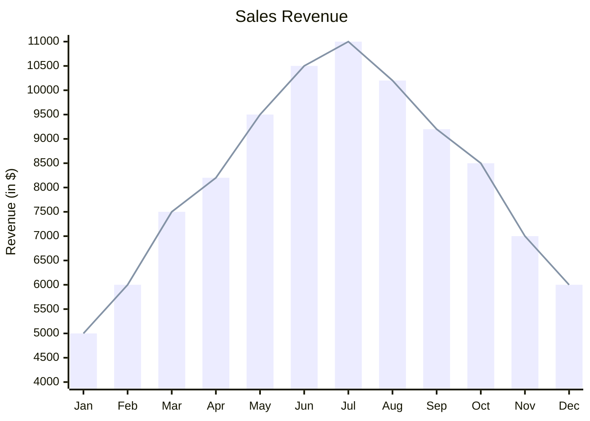
````

**Pie Chart**:
````markdown
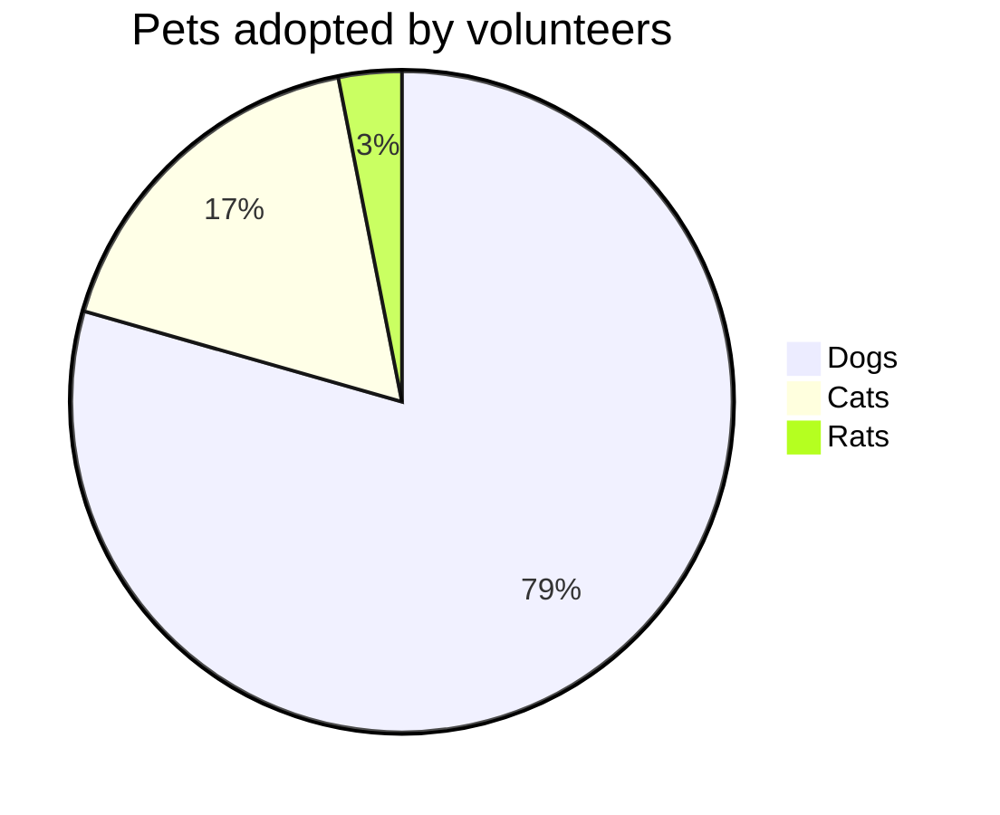
````

**Quadrant Chart**:
````markdown
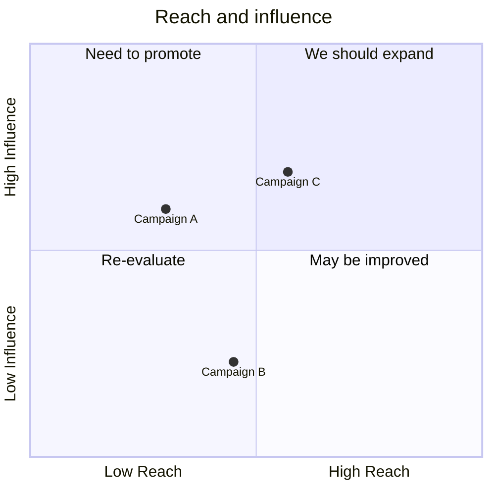
````

**Sankey Diagram**:
````markdown
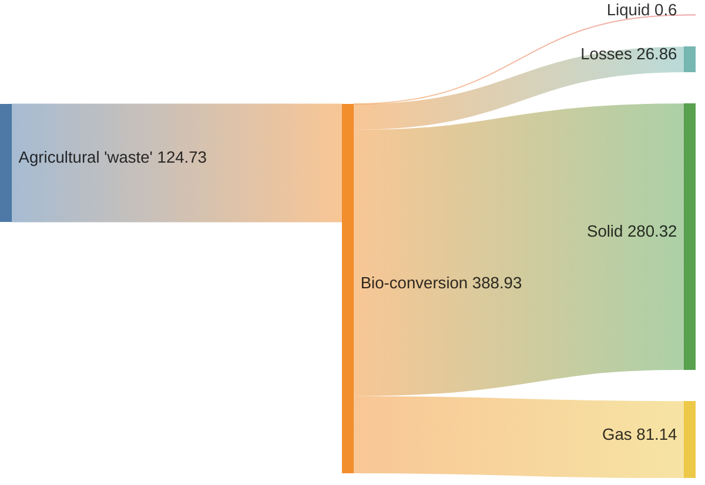
````

**Radar Chart**:
````markdown
```mermaid
radar
    title Skills Assessment
    JavaScript : 80
    React : 75
    Node.js : 70
    Python : 65
    SQL : 85
    Docker : 60
```
````

**Treemap**:
````markdown

````

#### Flow and Process Diagrams

**Flow Chart**:
````markdown

````

**Sequence Diagram**:
````markdown
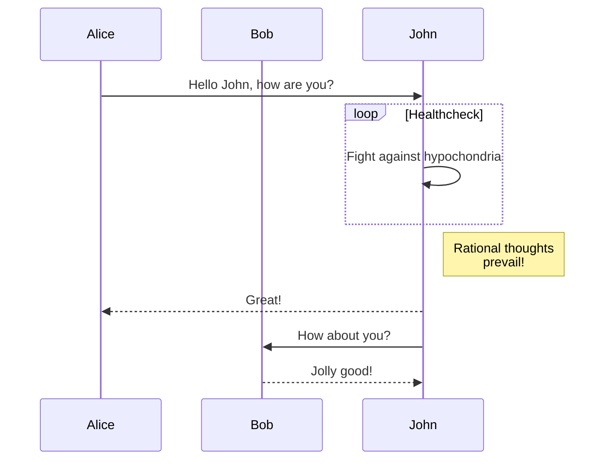
````

**State Diagram**:
````markdown
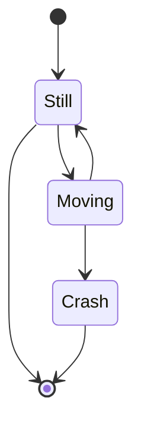
````

#### Project Management Diagrams

**Gantt Chart**:
````markdown
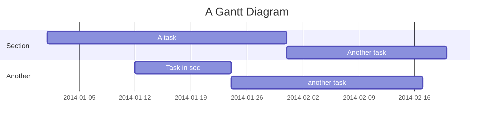
````

**Timeline**:
````markdown
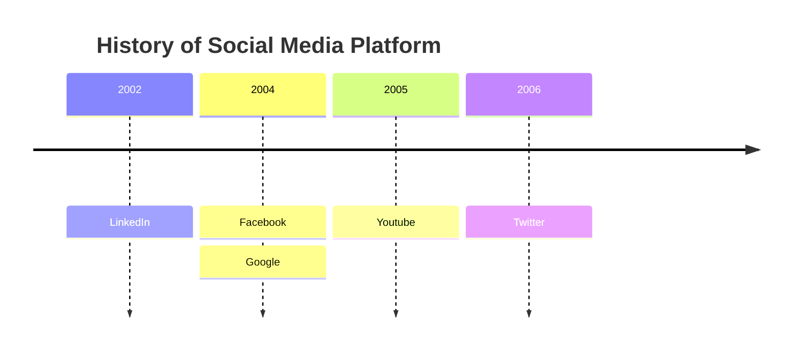
````

**User Journey**:
````markdown
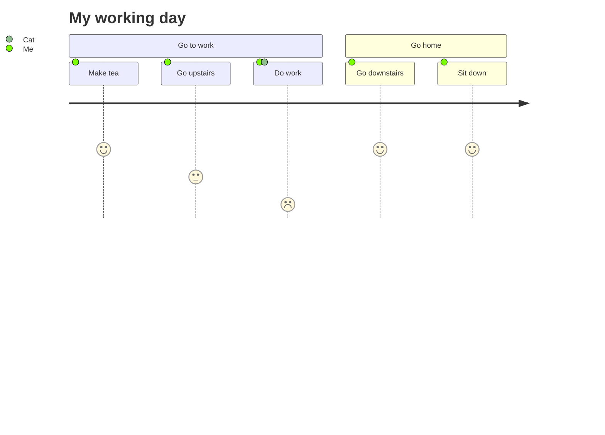
````

#### Technical Diagrams

**Class Diagram**:
````markdown
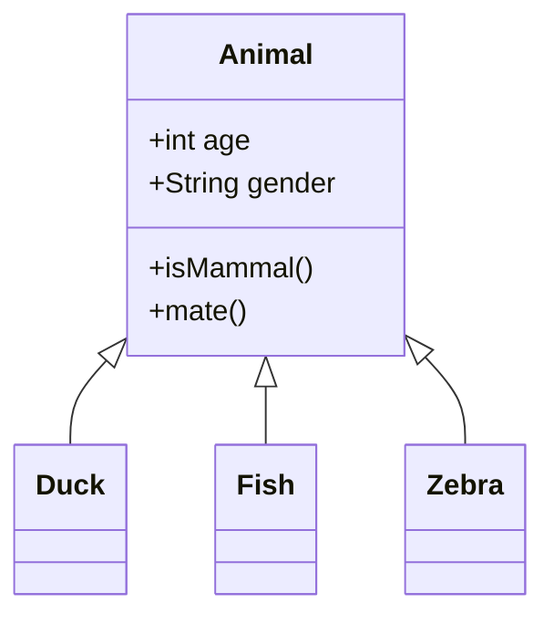
````

**Entity Relationship Diagram**:
````markdown
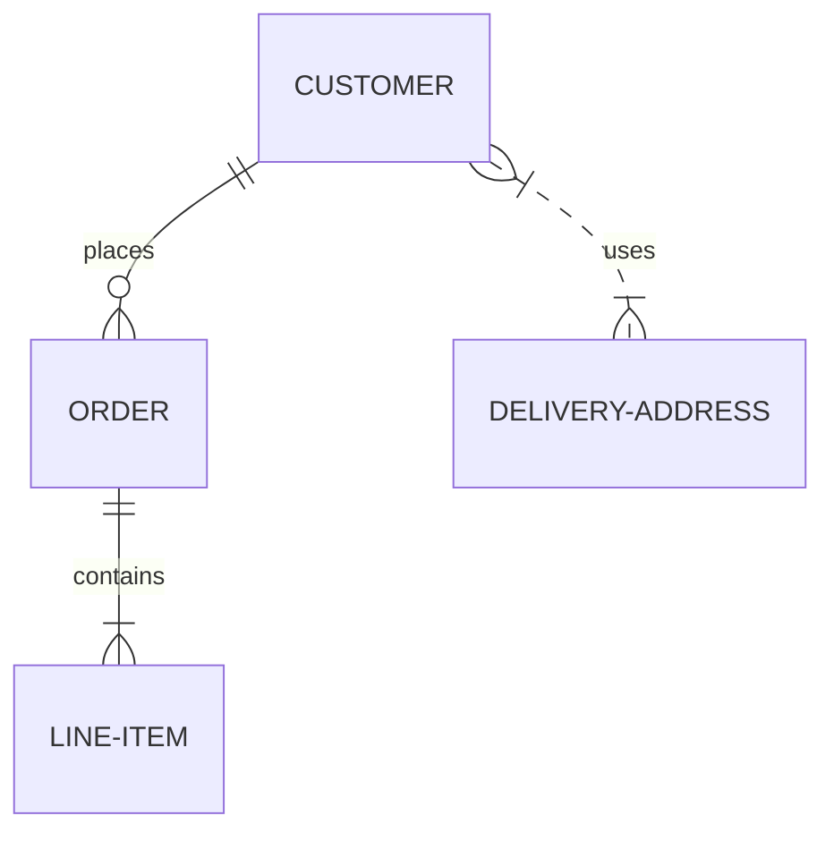
````

**Mindmap**:
````markdown
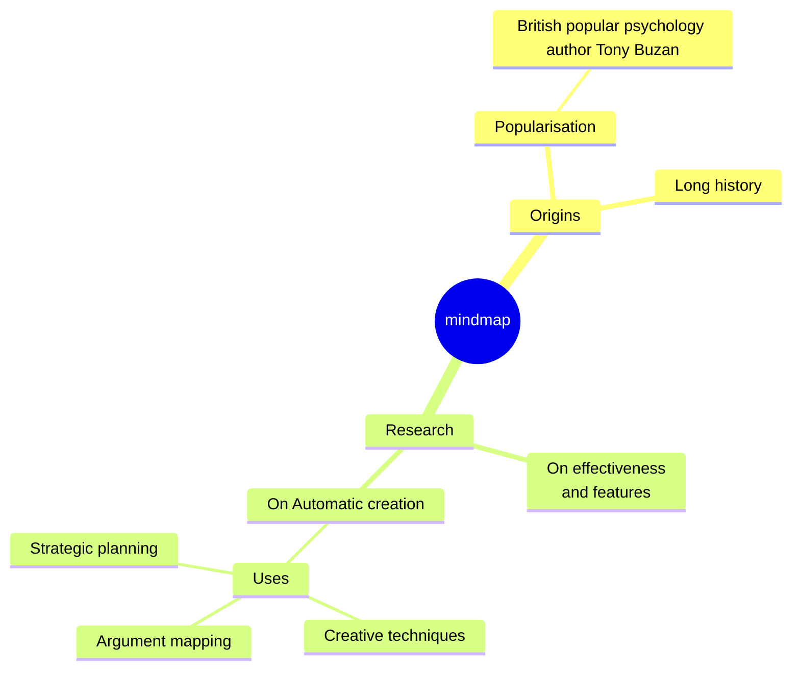
````

### 2. GeoJSON Maps

Create interactive maps by specifying geographic coordinates to define geographic data.

**Syntax**: Use fenced code block with `geojson` identifier

**Example**:
````markdown
```geojson
{
  "type": "Polygon",
  "coordinates": [
    [
      [-90, 30],
      [-90, 35],
      [-85, 35],
      [-85, 30],
      [-90, 30]
    ]
  ]
}
```
````

### 3. TopoJSON Maps

Similar to GeoJSON, but with more compact representation. Supports points, lines, and polygon geometries.

**Syntax**: Use fenced code block with `topojson` identifier

### 4. ASCII STL 3D Models

Create interactive 3D models directly in markdown.

**Syntax**: Use fenced code block with `stl` identifier

**Available in**:
- GitHub Issues
- GitHub Discussions
- Pull requests
- Wikis
- Markdown files

**Note**: You may observe errors if you run a third-party Mermaid plugin when using Mermaid syntax on GitHub.

## Creating Tables

### Basic Syntax

Use pipes `|` and hyphens `-` to create tables:

```markdown
| First Header | Second Header |
| ------------ | ------------- |
| Content Cell | Content Cell  |
```

### Formatting Requirements

- Include a blank line before the table for proper rendering
- Pipes at table ends are optional
- Must have at least three hyphens in header row
- Cells can vary in width

### Text Alignment

Use colons to control text alignment:

```markdown
| Left Align | Center Align | Right Align |
| :--------- | :----------: | ----------: |
| Left       | Center       | Right       |
| Text       | Text         | Text        |
```

- Left alignment: `:---`
- Center alignment: `:---:`
- Right alignment: `---:`

### Cell Content Formatting

Table cells support inline formatting:

```markdown
| Feature | Syntax        | Example                 |
| ------- | ------------- | ----------------------- |
| Code    | \`code\`      | `printf("Hello");`      |
| Links   | [text](url)   | [GitHub](github.com)    |
| Bold    | **text**      | **Important content**   |
| Italic  | *text*        | *Emphasized content*    |
```

### Special Characters

To include a pipe `|` in a cell, escape it with a backslash:

```markdown
| Character | Escape Method |
| --------- | ------------- |
| Pipe      | \|            |
```

### Editing Tips

When editing tables frequently, it's recommended to use a fixed-width font for proper alignment.

---

*Reference: GitHub Flavored Markdown Spec*