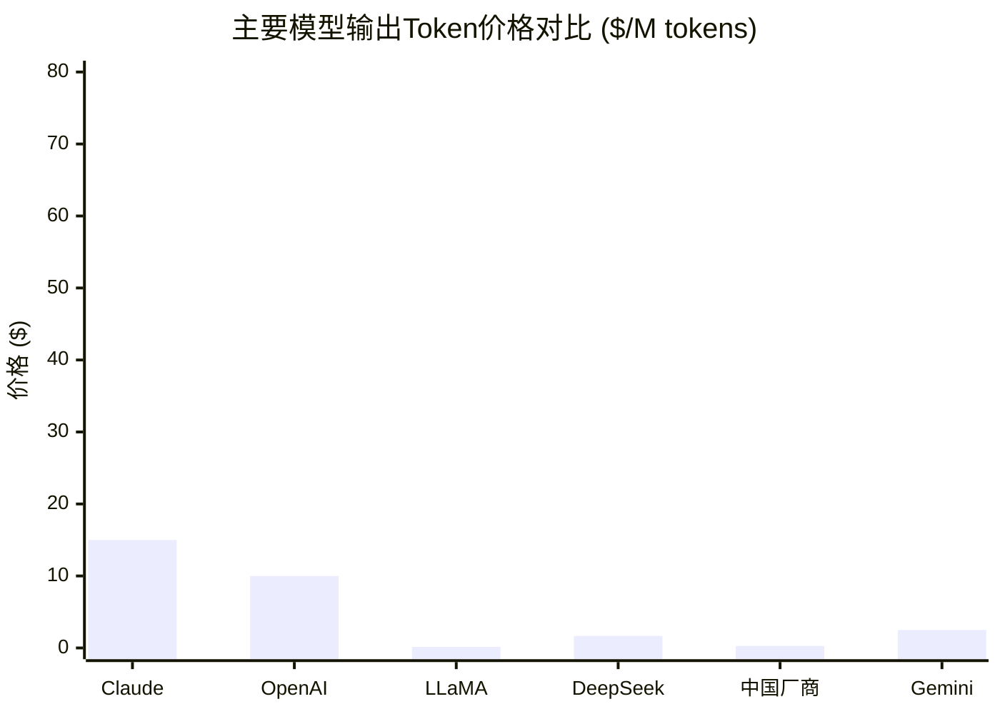

# 大模型成本及速度调研报告

## 执行摘要

本报告针对当前主流大语言模型进行了全面调研，涵盖了Claude、OpenAI、LLaMA、DeepSeek、中国厂商模型以及Google Gemini等主要模型系列。调研重点关注API定价、token限制、处理速度和多模态能力等关键指标。

### 关键发现
- **价格战激烈**：中国厂商（尤其是豆包、DeepSeek）以超低价格颠覆市场
- **多模态成主流**：除推理模型外，多数新模型都支持图像、音频、视频处理
- **上下文窗口扩大**：从4K发展到1M+ tokens，支持处理更长文档
- **推理能力突破**：OpenAI o系列和DeepSeek R1展现出色推理能力

## 模型对比表

| 模型名称 | 输入价格 ($/M tokens) | 输出价格 ($/M tokens) | 输入Token上限 | 输出Token上限 | Token速度 (tokens/s) | 多模态支持 |
|---------|------------------------|------------------------|------------|------------|---------------------|----------|
| **Claude系列** |  |  |  |  |  |  |
| Claude Opus 4 | 15.00 | 75.00 | 未指定 | 未指定 | 未指定 | ✅ 文字/图像/音频 |
| Claude Sonnet 4 | 3.00 | 15.00 | 未指定 | 未指定 | 未指定 | ✅ 文字/图像/音频 |
| Claude 3.7 Sonnet | 3.00 | 15.00 | 未指定 | 128K | 993 (输出) | ✅ 文字/图像/音频 |
| Claude 3.5 Sonnet | 3.00 | 15.00 | 200K | 8K (beta) | 7,934 (输入) | ✅ 文字/图像 |
| Claude 3.5 Haiku | 0.80 | 4.00 | 未指定 | 未指定 | 未指定 | ✅ 文字/图像 |
| **OpenAI系列** |  |  |  |  |  |  |
| GPT-4.1 | 未指定 | 未指定 | 1M | 未指定 | 未指定 | ✅ 文字/图像/视频 |
| GPT-4o | 2.50 (1.25缓存) | 10.00 | 128K | 未指定 | 比GPT-4 Turbo快 | ✅ 文字/图像 |
| GPT-4o mini | 0.15 (0.075缓存) | 0.60 | 128K | 未指定 | 未指定 | ✅ 文字/图像 |
| GPT-4 Turbo | 10.00 | 30.00 | 128K | 4K | 未指定 | ✅ 文字/图像 |
| o1 (推理) | 15.00 | 60.00 | 200K | 未指定 | 未指定 | ❌ 仅文字 |
| o1-mini (推理) | 3.00 | 12.00 | 128K | 未指定 | 未指定 | ❌ 仅文字 |
| o3-mini (推理) | 1.00 | 4.00 | 200K | 100K | 未指定 | ❌ 仅文字 |
| **LLaMA系列** |  |  |  |  |  |  |
| LLaMA 3.2 90B | 0.12 | 0.15 | 128K | 未指定 | 未指定 | ✅ 文字/图像 |
| LLaMA 3.2 11B | 云厂商定价 | 云厂商定价 | 128K | 未指定 | 未指定 | ✅ 文字/图像 |
| LLaMA 3.2 3B | 0.06 | 0.08 | 128K | 未指定 | 未指定 | ❌ 仅文字 |
| LLaMA 3.2 1B | 0.03 | 0.05 | 128K | 未指定 | 未指定 | ❌ 仅文字 |
| LLaMA 3.1 405B | 企业定价 | 企业定价 | 128K | 未指定 | AWS优化 | ❌ 仅文字 |
| LLaMA 3.1 70B | 按供应商 | 按供应商 | 128K | 未指定 | 249 (Groq) | ❌ 仅文字 |
| **DeepSeek系列** |  |  |  |  |  |  |
| DeepSeek-V3.1 Chat | 0.56 (0.07缓存) | 1.68 | 128K | 8K | 未指定 | ❌ 仅文字 |
| DeepSeek-V3.1 Reasoner | 0.56 (0.07缓存) | 1.68 | 128K | 64K | 未指定 | ❌ 仅文字 |
| DeepSeek-R1 | 0.55 (0.14缓存) | 2.19 | 未指定 | 未指定 | 未指定 | ❌ 仅文字 |
| **中国厂商模型** |  |  |  |  |  |  |
| Kimi K2 | 0.15 (0.60非缓存) | 2.50 | 128K | 未指定 | 53.3 | ❌ 仅文字 |
| GLM-4.5 | 未指定 | 未指定 | 1M | 96K | 未指定 | ✅ 文字/图像/其他 |
| GLM-4-Long | 0.14 | 0.14 | 128K-1M | 未指定 | 未指定 | ✅ 文字/图像 |
| QWEN3-Max | 0.861-2.151 | 3.441-8.602 | 258K | 32K | 未指定 | 未指定 |
| QWEN3-Coder | 0.084 | 1.575 | 262K | 未指定 | 未指定 | 未指定 |
| 豆包-1.5-Pro | 0.11 | 0.28 | 256K | 12K | 未指定 | ✅ 文字/图像/视频/音频 |
| 豆包-1.5-Lite | 0.042 | 未指定 | 32K | 未指定 | 未指定 | ✅ 多模态 |
| **Google Gemini系列** |  |  |  |  |  |  |
| Gemini 2.5 Pro | 1.25-2.50 | 10.00-15.00 | 1M | 65K | 未指定 | ✅ 文字/图像/音频/视频/PDF |
| Gemini 2.5 Flash | 0.30-1.00 | 2.50 | 1M | 65K | 低延迟优化 | ✅ 文字/图像/音频/视频 |
| Gemini 2.5 Flash-Lite | 0.10-0.30 | 0.40 | 1M | 65K | 高吞吐量优化 | ✅ 文字/图像/视频/音频/PDF |

## 多模态能力对比

```mermaid
graph TD
    A[多模态能力] --> B[文本处理]
    A --> C[图像处理]
    A --> D[音频处理]
    A --> E[视频处理]
    A --> F[文档处理]
    
    B --> B1[Claude ✅]
    B --> B2[OpenAI ✅]
    B --> B3[LLaMA ✅]
    B --> B4[DeepSeek ✅]
    B --> B5[中国厂商 ✅]
    B --> B6[Gemini ✅]
    
    C --> C1[Claude 4/3.x ✅]
    C --> C2[GPT-4o/4.1 ✅]
    C --> C3[LLaMA 3.2 11B/90B ✅]
    C --> C4[DeepSeek ❌]
    C --> C5[GLM-4/豆包 ✅]
    C --> C6[Gemini 2.5 ✅]
    
    D --> D1[Claude 4/3.7 ✅]
    D --> D2[OpenAI ❌]
    D --> D3[LLaMA ❌]
    D --> D4[DeepSeek ❌]
    D --> D5[豆包 ✅]
    D --> D6[Gemini 2.5 ✅]
    
    E --> E1[Claude ❌]
    E --> E2[GPT-4.1 ✅]
    E --> E3[LLaMA ❌]
    E --> E4[DeepSeek ❌]
    E --> E5[豆包 ✅]
    E --> E6[Gemini 2.5 ✅]
```

## 价格竞争力分析

### 价格梯队分析

**超低价格梯队 (< $1/M tokens)**
- 豆包系列：$0.042-0.28
- LLaMA小模型：$0.05-0.15
- GLM-4-Long：$0.14
- Gemini Flash-Lite：$0.40

**中等价格梯队 ($1-5/M tokens)**
- DeepSeek系列：$1.68-2.19
- Kimi K2：$2.50
- Gemini Flash：$2.50
- OpenAI o3-mini：$4.00

**高价格梯队 ($10+/M tokens)**
- OpenAI主流模型：$10-60
- Claude系列：$15-75
- Gemini Pro：$10-15

## 技术特性对比

### 推理能力
- **OpenAI o系列**：专业推理模型，o1与人类专家水平相当
- **DeepSeek R1**：开源推理模型，性能媲美OpenAI o1
- **Claude 3.7/4**：混合推理模式，可控思考预算
- **Gemini 2.5**：原生思考能力，透明token计费

### 上下文处理
- **1M+ tokens**：Gemini 2.5、GPT-4.1、GLM-4.5
- **128K-512K**：多数主流模型
- **特殊能力**：Claude支持128K输出，QWEN3支持262K输入

### 开源vs闭源
- **完全开源**：LLaMA系列、DeepSeek R1
- **部分开源**：GLM-4.5、Kimi K2
- **闭源API**：Claude、OpenAI、Gemini、豆包

## 成本优化策略

### 缓存机制
- **DeepSeek**：缓存命中可节省90%成本
- **OpenAI**：缓存输入50%折扣
- **Gemini**：上下文缓存节省87.5%成本
- **QWEN**：缓存命中25%价格

### 批处理优化
- **OpenAI**：批处理API 50%折扣
- **Claude**：批处理半价，24小时交付
- **云厂商**：企业级批量折扣

### 免费额度
- **Gemini**：Google AI Studio免费使用
- **豆包**：火山引擎提供2万亿免费token
- **Together AI**：LLaMA模型免费试用

## 应用场景推荐

### 对话聊天
**推荐**：豆包-1.5-Lite ($0.042), GLM-4-Long ($0.14), Gemini Flash-Lite ($0.40)
- 超低成本，适合大规模部署

### 代码生成
**推荐**：DeepSeek-V3.1 ($1.68), QWEN3-Coder ($0.084), Claude Sonnet 4 ($15)
- 专业代码能力，性价比高

### 复杂推理
**推荐**：DeepSeek-R1 ($2.19), OpenAI o1 ($60), Claude Opus 4 ($75)
- 专业推理能力，适合难题求解

### 多模态处理
**推荐**：Gemini 2.5 Flash ($2.5), 豆包-1.5-Pro ($0.28), LLaMA 3.2 90B ($0.15)
- 支持图像、视频、音频处理

### 长文档分析
**推荐**：Gemini 2.5 Pro (1M context), GLM-4.5 (1M context), GPT-4.1 (1M context)
- 超长上下文窗口支持

## 市场趋势分析

### 价格战加剧
中国厂商以极低价格打破垄断，国际厂商被迫降价应对。豆包企业版成本仅为行业均价的0.7%。

### 多模态标准化  
除专业推理模型外，多模态能力已成为标配，视频理解能力快速发展。

### 开源生态繁荣
LLaMA、DeepSeek等开源模型性能接近商业模型，降低了AI应用门槛。

### 上下文窗口扩展
从2K发展到1M+，支持处理整本书籍、完整代码库。

## 详细分析报告

- [Claude模型深度分析](./reports/task-1-claude-models.md)
- [OpenAI模型全面解析](./reports/task-2-openai-models.md)  
- [LLaMA模型生态研究](./reports/task-3-llama-models.md)
- [DeepSeek模型技术分析](./reports/task-4-deepseek-models.md)
- [中国厂商模型对比](./reports/task-5-chinese-models.md)
- [Gemini模型能力评估](./reports/task-6-gemini-models.md)

## 结论与建议

1. **成本敏感场景**：优先选择中国厂商模型（豆包、GLM、DeepSeek）
2. **企业级应用**：Claude和OpenAI提供更稳定的服务保障
3. **开源部署**：LLaMA和DeepSeek R1适合自建服务
4. **多模态需求**：Gemini 2.5和豆包提供最全面的多模态能力
5. **推理任务**：DeepSeek R1提供最佳性价比，OpenAI o1性能最强

市场正经历快速变化，建议持续关注模型更新和价格调整，根据具体应用场景选择最适合的模型组合。
