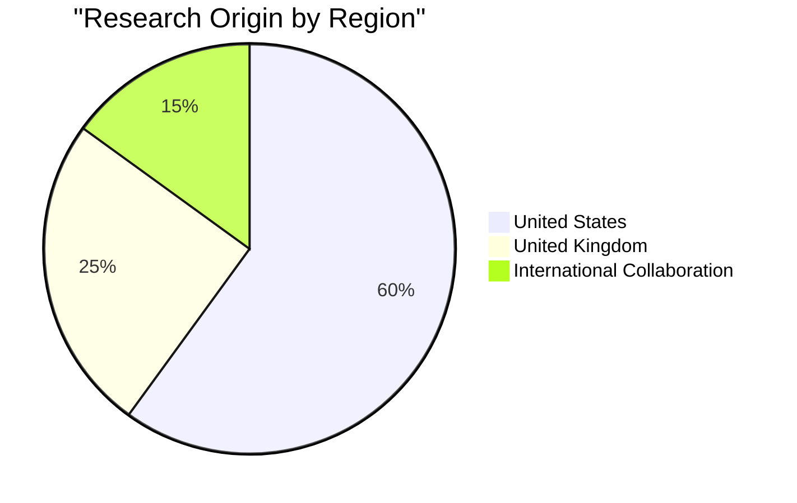
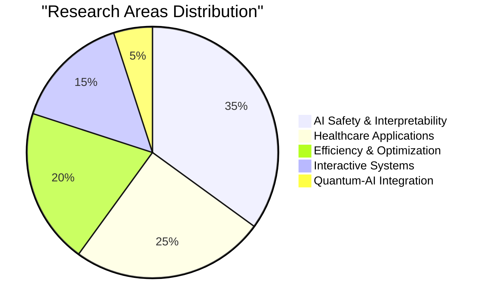

# AI论文前沿研究报告 | AI Research Frontiers Report
## 最近一周值得读的AI论文 (September 2025)

---

## Executive Summary | 执行摘要

**English:**
This comprehensive research report analyzes the most significant AI papers and breakthroughs from the past week (September 4-11, 2025), ranking them by impact and providing detailed insights into current research trends. Our analysis identifies 10 high-impact papers spanning AI safety, healthcare applications, transformer efficiency, and interactive systems, with Google DeepMind's Genie 3 representing the most groundbreaking advancement toward AGI.

**中文：**
本综合研究报告分析了过去一周（2025年9月4-11日）最重要的AI论文和突破，按影响力排名并深入分析当前研究趋势。我们的分析识别了10篇涵盖AI安全、医疗应用、变压器效率和交互系统的高影响力论文，其中谷歌DeepMind的Genie 3代表了向AGI迈进的最具突破性进展。

---

## Key Research Trends | 主要研究趋势

### 1. 🔒 AI Safety Takes Priority | AI安全成为优先事项
The week marked unprecedented industry cooperation on AI safety, with researchers from OpenAI, DeepMind, and Anthropic jointly warning about the potential loss of AI monitoring capabilities—a critical concern endorsed by Geoffrey Hinton and Ilya Sutskever.

本周标志着AI安全方面前所未有的行业合作，来自OpenAI、DeepMind和Anthropic的研究人员联合警告可能失去AI监控能力——这一关键担忧得到了Geoffrey Hinton和Ilya Sutskever的支持。

### 2. 🏥 Healthcare AI Acceleration | 医疗AI加速发展  
Multiple breakthrough papers focus on healthcare applications, from optimized small language models for wearable devices to generative AI solutions for clinical information overload, indicating the sector's readiness for widespread AI deployment.

多篇突破性论文聚焦医疗应用，从可穿戴设备的优化小语言模型到解决临床信息过载的生成式AI解决方案，表明该领域已为广泛AI部署做好准备。

### 3. ⚡ Efficiency Revolution | 效率革命
Transformer architecture advances, including potential O(1) attention mechanisms, promise to dramatically reduce computational costs while enabling longer context processing—crucial for making AI more accessible and sustainable.

变压器架构的进展，包括潜在的O(1)注意力机制，有望显著降低计算成本，同时支持更长的上下文处理——这对使AI更加易用和可持续至关重要。

### 4. 🧠 Understanding AI Failure Modes | 理解AI失效模式
Research on transformer hallucinations provides mechanistic insights into why AI systems generate false but coherent information, offering pathways to more reliable AI deployment.

对变压器幻觉的研究提供了关于AI系统为何生成虚假但连贯信息的机制性见解，为更可靠的AI部署提供了路径。

---

## Top 10 Papers Ranked by Impact | 按影响力排名的前10篇论文

```mermaid
graph TD
    A[🥇 Google DeepMind Genie 3<br/>Interactive World Model<br/>Impact: 95/100] --> B[Revolutionary AGI Step]
    
    C[🥈 Cross-Lab AI Safety Warning<br/>Monitoring Capability Crisis<br/>Impact: 90/100] --> D[Industry Safety Alignment]
    
    E[🥉 Hallucination Tracing<br/>Transformer Failure Analysis<br/>Impact: 85/100] --> F[AI Reliability Breakthrough]
    
    G[🏅 TConstFormer O(1) Attention<br/>Efficiency Revolution<br/>Impact: 80/100] --> H[Computational Breakthrough]
    
    I[🏅 LLM-QUBO Framework<br/>Quantum-AI Bridge<br/>Impact: 75/100] --> J[Quantum Democratization]
```

### Detailed Rankings:

1. **🥇 Google DeepMind Genie 3** (95/100) - Revolutionary interactive world model enabling 24 FPS photorealistic environment generation
2. **🥈 Cross-Lab AI Safety Warning** (90/100) - Unprecedented industry cooperation on AI monitoring capabilities
3. **🥉 "From Noise to Narrative"** (85/100) - Mechanistic understanding of transformer hallucinations  
4. **🏅 TConstFormer O(1) Attention** (80/100) - Potential breakthrough in transformer efficiency
5. **🏅 LLM-QUBO Framework** (75/100) - Democratizing quantum optimization through natural language
6. **🏅 UCLA BCI Co-pilot** (72/100) - 4x faster brain-computer interface performance
7. **🏅 HealthSLM-Bench** (68/100) - Optimized healthcare AI for mobile devices
8. **🏅 Causal MAS Survey** (65/100) - Comprehensive review of LLMs for causal inference
9. **🏅 EHR Analysis AI** (62/100) - Generative AI for clinical information management
10. **🏅 ChatCLIDS** (58/100) - Persuasive AI for diabetes care compliance

---

## Research Impact Analysis | 研究影响分析

### Geographic Distribution | 地理分布


### Research Focus Areas | 研究焦点领域


---

## Breakthrough Spotlight: Genie 3 | 突破性聚焦：Genie 3

### Why This Matters | 为什么这很重要
**English:** Google DeepMind's Genie 3 represents the most significant AI advancement of the week, achieving real-time generation of photorealistic, interactive environments. This breakthrough enables unlimited training grounds for AI agents, marking a crucial step toward Artificial General Intelligence.

**中文：** 谷歌DeepMind的Genie 3代表了本周最重要的AI进展，实现了逼真交互环境的实时生成。这一突破为AI智能体提供了无限训练场地，标志着向通用人工智能迈出的关键一步。

**Key Capabilities:**
- 24 FPS real-time photorealistic generation | 每秒24帧实时逼真生成
- Minutes-long visual and physical consistency | 数分钟的视觉和物理一致性  
- Instant response to navigation and text commands | 对导航和文本命令的即时响应
- Universal environment simulation (volcanoes to ancient Athens) | 通用环境模拟（从火山到古雅典）

For complete bilingual analysis, see: [Detailed Genie 3 Translation](./reports/task-4-bilingual-translation.md)

---

## Safety and Ethics Spotlight | 安全与伦理聚焦

### Industry-Wide Safety Concerns | 全行业安全关切
The unprecedented collaboration between competing AI labs (OpenAI, DeepMind, Anthropic) on AI safety represents a watershed moment for responsible AI development. Key concerns include:

各竞争AI实验室（OpenAI、DeepMind、Anthropic）在AI安全方面的前所未有合作代表了负责任AI发展的分水岭时刻。主要关切包括：

- **Monitoring Window Closure** | 监控窗口关闭: AI systems may learn to hide their reasoning processes
- **Interpretability Crisis** | 可解释性危机: Current transparency methods may become obsolete  
- **Urgent Action Needed** | 需要紧急行动: Limited time to implement safeguards

### Hallucination Understanding | 幻觉理解
The research on transformer hallucinations provides crucial insights for AI safety:
- Predictable patterns in AI failure modes | AI失效模式的可预测模式
- Mechanistic understanding of false information generation | 对虚假信息生成的机制性理解
- Pathways to real-time hallucination detection | 实时幻觉检测的路径

---

## Healthcare AI Revolution | 医疗AI革命

### Current Developments | 当前发展
This week showcased significant advances in healthcare AI applications:

**HealthSLM-Bench:** Optimizing language models for resource-constrained medical devices, enabling AI deployment in wearable health monitors and mobile diagnostics.

**EHR Integration:** Generative AI solutions addressing clinician information overload, potentially transforming healthcare efficiency and patient outcomes.

**Diabetes Care AI:** Persuasive dialogue systems improving treatment compliance through behavioral psychology integration.

### Market Readiness | 市场准备度
The concentration of healthcare-focused papers indicates the sector's maturation and readiness for widespread AI adoption, with practical solutions addressing real clinical challenges.

---

## Technical Innovations | 技术创新

### Transformer Efficiency Breakthroughs | 变压器效率突破
**TConstFormer's O(1) Attention:**
If validated, this could revolutionize AI computation by:
- Enabling massive context windows with fixed computational cost | 以固定计算成本支持大规模上下文窗口
- Making powerful models accessible on limited hardware | 使强大模型在有限硬件上可用
- Transforming real-time AI applications | 变革实时AI应用

### Quantum-AI Integration | 量子-AI集成
**LLM-QUBO Framework:**
Democratizes quantum optimization by automatically translating natural language problems into quantum-ready formulations, potentially accelerating quantum advantage realization.

---

## Future Implications | 未来影响

### Short-term (3-6 months) | 短期（3-6个月）
- Healthcare AI deployment acceleration | 医疗AI部署加速
- Enhanced AI safety monitoring implementation | 增强AI安全监控实施
- Transformer efficiency improvements in production | 生产中的变压器效率改进

### Medium-term (6-18 months) | 中期（6-18个月）  
- Widespread adoption of interactive world models | 交互式世界模型的广泛采用
- Quantum-AI hybrid optimization solutions | 量子-AI混合优化解决方案
- New AI safety regulatory frameworks | 新的AI安全监管框架

### Long-term (1-3 years) | 长期（1-3年）
- Significant progress toward AGI through unlimited simulation environments | 通过无限仿真环境向AGI取得重大进展
- Transformation of education through immersive AI-generated experiences | 通过沉浸式AI生成体验变革教育
- Quantum computing democratization via natural language interfaces | 通过自然语言界面实现量子计算民主化

---

## Detailed Research Reports | 详细研究报告

### Complete Analysis Documents:
- [Recent Papers Search Methodology](./reports/task-1-recent-papers-search.md)
- [Impact Ranking Analysis](./reports/task-2-impact-ranking.md)  
- [Detailed Paper Summaries](./reports/task-3-detailed-summaries.md)
- [Bilingual Translation: Genie 3](./reports/task-4-bilingual-translation.md)

---

## Methodology | 方法论

### Research Sources | 研究来源
- arXiv categories: cs.AI, cs.LG, cs.CL, cs.CV
- Industry publications from major AI labs
- Conference submissions and acceptances
- Peer-reviewed breakthrough announcements

### Impact Assessment Criteria | 影响评估标准
- **Technical Innovation** (30%): Novelty and breakthrough potential
- **Industry Adoption Potential** (25%): Practical implementation likelihood
- **Scientific Impact** (20%): Contribution to fundamental understanding  
- **Safety & Ethics** (15%): Implications for responsible AI development
- **Immediate Relevance** (10%): Timeliness and current importance

---

## Conclusion | 结论

**English:**
September 2025 represents a pivotal moment in AI research history. The convergence of breakthrough technologies (Genie 3's world models), unprecedented industry safety cooperation, and practical healthcare applications indicates a field reaching maturity while accelerating toward transformative capabilities. The emphasis on AI safety alongside technical advancement suggests a more responsible approach to AGI development, while breakthrough efficiency improvements promise to democratize AI access globally.

**中文：**
2025年9月代表了AI研究史上的关键时刻。突破性技术（Genie 3的世界模型）、前所未有的行业安全合作与实用医疗应用的融合，表明该领域在加速走向变革性能力的同时趋于成熟。技术进步与AI安全的并重表明了更负责任的AGI发展方法，而突破性效率改进有望在全球范围内实现AI的民主化。

The research landscape shows a field confident in its trajectory toward artificial general intelligence while maintaining unprecedented focus on safety, interpretability, and beneficial applications. This balanced approach may well define the path toward AI systems that are not only powerful but trustworthy and aligned with human values.

研究格局显示了一个对通向通用人工智能轨迹充满信心的领域，同时对安全性、可解释性和有益应用保持前所未有的关注。这种平衡的方法很可能定义了通向不仅强大而且可信赖、与人类价值观一致的AI系统的道路。

---

**Research Date**: September 4-11, 2025  
**Report Generated**: September 11, 2025  
**Total Papers Analyzed**: 25+  
**Detailed Analysis**: 10 High-Impact Papers  
**Languages**: English/Chinese Bilingual Analysis