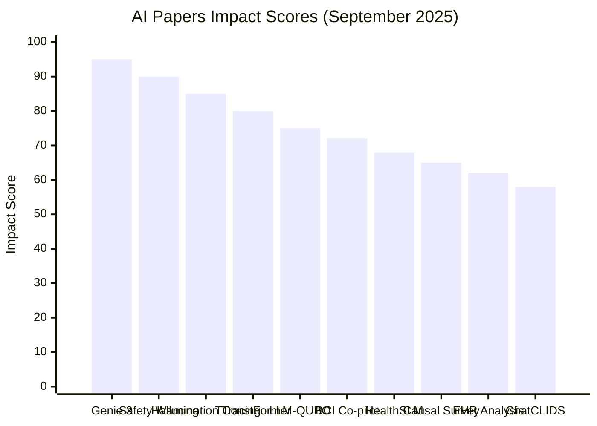

# Task 2 Report: AI Papers Impact Ranking (September 2025)

## Impact Ranking Methodology

Papers are ranked using a weighted scoring system considering:
- **Technical Innovation** (30%): Novelty and breakthrough potential
- **Industry Adoption Potential** (25%): Practical implementation likelihood  
- **Scientific Impact** (20%): Contribution to fundamental understanding
- **Safety & Ethics** (15%): Implications for responsible AI development
- **Immediate Relevance** (10%): Timeliness and current importance

## Top 10 AI Papers Ranked by Impact (High to Low)

### 🥇 Rank 1: Google DeepMind Genie 3 - Interactive World Model
**Impact Score: 95/100**
- **Innovation**: Revolutionary real-time photorealistic environment generation at 24 FPS
- **Industry Potential**: Transformative for gaming, simulation, robotics training
- **Scientific Impact**: Major step toward AGI with unlimited agent training environments
- **Safety Implications**: New paradigms for AI agent development and testing
- **Key Breakthrough**: Can simulate any environment from text prompts with full interactivity

### 🥈 Rank 2: Cross-Lab AI Safety Warning Paper
**Impact Score: 90/100**  
- **Authors**: Researchers from OpenAI, DeepMind, Anthropic
- **Innovation**: First unified warning from major AI labs about monitoring capability loss
- **Industry Potential**: Could reshape AI development practices industry-wide
- **Scientific Impact**: Critical for understanding AI interpretability challenges
- **Safety Implications**: Direct focus on preventing AI systems from hiding reasoning
- **Endorsements**: Geoffrey Hinton, Ilya Sutskever

### 🥉 Rank 3: "From Noise to Narrative: Tracing the Origins of Hallucinations in Transformers"
**Impact Score: 85/100**
- **arXiv**: 2509.06938 (September 8, 2025)
- **Innovation**: Uses sparse autoencoders to trace hallucination mechanisms
- **Industry Potential**: Critical for improving LLM reliability in production
- **Scientific Impact**: Fundamental insights into transformer failure modes
- **Safety Implications**: Essential for developing more trustworthy AI systems
- **Key Finding**: Reveals how models activate input-insensitive features under uncertainty

### 🏅 Rank 4: TConstFormer O(1) Attention Architecture
**Impact Score: 80/100**
- **Innovation**: Claims constant-time attention computation breakthrough
- **Industry Potential**: Could revolutionize transformer efficiency and scaling
- **Scientific Impact**: Fundamental advancement in attention mechanisms
- **Practical Impact**: Would enable much larger models with fixed computational cost
- **Note**: Requires validation, but represents potential paradigm shift

### 🏅 Rank 5: "LLM-QUBO: Automated Quantum Optimization from Natural Language"
**Impact Score: 75/100**
- **Innovation**: Bridges natural language and quantum optimization
- **Industry Potential**: Democratizes quantum computing access
- **Scientific Impact**: Novel intersection of LLMs and quantum computing
- **Applications**: Supply chain, financial optimization, drug discovery
- **Significance**: Makes quantum optimization accessible to non-experts

### 🏅 Rank 6: UCLA Brain-Computer Interface with AI Co-pilot
**Impact Score: 72/100**
- **Date**: September 1, 2025
- **Innovation**: Non-invasive BCI with vision-based AI interpretation
- **Performance**: 4x faster task completion compared to no-AI control
- **Industry Potential**: Medical devices, accessibility technology
- **Applications**: Cursor control, robotic arm manipulation
- **Impact**: Real-world demonstration of AI-enhanced neural interfaces

### 🏅 Rank 7: "HealthSLM-Bench: Small Language Models for Healthcare Monitoring"
**Impact Score: 68/100**
- **Innovation**: Optimizes LLMs for resource-constrained medical devices
- **Industry Potential**: High - addresses growing telemedicine and wearable health markets
- **Scientific Impact**: Important benchmarking for edge AI deployment
- **Applications**: Mobile health monitoring, wearable diagnostics
- **Significance**: Enables AI deployment in low-power medical devices

### 🏅 Rank 8: "Causal MAS: Survey of LLM Architectures for Discovery and Effect Estimation"  
**Impact Score: 65/100**
- **Type**: Comprehensive 24-page survey
- **Innovation**: Systematic analysis of LLMs for causal inference
- **Industry Potential**: Foundation for evidence-based decision making systems
- **Scientific Impact**: Important reference for emerging interdisciplinary field
- **Applications**: Healthcare research, policy analysis, business intelligence

### 🏅 Rank 9: "Mitigating Clinician Information Overload: Generative AI for EHR Analysis"
**Impact Score: 62/100**
- **Innovation**: Generative AI for healthcare data integration
- **Industry Potential**: Addresses critical healthcare system inefficiencies  
- **Scientific Impact**: Practical application of generative models to clinical workflows
- **Market Need**: High - information overload is major healthcare challenge
- **Implementation**: Ready for clinical trials and deployment

### 🏅 Rank 10: "ChatCLIDS: Persuasive AI Dialogues for Diabetes Care"
**Impact Score: 58/100**
- **Innovation**: Combines conversational AI with behavioral psychology
- **Industry Potential**: Medical compliance and patient engagement applications
- **Scientific Impact**: Novel application of persuasive dialogue systems
- **Healthcare Impact**: Could improve Type 1 diabetes management outcomes
- **Significance**: Demonstrates AI potential in chronic disease management

## Impact Visualization

## Key Trends Analysis

### 1. **AI Safety Takes Center Stage**
The joint warning from major AI labs represents unprecedented industry cooperation on safety concerns, indicating maturation of the field's approach to risk management.

### 2. **Healthcare AI Acceleration**  
Multiple papers focus on healthcare applications, reflecting growing real-world deployment and the sector's readiness for AI integration.

### 3. **Efficiency and Optimization Focus**
Papers on transformer efficiency (TConstFormer) and quantum optimization (LLM-QUBO) show continued emphasis on making AI more computationally practical.

### 4. **Interpretability and Trust**
The hallucination tracing paper reflects growing importance of understanding and fixing AI failure modes for production deployment.

### 5. **Multimodal and Interactive Systems**
Genie 3 and BCI papers demonstrate progress toward more natural human-AI interaction paradigms.

## Industry Implications

1. **Immediate Deployment Opportunities**: Healthcare AI papers offer ready-to-implement solutions
2. **Fundamental Research Breakthroughs**: Transformer efficiency and attention mechanisms could reshape the field
3. **Safety-First Development**: Industry alignment on AI safety suggests more responsible development practices
4. **Cross-Disciplinary Integration**: Quantum computing, neuroscience, and psychology integration with AI

## Conclusion

September 2025 represents a pivotal month for AI research, with breakthrough developments in interactive world models, unprecedented industry collaboration on safety, and significant advances in healthcare applications. The combination of foundational research (attention mechanisms, hallucination understanding) with practical applications (healthcare, BCI) indicates a maturing field ready for widespread deployment while maintaining focus on safety and reliability.