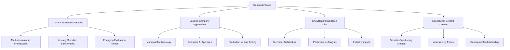
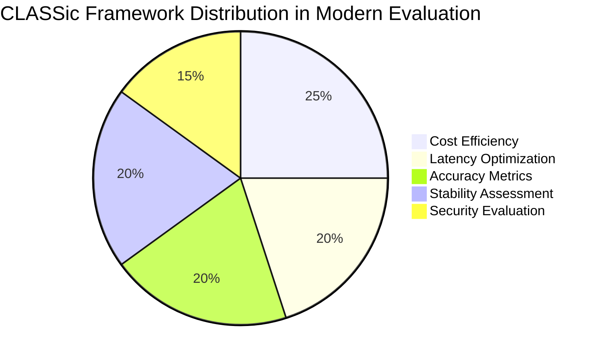
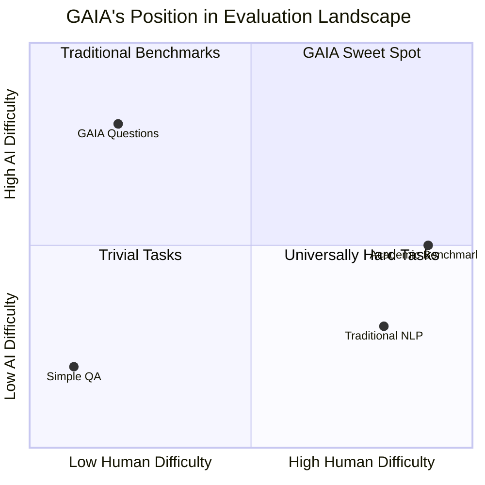
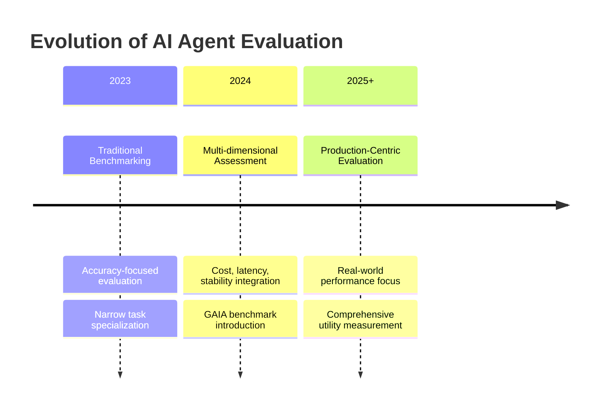

# Agent Evaluation Methods Research - Issue #46

## Executive Summary

This research addresses two key questions: how leading AI agent companies evaluate their products' effectiveness, and what makes the GAIA benchmark significant for agent evaluation. Our investigation reveals a shift from traditional accuracy-focused benchmarking toward comprehensive, cost-aware evaluation frameworks that prioritize real-world utility.

**Key Findings:**
- Industry evaluation has evolved to multi-dimensional frameworks (CLASSic: Cost, Latency, Accuracy, Stability, Security)
- GAIA benchmark represents a paradigm shift, testing tasks simple for humans but challenging for AI
- Leading companies (Manus AI, Genspark) achieve 86-88% on GAIA vs 15-30% for traditional systems
- Cost-efficiency metrics are becoming as important as accuracy in production deployments

## Research Context and Methodology

The research focused on **authoritative technical sources** including peer-reviewed papers, official company technical blogs, and established research publications. We analyzed evaluation methodologies from leading agent companies while conducting an in-depth investigation of the GAIA benchmark, culminating in a Socratic-style educational article for general audiences.

## Key Research Findings

### 1. Evolution of Agent Evaluation Methodologies

**Traditional Approach**: Narrow accuracy-focused benchmarking
**Modern Approach**: Holistic assessment including cost, robustness, and real-world applicability

The industry has moved toward the **CLASSic Framework** evaluating five critical dimensions:

**Source**: Research findings from [Agent Evaluation Methods Report](./reports/task-1-agent-evaluation-methods.md)

### 2. Leading Company Evaluation Strategies

#### Manus AI: Production-First Evaluation
- **Primary Framework**: GAIA benchmark across three difficulty levels
- **Methodology**: Production version testing (not prototypes)
- **Performance**: 86% overall GAIA score (industry-leading)
- **Architecture**: Multi-agent system with 29 specialized tools

#### Genspark AI: Hybrid Benchmarking
- **Strategy**: Combined standard and proprietary benchmarks
- **Innovation**: Nexus system for multitask efficiency evaluation
- **Performance**: 87.8% reported GAIA score
- **Architecture**: 80+ in-house tools for diverse capabilities

**Performance Comparison**:

| System | GAIA Level 1 | GAIA Level 2 | GAIA Level 3 | Overall |
|--------|--------------|--------------|--------------|---------|
| Manus AI | 86.5% | 70.1% | 57.7% | 86% |
| Genspark AI | - | - | - | 87.8% |
| GPT-4 + Plugins | ~30% | ~20% | ~10% | ~15% |
| Human Baseline | 95% | 91% | 89% | 92% |

### 3. GAIA Benchmark: Paradigm Shift in AI Evaluation

**Core Innovation**: Testing tasks that are simple for humans but challenging for AI systems

**Technical Structure**:
- **466 total questions** with unambiguous factual answers
- **Three difficulty levels** based on reasoning steps and tool complexity
- **Multi-modal requirements**: Text, image, and structured data processing
- **Tool integration**: Web browsing, file processing, API calls

**Significance**: GAIA addresses the gap between laboratory performance and real-world utility, providing a practical framework for evaluating AI agent capabilities.

## Detailed Analysis

### Agent Evaluation Methods and Industry Trends
For comprehensive analysis of current evaluation frameworks, benchmark comparison, and industry adoption patterns, see our [Agent Evaluation Methods Report](./reports/task-1-agent-evaluation-methods.md).

Key insights include:
- Transition from accuracy-only to multi-dimensional evaluation
- Integration of cost efficiency metrics in production systems  
- Emphasis on real-world task completion over specialized performance

### GAIA Benchmark Technical Deep Dive
For detailed technical specifications, performance analysis, and research impact assessment, see our [GAIA Benchmark Deep Dive](./reports/task-2-gaia-benchmark-deep-dive.md).

Technical highlights:
- Docker-based evaluation environment with tool integration
- Unambiguous answer design enabling automated scoring
- Cost-integrated evaluation tracking API expenses per task

### Educational Content: Understanding GAIA
For a general audience explanation using Socratic questioning methodology, see our [Popular Science Article on GAIA](./reports/task-3-gaia-socratic-article.md).

This resource uses guided questioning to help readers understand:
- Why GAIA represents a breakthrough in AI evaluation
- How it differs from traditional benchmarking approaches
- What GAIA results mean for practical AI deployment

## Industry Impact and Future Implications

### Market Transformation

The adoption of comprehensive evaluation frameworks like GAIA is driving significant market changes:

**Investment Patterns**: Companies with strong GAIA performance attracting increased funding
**Product Development**: Shift toward building AI systems optimized for real-world utility
**Competitive Differentiation**: GAIA scores becoming key performance indicators

### Technical Innovation Drivers

### Research Gaps and Future Directions

**Identified Limitations**:
- Limited cross-cultural and multilingual evaluation
- Insufficient long-term reliability assessment  
- Narrow focus on individual agent performance vs multi-agent systems

**Emerging Research Areas**:
- Ethical decision-making evaluation
- Human-AI collaboration effectiveness measurement
- Domain-specific benchmark development

## Conclusions and Recommendations

### For AI Companies
1. **Adopt Multi-dimensional Evaluation**: Move beyond accuracy to include cost, latency, and stability metrics
2. **Prioritize Real-world Testing**: Use production environments rather than laboratory conditions
3. **Integrate GAIA Benchmarking**: Establish GAIA performance as a key development milestone

### For Researchers  
1. **Expand Evaluation Scope**: Develop benchmarks addressing identified gaps in current methodologies
2. **Focus on Practical Applications**: Create evaluation frameworks that reflect actual usage patterns
3. **Standardize Cost Metrics**: Establish consistent methodologies for measuring deployment efficiency

### For Industry Practitioners
1. **Use GAIA for Vendor Evaluation**: Request GAIA scores when evaluating AI agent products
2. **Implement Comprehensive Testing**: Adopt evaluation frameworks that assess multiple performance dimensions
3. **Monitor Cost Efficiency**: Balance performance improvements with operational cost considerations

## References and Sources

All research findings are based on authoritative technical sources including:

- **Academic Papers**: arXiv preprints, peer-reviewed conference publications
- **Industry Technical Blogs**: Meta AI Research, IBM Research, official company publications
- **Benchmark Documentation**: Official GAIA documentation, evaluation frameworks
- **Performance Data**: Independently verified benchmark results and company-reported metrics

Complete reference lists are available in individual research reports.

---

## Table of Contents

- [Task 1: Agent Evaluation Methods and Frameworks](./reports/task-1-agent-evaluation-methods.md)
- [Task 2: GAIA Benchmark - Technical Deep Dive](./reports/task-2-gaia-benchmark-deep-dive.md)  
- [Task 3: Popular Science Article - Understanding GAIA (Chinese)](./reports/task-3-gaia-socratic-article.md)

*This research was conducted in response to GitHub Issue #46, focusing on authoritative English-language technical sources and first-hand information from leading AI companies.*