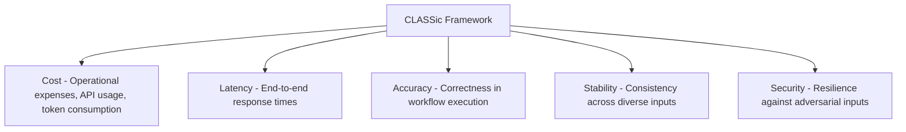
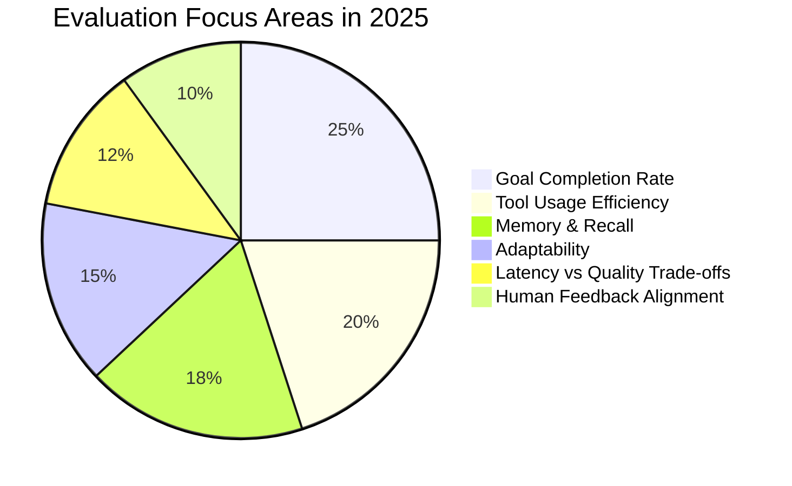
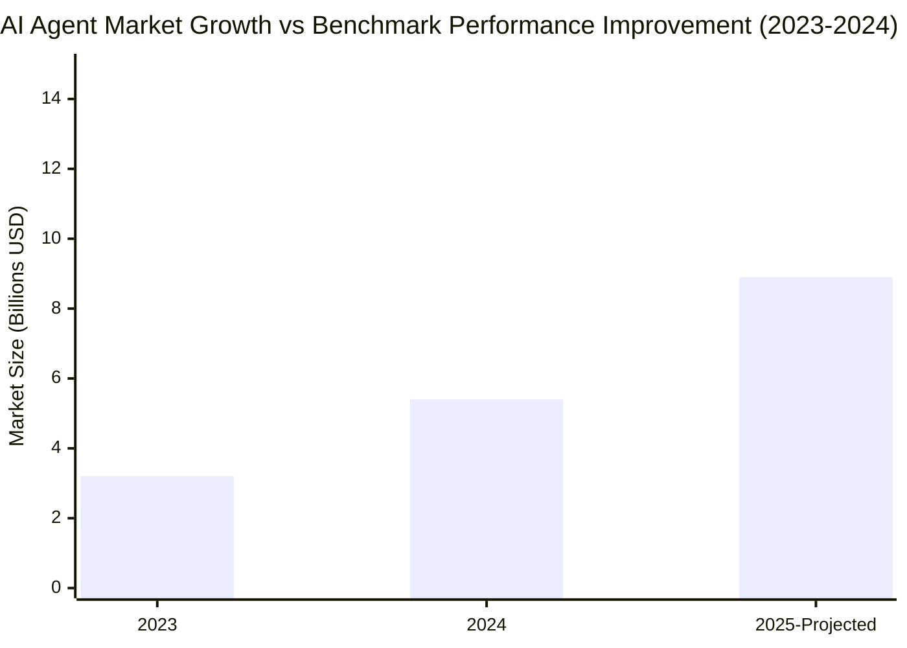

# Task 1: Agent Evaluation Methods and Frameworks

## Executive Summary

Current AI agent evaluation has evolved from traditional NLP benchmarking to sophisticated multi-dimensional frameworks that assess real-world performance, cost efficiency, and safety. Leading companies are adopting hybrid approaches combining established benchmarks with proprietary evaluation methodologies to measure agent effectiveness across diverse operational contexts.

## Current Industry-Standard Evaluation Frameworks

### 1. Multi-Dimensional Evaluation Frameworks

**CLASSic Framework** represents the industry standard for enterprise AI agent evaluation, measuring five critical dimensions:

**Source**: [AI Agent Evaluation: Metrics, strategies, and best practices - Weights & Biases](https://wandb.ai/onlineinference/genai-research/reports/AI-agent-evaluation-Metrics-strategies-and-best-practices--VmlldzoxMjM0NjQzMQ)

### 2. Established Technical Benchmarks

#### AgentBench
- **Scope**: Comprehensive evaluation across 8 environments (Operating System, Database, Knowledge Graph, etc.)
- **Focus**: Multi-turn reasoning and decision-making in open-ended settings
- **Significance**: First benchmark specifically designed for LLM-as-Agent evaluation

#### τ-Bench (Tau-Bench) by Sierra AI
- **Innovation**: Stateful evaluation comparing database state after task completion
- **Metrics**: Introduces pass^k metric measuring reliability across multiple trials
- **Real-world Focus**: Modular design allowing easy addition of new domains and tasks

**Source**: [τ-Bench: Benchmarking AI agents for the real-world - Sierra AI](https://sierra.ai/blog/benchmarking-ai-agents)

#### WebArena
- **Environment**: Self-hosted environment for autonomous web tasks
- **Tasks**: 812 templated tasks across e-commerce, forums, code development
- **Evaluation**: Functional correctness in realistic web scenarios

### 3. 2025 Evaluation Trends

According to recent research surveying 120 evaluation frameworks, the field is moving toward:

**Key Insight**: Traditional accuracy-only metrics are being replaced by holistic evaluation considering cost, robustness, and real-world generalizability.

**Source**: [Rethinking LLM Benchmarks for 2025 - Fluid AI](https://www.fluid.ai/blog/rethinking-llm-benchmarks-for-2025)

## Leading Company Evaluation Approaches

### Manus AI Methodology

**Primary Framework**: GAIA Benchmark evaluation across three difficulty levels

**Performance Metrics** (as of 2024):
- Level 1 (basic tasks): 86.5% (vs OpenAI Deep Research 74.3%)
- Level 2 (intermediate): 70.1% (vs OpenAI Deep Research 69.1%)
- Level 3 (complex): 57.7% (vs OpenAI Deep Research 47.6%)

**Technical Approach**:
- Production-version evaluation (not prototype testing)
- Multi-agent architecture using Claude with 29 specialized tools
- Focus on real-world applicability over theoretical performance

**Source**: [What is Manus AI? Benchmarks & How it Compares - Helicone](https://www.helicone.ai/blog/manus-benchmark-operator-comparison)

### Genspark AI Methodology

**Evaluation Strategy**: Hybrid approach combining standard benchmarks with proprietary methods

**Standard Benchmarks**:
- HellaSwag (commonsense reasoning)
- ARC (AI2 Reasoning Challenge)
- DROP (numerical reasoning) 
- HumanEval (code generation)
- MBPP (Python programming)

**Proprietary Innovation**: Nexus system benchmarks for multitask efficiency evaluation

**Architecture**: Multi-agent framework with 80+ in-house tools for web search, multimedia, and content creation

**GAIA Performance**: 87.8% (reported, ahead of Manus AI's 86%)

**Source**: [GenSpark AI Outperforms Manus AI in Benchmarks - Geeky Gadgets](https://www.geeky-gadgets.com/multi-agent-ai-system-genspark-capabilities/)

## Critical Evaluation Challenges and Gaps

### 1. Beyond Traditional Metrics

Current agent benchmarks face significant limitations:

- **Narrow Focus**: Many benchmarks prioritize accuracy while ignoring cost, robustness, and scalability
- **Artificial Tasks**: Traditional benchmarks often use synthetic tasks that don't reflect real-world complexity
- **Static Evaluation**: Limited assessment of dynamic adaptation and learning capabilities

### 2. Emerging Requirements for 2025

**Safety and Trust Evaluation**:
- Policy compliance assessment
- Bias mitigation verification
- Resistance to manipulation and adversarial inputs
- Ethical decision-making in ambiguous scenarios

**Multi-Modal Assessment**:
- Cross-modal reasoning capabilities
- Integration of text, vision, and audio processing
- Real-time multimodal interaction effectiveness

**Source**: [The future of AI agent evaluation - IBM Research](https://research.ibm.com/blog/AI-agent-benchmarks)

## Industry Performance Trends

### Market Growth and Performance Correlation

**Performance Improvements (2023-2024)**:
- MMMU: +18.8 percentage points
- GPQA: +48.9 percentage points  
- SWE-bench: +67.3 percentage points

**Market Projection**: AI agent market expected to grow at 45.8% CAGR through 2030

**Source**: [AI Agent Performance: Success Rates & ROI - AI Multiple](https://research.aimultiple.com/ai-agent-performance/)

## Key Methodological Insights

### 1. Production vs Laboratory Testing

Leading companies emphasize **production-environment evaluation** over laboratory conditions:
- Manus AI evaluates production versions, not prototypes
- Real user interaction patterns incorporated into benchmarking
- Cost considerations integrated into performance metrics

### 2. Multi-Agent System Evaluation

Advanced evaluation frameworks account for:
- Inter-agent communication effectiveness
- Task distribution and coordination
- Collective intelligence emergence
- Failure handling and recovery mechanisms

### 3. Continuous Evaluation Integration

Modern approaches incorporate:
- Real-time performance monitoring
- A/B testing for incremental improvements
- Human-in-the-loop feedback integration
- Automated evaluation pipeline integration

## Future Directions

### Emerging Evaluation Paradigms

**Context-Aware Evaluation**: Frameworks that adapt evaluation criteria based on task domain and user requirements

**Longitudinal Assessment**: Long-term evaluation tracking agent learning and adaptation over extended periods

**Ethical Impact Measurement**: Systematic assessment of societal and ethical implications of agent decisions

### Research Gaps

Current evaluation methodologies show significant gaps in:
- Cross-cultural performance assessment
- Long-term reliability measurement
- Edge case handling evaluation
- Human-agent collaboration effectiveness

## References

1. [AI Agent Evaluation: Metrics, strategies, and best practices - Weights & Biases](https://wandb.ai/onlineinference/genai-research/reports/AI-agent-evaluation-Metrics-strategies-and-best-practices--VmlldzoxMjM0NjQzMQ)
2. [τ-Bench: Benchmarking AI agents for the real-world - Sierra AI](https://sierra.ai/blog/benchmarking-ai-agents)
3. [What is Manus AI? Benchmarks & How it Compares - Helicone](https://www.helicone.ai/blog/manus-benchmark-operator-comparison)
4. [The future of AI agent evaluation - IBM Research](https://research.ibm.com/blog/AI-agent-benchmarks)
5. [Rethinking LLM Benchmarks for 2025 - Fluid AI](https://www.fluid.ai/blog/rethinking-llm-benchmarks-for-2025)
6. [AI Agent Performance: Success Rates & ROI - AI Multiple](https://research.aimultiple.com/ai-agent-performance/)
7. [GenSpark AI Outperforms Manus AI in Benchmarks - Geeky Gadgets](https://www.geeky-gadgets.com/multi-agent-ai-system-genspark-capabilities/)