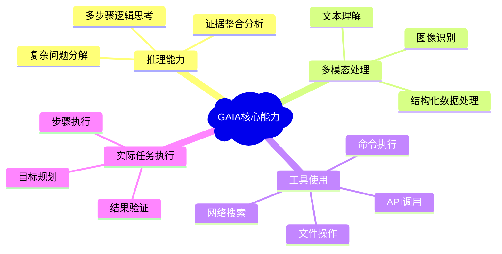
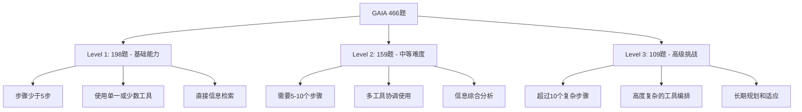

# 关于评测：白话聊聊GAIA 是什么

> 用苏格拉底问答法带你理解AI评测的新标准

---

**问：朋友，你觉得一个真正聪明的AI助手应该能做什么？**

答：嗯，应该能回答我的问题，帮我处理各种任务，就像一个得力的助手一样吧？

**问：很好的想法！那么，如果我们要判断一个AI是否真的"聪明"，我们应该怎么测试它呢？**

答：可能要出一些难题给它做？看看它能不能答对？

**问：这是个很自然的想法。但你有没有想过，什么样的"难题"才能真正体现AI的实用性呢？是那些连人类专家都觉得困难的学术问题，还是我们日常生活中经常遇到的实际问题？**

答：呃...好像日常问题更重要一些？毕竟我们希望AI能帮助我们解决实际问题。

**问：说得很对！这正是GAIA基准评测的核心思想。让我换个角度问你：你觉得什么样的任务对人类来说很容易，但对AI来说却很困难？**

## 什么是GAIA？为什么它与众不同？

答：我想想...比如让AI帮我查找一些信息，然后综合分析得出结论？这对人来说挺简单的，但AI可能会搞混？

**问：太棒了！你已经抓住了GAIA的精髓。GAIA是"General AI Assistants"（通用AI助手）的缩写，它是由Meta AI、Hugging Face和AutoGPT团队合作开发的评测基准。它的独特之处恰恰在于你刚才说的——专门挑选那些人类觉得简单，但AI觉得困难的任务。这种设计有什么好处呢？**

答：这样的话，测试结果更贴近实际使用场景？

**问：完全正确！想象一下，如果一个AI在某个超级专业的数学竞赛中得了满分，但却不能帮你查找并整理一份简单的资料，你会觉得这个AI有用吗？**

答：不会，那样的AI对日常生活帮助不大。

**问：这就是GAIA要解决的问题。现在让我问你另一个问题：你认为一个好的AI助手需要具备哪些基本能力？**

## AI助手需要什么超能力？

答：要能理解我的问题，找到相关信息，还要能用工具？

**问：很好的观察！你提到了"用工具"，这很重要。让我们深入思考一下：当你解决一个复杂问题时，你通常怎么做？**

答：我会先想想需要什么信息，然后去网上搜索，可能还要查看一些文档，最后把所有信息整合起来得出答案。

**问：太精彩了！你刚才描述的过程包含了GAIA评测的四个核心能力。你能帮我识别出来吗？**



答：让我想想...推理能力（想需要什么信息），搜索能力（网上找信息），文档处理能力（查看文档），还有整合能力（把信息组合起来）？

**问：非常接近！GAIA确实测试这四个方面：结构化推理、多模态处理、工具使用能力，以及通用任务执行能力。那么现在我要问一个关键问题：你觉得应该如何设计测试来评判这些能力呢？**

## 如何科学地测试AI？

答：出一些需要这些能力的题目？

**问：好主意！但这里有个技术问题：如何确保测试结果是客观公正的？比如，如果问题的答案是开放性的，不同的人可能有不同的评判标准，那怎么办？**

答：那就设计一些有标准答案的问题？

**问：聪明！这正是GAIA的创新之一——所有问题都有明确、无歧义的事实性答案。比如"某公司2023年的营收是多少"而不是"某公司的发展前景如何"。这样做有什么好处？**

答：这样就不会因为评判者的主观意见不同而产生争议了。

**问：完全正确！现在让我告诉你GAIA的具体结构。它包含466个问题，分为三个难度等级。你觉得这三个等级应该如何区分？**

### GAIA的三个等级



答：应该是从简单到复杂？简单的可能一步就能解决，复杂的需要很多步骤？

**问：你的直觉很准确！Level 1通常需要少于5个步骤，Level 2需要5-10个步骤，Level 3则需要10个以上的复杂步骤。但这里有个有趣的现象：你觉得人类在这三个等级上的表现如何？**

## 人类 vs AI：谁更厉害？

答：人类应该都能做得不错吧？毕竟这些都是日常任务。

**问：太对了！人类在GAIA上的整体准确率是92%，表现相当优秀。那么你猜猜目前最先进的AI系统表现如何？**

答：应该也不错吧？毕竟现在AI很强大了。

**问：这个答案可能会让你吃惊：GPT-4等主流AI系统在GAIA上的准确率只有大约15-30%！这个巨大的差距说明了什么？**

```mermaid
xychart-beta
    title "GAIA基准测试：人类 vs AI表现对比"
    x-axis [Level 1, Level 2, Level 3, 总体]
    y-axis "准确率 %" 0 --> 100
    bar [95, 91, 89, 92]
    line [45, 32, 18, 31]
```
*蓝色柱状图：人类表现，红色折线：AI平均表现*

答：哇，差距这么大？这说明AI在处理实际任务时还有很大的改进空间？

**问：精准的分析！这正是GAIA的价值所在——它揭示了AI系统在实际应用中的真实能力水平。但是最近有一些突破性进展，比如Manus AI在GAIA上达到了86%的准确率。你觉得这意味着什么？**

## 突破在哪里？

答：说明AI技术在快速进步？某些AI已经接近人类水平了？

**问：很好的观察！让我们看看这些领先的AI系统是如何做到的。Manus AI的架构使用了29个专业工具，采用多智能体协作方式。你觉得这种"团队合作"的方法为什么会更有效？**

答：就像人类工作一样，不同的专家负责不同的任务，然后汇总结果？

**问：完美的类比！这确实反映了一个重要趋势：从单一模型转向多智能体系统。那么现在让我问你一个成本问题：你觉得AI系统的评测应该只看准确率吗？**

## 不只是准确率：成本也重要

答：不应该只看准确率，还要考虑成本效益？

**问：太聪明了！GAIA的另一个创新就是同时跟踪成本指标——测量每个任务消耗了多少API调用费用。为什么这很重要？**

答：因为在实际使用中，既要效果好，也要经济实惠？

**问：完全正确！一个AI系统如果能给出正确答案，但每次都要花费100美元，那在商业上就不实用。这种全面评估方法对AI发展有什么意义？**

答：这样能推动AI既变得更聪明，也变得更实用？

**问：说得太好了！现在让我问最后一个问题：了解了GAIA之后，你觉得它对普通用户有什么意义？**

## 对我们的意义

答：我们可以用GAIA的结果来判断哪个AI助手更实用？

**问：非常聪明的想法！当你看到一个AI产品宣称自己很厉害时，你可以问问它在GAIA上的表现如何。就像买车要看碰撞测试成绩一样。但是还有更深层的意义：GAIA的出现标志着AI评测从"炫技"转向"实用"。这种转变对整个AI行业意味着什么？**

答：这意味着AI公司会更关注开发真正有用的产品，而不是只在实验室里表现好？

**问：精彩的洞察！你已经理解了GAIA的真正价值。它不仅是一个测试工具，更是一个方向标，指引着AI技术朝着更实用、更贴近人类需求的方向发展。**

## 总结思考

通过我们的对话，你已经理解了：

1. **GAIA的核心理念**：测试人类觉得简单但AI觉得困难的任务
2. **评测的科学性**：使用明确的事实性答案确保客观评判  
3. **能力的全面性**：同时测试推理、多模态、工具使用等多种能力
4. **成本的重要性**：不仅要效果好，还要经济实用
5. **发展的方向性**：推动AI从"炫技"转向"实用"

**最后一个问题：现在你对AI助手的期待是否有了变化？**

相信经过这番探讨，你不仅了解了GAIA是什么，更重要的是理解了如何科学地评判AI系统的真实价值。下次当有人向你推荐AI产品时，你就可以像苏格拉底一样，通过提问来找到真正的答案了！

---

## 深入了解

想要了解更多技术细节？可以查看：
- [GAIA官方论文](https://arxiv.org/abs/2311.12983)
- [GAIA排行榜](https://huggingface.co/spaces/gaia-benchmark/leaderboard) 
- [技术实现细节](../task-2-gaia-benchmark-deep-dive.md)

*通过苏格拉底问答法，我们不是被动接受信息，而是主动思考和发现。这正是理解复杂技术概念最好的方式。*