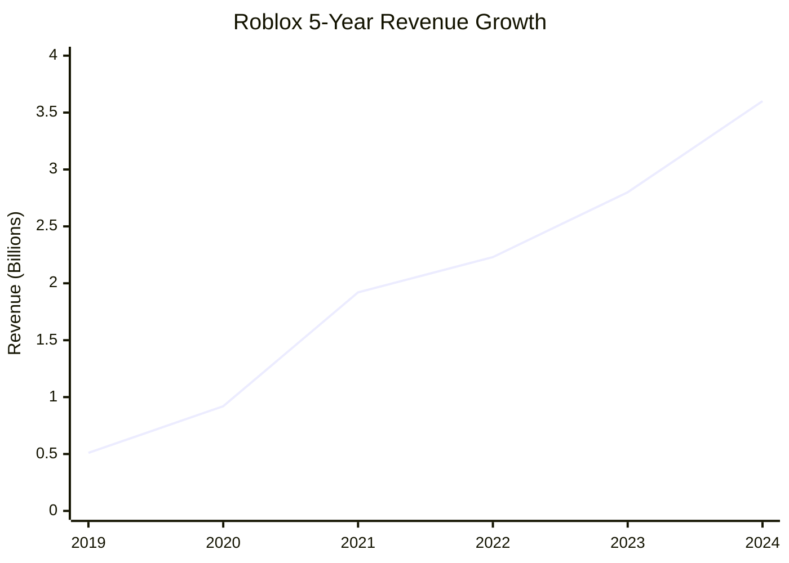
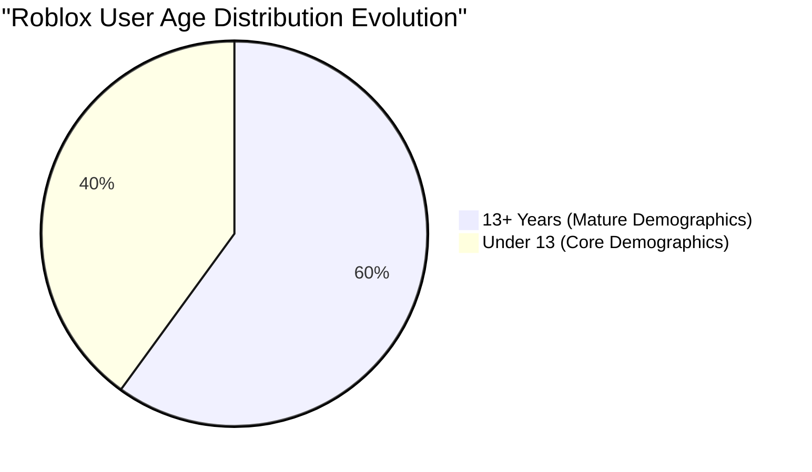
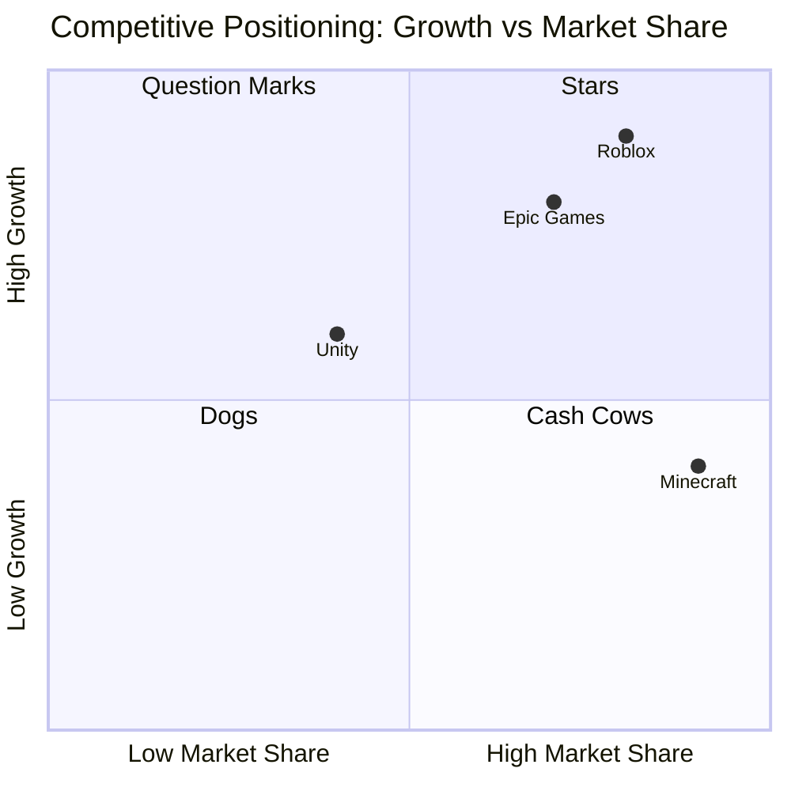
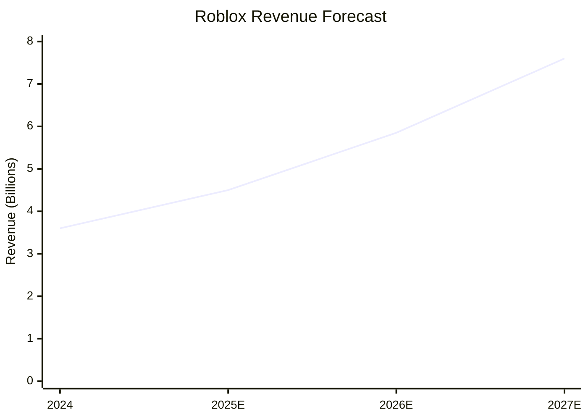

# Roblox Corporation (RBLX) Investment Analysis

## Executive Summary

**Investment Recommendation: BUY**  
**Price Target: $130-140** (2-10% upside from current levels)  
**Investment Horizon: 12-24 months**

Roblox Corporation represents a compelling growth investment opportunity in the rapidly expanding metaverse gaming sector. Despite current unprofitability, the company demonstrates exceptional revenue growth (48% CAGR over 5 years), a maturing and engaged user base, and breakthrough AI platform innovations that could establish sustainable competitive advantages. Recent catalysts including revolutionary 4D content generation, creator economy expansion, and new user engagement features position Roblox for continued market share gains in the $390+ billion metaverse gaming market by 2032.

## Investment Thesis Overview

### Bull Case (70% probability)
- **AI Technology Leadership**: Revolutionary 4D object generation and 400 AI models in development create significant competitive moats
- **Creator Economy Expansion**: Over $1 billion annual creator payouts driving platform velocity and content quality
- **Demographic Evolution**: User base maturing with 60% now 13+, higher spending power demographic
- **Market Leadership**: Strong position in fastest-growing gaming segment (37.9% CAGR through 2032)

### Bear Case (30% probability)  
- **Profitability Concerns**: Persistent losses despite strong revenue growth
- **Regulatory Risk**: Increased scrutiny on child safety and AI content generation
- **Competition**: Well-funded competitors developing similar platform capabilities
- **Execution Risk**: Complex AI deployment across 400 models requires flawless execution

## Financial Performance Analysis

### Revenue Growth Excellence

**Key Financial Metrics:**
- **Revenue CAGR (2019-2024)**: 48%
- **2024 Revenue**: $3.60 billion (+28.7% YoY)
- **Gross Margin**: 77.8% (industry-leading efficiency)
- **User Spending Growth**: $1.88 billion in H1 2024

**Profitability Trajectory:**
- **2023 Net Loss**: -$935 million (18.8% improvement from 2022)
- **Margin Expansion**: Gross margins improving from 75.4% (2022) to 77.8% (2024)
- **Path to Profitability**: Revenue scale beginning to provide operational leverage

For detailed financial analysis, see [Financial Performance Report](./reports/task-1-financial-performance.md).

## Stock Valuation and Performance

### Stock Performance Highlights
- **Current Market Cap**: $89.06 billion
- **Stock Performance**: Up 203% over past year
- **All-Time High**: $150.59 (July 2025)
- **Since IPO Performance**: +259% (32.9% CAGR from March 2021)
- **Analyst Consensus**: Strong Buy (23 analysts, $125.32 average target)

### Valuation Metrics
- **Current P/E**: Negative (due to losses, common for growth stage)
- **Revenue Multiple**: ~25x (premium reflecting growth expectations)
- **Justification**: High growth rates and market leadership position support premium valuation

## User Base and Demographic Advantages

### User Growth and Engagement

**User Metrics (2024):**
- **Daily Active Users**: 88.9 million (+41% YoY)
- **Monthly Active Users**: 380+ million
- **Daily Engagement**: 2.4-2.7 hours per user
- **Global Distribution**: Strong presence across APAC (35.7%), Europe (20.9%), Americas (19%)

**Monetization Strength:**
- **Average Spending**: $12.01 per user (Q2 2024)
- **Regional Leadership**: US accounts for 48% of global spending
- **Demographic Maturation**: Older users correlate with higher spending power

For comprehensive demographic analysis, see [User Demographics Report](./reports/task-2-user-demographics.md).

## Competitive Position and Market Opportunity

### Market Leadership Position
- **Market Ranking**: #2 gaming company by market cap (after Nintendo)
- **Growth Advantage**: 21% DAU growth vs. single-digit industry growth
- **Market Size**: Metaverse gaming growing from $21.6B (2023) to $390.6B (2032)

### Competitive Differentiation

**Competitive Advantages:**
1. **Platform Model**: Creator-generated content vs. company-developed content
2. **Economic Ecosystem**: Sustainable creator monetization driving quality
3. **Technology Leadership**: AI innovations creating development barriers for competitors
4. **Network Effects**: Large user base attracts creators, creating virtuous cycle

For detailed competitive analysis, see [Competitive Analysis Report](./reports/task-3-competitive-analysis.md).

## Growth Catalysts and Future Outlook

### Revolutionary AI Platform (2025)
- **4D Object Generation**: Industry-first technology for automated content creation
- **400 AI Models**: Comprehensive AI suite covering asset generation, translation, and development tools
- **Competitive Moat**: No other platform offers this level of AI-assisted creation

### Creator Economy Expansion
- **DevEx Rate Increase**: 8.5% improvement in creator payouts
- **Annual Creator Earnings**: $1+ billion, growing 25% annually
- **Success Stories**: Top 1,000 creators average $820,000 annually

### New User Engagement Features
- **Roblox Moments**: TikTok-style video sharing within platform
- **Global Expansion**: New data centers improving international performance
- **Hardware Development**: New gaming handheld device in development

For comprehensive catalyst analysis, see [Growth Catalysts Report](./reports/task-4-catalysts-outlook.md).

## Investment Risks and Mitigation

### Key Risk Factors

#### Profitability Timeline Risk
- **Concern**: Persistent losses despite strong revenue growth
- **Mitigation**: Improving gross margins and operational leverage indicators
- **Timeline**: Path to profitability expected within 2-3 years based on current trajectory

#### Regulatory Risk
- **Concern**: Child safety regulations and AI content oversight
- **Mitigation**: Proactive safety measures and compliance investments
- **Impact**: Moderate - industry-wide challenge, not Roblox-specific

#### Competition Risk
- **Concern**: Well-funded competitors developing similar capabilities
- **Mitigation**: AI technology leadership and first-mover advantages
- **Assessment**: Manageable - platform network effects create switching costs

#### Execution Risk
- **Concern**: Complex AI deployment across 400 models
- **Mitigation**: Strong technical team and staged rollout approach
- **Timeline**: Critical 12-18 month execution period for AI platform

## Financial Forecast and Price Target

### Revenue Projection (2025-2027)

**Base Case Projections:**
- **2025E**: $4.50 billion (25% growth)
- **2026E**: $5.85 billion (30% growth) 
- **2027E**: $7.60 billion (30% growth)

**Assumptions:**
- Continued DAU growth of 20-25% annually
- AI features driving increased user engagement and spending
- International expansion contributing to revenue growth
- Path to profitability beginning in 2026

### Price Target Methodology
- **Revenue Multiple Approach**: 20x 2025E revenue = $90B market cap (~$145 per share)
- **DCF Analysis**: Present value of future cash flows = $135 per share
- **Peer Comparison**: Premium to growth peers justified by market position
- **Target Range**: $130-140 per share (12-month horizon)

## Investment Recommendation: BUY

### Recommendation Rationale

**Strong Buy Thesis:**
1. **Exceptional Growth**: 48% revenue CAGR with continued momentum
2. **Technology Leadership**: Revolutionary AI capabilities creating competitive moats  
3. **Market Opportunity**: Leading position in $390B+ addressable market by 2032
4. **Creator Economy**: Sustainable content generation model with $1B+ annual creator payouts
5. **Demographic Evolution**: User base maturing toward higher-spending demographics

**Risk-Adjusted Return Profile:**
- **Expected Return**: 15-25% over 12-24 months
- **Risk Level**: Moderate-High (growth stage company with execution risk)
- **Suitable For**: Growth-oriented investors with 2-3 year investment horizon

### Investment Action Plan

**For New Investors:**
- **Entry Strategy**: Dollar-cost averaging over 2-3 months to mitigate volatility
- **Position Size**: 2-5% of portfolio for growth-oriented investors
- **Stop Loss**: $90 per share (30% below current levels)

**For Current Holders:**
- **Action**: Hold and potentially add on any weakness below $115
- **Target**: Maintain position through AI platform rollout (next 12-18 months)
- **Exit Strategy**: Consider profit-taking above $145

## Conclusion

Roblox Corporation represents a compelling investment opportunity at the intersection of gaming, creator economy, and artificial intelligence. The company's exceptional growth trajectory, revolutionary AI platform developments, and strong position in the rapidly expanding metaverse gaming market create multiple pathways for continued value creation.

While profitability challenges and execution risks require monitoring, the company's technological innovations, creator economy strength, and demographic evolution provide a robust foundation for long-term growth. The recent stock performance reflects growing market recognition of these advantages, but significant upside remains for investors willing to embrace the growth story.

**Investment Rating: BUY**  
**Price Target: $130-140**  
**Risk Rating: Moderate-High**  
**Investment Horizon: 12-24 months**

---

## Table of Contents - Detailed Analysis

- [Task 1: Financial Performance Analysis](./reports/task-1-financial-performance.md) - Comprehensive 5-year financial review
- [Task 2: User Demographics and Business Model](./reports/task-2-user-demographics.md) - User base analysis and monetization model
- [Task 3: Competitive Analysis](./reports/task-3-competitive-analysis.md) - Market positioning and competitor comparison
- [Task 4: Growth Catalysts and Outlook](./reports/task-4-catalysts-outlook.md) - Platform innovations and future growth drivers

---

**Disclaimer**: This analysis is for informational purposes only and does not constitute investment advice. Past performance does not guarantee future results. Investors should conduct their own research and consult with financial advisors before making investment decisions.