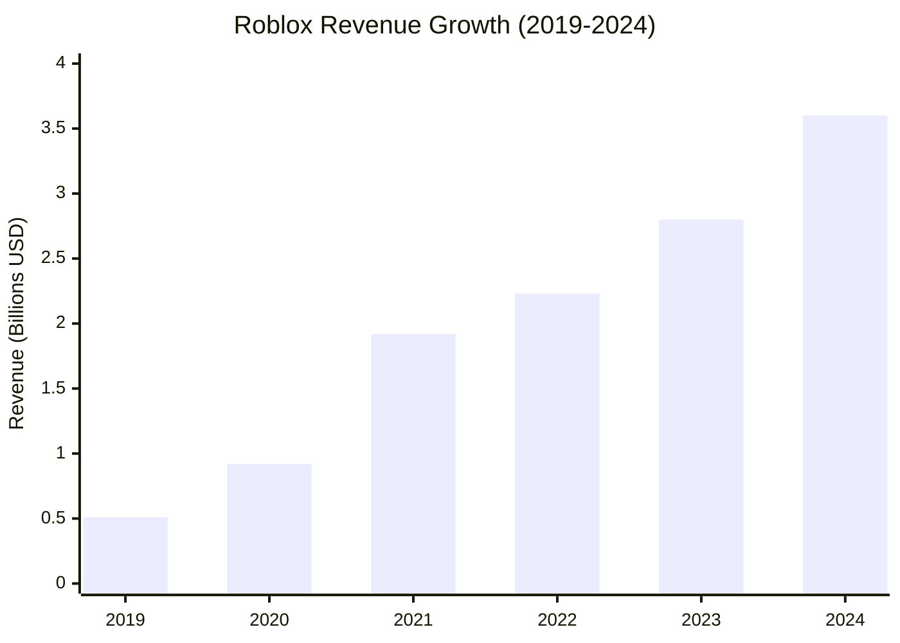
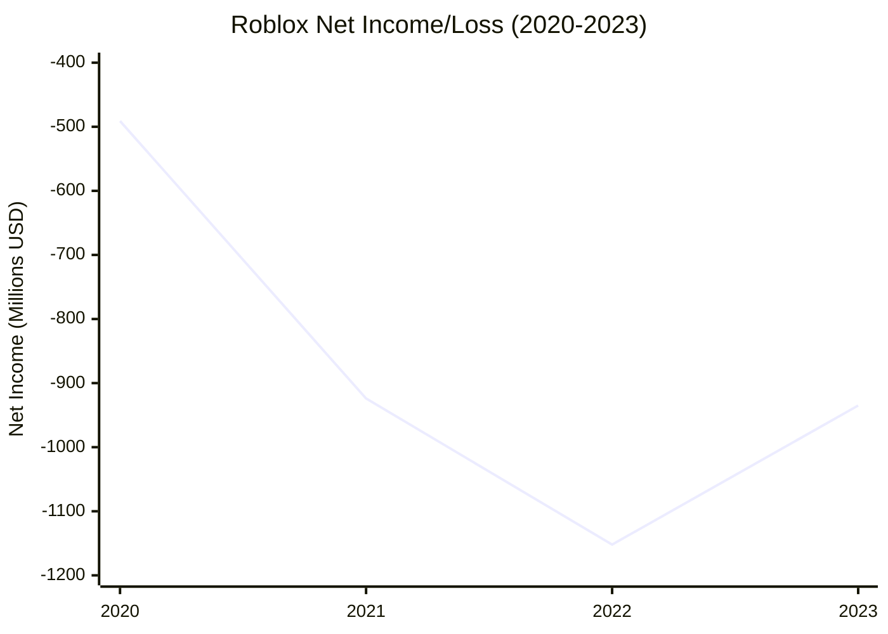

# Roblox Financial Performance Analysis (2019-2024)

## Executive Summary

Roblox Corporation (RBLX) has demonstrated exceptional revenue growth over the past five years, with annual revenue increasing from $508 million in 2019 to $3.60 billion in 2024, representing a compound annual growth rate (CAGR) of approximately 48%. However, the company continues to operate at a net loss, though losses are stabilizing as the company focuses on operational efficiency.

## Revenue Growth Trajectory

### 5-Year Revenue Performance

- **2019**: $508 million
- **2020**: $924 million (+81.7% YoY)
- **2021**: $1.92 billion (+108.1% YoY) - IPO year
- **2022**: $2.23 billion (+15.9% YoY)
- **2023**: $2.80 billion (+25.8% YoY)
- **2024**: $3.60 billion (+28.7% YoY)

### Key Revenue Insights
- **Consistent Double-Digit Growth**: Maintained 15-29% annual growth rates since 2022
- **Strong 2024 Performance**: Revenue of $3.60 billion exceeded expectations with 28.7% growth
- **Quarterly Momentum**: Q3 2024 generated $919 million in revenue, continuing the upward trend

## Profitability Analysis

### Gross Profit Margins
Roblox has shown improving gross profit margins, demonstrating operational leverage:

- **2022**: $1.68 billion gross profit (75.4% margin)
- **2023**: $2.15 billion gross profit (76.8% margin) 
- **2024**: $2.80 billion gross profit (77.8% margin)

### Net Income/Loss Trends

- **2020**: -$491.7 million
- **2021**: -$924.4 million (IPO investments and growth spending)
- **2022**: -$1.15 billion (peak losses)
- **2023**: -$935.4 million (18.8% improvement from 2022)

## Stock Performance and Valuation

### Market Capitalization Growth
- **Current Market Cap**: $89.06 billion (September 2025)
- **IPO Market Cap** (March 2021): $24.77 billion
- **Growth Since IPO**: 259.5% increase (32.9% CAGR)

### Stock Price Performance
- **IPO Date**: March 10, 2021
- **All-Time High**: $150.59 (July 31, 2025)
- **All-Time Low**: $21.65 (May 10, 2022)
- **Current Price**: ~$127.69 (as of research date)
- **Recent Performance**: Up 203% over the last year

### P/E Ratio Analysis
- **Current P/E Ratio**: -95.87 (TTM) - negative due to net losses
- **2024 Year-End P/E**: -39.9
- **Analyst Price Target**: $125.32 average (23 analysts)
- **Analyst Rating**: "Strong Buy" consensus

## Financial Health Indicators

### Balance Sheet Strength
- **Cash Position**: Strong cash reserves supporting growth investments
- **Debt Management**: Minimal debt burden allows for continued expansion
- **Working Capital**: Positive working capital supporting operations

### Key Financial Ratios
- **Gross Margin**: 77.8% (2024) - industry-leading efficiency
- **Revenue Growth Rate**: 28.7% (2024) - significantly above industry average
- **Market Cap to Revenue**: ~25x (premium valuation reflecting growth expectations)

## Bookings and User Spending
- **2024 H1 Bookings**: $1.88 billion in user spending on Robux
- **Q3 2024 Bookings**: $1.12 billion 
- **Average User Spending**: $12.01 per player (Q2 2024)

## Key Financial Conclusions

### Strengths
1. **Exceptional Revenue Growth**: 48% CAGR over 5 years demonstrates strong market demand
2. **Improving Margins**: Gross margins expanding to 77.8%, showing operational leverage
3. **Strong Balance Sheet**: Adequate cash position for continued growth investments
4. **Market Leadership**: Premium valuation reflects strong competitive position

### Areas of Concern
1. **Persistent Losses**: Despite revenue growth, company remains unprofitable
2. **High Valuation**: 25x revenue multiple requires continued high growth rates
3. **Operating Leverage**: Need to demonstrate path to profitability

### Financial Outlook
According to [MacroTrends](https://www.macrotrends.net/stocks/charts/RBLX/roblox/revenue) and [Roblox IR](https://ir.roblox.com/financials/quarterly-results/default.aspx), the company's strong revenue trajectory and improving operational metrics suggest continued growth potential, though investors should monitor progress toward profitability.

## References
- [Roblox Quarterly Results](https://ir.roblox.com/financials/quarterly-results/default.aspx)
- [Roblox 2024 Financial Results](https://ir.roblox.com/news/news-details/2025/Roblox-Reports-Fourth-Quarter-and-Full-Year-2024-Financial-Results/default.aspx)
- [MacroTrends RBLX Financial Data](https://www.macrotrends.net/stocks/charts/RBLX/roblox/revenue)
- [Yahoo Finance RBLX Stock Data](https://finance.yahoo.com/quote/RBLX/)
- [StockAnalysis.com RBLX Data](https://stockanalysis.com/stocks/rblx/revenue/)