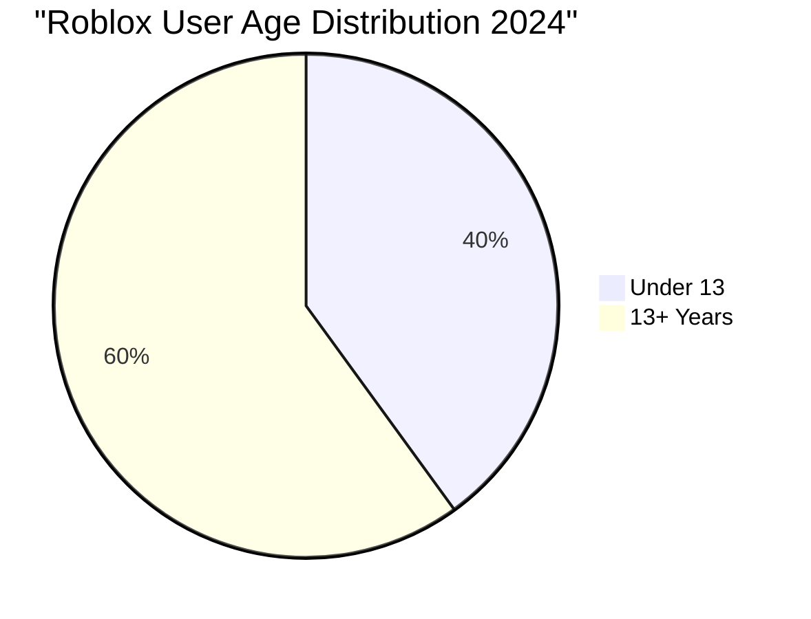
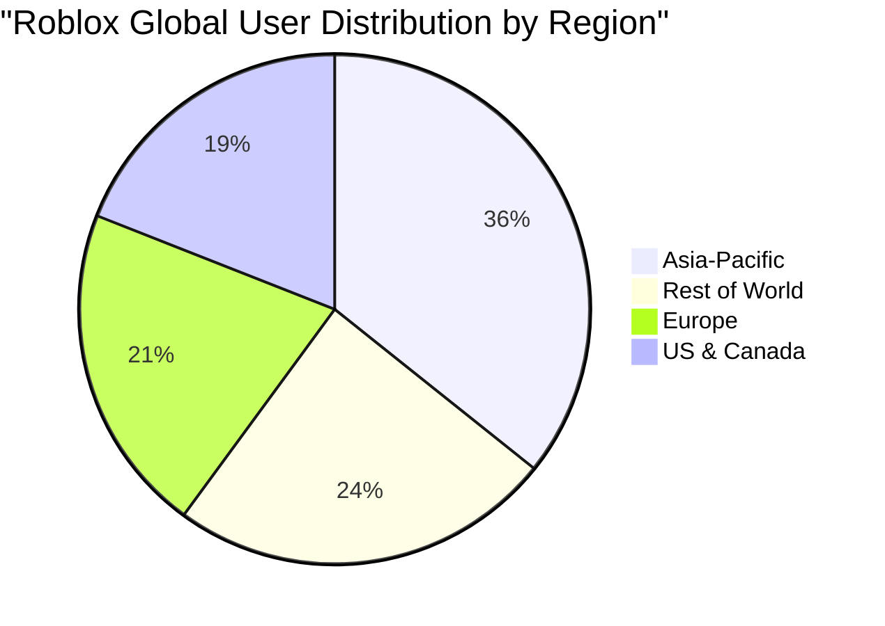
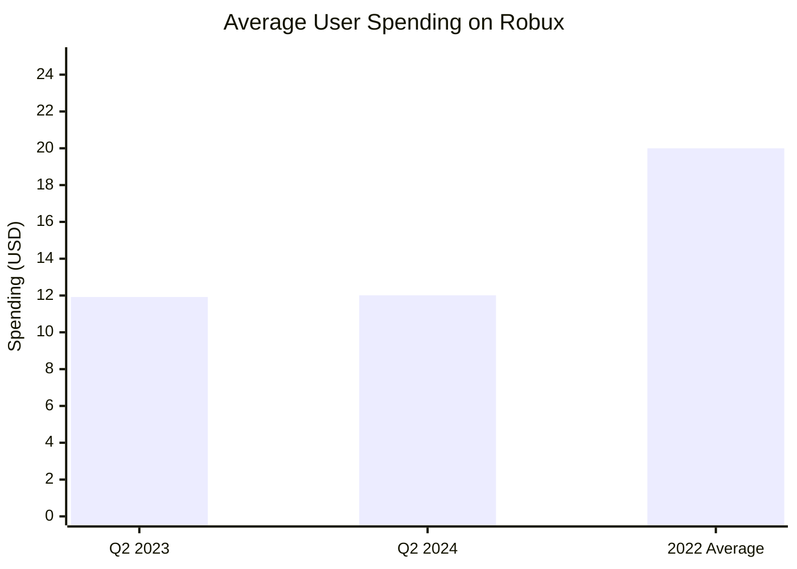

# Roblox User Demographics and Business Model Analysis

## Executive Summary

Roblox has evolved from a predominantly child-focused platform to a diverse gaming ecosystem with significant adult engagement. The platform now serves 88.9 million daily active users (Q3 2024) and over 380 million monthly active users (2025), with 60% of users now over 13 years old. The global user base demonstrates strong spending patterns, with users spending $1.88 billion in the first half of 2024 alone.

## User Base Growth and Scale

### Active User Metrics (2024)
- **Daily Active Users**: 88.9 million (Q3 2024) - 41% YoY increase
- **Monthly Active Users**: 380+ million (2025)
- **Peak Concurrent Users**: Over 45 million simultaneously
- **User Engagement**: 2.4-2.7 hours average daily usage
- **Total Gameplay Hours**: 73.5 billion hours in 2024 (+22% YoY)

## Age Demographics Evolution

### Current Age Distribution
The platform's user base has significantly matured:
- **60% of users are now 13+ years old** (major shift from historically younger demographics)
- **Under 13**: Approximately 34 million daily active users
- **13 and above**: Approximately 53.6 million daily active users
- **Under 9**: 21% of total user base
- **12 and under**: Over 40% of users
- **25+ years**: 18% of user base

### Key Demographic Insights
- **Aging User Base**: Roblox is successfully retaining users as they mature
- **Adult Engagement**: Nearly 1 in 5 users are 25+ years old
- **Balanced Demographics**: Platform appeals across age groups, not just children

## Global Regional Distribution

### Regional Breakdown
- **Asia-Pacific (APAC)**: 35.7% share (22.3M daily active users)
- **Europe**: 20.9% share (20.6-21.7M daily active users)  
- **US and Canada**: 19% share (19.7M daily active users)
- **Rest of World**: 24.3% share

### Regional Growth Drivers
- Strong penetration in emerging markets
- Localization efforts supporting global expansion
- New data centers (São Paulo) improving regional performance

## User Spending and Monetization

### Platform Revenue from Users
- **H1 2024 Spending**: $1.88 billion on Robux purchases
- **Q3 2024 Bookings**: $1.12 billion
- **Q3 2024 Revenue**: $919 million

### Individual Spending Patterns

- **Q2 2024**: $12.01 per player (slight increase from $11.92 in Q2 2023)
- **2022 Annual**: $20 per user average
- **Spending Growth**: Consistent year-over-year increases

### Country-Specific Spending Leadership (2023)
- **United States**: 48% of global player expenditure
- **South Korea**: 6%
- **United Kingdom**: 5%
- **Australia**: 3%
- **Canada**: 3%

## Purchasing Behavior Analysis

### Youth Purchasing Independence
Research indicates that children on Roblox do engage in independent purchasing, though often with parental oversight:
- Parents frequently provide payment methods for Robux purchases
- Gift cards are popular for younger users
- In-app purchase controls are common parental tools
- Average spending suggests regular, moderate purchases rather than large occasional spending

### Engagement-Driven Spending
- **High Engagement Correlation**: Users spending 2.4+ hours daily correlate with higher spending
- **Social Spending**: Users often purchase items to enhance social experiences
- **Creator Economy**: Users support favorite creators through purchases

## Gender Distribution
- **Male**: 51-53% of user base
- **Female**: 39-44% of user base
- **Relatively Balanced**: Platform appeals to both genders effectively

## Business Model Effectiveness

### Creator Economy Success
- **Creator Earnings**: Over $1 billion earned through DevEx in past year
- **Top Creators**: Top 1,000 developers average $820,000 annually
- **Growth**: Creator earnings up 25% in 2024 vs 2023
- **Ecosystem Health**: Strong creator incentives drive content quality

### Monetization Strengths
1. **Recurring Revenue**: High user engagement drives consistent spending
2. **Global Appeal**: Diverse geographic revenue streams
3. **Age Retention**: Users continue spending as they mature
4. **Creator Economy**: Virtuous cycle of content creation and monetization

## Key Demographics Conclusions

### User Base Strengths
- **Maturing Demographics**: Successfully expanding beyond core child audience
- **Global Scale**: Strong presence across all major regions
- **High Engagement**: Industry-leading usage hours per user
- **Spending Growth**: Consistent increases in per-user revenue

### Market Opportunity
- **Aging User Base**: Older users typically have higher spending power
- **Global Expansion**: Significant growth potential in emerging markets
- **Creator Economy**: Sustainable content generation model

### Risk Factors
- **Regulatory Concerns**: Child safety and spending oversight requirements
- **Competition**: Other platforms targeting similar demographics
- **Economic Sensitivity**: Discretionary spending vulnerable to economic downturns

## References
- [Roblox Q3 2024 Financial Results](https://ir.roblox.com/news/news-details/2024/Roblox-Reports-Third-Quarter-2024-Financial-Results/default.aspx)
- [Statista: Roblox User Demographics](https://www.statista.com/statistics/1190869/roblox-games-users-global-distribution-age/)
- [Enterprise Apps Today: Roblox Statistics](https://www.enterpriseappstoday.com/stats/roblox-statistics.html)
- [TechPoint Africa: Roblox User Demographics](https://techpoint.africa/guide/roblox-user-demographics/)
- [Takeaway Reality: Roblox Demographics 2025](https://www.takeaway-reality.com/post/roblox-demographics-statistics)