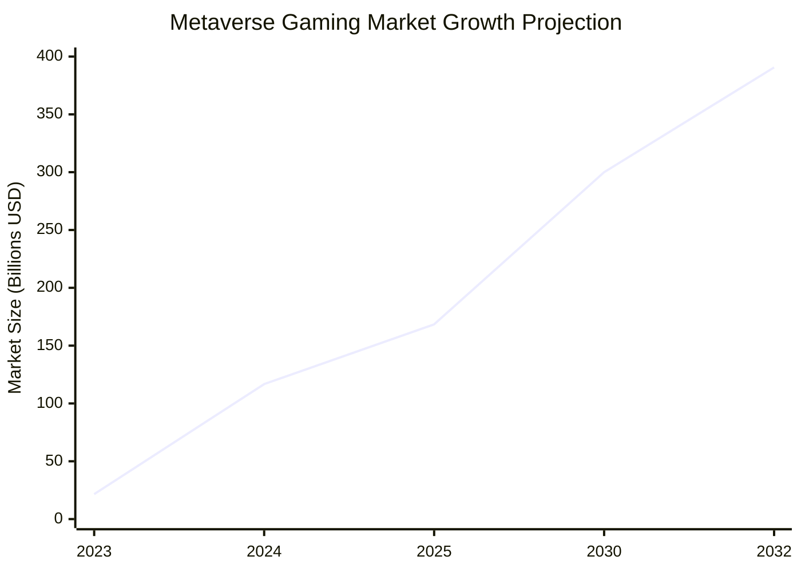
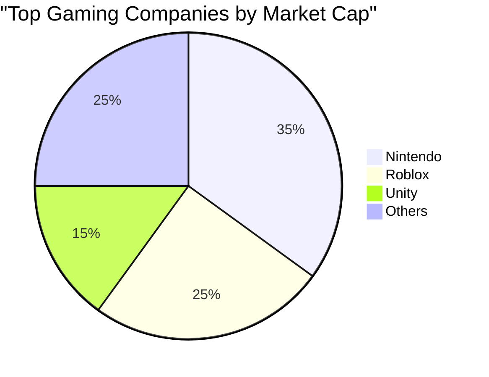

# Roblox Competitive Analysis and Market Positioning

## Executive Summary

Roblox operates in the rapidly growing metaverse gaming market, competing with major players including Epic Games (Fortnite), Microsoft (Minecraft), Unity Software, and Meta Platforms. The metaverse gaming market is projected to grow from $21.6 billion in 2023 to $390.6 billion by 2032, representing a 37.9% CAGR. Roblox holds a strong position as the second-largest gaming company by market capitalization after Nintendo.

## Market Landscape and Growth

### Metaverse Gaming Market Size


- **2023 Market Size**: $21.6 billion
- **2024 Projected**: $116.74 billion  
- **2030 Projection**: $168.4 billion
- **2032 Projection**: $390.6 billion
- **Growth Rate**: 37.9% CAGR (2023-2032)

### Overall Metaverse Market
- **2024 Market Size**: $116.74 billion
- **2029 Projection**: $669.96 billion
- **CAGR**: 41.83% (2024-2029)

## Key Competitors Analysis

### Direct Competitors

#### Epic Games (Fortnite)
- **Business Model**: Free-to-play with cosmetic microtransactions
- **Strengths**: 
  - Massive concurrent player base
  - Strong esports ecosystem
  - Unreal Engine technology platform
  - Takes 5% revenue from games built on Unreal Engine
- **Recent Developments**: Raised $2 billion in funding (April 2022) from Sony and Kirkbi (Lego parent)
- **Market Position**: Leader in battle royale genre with strong creator economy

#### Microsoft (Minecraft)
- **Business Model**: Game purchase + downloadable content + educational licensing
- **Strengths**:
  - Established brand with broad appeal
  - Educational market penetration
  - Cross-platform availability
  - Strong modding community
- **Market Position**: Dominant in sandbox/creative gaming space

#### Unity Software (U)
- **Business Model**: Engine licensing and development tools
- **Valuation**: Trading at 7x projected revenue
- **Recent Developments**: 
  - Strategic collaboration with Apple (January 2024) for AR/spatial computing
  - Focus on spatial experiences and augmented reality
- **Market Position**: Leading game engine provider, enabling competitor platforms

### Indirect Competitors

#### Meta Platforms (META)
- **Focus**: VR/AR metaverse experiences (Horizon Worlds)
- **Strengths**: Massive social network integration, VR hardware (Quest)
- **Challenges**: Limited gaming-focused content, hardware dependency

#### Nintendo
- **Market Cap**: Largest gaming company globally
- **Strengths**: Exclusive IP, hardware ecosystem, family-friendly content
- **Different Focus**: Console gaming vs. PC/mobile metaverse platforms

## Market Position Comparison

### Gaming Company Market Cap Rankings (2024)


1. **Nintendo**: Leading position (traditional console gaming)
2. **Roblox**: $89.06 billion market cap (September 2025)
   - Previously $23.89 billion (April 2024)
   - Strong recovery and growth trajectory
3. **Other Gaming Companies**: Various positions

### Competitive Advantages Analysis

#### Roblox's Strengths
1. **User-Generated Content Platform**: Unlike competitors who create content, Roblox enables users to create
2. **Creator Economy**: Over $1 billion paid to creators annually
3. **Age Demographic Expansion**: Successfully growing beyond core child audience
4. **Global Reach**: Strong presence in APAC (35.7% of users), Europe (20.9%), and Americas (19%)
5. **High Engagement**: 2.4-2.7 hours daily usage per user

#### Competitive Disadvantages
1. **Profitability Challenges**: Still operating at a loss while some competitors are profitable
2. **Platform Dependency**: Relies on creator content quality
3. **Regulatory Risk**: Child safety concerns more pronounced than adult-focused competitors

## Growth Rate Comparisons

### Roblox vs. Market Growth
- **Roblox Daily Active Users Growth**: 21% (2024)
- **Gaming Industry Growth**: Single-digit growth (2024)
- **Metaverse Market Growth**: 41.83% CAGR
- **Roblox Revenue Growth**: 28.7% (2024)

### Competitive Growth Metrics
While specific growth rates for all competitors weren't available, Roblox's 21% DAU growth significantly outpaces the broader gaming industry's single-digit growth rate, indicating market share gains.

## Valuation Comparison

### P/E Ratio Analysis
- **Roblox Current P/E**: -95.87 (negative due to losses)
- **Industry Context**: Many growth-stage gaming companies trade on revenue multiples rather than P/E
- **Roblox Revenue Multiple**: ~25x revenue (premium reflecting growth expectations)

### Market Positioning
```mermaid
quadrantChart
    title Competitive Positioning Matrix
    x-axis Low Market Share --> High Market Share
    y-axis Low Growth --> High Growth
    quadrant-1 Stars (High Growth, High Share)
    quadrant-2 Question Marks (High Growth, Low Share)
    quadrant-3 Dogs (Low Growth, Low Share)
    quadrant-4 Cash Cows (Low Growth, High Share)
    Roblox: [0.8, 0.9]
    Epic Games: [0.7, 0.8]
    Minecraft: [0.9, 0.4]
    Unity: [0.4, 0.6]
    Meta VR: [0.2, 0.5]
```

## Strategic Differentiation

### Unique Value Propositions

#### Roblox
- **Platform Model**: Enables creators rather than just consuming content
- **Economic Ecosystem**: Robust creator monetization driving content quality
- **Cross-Platform**: Available across devices without hardware requirements

#### Competitive Responses
- **Epic Games**: Building creator tools and economic systems in Fortnite Creative
- **Microsoft**: Expanding Minecraft's creative capabilities and educational focus
- **Meta**: Developing creator tools for Horizon Worlds

## Market Share and Competitive Dynamics

### Gaming Metaverse Leadership
Roblox, Fortnite, and Minecraft are identified as the pioneering virtual worlds in the metaverse gaming segment, which captured over 25.3% of the global metaverse market in 2024.

### Competitive Moats
1. **Network Effects**: Large user base attracts creators, creating more content
2. **Creator Lock-in**: Developers invested in Roblox Studio and Robux economy
3. **Brand Recognition**: Strong brand awareness among target demographics
4. **Data Advantages**: User behavior data improves recommendation and discovery systems

## Investment Implications

### Competitive Strengths
- Strong market position in fastest-growing gaming segment
- Unique platform model with sustainable competitive advantages
- Outpacing industry growth rates significantly

### Competitive Risks
- Well-funded competitors with significant resources
- Platform dependency on creator content quality
- Regulatory risks more pronounced than competitors

### Analyst Perspective
23 analysts maintain "Strong Buy" rating with $125.32 average price target, reflecting confidence in competitive position despite market challenges.

## Key Competitive Conclusions

Roblox holds a strong competitive position in the rapidly expanding metaverse gaming market, with unique platform advantages and superior growth rates compared to both direct competitors and the broader gaming industry. The company's creator economy model provides sustainable differentiation, though execution risks remain in maintaining content quality and achieving profitability.

## References
- [Context is King: Metaverse Competitors Analysis](https://contextisking.com/2022/06/17/distinguishing-the-key-competitors-in-the-metaverse-roblox-unity-epic-games/)
- [Bloomberg: Metaverse Market Analysis](https://www.bloomberg.com/professional/insights/trading/metaverse-may-be-800-billion-market-next-tech-platform/)
- [Kavout: Comparative Analysis RBLX vs META vs Unity](https://www.kavout.com/market-lens/unlocking-the-future-of-metaverse-a-comparative-analysis-of-roblox-rblx-meta-meta-and-unity-u)
- [Statista: Top Gaming Companies Market Value](https://www.statista.com/statistics/1197213/market-value-of-the-largest-gaming-companies-worldwide/)
- [SNS Insider: Metaverse Gaming Market Report](https://www.snsinsider.com/reports/metaverse-in-gaming-market-3343)