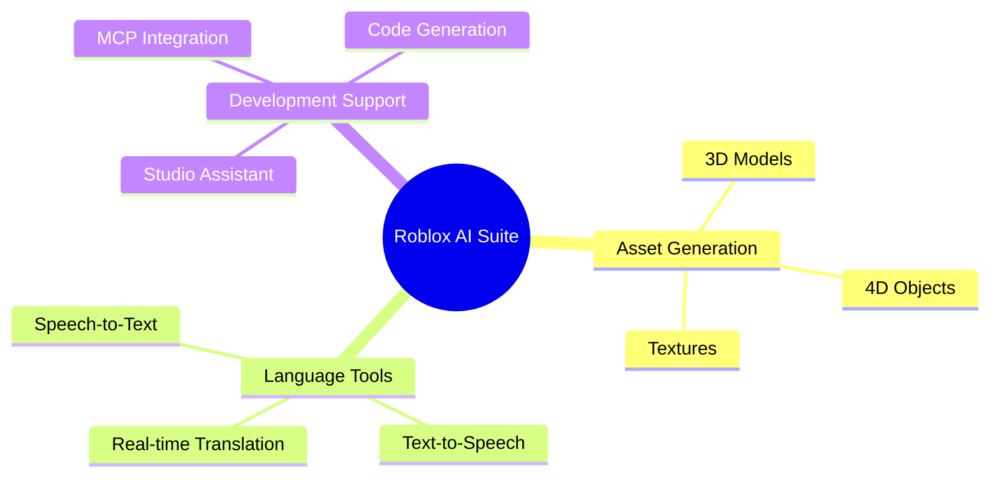
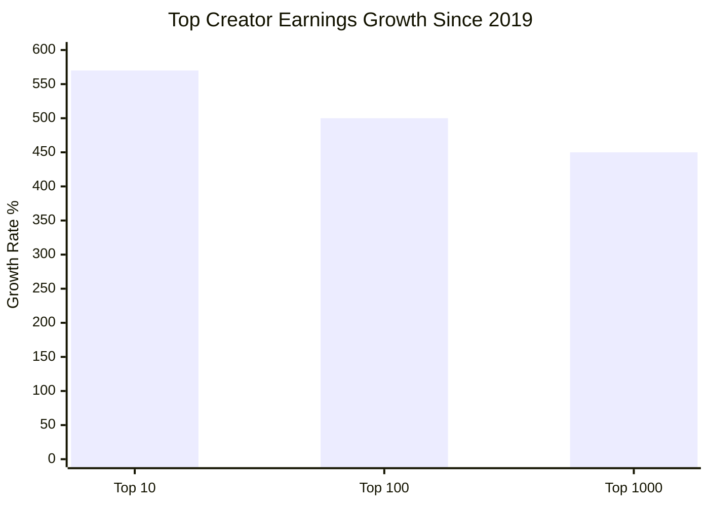
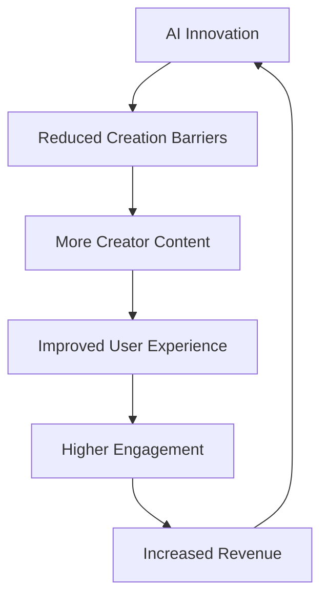

# Roblox Growth Catalysts and Future Outlook

## Executive Summary

Roblox is positioned for continued growth driven by several key catalysts including revolutionary AI platform developments, expanded creator monetization, new user engagement features, and strategic global expansion. Recent announcements at RDC 2025 showcase significant platform innovations that could drive the next phase of growth, while the company targets capturing 10% of all gaming content revenue globally.

## Major Platform Innovations and Catalysts

### Revolutionary AI Capabilities (2025)

#### 4D Object Generation
- **Breakthrough Technology**: First-of-its-kind AI that generates fully functional 4D objects from text prompts
- **Creator Impact**: Dramatically reduces asset creation time and barriers to entry
- **Competitive Advantage**: No other platform currently offers this level of automated content generation
- **Development Scale**: 400 AI models currently in development

#### AI-Powered Features

- **Real-time Translation**: Breaking down language barriers for global user interaction
- **Studio Integration**: MCP (Model Context Protocol) integration accelerating creation workflows
- **Asset Generation**: Comprehensive AI tools for content creation

### New User Engagement Features

#### Roblox Moments (2025)
- **TikTok-Style Video Feed**: Short-form video sharing platform within Roblox
- **User Demographics**: Initially available for users 13+ (expanding to core user base)
- **Feature Set**:
  - 30-second gameplay clip capture and editing
  - Music integration via DistroKid partnership
  - Social sharing and discovery
  - Direct jump-to-experience from videos
- **Market Impact**: Could significantly increase user engagement and retention

#### Enhanced Creator Tools
- **Collaborative Studio Tools**: Multi-user development environment
- **Native 3D Generation**: Streamlined content creation processes
- **Economy Expansion**: New monetization opportunities for creators

## Creator Economy Growth Catalysts

### Improved Developer Exchange (DevEx)
- **Rate Increase**: 8.5% improvement in DevEx rates
- **New Rate**: 100,000 earned Robux = $380 (up from $350)
- **Annual Creator Earnings**: Over $1 billion through DevEx program
- **Growth Trajectory**: 25% increase in creator earnings (2024 vs 2023)

### Creator Success Metrics (2024)

- **Top 1,000 Developers**: Average $820,000 annually (570% increase since 2019)
- **Top 10 Developers**: Average $33.9 million annually
- **Top 100 Developers**: Average $6 million annually (500% increase since 2019)

## Infrastructure and Global Expansion

### Geographic Expansion
- **São Paulo Data Center**: Now fully operational, improving Latin American user experience
- **Performance Impact**: Reduced latency for millions of Brazilian users
- **Growth Opportunity**: Brazil represents significant emerging market potential

### Platform Expansion
- **Gaming Hardware**: Development of new gaming handheld device (details pending)
- **Cross-Platform Strategy**: Expanding availability across more platforms
- **Technical Infrastructure**: Continued investment in global data center network

## Strategic Goals and Market Targets

### 10% Gaming Revenue Target
Roblox has set an ambitious goal to capture **10% of all global gaming content revenue**, with announcements designed to advance this vision through:
- Enhanced creator tools and AI capabilities
- Expanded monetization opportunities
- Improved user engagement and retention features

### Market Positioning Strategy
- **Creator Economy Leader**: Strengthening position as premier platform for user-generated content monetization
- **AI Innovation**: Establishing technology leadership in automated content generation
- **Global Platform**: Building infrastructure for worldwide accessibility and performance

## Financial Outlook and Growth Drivers

### Revenue Growth Catalysts
1. **Increased User Engagement**: Roblox Moments and AI features driving higher daily usage
2. **Creator Ecosystem Growth**: More creators earning significant income attracts higher-quality content
3. **Geographic Expansion**: Infrastructure improvements unlocking new markets
4. **AI-Driven Efficiency**: Reduced content creation barriers increasing platform velocity

### Key Performance Metrics Outlook
- **Daily Active Users**: 112 million (2024) with continued growth expected
- **User Spending**: $1.88 billion in H1 2024, projected to increase with new features
- **Creator Earnings**: Over $1 billion annually, supporting ecosystem growth

## Market Expansion Opportunities

### Demographic Growth
- **Age Expansion**: 60% of users now 13+, trend toward older demographics with higher spending power
- **Global Reach**: APAC leading with 35.7% of users, significant growth potential in emerging markets
- **Platform Evolution**: Moving beyond "kids' game" perception to broad entertainment platform

### Technology Leadership

The virtuous cycle of AI innovation driving creator success, leading to better content and higher user engagement.

## Recent Catalysts and Market Response

### Stock Performance Correlation
- **2024 Performance**: Stock up 203% over the last year
- **All-Time High**: $150.59 reached in July 2025
- **Market Response**: Strong positive reaction to AI and platform announcements

### Analyst Outlook
- **Consensus Rating**: "Strong Buy" from 23 analysts
- **Price Target**: $125.32 average target
- **Growth Recognition**: Analysts highlighting long-term growth potential and global expansion opportunities

## Risk Factors and Challenges

### Technology Risks
- **AI Implementation**: Successfully deploying 400 AI models requires significant execution capability
- **Competition**: Other platforms may develop competing AI capabilities
- **Technical Complexity**: Managing increasing platform sophistication

### Market Risks
- **Regulatory Environment**: Potential increased scrutiny on child safety and AI content generation
- **Economic Sensitivity**: User spending vulnerable to economic downturns
- **Content Quality**: Maintaining high-quality user experience as content creation becomes easier

## Investment Catalysts Summary

### Near-Term Catalysts (6-12 months)
1. **Roblox Moments Launch**: Full rollout of short-form video feature
2. **AI Tools Deployment**: Implementation of 4D object generation and other AI capabilities
3. **Creator Economy Growth**: Impact of improved DevEx rates on creator attraction
4. **Hardware Launch**: Details and launch of new gaming handheld device

### Medium-Term Catalysts (1-3 years)
1. **Global Expansion**: Infrastructure improvements driving international growth
2. **AI Platform Maturity**: Full deployment of 400 AI models creating competitive moats
3. **Demographic Evolution**: Continued shift toward older, higher-spending user base
4. **Market Share Gains**: Progress toward 10% global gaming revenue target

### Long-Term Vision (3+ years)
1. **Platform Dominance**: Establishing leading position in metaverse gaming
2. **Creator Economy Scale**: Multi-billion dollar annual creator payouts
3. **Technology Leadership**: AI-driven content creation becoming industry standard
4. **Global Platform**: Truly worldwide user base with localized experiences

## Conclusion

Roblox's growth catalyst portfolio is robust and multifaceted, with revolutionary AI capabilities, enhanced creator tools, and global expansion creating multiple pathways for continued growth. The company's strategic vision of capturing 10% of global gaming revenue, while ambitious, is supported by concrete technological and platform innovations that differentiate it from competitors.

## References
- [Roblox RDC 2025 Announcements](https://corp.roblox.com/newsroom/2025/09/roblox-rdc-2025)
- [TechCrunch: Roblox AI and Video Feed Features](https://techcrunch.com/2025/09/05/roblox-announces-short-form-video-feed-for-gameplay-clips-new-ai-tools-for-creators-and-more/)
- [Roblox Investor Relations: AI and Creator Innovations](https://ir.roblox.com/news/news-details/2025/Roblox-Unveils-AI-Monetization-and-Performance-Innovations-for-Creators/default.aspx)
- [Beebom: RDC 2025 Comprehensive Recap](https://beebom.com/roblox-rdc-2025-keynote-recap/)
- [GameSpot: Roblox TikTok-Style Feed Analysis](https://www.gamespot.com/articles/roblox-adds-tiktok-style-video-feed-and-new-ai-creator-tools/1100-6534571/)