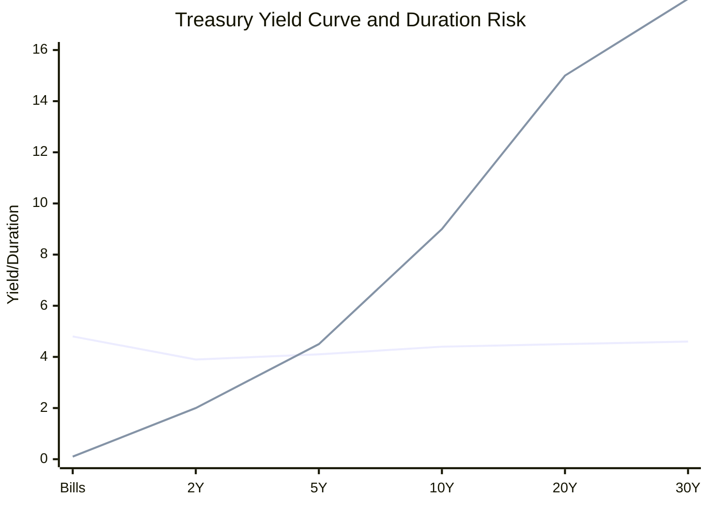
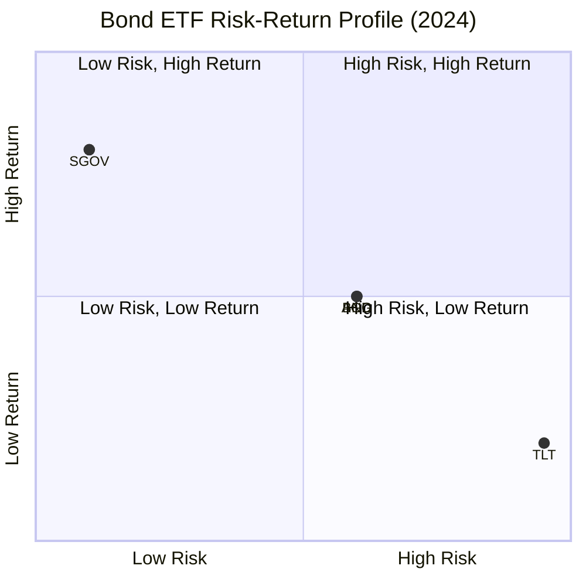
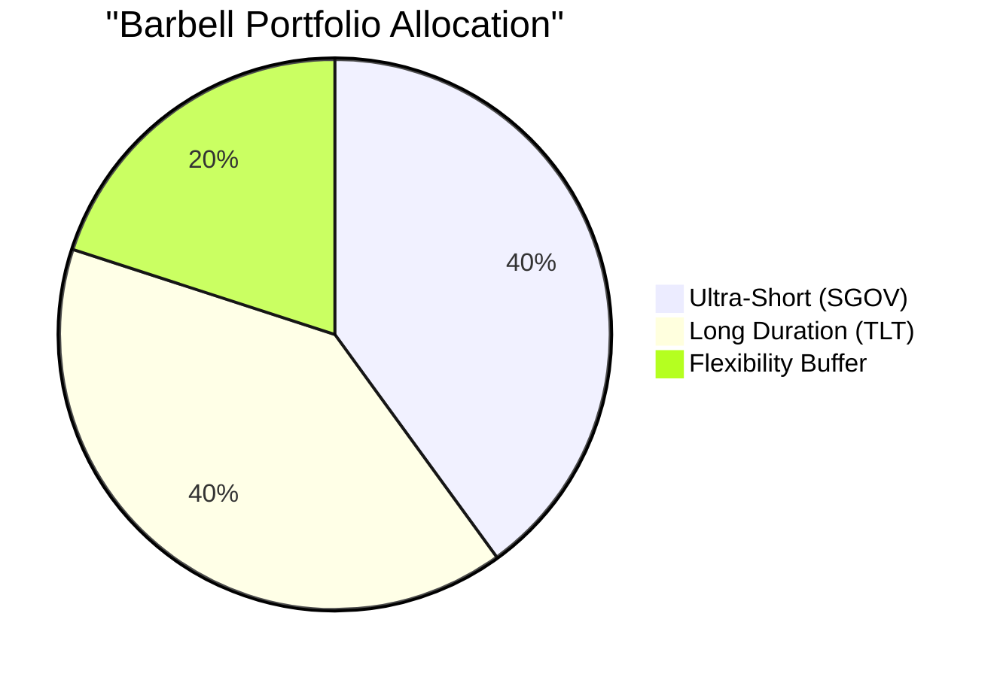
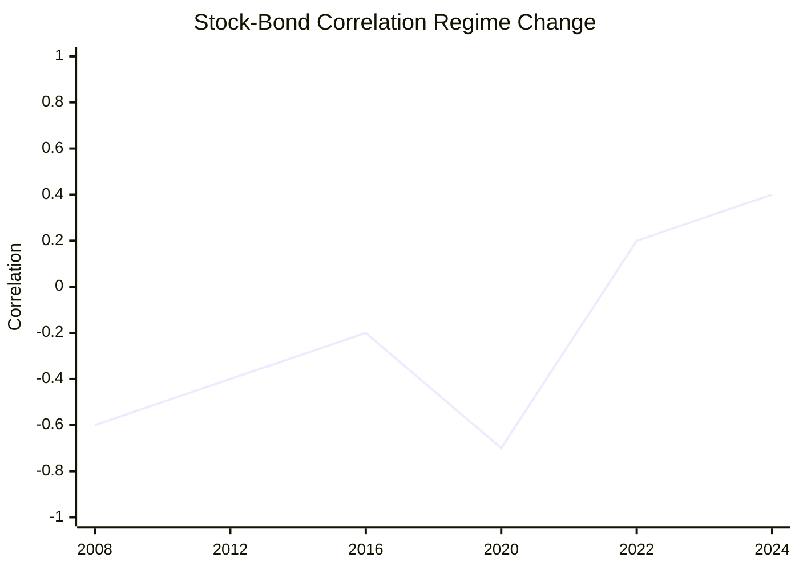
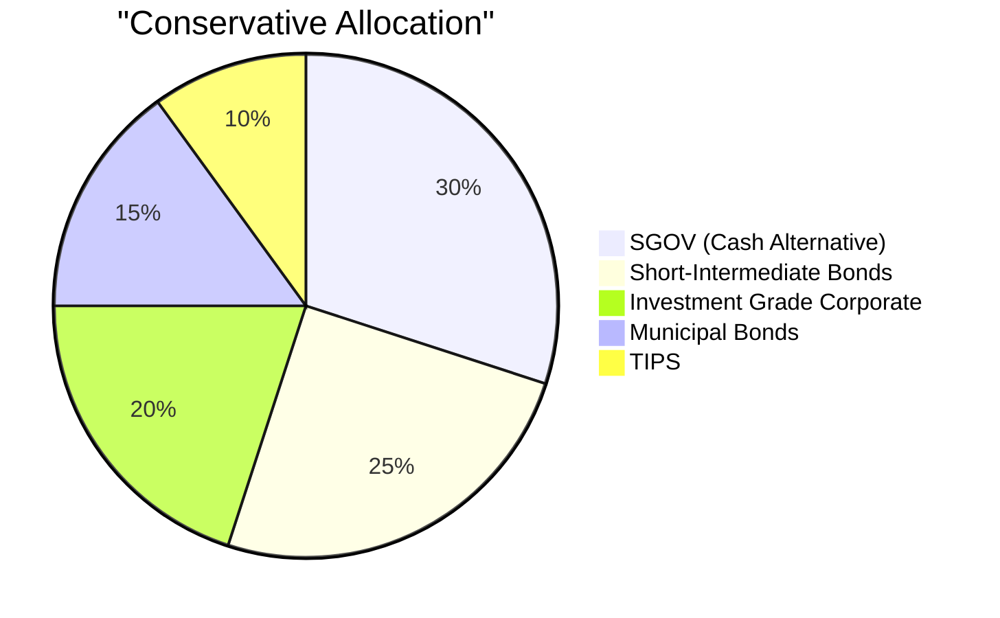
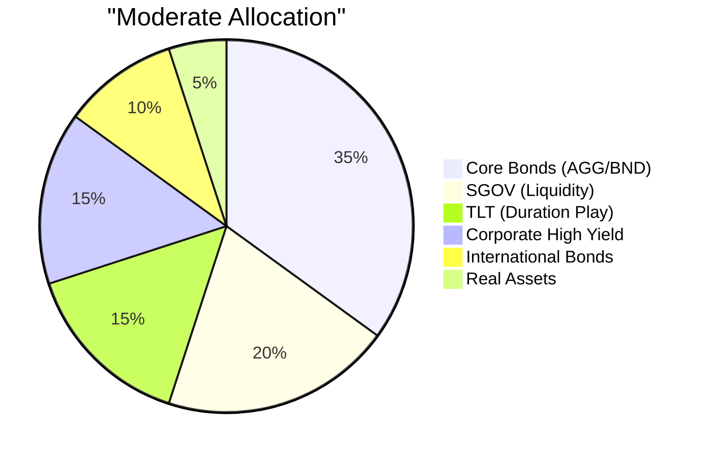
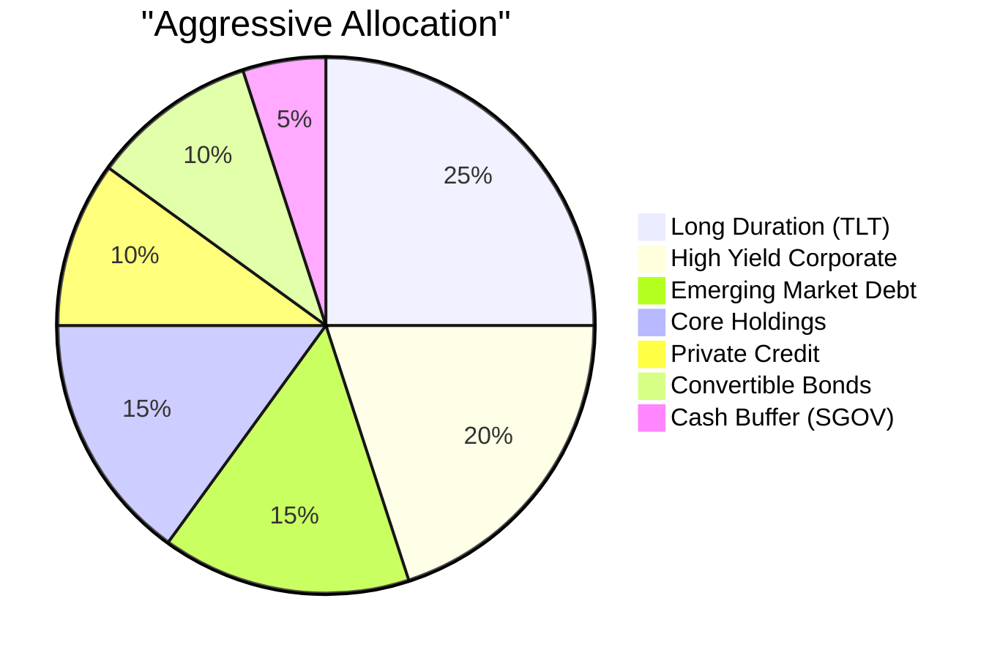
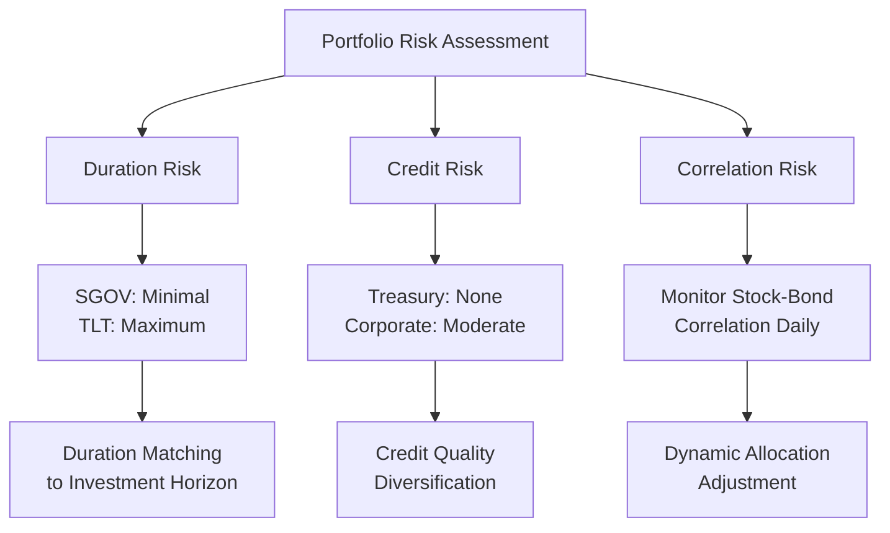

# US Treasury Bonds: SGOV, TLT, and Strategic Investment Analysis

## Executive Summary

This comprehensive research addresses US Treasury bond investing, with specific focus on the comparison between short-term (SGOV) and long-term (TLT) Treasury ETFs, investment strategies, and the evolving relationship with equity markets (SPX). The 2024 bond market presents unique opportunities with yields above 4% for the first time since 2009, while simultaneously challenging traditional portfolio diversification assumptions due to changing stock-bond correlations.

**Key Findings:**
- **SGOV** offers 4.2% yield with minimal duration risk, ideal for cash management
- **TLT** provides 4.5% yield with 15.5-year duration, suitable for rate decline positioning
- Traditional stock-bond negative correlation has reversed, reaching 75-year highs
- Strategic bond allocation requires alternative diversification approaches beyond traditional 60/40 portfolios

## Research Context: From Keywords to Strategic Insights

The fragmented keywords—"us bond," "SGOV, TLT, and others," "compare," "strategy," "relationship with SPX"—reveal a sophisticated investment inquiry seeking to understand the Treasury bond landscape and its role in portfolio construction. This research synthesizes these concepts into actionable investment intelligence across six critical dimensions.

## Key Findings

### 1. Treasury Bond Market Fundamentals

**Current Environment (2024):**
- Over 50% of fixed income markets yielding 4%+ (first time since 2009)
- Inverted yield curve: 10-year Treasury at 4.38%, 2-year at 3.88%
- Positive real yields across the curve due to moderating inflation
- Fed policy transition creating tactical positioning opportunities

**Treasury Securities Spectrum:**

### 2. SGOV vs. TLT: The Duration Spectrum

#### SGOV: The Cash Management King
- **Duration**: 0.1-0.2 years (minimal interest rate risk)
- **Yield**: 4.20% SEC 30-day yield
- **Assets**: $56 billion (grew $26B in 2024)
- **Expense Ratio**: 0.09%
- **Best Use**: Cash alternative, uncertainty hedging, emergency funds

#### TLT: The Duration Maximizer
- **Duration**: 15.5 years (maximum rate sensitivity)
- **Yield**: 4.45% dividend yield
- **Assets**: $48 billion ($2.4B outflows in 2024)
- **Expense Ratio**: 0.15%
- **Best Use**: Recession hedging, falling rate positioning, duration plays

**Risk-Return Positioning:**

### 3. Comprehensive Bond ETF Comparison

The Treasury ETF universe provides exposure across the complete duration spectrum:

| ETF | Duration | 2024 Yield | Assets | Performance | Strategic Use |
|-----|----------|------------|---------|-------------|---------------|
| **SGOV** | 0.15 | 4.20% | $56B | +5.27% | Cash management |
| **SHY** | 1.93 | 1.16% | $11B | Positive | Short duration exposure |
| **IEI** | 3.8 | ~4.4% | $6B+ | Near flat | Intermediate positioning |
| **AGG** | ~6.0 | Variable | Large | ~Flat | Broad diversification |
| **BND** | ~6.2 | Variable | Large | ~Flat | Total market exposure |
| **TLT** | 15.5 | 4.45% | $48B | -7.5% | Maximum duration play |

**2024 Performance Lesson**: Ultra-short duration strategies dominated, with SGOV capturing $26B in inflows while TLT faced $2.4B outflows.

### 4. Strategic Investment Frameworks

#### Barbell Strategy (Recommended for Uncertainty)

**Benefits:**
- High convexity for yield curve changes
- Liquidity from short end
- Duration exposure from long end
- Tactical rebalancing opportunities

#### Laddering Strategy (Stable Income Focus)
- **Structure**: Evenly distributed maturities
- **Income**: Predictable cash flows
- **Risk Management**: Reduced timing risk
- **Performance**: "Ladders have potential to outperform barbells in falling rate environment"

#### Core-Plus Approach (Diversified Foundation)
- **Core Holdings (60-70%)**: AGG, BND for broad exposure
- **Satellite Positions (30-40%)**: SGOV for cash, TLT for duration plays
- **Alternative Income (5-15%)**: High yield, international bonds

### 5. Stock-Bond Correlation Revolution

**Historic Regime Change:**
The 2024 bond market witnessed a fundamental shift in stock-bond relationships:

- **Correlation Level**: Stock-bond correlation reached 75-year high
- **Timeline**: 13-week correlation moved from -0.72 to +0.39 (November 2024 to January 2025)
- **Drivers**: Inflation concerns, monetary policy uncertainty, fiscal sustainability questions

**Portfolio Implications:**
- Traditional 60/40 diversification compromised
- Need for alternative risk factors (real assets, alternatives)
- Dynamic correlation monitoring essential
- Greater emphasis on active management

### 6. Strategic Portfolio Allocation Models

#### Current Market Environment Allocations

**Conservative (Capital Preservation Focus):**

**Moderate (Balanced Approach):**

**Aggressive (Total Return Focus):**

## Detailed Analysis Links

For comprehensive analysis of each research area, see the following detailed reports:

- **[US Bond Fundamentals and Market Overview](./reports/task-1-us-bond-fundamentals.md)**
  - Treasury securities types and characteristics
  - 2024 yield curve dynamics and economic implications
  - Duration risk and market structure analysis

- **[SGOV (Short Treasury ETF) Deep Dive](./reports/task-2-sgov-analysis.md)**
  - Portfolio composition and risk profile
  - Yield analysis and performance metrics
  - Strategic use cases and investor suitability

- **[TLT (Long Treasury ETF) Deep Dive](./reports/task-3-tlt-analysis.md)**
  - Duration risk and volatility characteristics
  - Performance analysis across rate environments
  - Strategic positioning and risk considerations

- **[Comparative Analysis of Major Bond ETFs](./reports/task-4-bond-etf-comparison.md)**
  - Complete spectrum analysis from SGOV to TLT
  - 2024 performance attribution by duration
  - Strategic allocation frameworks and cost analysis

- **[Bond Investment Strategies and Portfolio Allocation](./reports/task-5-bond-investment-strategies.md)**
  - Barbell, laddering, and core-plus strategies
  - Portfolio diversification beyond traditional approaches
  - Implementation considerations and tax optimization

- **[Bond-Equity Correlation and Relationship with SPX](./reports/task-6-bonds-spx-relationship.md)**
  - Historical correlation patterns and regime changes
  - 2024 correlation revolution analysis
  - Portfolio implications and alternative diversification strategies

## Investment Recommendations

### Immediate Tactical Considerations (2025)

1. **Lock in High Yields**: Current 4%+ Treasury yields represent attractive entry points
2. **Diversify Duration Exposure**: Use barbell approach with SGOV and TLT
3. **Monitor Correlation Regimes**: Adjust allocations based on stock-bond correlation trends
4. **Enhance Diversification**: Include real assets and alternatives beyond traditional bonds

### Strategic Portfolio Positioning

#### For Rising Rate Environments:
- **High SGOV allocation (40-60%)**: Benefits from rate increases
- **Moderate core bond exposure (30-40%)**: Maintains diversification
- **Low long duration (0-10%)**: Minimizes duration risk

#### For Falling Rate Environments:
- **Moderate SGOV (20-30%)**: Maintains liquidity
- **Higher TLT allocation (20-40%)**: Captures duration benefits
- **Balanced core holdings (30-40%)**: Provides stability

#### For Uncertain Environments (Current Recommendation):
- **Barbell Structure**: 30% SGOV, 30% TLT, 40% diversified core
- **Regular Rebalancing**: Quarterly assessment and adjustment
- **Alternative Diversification**: 15-20% allocation to real assets

### Risk Management Framework

## Conclusions and Implications

### Key Strategic Insights

1. **Duration Positioning Dominates**: 2024 demonstrated that duration management remains the primary driver of bond returns, with ultra-short strategies significantly outperforming long duration plays.

2. **SGOV's Sweet Spot**: The combination of 4%+ yields with minimal duration risk makes SGOV an exceptional cash management tool in the current environment.

3. **TLT's Tactical Value**: While facing headwinds in 2024, TLT remains valuable for recession hedging and duration positioning when rate cuts materialize.

4. **Correlation Revolution**: The shift to positive stock-bond correlation fundamentally changes portfolio construction, requiring enhanced diversification beyond traditional approaches.

5. **Strategic Flexibility**: Success requires dynamic allocation strategies that can adapt to changing correlation regimes and rate environments.

### Investment Principles for the New Bond Market

**Principle 1: Duration Awareness**
Understand that duration risk has been the primary return driver—position accordingly based on rate outlook.

**Principle 2: Diversification Evolution**
Traditional stock-bond diversification is compromised; embrace real assets, alternatives, and geographic diversification.

**Principle 3: Yield Opportunity**
Current 4%+ yields across Treasury spectrum represent compelling entry points for tactical positioning.

**Principle 4: Regime Monitoring**
Correlation regimes can shift rapidly—maintain flexibility and monitoring systems for dynamic adjustment.

**Principle 5: Strategic Patience**
Bond investing success requires patience and systematic approaches rather than tactical timing.

### Future Outlook

The Treasury bond market of 2024-2025 presents both unprecedented opportunities and challenges. Investors who understand duration dynamics, embrace alternative diversification approaches, and maintain strategic flexibility while capitalizing on attractive absolute yield levels will be best positioned for success in this evolved market environment.

The era of simple stock-bond diversification has ended, but the opportunities for sophisticated bond investing have never been greater. Success requires adapting to new market realities while maintaining focus on fundamental investment principles of diversification, risk management, and strategic asset allocation.

---

*This research provides strategic insights into US Treasury bond investing, comparing key ETFs (SGOV, TLT), and analyzing their role in modern portfolio construction. The analysis demonstrates how traditional investment assumptions must evolve to address changing market dynamics while capitalizing on attractive yield opportunities.*