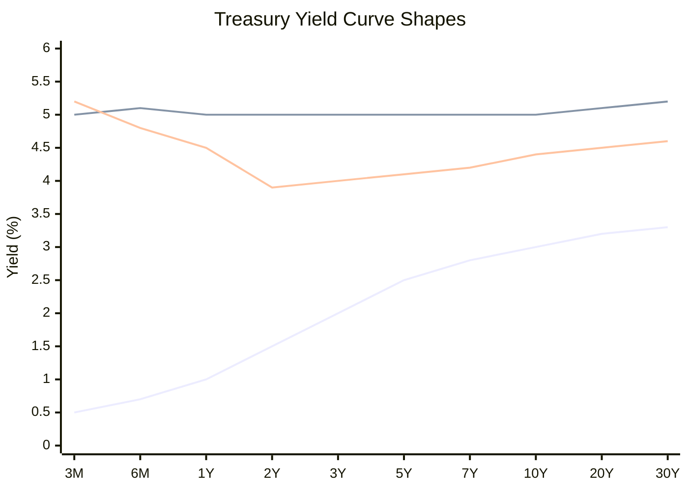

# Task 1: US Bond Fundamentals and Market Overview

## Executive Summary

US Treasury securities form the backbone of the global bond market, offering government-backed fixed income investments across various maturities. The Treasury market experienced significant changes in 2024, with an inverted yield curve and evolving interest rate environment creating unique opportunities and challenges for investors.

## Types of Treasury Securities

### Treasury Bills (T-Bills)
- **Maturity**: Less than 1 year (4-week, 6-week, 8-week, 13-week, 17-week, 26-week, and 52-week)
- **Characteristics**: Sold at discount, mature at par value
- **Use Case**: Cash management and short-term liquidity

### Treasury Notes
- **Maturity**: 2-10 years (1, 2, 3, 5, 7, and 10-year maturities available)
- **Characteristics**: Pay semi-annual interest, intermediate duration
- **Use Case**: Core bond portfolio holdings

### Treasury Bonds
- **Maturity**: 20-30 years
- **Characteristics**: Highest duration risk, pay semi-annual interest
- **Use Case**: Long-term income and portfolio diversification

### Treasury Inflation-Protected Securities (TIPS)
- **Features**: Principal adjusts with inflation (CPI)
- **Maturities**: 5, 10, and 30 years
- **Use Case**: Inflation hedging

## 2024 Yield Curve Dynamics

### Current State (as of search date)
- **10-Year Treasury Yield**: 4.38%
- **2-Year Treasury Yield**: 3.88%
- **Yield Curve Shape**: Inverted (10Y2Y spread: +0.50%)

### Yield Curve Interpretation



### Economic Implications
- **Inverted Curve**: Historically reliable recession predictor
- **10Y-2Y Spread**: Negative values often precede economic downturns
- **Current Inversion**: Reflects expectations of declining long-term rates

## Duration and Interest Rate Risk

### Duration Concepts
- **Modified Duration**: Sensitivity to interest rate changes
- **Effective Duration**: Accounts for embedded options
- **Key Rate Duration**: Sensitivity to specific yield curve points

### Risk-Return Profile by Maturity

```mermaid
quadrantChart
    title Treasury Securities Risk-Return Profile
    x-axis Low Risk --> High Risk
    y-axis Low Return --> High Return
    quadrant-1 High Risk, High Return
    quadrant-2 Low Risk, High Return
    quadrant-3 Low Risk, Low Return
    quadrant-4 High Risk, Low Return
    T-Bills: [0.2, 0.3]
    Short Notes (2-5Y): [0.4, 0.5]
    Long Notes (7-10Y): [0.6, 0.7]
    Long Bonds (20-30Y): [0.9, 0.8]
```

## Market Structure and Pricing

### Primary Market
- **Auction Schedule**: Regular competitive and non-competitive auctions
- **Participants**: Primary dealers, banks, institutional investors
- **Pricing**: Yield-based competitive bidding

### Secondary Market
- **Liquidity**: Highly liquid, deep market
- **Trading**: Over-the-counter dealer market
- **Pricing**: Real-time throughout trading day

### Yield Curve Construction
- **Methodology**: Monotone convex spline (MC) method since December 2021
- **Data Source**: Federal Reserve Bank of New York quotations at 3:30 PM daily
- **Par Yields**: Derived from indicative market prices

## Tax Implications

### Federal Taxation
- Interest income taxed as ordinary income
- No preferential capital gains treatment on interest

### State and Local Taxation
- **Advantage**: Treasury interest exempt from state and local taxes
- **Impact**: Increases after-tax yield for investors in high-tax states

## Key Market Indicators

### Economic Indicators to Monitor
1. **Fed Funds Rate**: Direct impact on short-term yields
2. **Inflation Expectations**: Affects real yields and TIPS pricing
3. **Economic Growth**: Influences yield curve shape
4. **Credit Spreads**: Risk appetite gauge

### Volatility Factors
- **Interest Rate Changes**: Primary driver of price movement
- **Inflation Surprises**: Especially important for longer maturities
- **Fed Policy Communications**: Forward guidance impacts
- **Economic Data Releases**: Employment, GDP, inflation reports

## References

1. [U.S. Department of Treasury - Interest Rate Statistics](https://home.treasury.gov/policy-issues/financing-the-government/interest-rate-statistics)
2. [Daily Treasury Par Yield Curve Rates](https://home.treasury.gov/resource-center/data-chart-center/interest-rates/TextView?type=daily_treasury_yield_curve&field_tdr_date_value=2025)
3. [Federal Reserve Economic Data (FRED) - 10Y Treasury](https://fred.stlouisfed.org/series/DGS10)
4. [Federal Reserve Economic Data (FRED) - 10Y-2Y Spread](https://fred.stlouisfed.org/series/T10Y2Y)
5. [Statista - U.S. Treasury Yield Curve 2024](https://www.statista.com/statistics/1059669/yield-curve-usa/)