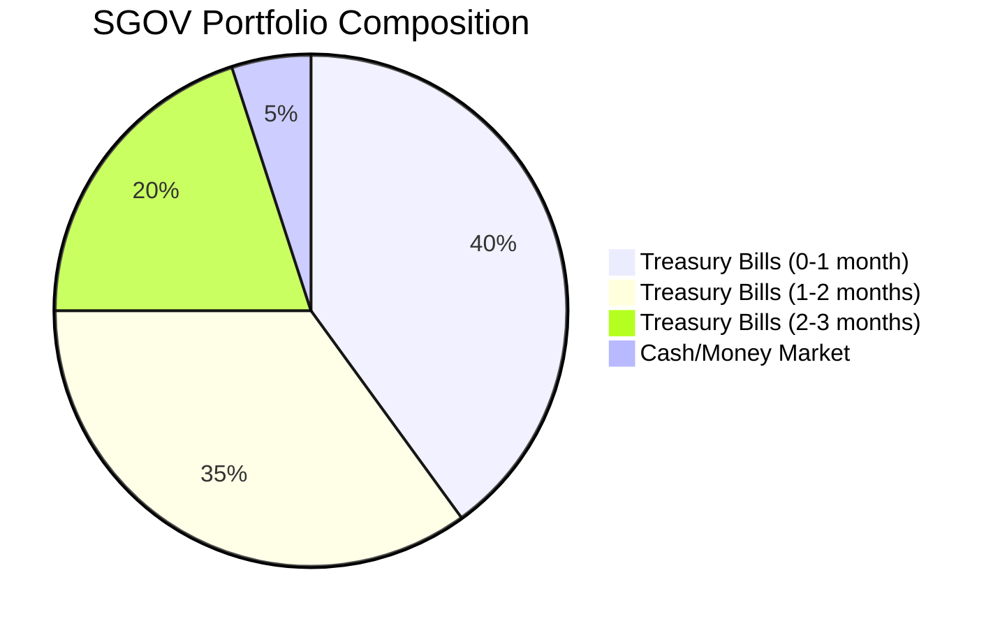
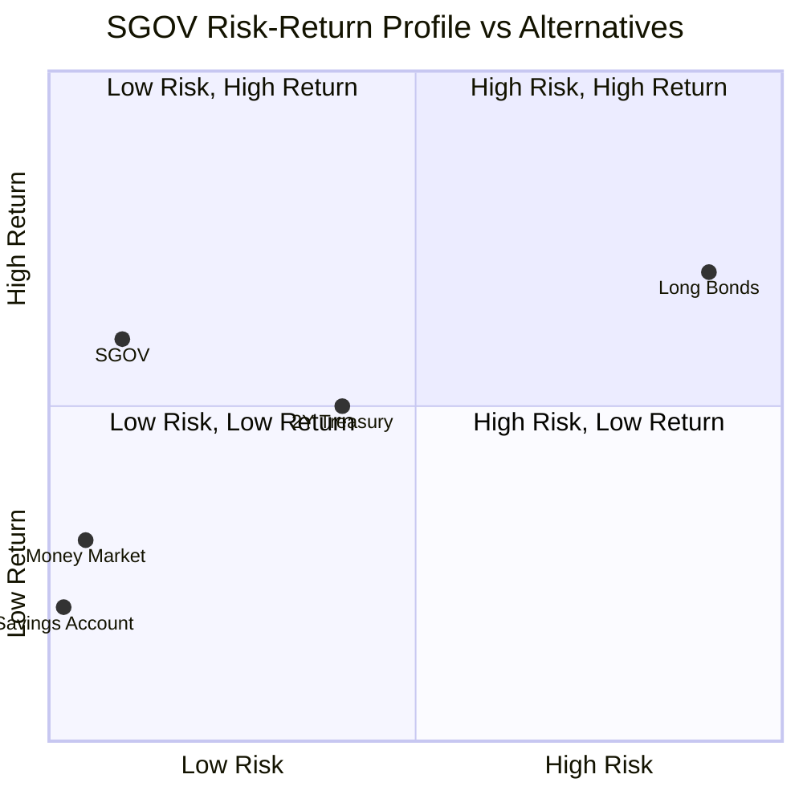
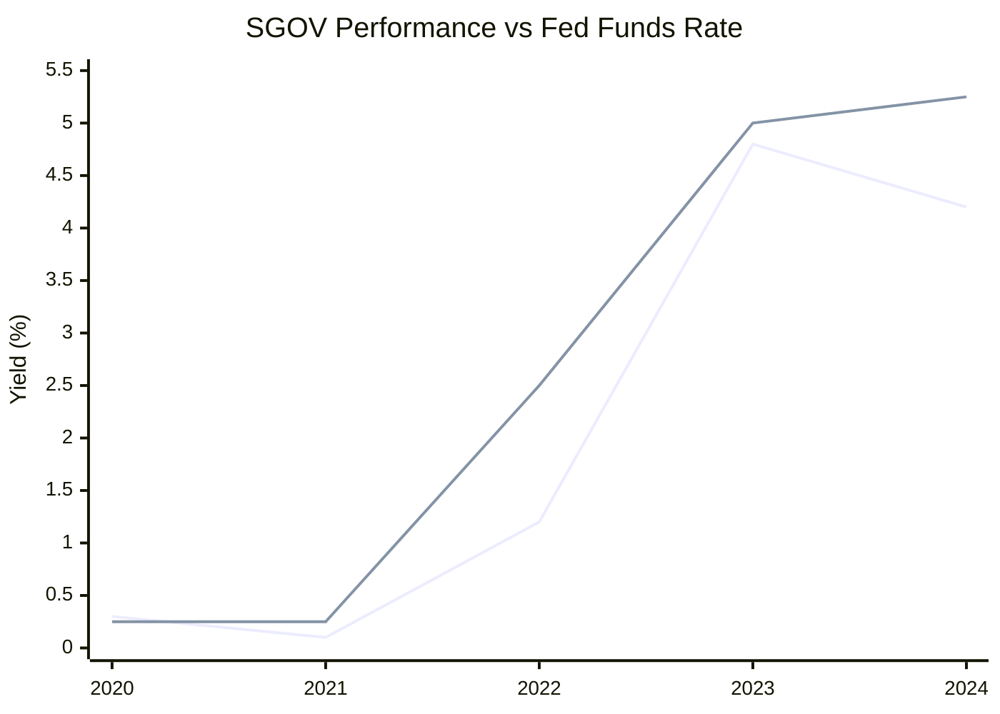
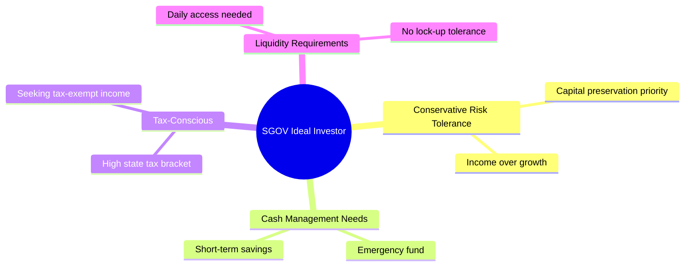

# Task 2: SGOV (Short Treasury ETF) Deep Dive

## Executive Summary

The iShares 0-3 Month Treasury Bond ETF (SGOV) serves as a premier cash management tool, offering higher yields than traditional money market accounts while maintaining near-zero duration risk. With over $50 billion in assets and a 0.09% expense ratio, SGOV represents an efficient way to access ultra-short Treasury exposure.

## Fund Overview

### Basic Information
- **Full Name**: iShares 0-3 Month Treasury Bond ETF
- **Ticker**: SGOV
- **Inception Date**: May 26, 2020
- **Issuer**: BlackRock iShares
- **Assets Under Management**: Over $50 billion (as of July 2024)
- **Average Daily Volume**: 10.68 million shares (30-day average)

### Investment Objective
SGOV seeks to track the investment results of an index composed of U.S. Treasury bonds with remaining maturities less than or equal to three months.

## Portfolio Composition and Holdings

### Asset Allocation
- **Treasury Bills**: 100% of holdings
- **Maturity Range**: 0-3 months maximum
- **Credit Quality**: AAA (U.S. Government backing)
- **Reinvestment Policy**: Does not reinvest cash flows between rebalance dates

### Holdings Strategy

### Key Features
- **Minimum Investment**: Cost of one share (highly accessible)
- **Liquidity**: Trades with minimal bid-ask spreads
- **Rebalancing**: Regular rebalancing to maintain 0-3 month maturity target

## Risk Profile and Duration Analysis

### Duration Characteristics
- **Modified Duration**: Approximately 0.1-0.2 years
- **Interest Rate Risk**: Minimal due to ultra-short maturities
- **Price Volatility**: Near-zero volatility
- **Credit Risk**: Virtually none (U.S. Government backing)

### Risk Comparison

## Yield and Performance Analysis

### 2024 Yield Environment
- **Current SEC 30-Day Yield**: 4.19-4.21% (multiple sources)
- **12-Month Total Return**: 4.51% (including distributions)
- **YTD Performance**: 5.27%
- **Since Inception Average**: 2.82% annual return

### Yield Components
- **Distribution Frequency**: Monthly
- **Tax Treatment**: 
  - Federal income tax applies
  - State and local tax exempt
  - Suitable for tax-advantaged accounts

### Performance During Different Rate Environments

## Cost Structure

### Expense Analysis
- **Expense Ratio**: 0.09% (among the best in category)
- **Fee Quintile**: Least expensive quintile among peers
- **Annual Cost on $10,000**: $9

### Cost Comparison with Alternatives
| Fund Type | Typical Expense Ratio | SGOV Advantage |
|-----------|---------------------|----------------|
| Money Market Funds | 0.20-0.50% | 0.11-0.41% savings |
| Bank Savings | N/A (low rates) | Higher yield |
| Other Short Treasury ETFs | 0.15-0.25% | 0.06-0.16% savings |

## Liquidity and Trading Characteristics

### Market Structure
- **Exchange**: NYSE Arca
- **Trading Hours**: Regular market hours
- **Bid-Ask Spread**: Minimal (typically 1-2 basis points)
- **Market Making**: Efficient authorized participant network

### Liquidity Metrics
- **Average Daily Volume**: 10.68 million shares
- **Market Cap**: $50+ billion
- **Float**: Highly liquid, easy entry/exit

## Use Cases and Strategic Applications

### Primary Use Cases
1. **Cash Management**: Alternative to money market funds
2. **Portfolio Stability**: Defensive allocation during volatility
3. **Liquidity Buffer**: Easily accessible emergency funds
4. **Tactical Allocation**: Short-term parking for investment proceeds

### Strategic Benefits
- **Capital Preservation**: Minimal principal risk
- **Income Generation**: Higher than savings accounts
- **Tax Efficiency**: State tax exemption benefit
- **Flexibility**: Daily liquidity vs. CDs or time deposits

### Ideal Investor Profile

## Limitations and Considerations

### Potential Drawbacks
- **Interest Rate Ceiling**: Performance capped by short rates
- **Inflation Risk**: Real returns may be negative in high inflation
- **Opportunity Cost**: Lower returns than longer-duration bonds
- **Rate Lag**: Takes time to reflect Fed rate changes

### Not Suitable For
- Long-term wealth building
- Investors seeking capital appreciation
- Those comfortable with duration risk for higher yields

## Conclusion

SGOV represents an efficient cash management solution, offering:
- **Safety**: Government backing and minimal duration risk
- **Yield**: Competitive returns in current environment (4.2%+)
- **Liquidity**: Excellent trading characteristics
- **Cost**: Low expense ratio (0.09%)
- **Tax Efficiency**: State tax exemption

The ETF serves as an excellent bridge between traditional savings accounts and longer-term bond investments, particularly valuable in the current high short-rate environment.

## References

1. [iShares SGOV Official Page](https://www.ishares.com/us/products/314116/ishares-0-3-month-treasury-bond-etf)
2. [SGOV Stock Analysis - Dividend History](https://stockanalysis.com/etf/sgov/dividend/)
3. [Yahoo Finance - SGOV Quote](https://finance.yahoo.com/quote/SGOV/)
4. [Morningstar - SGOV Portfolio Analysis](https://www.morningstar.com/etfs/arcx/sgov/portfolio)
5. [ETF Database - SGOV Profile](https://etfdb.com/etf/SGOV/)