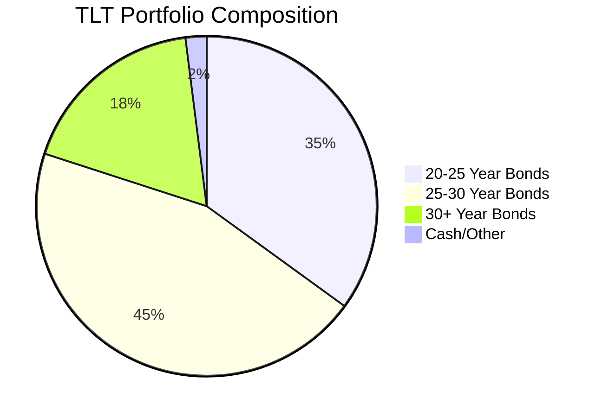
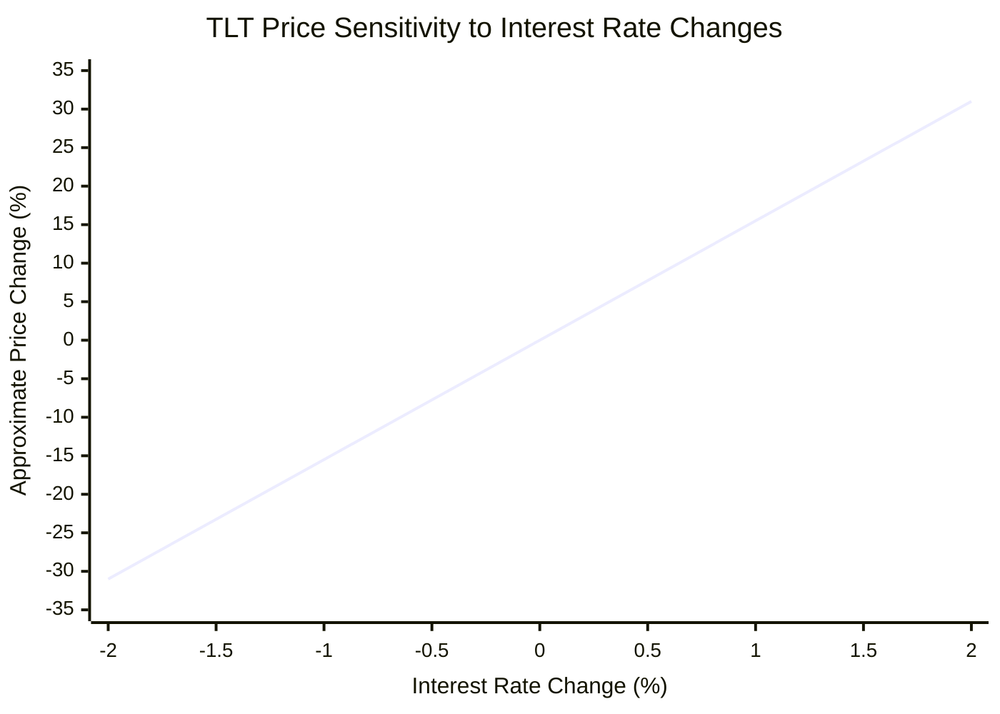
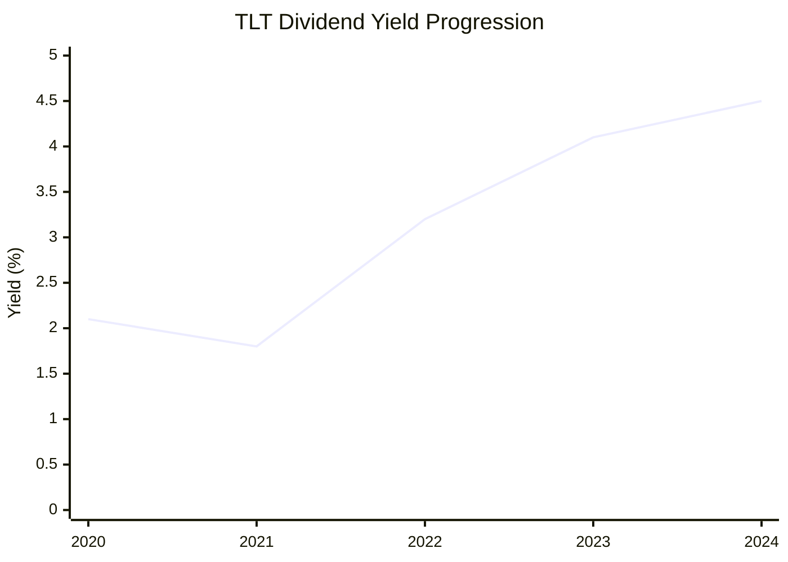
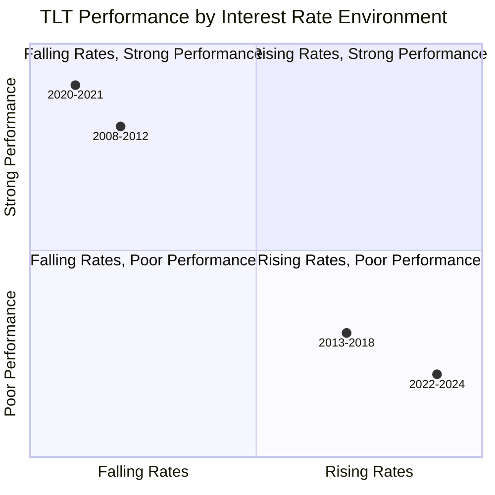
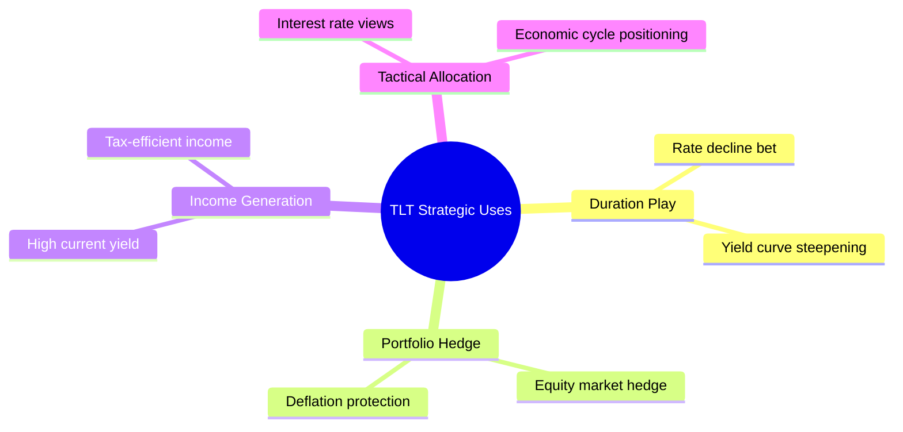

# Task 3: TLT (Long Treasury ETF) Deep Dive

## Executive Summary

The iShares 20+ Year Treasury Bond ETF (TLT) provides exposure to long-duration U.S. Treasury bonds, making it one of the most interest-rate sensitive ETFs available. With $61.4 billion in assets and 15.5-year effective duration, TLT serves as both a long-term income vehicle and a hedge against deflationary conditions, though it comes with significant volatility during interest rate transitions.

## Fund Overview

### Basic Information
- **Full Name**: iShares 20+ Year Treasury Bond ETF
- **Ticker**: TLT
- **Inception Date**: July 22, 2002
- **Issuer**: BlackRock iShares
- **Assets Under Management**: $61.4 billion
- **Expense Ratio**: 0.15%
- **Underlying Index**: ICE U.S. Treasury 20+ Year Bond Index

### Investment Objective
TLT seeks to track the investment results of an index composed of U.S. Treasury bonds with remaining maturities greater than twenty years.

## Portfolio Composition and Holdings

### Asset Allocation Requirements
- **Minimum Treasury Exposure**: 90% in U.S. Treasury bonds
- **Index Component Allocation**: 80% in underlying index securities
- **Maturity Focus**: Exclusively 20+ year Treasury bonds
- **Credit Quality**: AAA (U.S. Government backing)

### Holdings Structure

### Key Characteristics
- **Number of Holdings**: Hundreds of individual Treasury securities
- **Diversification**: Market-weighted across long-term maturities
- **Rebalancing**: Regular rebalancing to maintain 20+ year focus
- **Leverage**: Not leveraged (no borrowings or derivatives)

## Duration and Interest Rate Risk Profile

### Duration Metrics
- **Effective Duration**: 15.5 years
- **Interest Rate Sensitivity**: ~15.5% price change per 1% rate move
- **Modified Duration**: Approximately 15-16 years
- **Convexity**: Positive convexity benefits in falling rate environments

### Risk Visualization

### Historical Volatility Patterns
- **High Interest Rate Sensitivity**: Among highest duration ETFs available
- **2024 Volatility**: Significant price swings during Fed policy changes
- **Rate Environment Impact**: Performance highly dependent on rate direction

## Dividend and Yield Analysis

### Current Yield Metrics (2024)
- **Trailing 12-Month Yield**: 4.5%
- **Forward Dividend Yield**: 4.44-4.45%
- **Alternative Sources**: 3.75% (yield variation by timing/methodology)
- **Distribution Frequency**: Monthly
- **Recent Dividend Growth**: 12.3% over past year

### Yield Components

### Tax Considerations
- **Federal Tax**: Ordinary income rates apply to interest
- **State/Local Tax**: Exempt from state and local taxation
- **Tax Efficiency**: Beneficial for high-tax state residents

## Performance Analysis

### 2024 Performance Challenges
- **Total Return (12 months)**: -6.59% including dividends
- **Capital Loss**: -8% in 2024 amid inflation-driven rate hikes
- **Since Inception Average**: 3.82% annual return
- **Volatility Source**: Interest rate increases reduced bond values

### Performance in Different Rate Environments

### Beta and Correlation Metrics
- **Interest Rate Beta**: Highly negative correlation with rate changes
- **Equity Beta**: Generally negative correlation with stocks during crises
- **Bond Market Beta**: High correlation with long-term bond markets

## Risk Profile and Volatility

### Primary Risk Factors
1. **Interest Rate Risk**: Dominant risk factor (15.5 duration)
2. **Inflation Risk**: Real return erosion during high inflation
3. **Reinvestment Risk**: Lower rates at maturity affect returns
4. **Liquidity Risk**: Minimal due to Treasury backing and ETF structure

### Volatility Characteristics
- **Daily Volatility**: High during rate uncertainty periods
- **Drawdown Risk**: Significant during rate hiking cycles
- **Recovery Patterns**: Strong performance when rates stabilize/fall

### Risk Mitigation Features
- **Credit Risk**: Virtually none (U.S. Government backing)
- **Liquidity**: Excellent due to Treasury market depth
- **Diversification**: Hundreds of individual securities

## Strategic Use Cases

### Portfolio Applications

### Ideal Market Conditions
- **Falling Interest Rates**: Primary beneficiary
- **Economic Slowdown**: Flight-to-quality benefits
- **Disinflation/Deflation**: Real yield enhancement
- **Market Stress**: Negative correlation with risk assets

### Not Suitable When
- **Rising Rate Environment**: Significant capital losses
- **High Inflation Periods**: Negative real returns
- **Short Investment Horizon**: High volatility risk
- **Conservative Risk Tolerance**: Extreme price swings

## Comparison with Alternatives

### Duration Spectrum Positioning
| ETF | Duration | Risk Level | Current Yield | Use Case |
|-----|----------|------------|---------------|-----------|
| SGOV | 0.1-0.2 | Very Low | 4.2% | Cash alternative |
| SHY | 1.9 | Low | 4.3% | Short duration |
| IEI | 3.8 | Medium | 4.4% | Intermediate |
| TLT | 15.5 | Very High | 4.5% | Long duration |

## Cost Analysis

### Expense Structure
- **Expense Ratio**: 0.15%
- **Annual Cost per $10,000**: $15
- **Competitive Position**: Reasonable for long Treasury exposure
- **Trading Costs**: Minimal bid-ask spreads due to liquidity

## Current Market Environment Considerations

### 2024-2025 Outlook Factors
- **Fed Policy Stance**: Rate cutting cycle expectations
- **Inflation Trends**: Moderating inflation supporting bonds
- **Yield Curve Dynamics**: Potential steepening benefiting TLT
- **Economic Uncertainty**: Flight-to-quality potential

### Strategic Positioning
- **Term Premium**: 100 bps 2-20 yield spread indicates higher term premium
- **Valuation**: Recent selloff may have created opportunities
- **Technical Factors**: Oversold conditions possible

## Limitations and Considerations

### Key Drawbacks
- **Extreme Duration Risk**: 15.5% price sensitivity per 1% rate move
- **Inflation Vulnerability**: Negative real returns during high inflation
- **Complexity**: Requires understanding of bond market dynamics
- **Timing Sensitivity**: Entry/exit timing crucial for returns

### Investor Suitability
**Suitable For:**
- Sophisticated bond investors
- Those with strong interest rate views
- Portfolio diversification seekers
- Long-term income investors in falling rate environments

**Not Suitable For:**
- Conservative investors seeking stability
- Those uncomfortable with high volatility
- Short-term investors
- Investors without rate cycle understanding

## Conclusion

TLT represents one of the purest long-duration Treasury plays available, offering:
- **High Duration Exposure**: 15.5-year sensitivity for rate positioning
- **Quality Income**: Government-backed yield around 4.5%
- **Portfolio Diversification**: Negative correlation with risk assets
- **Liquidity**: Deep market and tight spreads

However, investors must accept significant volatility and timing risk, making TLT most suitable for sophisticated investors with strong conviction about interest rate direction or those using it as a portfolio hedge.

## References

1. [iShares TLT Official Page](https://www.ishares.com/us/products/239454/ishares-20-year-treasury-bond-etf)
2. [TLT Dividend Analysis - AI Invest](https://www.ainvest.com/news/tlt-dividend-resilience-rising-rate-environment-balancing-income-duration-risk-2509/)
3. [GuruFocus TLT Summary](https://www.gurufocus.com/etf/TLT/summary)
4. [Yahoo Finance TLT Quote](https://finance.yahoo.com/quote/TLT/)
5. [Stock Analysis TLT Overview](https://stockanalysis.com/etf/tlt/)