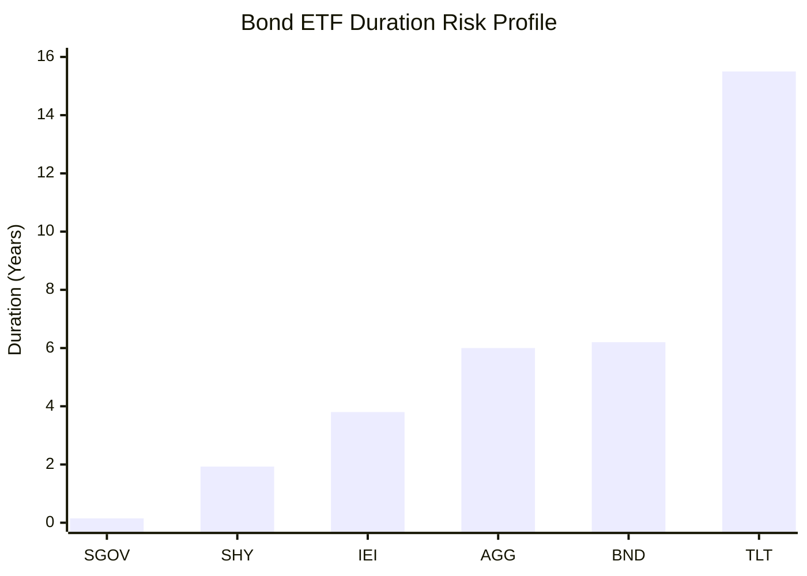
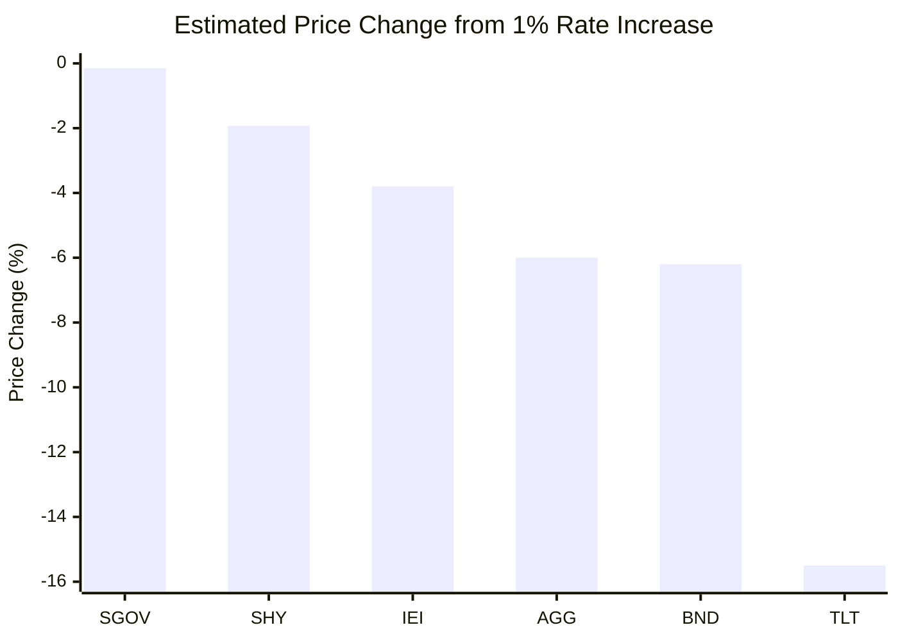
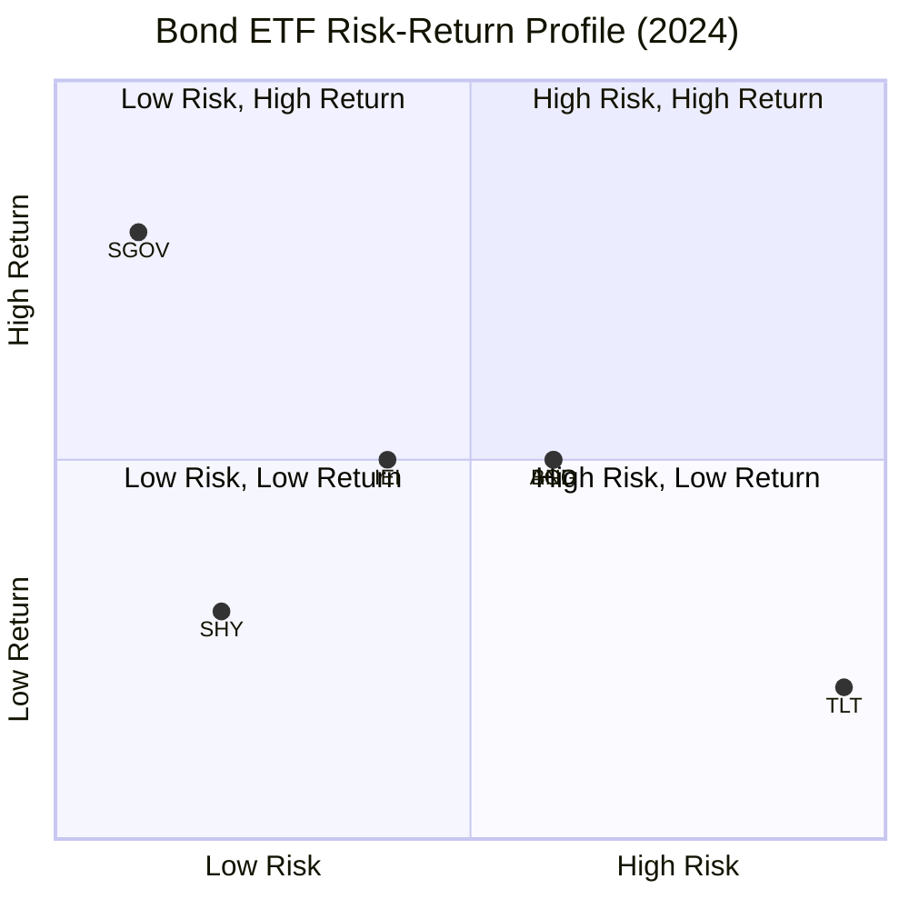
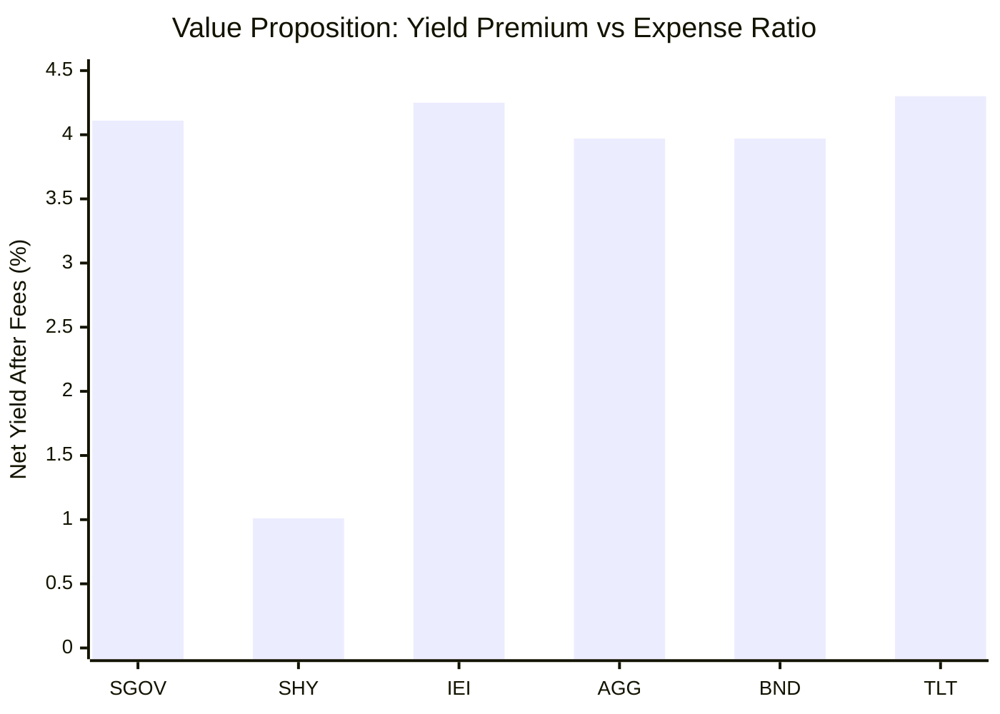

# Task 4: Comparative Analysis of Major Bond ETFs

## Executive Summary

The 2024 bond market presented a tale of two strategies: ultra-short duration ETFs like SGOV thrived with 4%+ yields and minimal volatility, while long-duration funds like TLT suffered significant losses. This comparison analyzes the complete spectrum of Treasury and aggregate bond ETFs to help investors understand duration risk, yield trade-offs, and strategic positioning across different market environments.

## Complete ETF Comparison Matrix

### Key Metrics Overview

| ETF | Full Name | Duration | Yield | Assets | Expense Ratio | 2024 Performance |
|-----|-----------|----------|--------|---------|---------------|------------------|
| SGOV | 0-3 Month Treasury | 0.1-0.2 | 4.20% | $56B | 0.09% | +5.27% |
| SHY | 1-3 Year Treasury | 1.93 | 1.16% | $11B | 0.15% | Positive |
| IEI | 3-7 Year Treasury | ~3.8 | ~4.4% | $6B+ | 0.15% | Near flat |
| AGG | Core U.S. Aggregate | ~6.0 | Variable | Large | 0.03% | ~Flat |
| BND | Total Bond Market | ~6.2 | Variable | Large | 0.03% | ~Flat |
| TLT | 20+ Year Treasury | 15.5 | 4.45% | $48B | 0.15% | -7.5% |

## Duration Spectrum Analysis

### Visual Duration Risk Comparison



### Interest Rate Sensitivity Impact



## Category Analysis by Duration

### Ultra-Short Duration (0-2 Years)

#### SGOV - Premier Cash Alternative
**Strengths:**
- Yields above 4% with near-zero duration risk
- Full U.S. government backing
- Perfect capital parking during uncertainty
- $26B net inflows, growing to $56B assets

**Best Use Cases:**
- Cash management and emergency funds
- Rate uncertainty periods
- Conservative portfolio anchor

#### SHY - Short-Term Treasury Exposure
**Strengths:**
- 1.93-year duration provides some rate sensitivity
- Monthly income distribution
- Over $11B in assets providing liquidity

**Considerations:**
- Lower current yield (1.16%) than ultra-short
- Modest duration risk vs. SGOV

### Intermediate Duration (3-8 Years)

#### IEI - Mid-Duration Bridge
**Characteristics:**
- Bridges gap between short (SHY) and intermediate (IEF)
- 3.8-year duration for moderate rate sensitivity
- Over $6B in assets with established track record

**Strategic Position:**
- Balances yield and duration risk
- Suitable for core bond allocation
- Flip-flops in size with similar funds over cycles

### Broad Market/Aggregate (5-7 Year Duration)

#### AGG - Core Aggregate Exposure
**Strengths:**
- Broad diversification across government, corporate, MBS
- Low expense ratio (0.03%)
- $6.7B in 2024 inflows
- Mid-level interest rate sensitivity

**Diversification Benefits:**
- Government bonds (~40%)
- Corporate bonds (~25%)
- Mortgage-backed securities (~30%)
- Asset-backed securities (~5%)

#### BND - Total Market Approach
**Advantages:**
- Comprehensive U.S. bond market exposure
- Vanguard's low-cost approach (0.03%)
- $10.5B in 2024 inflows
- Slightly higher duration than AGG

**Strategic Positioning:**
- One-fund solution for bond allocation
- Broad diversification reduces concentration risk

### Long Duration (15+ Years)

#### TLT - Maximum Duration Play
**High-Risk/High-Reward Profile:**
- 15.5-year duration creates maximum rate sensitivity
- Potential recession hedge with big upside in downturns
- Significant volatility and drawdown risk

**2024 Performance:**
- -7.5% year-to-date through December
- $2.4B in outflows reflecting investor caution
- Price declines more than offset 4.45% yield

## 2024 Performance Analysis by Strategy

### Winners: Ultra-Short Duration Strategy
```mermaid
pie title "2024 Bond ETF Flow Winners"
    "SGOV Inflows" : 26
    "BND Inflows" : 10.5
    "AGG Inflows" : 6.7
    "Other Inflows" : 15
    "TLT Outflows" : -2.4
```

**Key Insights:**
- Ultra-short duration dominated with SGOV's $26B inflows
- Investors who stayed on shorter end of yield curve fared better
- Rate sensitivity was the key differentiator in 2024

### Strategic Lessons from 2024
1. **Duration Risk Realized**: Long bonds punished by rate increases
2. **Yield Curve Positioning**: Short end provided best risk-adjusted returns
3. **Flow Patterns**: Money moved to safety and higher yields without duration risk

## Risk-Return Positioning Matrix



## Strategic Allocation Framework

### Multi-ETF Approach Benefits
**Balanced Strategy:** "Holding all three [SGOV, AGG, TLT], even in modest proportions, creates a more resilient bond sleeve that can adjust to multiple outcomes"

### Allocation by Market Outlook

#### Rising Rate Environment
- **High SGOV allocation (40-60%)**: Benefits from rate increases
- **Moderate AGG/BND (30-40%)**: Diversification benefits
- **Low TLT allocation (0-10%)**: Minimize duration risk

#### Falling Rate Environment  
- **Moderate SGOV (20-30%)**: Maintain liquidity
- **Moderate AGG/BND (30-40%)**: Core holdings
- **Higher TLT (20-40%)**: Capture duration benefits

#### Uncertain Environment
- **Balanced approach**: Equal weights across duration spectrum
- **Regular rebalancing**: Adjust as conditions clarify

## Expense Ratio and Cost Analysis

### Cost Efficiency Leaders
- **AGG & BND**: 0.03% (best-in-class for broad exposure)
- **SGOV**: 0.09% (excellent for ultra-short)
- **SHY, IEI, TLT**: 0.15% (standard for Treasury focus)

### Cost-Benefit Assessment


## Liquidity and Trading Characteristics

### Daily Trading Volumes (Relative)
- **SGOV**: Very High (10.68M daily average)
- **TLT**: Very High (institutional favorite)
- **AGG/BND**: High (broad market appeal)
- **SHY/IEI**: Moderate (niche positioning)

### Bid-Ask Spreads
- **SGOV & TLT**: Minimal (1-2 basis points)
- **AGG & BND**: Very tight (high liquidity)
- **SHY & IEI**: Reasonable (adequate for most investors)

## Strategic Use Case Summary

### SGOV: The Cash King
- **Perfect For**: Cash management, uncertainty hedging, conservative income
- **Avoid When**: Seeking capital appreciation or duration plays

### SHY: Short Duration Starter
- **Perfect For**: First step beyond cash, modest rate sensitivity
- **Avoid When**: Current yield environment favors ultra-short

### IEI: The Duration Bridge
- **Perfect For**: Intermediate duration exposure, balanced approach
- **Avoid When**: Clear directional rate views exist

### AGG: The Core Holding
- **Perfect For**: Diversified bond allocation, one-decision approach
- **Avoid When**: Specific duration or credit bets desired

### BND: The Total Market Play
- **Perfect For**: Comprehensive bond exposure, cost-conscious investors
- **Avoid When**: Targeted sector or duration strategy needed

### TLT: The Duration Maximizer
- **Perfect For**: Recession hedging, falling rate environments
- **Avoid When**: Rising rates expected or volatility intolerance

## 2025 Outlook and Strategic Implications

### Rate Environment Scenarios
1. **Continued Tightening**: SGOV remains king
2. **Policy Pivot**: TLT could outperform significantly  
3. **Economic Slowdown**: Flight to quality benefits all Treasuries

### Portfolio Construction Recommendations
- **Conservative**: 60% SGOV, 30% AGG, 10% TLT
- **Moderate**: 30% SGOV, 50% BND, 20% TLT
- **Aggressive**: 20% SGOV, 30% AGG, 50% TLT

## Conclusion

The 2024 bond market demonstrated the critical importance of duration positioning. Ultra-short Treasury ETFs like SGOV delivered the best risk-adjusted returns, while long-duration plays like TLT faced significant headwinds. 

**Key Takeaways:**
- **Duration dominates**: Interest rate sensitivity was the primary return driver
- **SGOV's sweet spot**: 4%+ yields with minimal risk proved unbeatable
- **Diversification value**: Multi-ETF approaches provide flexibility
- **Cost matters**: Expense ratios of 0.03-0.15% are competitive
- **Tactical opportunities**: Rate environment changes create rotation opportunities

Investors should consider their rate outlook, risk tolerance, and time horizon when selecting from this diverse universe of bond ETFs, with the understanding that duration positioning will likely remain the primary driver of relative performance.

## References

1. [ETF.com - Beyond SGOV: Bond ETF Playbook 2025](https://www.etf.com/sections/advisor-center/sgov-agg-tlt-bond-etf-playbook-2025)
2. [ETF.com - TLT Tanks, SGOV Rises](https://www.etf.com/sections/features/tlt-tanks-sgov-rises-mixed-year-fixed-income-etfs)
3. [AI Invest - Duration Trade: SGOV and TLT](https://www.ainvest.com/news/duration-trade-sgov-tlt-etfs-tale-bonds-2507/)
4. [Nasdaq - Biggest Treasury Bond ETFs](https://www.nasdaq.com/articles/3-biggest-treasury-bond-etfs-and-how-use-them-2017-04-18)
5. [ETF Database - SHY vs TLT Comparison](https://etfdb.com/tool/etf-comparison/SHY-TLT/)