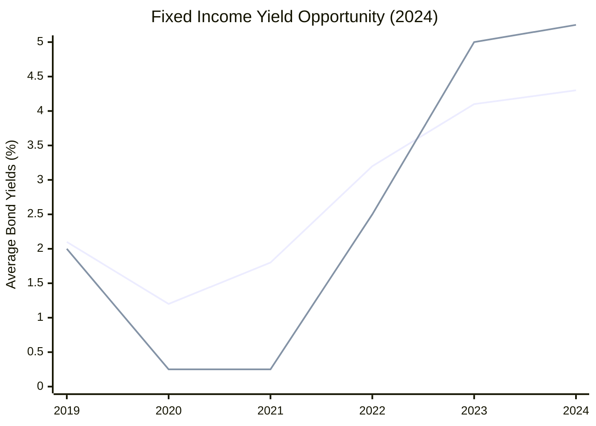
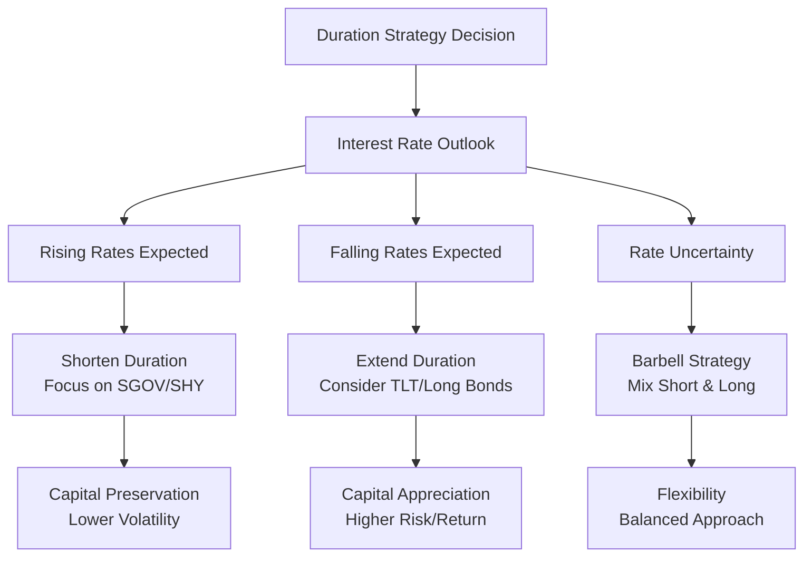
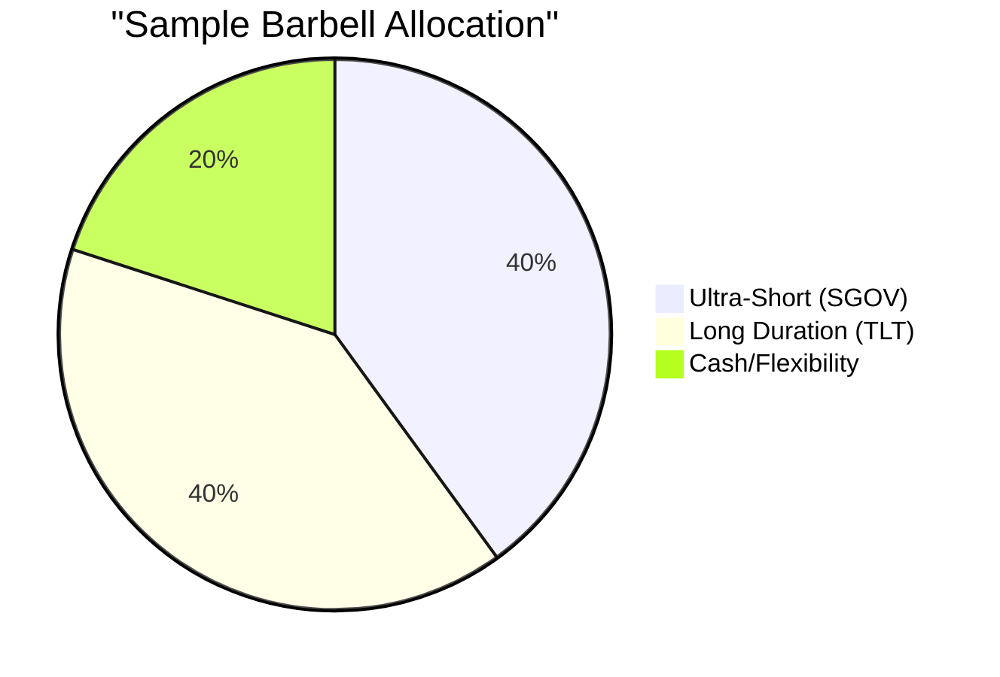
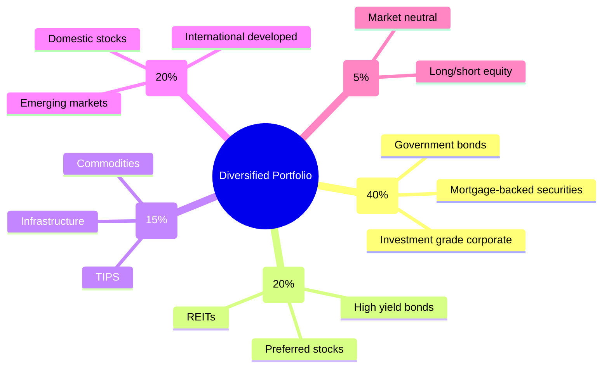
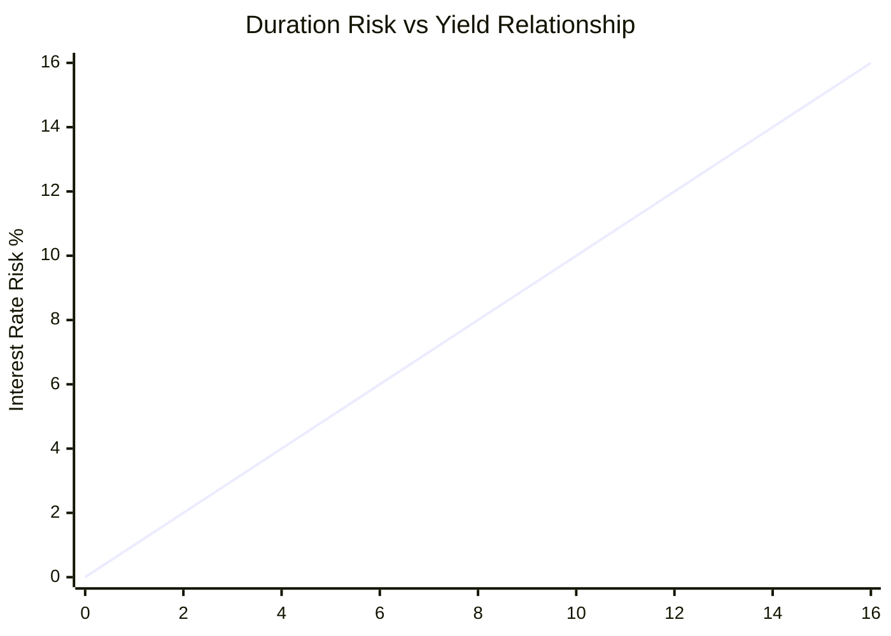
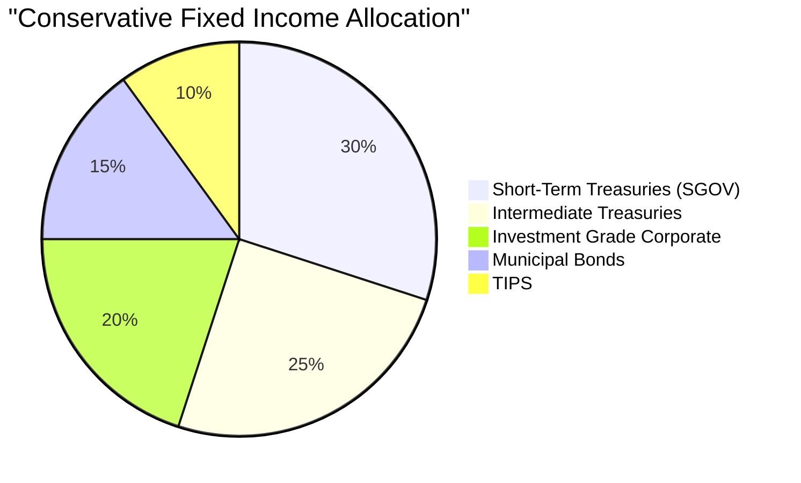
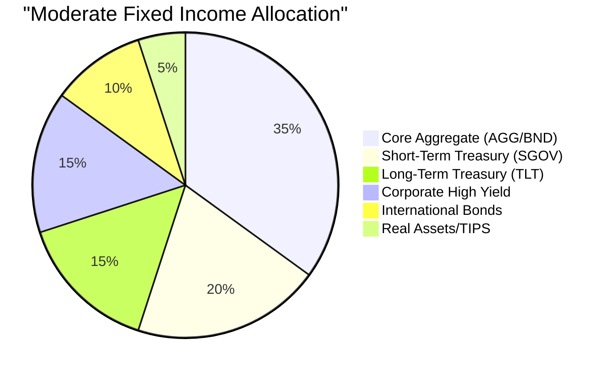
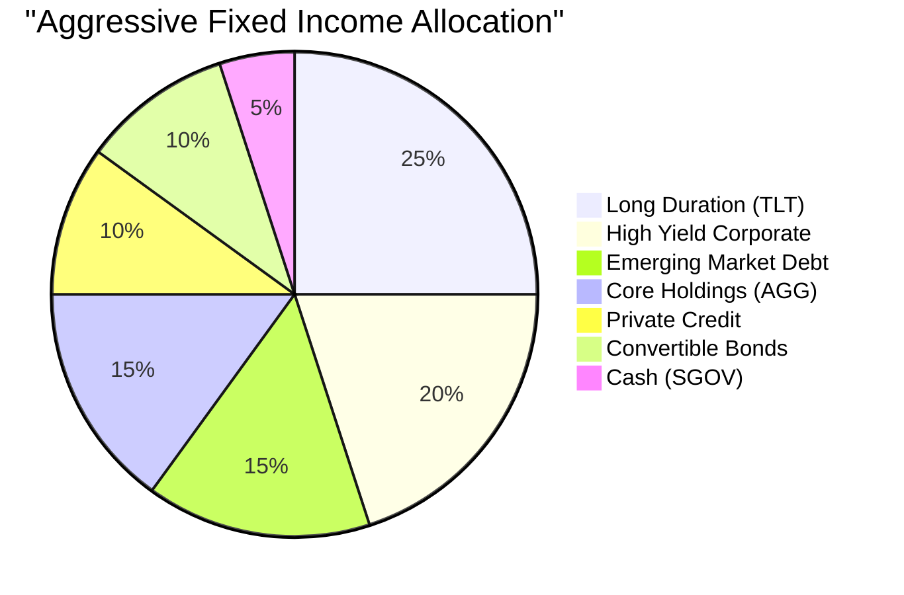
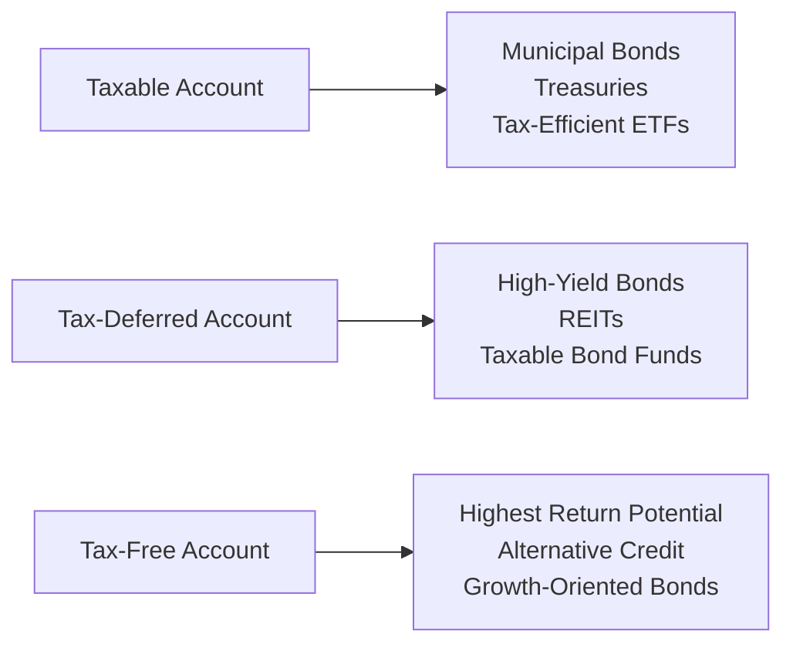

# Task 5: Bond Investment Strategies and Portfolio Allocation

## Executive Summary

2024 marked a pivotal year for fixed income investing, with over half of bond markets yielding above 4% for the first time since 2009. This environment created opportunities for strategic duration positioning, diversification beyond traditional 60/40 allocations, and sophisticated yield curve strategies. This analysis explores core bond strategies, advanced positioning techniques, and portfolio allocation frameworks optimized for the current high-yield environment.

## Current Fixed Income Landscape (2024)

### Market Transformation
- **Yield Environment**: Over 50% of fixed income markets yielding 4%+ (first time since 2009)
- **Real Yields**: Positive real yields across the curve due to declining inflation
- **Fed Policy**: Aggressive hiking cycle created attractive entry points
- **Opportunity Window**: High nominal yields with improving inflation backdrop

### Strategic Implications

## Core Bond Allocation Strategies

### Foundation Building: High-Quality Core Holdings

**Primary Asset Classes for Core Allocation:**
- **U.S. Treasuries**: Government backing, liquidity, tax advantages
- **Investment-Grade Corporate Bonds**: Credit spread opportunities
- **Agency Mortgage-Backed Securities**: Government implicit backing
- **Municipal Bonds**: Tax-advantaged income for high-tax investors
- **Treasury Inflation-Protected Securities (TIPS)**: Inflation hedging

**Core Allocation Philosophy:**
"Think of core bonds as the 'ballast' to your portfolio. They should make up the bulk of your fixed income holdings."

### Duration Management Strategies

#### Strategic Duration Positioning

#### Duration Ladder Strategy Benefits
- **Income Predictability**: Regular maturity schedule
- **Reinvestment Flexibility**: Systematic rebalancing opportunities
- **Risk Mitigation**: Reduced timing risk through diversification
- **Performance Potential**: "Ladders have the potential to outperform barbells in a falling rate environment"

## Advanced Yield Curve Strategies

### Barbell vs. Bullet vs. Ladder Comparison

| Strategy | Structure | Best Environment | Risk Profile | Flexibility |
|----------|-----------|------------------|--------------|-------------|
| **Barbell** | Short + Long ends | Flattening curve | High convexity | High |
| **Bullet** | Concentrated maturity | Specific rate view | Lower convexity | Low |
| **Ladder** | Evenly distributed | All environments | Balanced risk | Medium |

### Barbell Strategy Implementation

**Benefits:**
- **Convexity Advantage**: Outperforms during yield curve flattening
- **Flexibility**: Short end provides liquidity and reinvestment options
- **Duration Exposure**: Long end captures duration benefits
- **Volatility Management**: Short bonds reduce overall portfolio volatility

### Yield Curve Positioning Strategies

#### Steepening Strategies
- **Structure**: Long short-term bonds, short long-term bonds
- **Expectation**: Increasing spread between short and long rates
- **2024 Context**: Potential Fed cuts could steepen curve

#### Flattening Strategies
- **Structure**: Short short-term bonds, long long-term bonds
- **Expectation**: Decreasing spread between short and long rates
- **Risk Considerations**: Duration-neutral positioning possible

## Portfolio Diversification Framework

### Beyond Traditional 60/40 Allocation

#### Challenges with Traditional Approach
- **Correlation Issues**: Bond-stock correlation doubled vs. 10-year average
- **Inflation Pressure**: Traditional allocation struggled with post-COVID inflation
- **Policy Uncertainty**: Fiscal, trade, and monetary policy changes

#### Enhanced Diversification Model

### Multi-Sector Fixed Income Diversification

#### Correlation Benefits
"Different fixed income markets aren't highly correlated, so a diversified fixed income portfolio may provide higher returns with a more modest increase in risk or volatility."

#### Sector Allocation Framework
- **Government (30-40%)**: Treasuries, agencies for safety
- **Corporate (25-35%)**: Investment grade for yield pickup  
- **Securitized (20-30%)**: MBS, ABS for diversification
- **International (5-15%)**: Currency and geographic diversification

## Risk Management Strategies

### Interest Rate Risk Management

#### Duration-Based Approach

#### Risk Mitigation Techniques
1. **Duration Matching**: Align with investment horizon
2. **Convexity Management**: Benefit from yield curve shape changes
3. **Sector Rotation**: Shift between credit and duration risk
4. **Hedging Strategies**: Use derivatives for specific exposures

### Credit Risk Management

#### Credit Quality Ladder
- **AAA/AA (40-50%)**: Treasury and high-grade corporate
- **A/BBB (30-40%)**: Investment grade corporate
- **Below IG (5-15%)**: High yield for selective opportunities
- **Alternative Credit (5-10%)**: Private credit, CLOs

## Strategic Allocation Models for 2024

### Conservative Income-Focused Portfolio

**Characteristics:**
- Lower duration risk
- High credit quality
- Predictable income stream
- Limited volatility

### Moderate Balanced Portfolio

**Characteristics:**
- Balanced duration exposure
- Diversified credit risk
- Total return focus
- Moderate volatility

### Aggressive Opportunities Portfolio

**Characteristics:**
- Higher duration and credit risk
- Alternative income sources
- Total return optimization
- Higher volatility tolerance

## Implementation Considerations

### ETF vs. Individual Bonds Trade-offs

| Consideration | ETFs | Individual Bonds |
|---------------|------|------------------|
| **Diversification** | Instant | Requires scale |
| **Liquidity** | High | Variable |
| **Costs** | Low expense ratios | Transaction costs |
| **Customization** | Limited | Full control |
| **Maturity Control** | None | Precise |

### Rebalancing Strategies

#### Systematic Approach
- **Calendar Rebalancing**: Quarterly or semi-annual
- **Threshold Rebalancing**: When allocations drift 5%+ from target
- **Tactical Adjustments**: Based on rate cycle positioning

#### Market-Driven Adjustments
- **Rate Environment Changes**: Adjust duration exposure
- **Credit Cycle Timing**: Rotate between quality levels
- **Curve Positioning**: Modify barbell/ladder structures

## Tax-Efficient Implementation

### Tax-Advantaged Strategies
- **Municipal Bonds**: For high-tax-bracket investors
- **Treasury Focus**: State tax exemption benefits
- **Tax-Loss Harvesting**: Systematic realization of losses
- **Asset Location**: Place high-yield bonds in tax-deferred accounts

### Account Placement Optimization

## Performance Measurement and Monitoring

### Key Performance Indicators
1. **Total Return**: Income plus capital appreciation
2. **Risk-Adjusted Returns**: Sharpe ratio, information ratio
3. **Duration Contribution**: Performance attribution by duration exposure
4. **Credit Contribution**: Performance attribution by credit quality
5. **Correlation Analysis**: Diversification effectiveness

### Benchmark Selection
- **Conservative**: Bloomberg Aggregate Bond Index
- **Moderate**: Custom blend of Treasury and credit indices
- **Aggressive**: Broad fixed income index plus alternatives

## Outlook and Strategic Considerations

### 2024-2025 Environment
**Opportunities:**
- High absolute yields create attractive entry points
- Potential Fed cuts could benefit duration positioning
- Credit spreads may compress with economic stability

**Risks:**
- Persistent inflation could pressure real returns
- Credit cycle turn could impact spread sectors
- Geopolitical events may affect international bonds

### Strategic Recommendations
1. **Lock in High Yields**: Extend duration from ultra-short positions
2. **Diversify Beyond Core**: Include alternatives and real assets
3. **Maintain Flexibility**: Use barbell or ladder structures
4. **Monitor Correlations**: Adjust as bond-equity relationships evolve
5. **Tax Optimization**: Maximize after-tax returns through strategic placement

## Conclusion

The 2024 fixed income environment presents unique opportunities for strategic investors. With yields at multi-year highs and the potential for rate cuts ahead, bond investors should:

- **Focus on Quality**: Build core positions in high-grade bonds
- **Manage Duration Tactically**: Position for potential rate declines
- **Diversify Broadly**: Look beyond traditional government and corporate bonds  
- **Optimize Taxes**: Utilize municipal bonds and strategic account placement
- **Stay Flexible**: Use barbell and ladder strategies for changing conditions

The combination of attractive yields, strategic positioning opportunities, and enhanced diversification techniques creates a compelling case for sophisticated fixed income allocation in the current environment.

## References

1. [Vanguard - Asset Allocation Models](https://investor.vanguard.com/investor-resources-education/education/model-portfolio-allocation)
2. [Charles Schwab - Bond Portfolio Building](https://www.schwab.com/learn/story/how-to-build-bond-portfolio)
3. [BlackRock - Fixed Income Strategies](https://www.blackrock.com/us/financial-professionals/insights/building-bond-portfolios-across-investment-objectives)
4. [Hermes Investment - Bond Barbells Strategy](https://www.hermes-investment.com/us/en/professional/insights/active-esg/bonds-bullets-and-barbells-what-happens-after-yield-curve-inversion/)
5. [JP Morgan - Portfolio Diversification 2024](https://am.jpmorgan.com/gb/en/asset-management/institutional/insights/market-insights/investment-outlook/portfolio-diversification/)