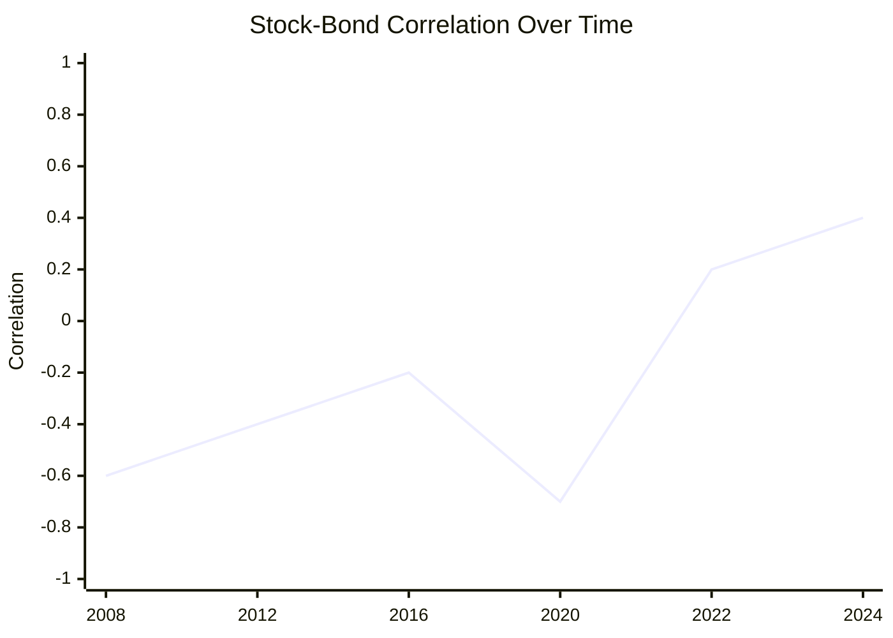
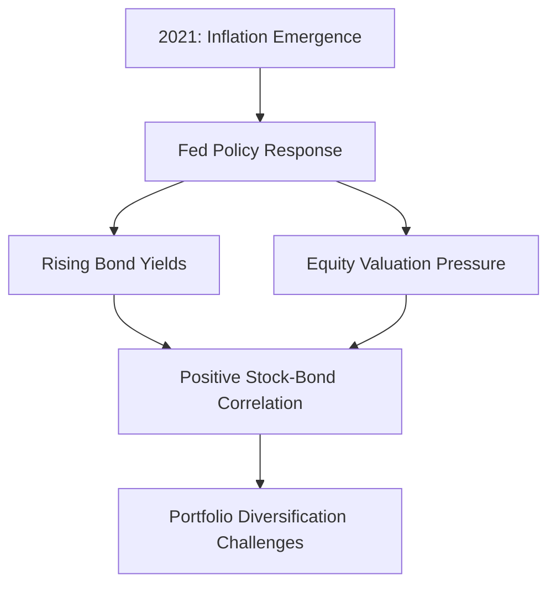
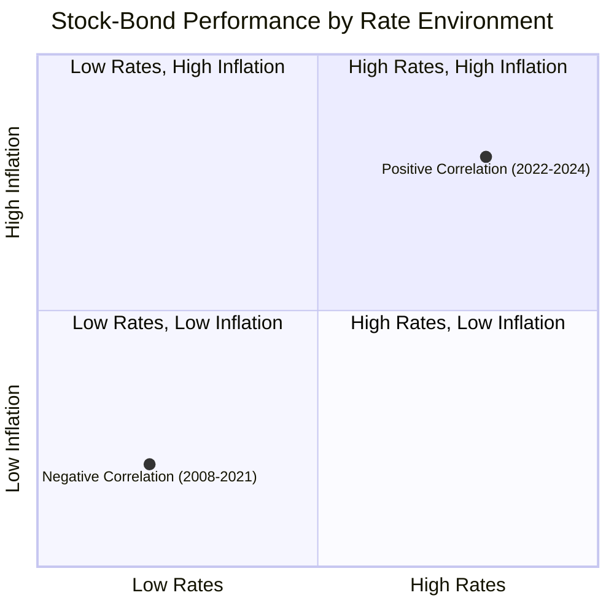
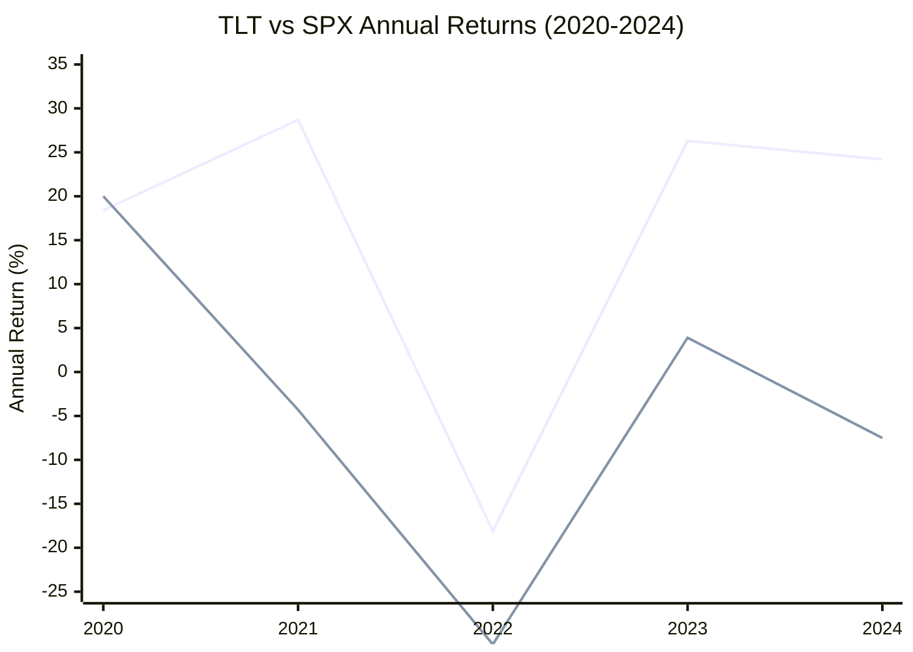
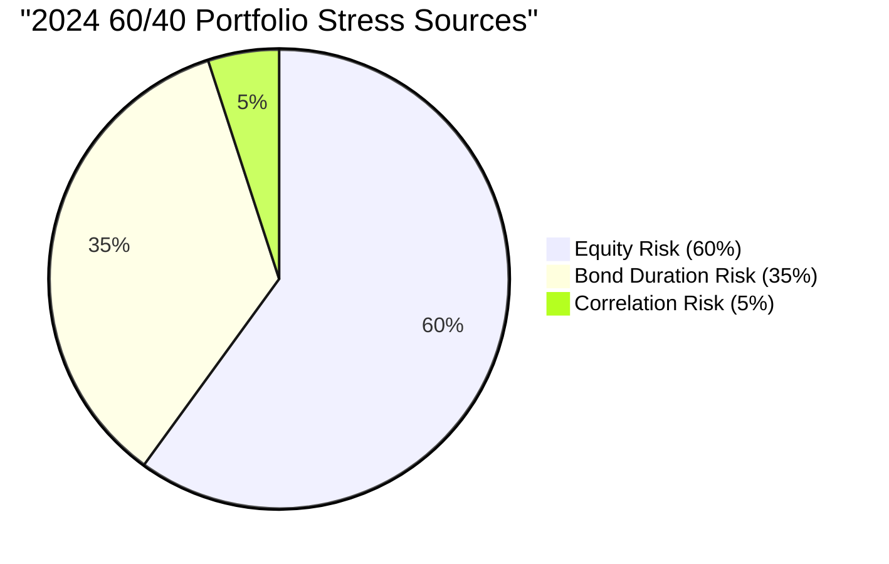
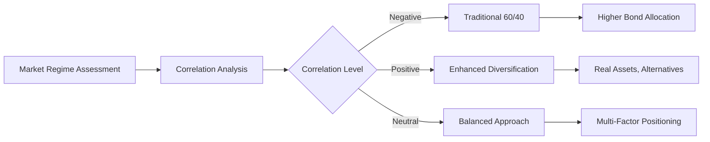
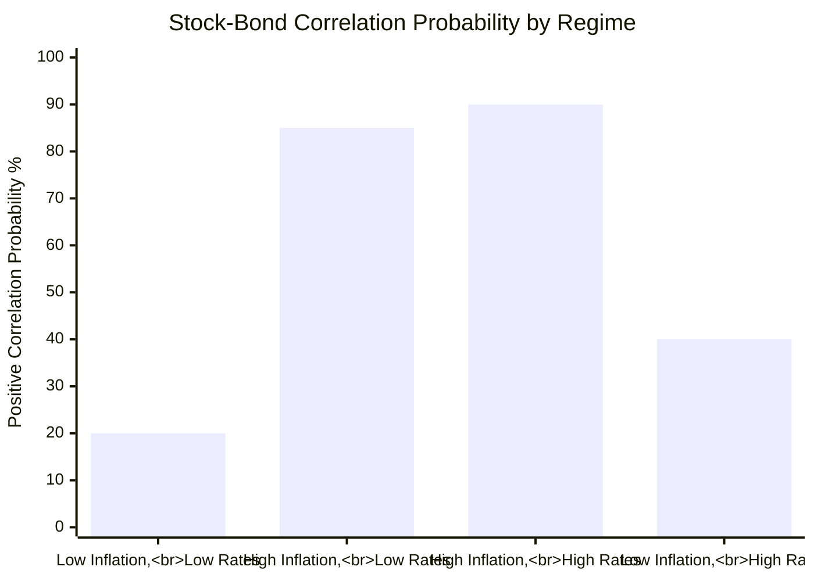
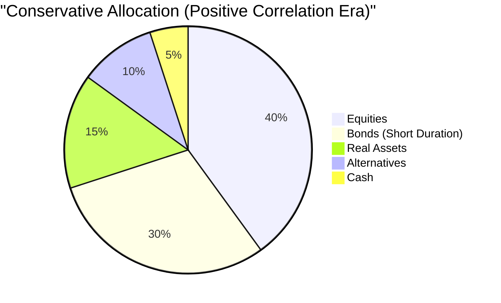
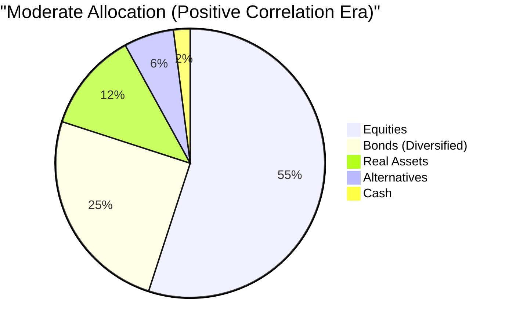
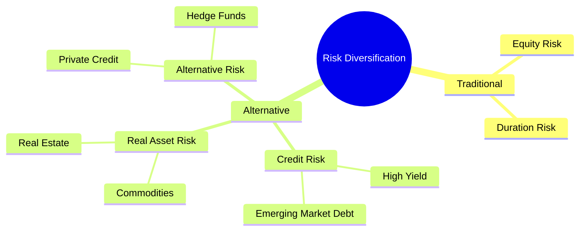

# Task 6: Bond-Equity Correlation and Relationship with SPX

## Executive Summary

The relationship between bonds and the S&P 500 (SPX) underwent a dramatic transformation in 2024, marking the end of the era of reliable negative correlation that provided natural portfolio diversification. Stock-bond correlation reached a 75-year high, fundamentally altering traditional portfolio construction assumptions and requiring investors to reconsider diversification strategies in a higher-for-longer rate environment.

## Current Correlation Environment (2024-2025)

### Historic Shift in Correlation Patterns
- **Current Level**: Stock-bond correlation at 75-year high
- **Regime Change**: From negative to positive correlation dominance
- **Timeline**: Rolling 13-week correlation between 10-year Treasury and S&P 500 moved from -0.72 (November 2024) to +0.39 (January 2025)
- **TLT vs. SPY**: Specific correlation of -0.27, but trending toward less negative

### Correlation Dynamics Visualization

## Historical Context and Pattern Analysis

### Two Distinct Regimes

#### Pre-Dot-Com Era (Pre-2000)
- **Correlation Character**: Largely positive
- **Market Logic**: Economic growth benefited both stocks and bonds
- **Inflation Environment**: Moderate, stable inflation expectations

#### Post-Financial Crisis (2008-2021)
- **Correlation Character**: Predominantly negative
- **Market Logic**: Bonds as safe haven during equity distress
- **Policy Environment**: Ultra-low rates, quantitative easing

### The Great Reversal (2021-2024)

#### Triggering Factors
1. **Inflation Resurgence**: Post-COVID supply chain disruptions and fiscal stimulus
2. **Monetary Policy Shift**: Fed pivot from accommodation to tightening
3. **Economic Growth Uncertainty**: Mixed signals on recession risks
4. **Fiscal Sustainability Concerns**: Rising deficits and debt levels

## Economic Drivers of Correlation Changes

### Inflation as Primary Catalyst

**Impact Mechanism:**
- **Bond Yields**: Rising inflation expectations drive yields higher
- **Equity Valuations**: Higher discount rates pressure stock multiples
- **Correlation Result**: Both assets move down together during inflation scares

### Monetary Policy Transmission

**Fed Tightening Effects:**
- **Direct Bond Impact**: Higher policy rates push yields up across curve
- **Equity Channel**: Tighter financial conditions affect growth and earnings
- **Correlation Outcome**: Synchronized negative performance

### Real vs. Nominal Rate Dynamics

## Performance Analysis: TLT vs. SPX

### 2024 Performance Divergence
- **SPX Performance**: +24.2% (strong bull market)
- **TLT Performance**: -7.5% year-to-date through December
- **Correlation Impact**: Limited diversification benefit despite negative correlation

### Volatility Characteristics
- **TLT Volatility**: 3.75% (lower risk profile)
- **SPX Volatility**: 5.51% (higher but manageable)
- **Diversification Value**: Risk reduction still present despite correlation challenges

### Historical Risk-Return Profile

## Portfolio Diversification Implications

### Traditional 60/40 Portfolio Challenges

#### Lost Diversification Benefits
- **Historical Assumption**: Bonds hedge equity risk during downturns
- **2024 Reality**: Both assets can decline simultaneously
- **Risk Concentration**: Higher portfolio volatility without bond hedge

#### Performance Impact Analysis

### Alternative Diversification Strategies

#### Multi-Asset Approach
- **Real Assets**: Commodities, REITs for inflation protection
- **Alternative Income**: Private credit, preferred stocks
- **Geographic Diversification**: International bonds, emerging market debt
- **Currency Hedging**: Manage foreign exchange exposure

#### Dynamic Allocation Framework

## Regime Identification and Monitoring

### Key Indicators for Correlation Regimes

#### Economic Indicators
1. **Inflation Expectations**: 5y5y forward inflation compensation
2. **Policy Uncertainty**: Fed dot plot dispersion
3. **Growth Momentum**: Leading economic indicators
4. **Financial Conditions**: Chicago Fed NFCI

#### Market-Based Signals
1. **Yield Curve Shape**: Steepening vs. flattening patterns
2. **Credit Spreads**: Risk appetite measures
3. **Volatility**: VIX and MOVE indices
4. **Sector Rotation**: Growth vs. value, duration vs. credit

### Correlation Forecasting Framework

## Strategic Portfolio Implications

### Risk Budgeting Adjustments

#### Traditional Approach (Negative Correlation Era)
- **Equity Risk**: 80% of portfolio volatility
- **Bond Risk**: 20% of portfolio volatility
- **Correlation Benefit**: Significant risk reduction

#### New Framework (Positive Correlation Era)
- **Combined Risk**: Higher portfolio volatility
- **Alternative Assets**: Increased allocation needed
- **Active Management**: Greater tactical flexibility required

### Asset Allocation Modifications

#### Conservative Portfolios

#### Moderate Portfolios

## Sector and Style Implications

### Bond Sector Positioning
- **Duration Management**: Shorter duration preference in rising rate environment
- **Credit vs. Duration**: Focus on credit spread opportunities
- **International Exposure**: Currency diversification benefits
- **Inflation Protection**: TIPS and real return strategies

### Equity Sector Considerations
- **Rate Sensitivity**: Utilities, REITs face headwinds in rising rate environment
- **Growth vs. Value**: Higher rates favor value over growth
- **Sector Rotation**: Financials benefit from higher rates
- **International Markets**: Emerging markets may provide diversification

## Future Outlook and Scenarios

### Base Case: Normalized Correlation (2025-2026)
- **Assumption**: Inflation moderates, Fed policy stabilizes
- **Correlation**: Return to slightly negative or neutral correlation
- **Investment Implication**: Gradual return to traditional diversification

### Alternative Scenario: Persistent Positive Correlation
- **Drivers**: Structural inflation, fiscal concerns, policy uncertainty
- **Correlation**: Sustained positive correlation above historical norms
- **Investment Response**: Permanent shift to alternative diversification

### Recession Scenario: Negative Correlation Return
- **Trigger**: Economic slowdown, deflationary pressures
- **Correlation**: Sharp return to negative correlation
- **Opportunity**: TLT outperformance as recession hedge

## Risk Management Strategies

### Dynamic Hedging Approaches
1. **Options Strategies**: Put spreads on equity exposure
2. **Futures Positioning**: Treasury futures for duration hedging
3. **Currency Overlay**: Foreign exchange diversification
4. **Volatility Management**: Long volatility positions

### Alternative Risk Factors

## Practical Implementation Guidelines

### Portfolio Construction Rules
1. **Maximum Bond Allocation**: Limit to 30-40% in positive correlation regime
2. **Alternative Minimums**: 15-20% allocation to real assets and alternatives
3. **Dynamic Rebalancing**: Quarterly correlation assessment and adjustment
4. **Stress Testing**: Regular portfolio stress tests under different correlation scenarios

### Monitoring and Adjustment Framework
- **Monthly**: Correlation measurement and trend analysis
- **Quarterly**: Asset allocation review and rebalancing
- **Semi-Annual**: Regime assessment and strategic adjustment
- **Annual**: Comprehensive portfolio optimization

## Conclusion

The 2024 shift in stock-bond correlation represents a fundamental change in financial market relationships, with profound implications for portfolio construction. Key takeaways include:

**Structural Changes:**
- Stock-bond correlation at 75-year highs
- Traditional 60/40 portfolio challenged
- Need for alternative diversification sources

**Investment Implications:**
- Reduced reliance on bonds for equity hedge
- Increased allocation to real assets and alternatives
- Greater importance of active management and tactical positioning

**Strategic Response:**
- Dynamic correlation monitoring essential
- Multi-asset diversification strategies required
- Flexibility to adapt to changing market regimes

**Future Considerations:**
- Correlation regimes may be more volatile going forward
- Investment success requires adaptation to new market realities
- Traditional diversification assumptions need updating

The era of relying solely on stock-bond diversification has ended, requiring investors to embrace more sophisticated and dynamic approaches to portfolio risk management.

## References

1. [Hilton Capital Management - Stock-Bond Correlation Reversals](https://www.hiltoncapitalmanagement.com/blog/unpacking-the-reversals-in-equity-price-bond-yield-correlation)
2. [PortfoliosLab - TLT vs SPY Comparison](https://portfolioslab.com/tools/stock-comparison/TLT/SPY)
3. [FS Investments - Stock-Bond Correlation Analysis](https://fsinvestments.com/fs-insights/as-treasury-yields-rise-so-has-stock-bond-correlation/)
4. [JP Morgan - Treasury Yield Analysis](https://www.jpmorgan.com/insights/markets-and-economy/top-market-takeaways/tmt-why-have-ten-year-us-treasury-yields-increased-since-the-fed-started-cutting-rates)
5. [John Hancock - Stock-Bond Correlation Understanding](https://www.jhinvestments.com/viewpoints/investing-basics/understanding-stock-bond-correlation)