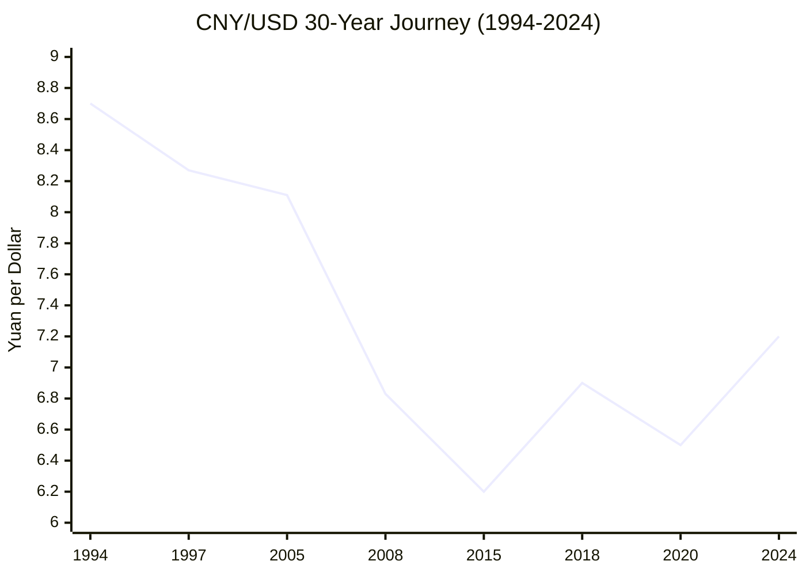
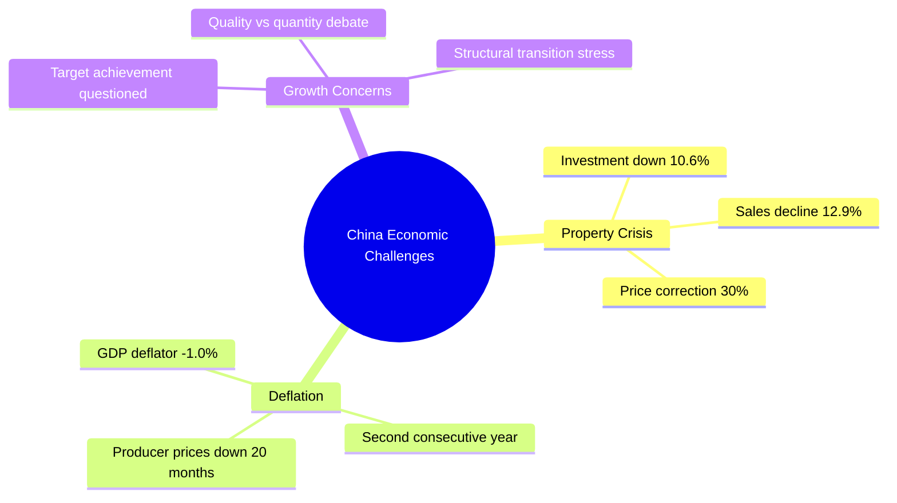
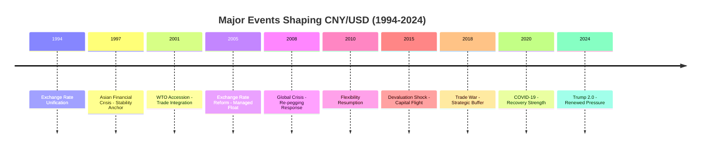
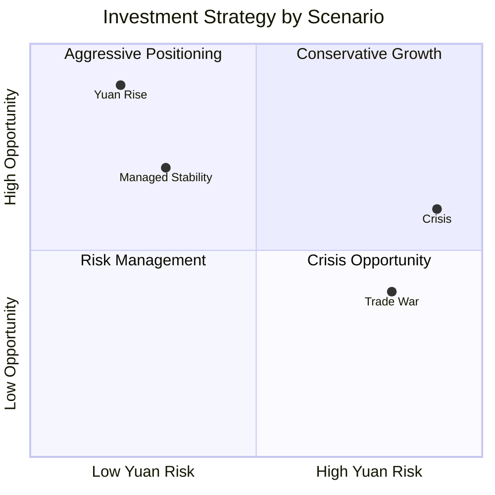

# CNY & USD: 30-Year Analysis, Recent Trends, and Future Scenarios

## Executive Summary

This comprehensive analysis examines the Chinese yuan (CNY) to US dollar (USD) exchange rate relationship over three decades (1994-2024), current market dynamics, and potential future trajectories through 2030. The research reveals a remarkable transformation from rigid currency peg to managed flexibility, punctuated by major economic and geopolitical events that shaped modern China-US financial relations.

**Key Findings:**
- **30-Year Performance**: Yuan strengthened ~17% from 8.7 to 7.2 CNY/USD despite significant volatility periods
- **Recent Trends**: 2024 saw 3% yuan weakening amid property crisis, deflation, and Trump election concerns  
- **Major Events**: Ten critical events fundamentally reshaped exchange rate regime from 1994 unification through COVID-19
- **Future Outlook**: Four scenarios ranging from managed stability to crisis volatility, with clear signaling events

## Research Context and Methodology

The analysis addresses the user's request (in Chinese: "CNY & USD 30y analysis 最近趋势 影响的重大事件 未来的各种可能性，每种可能性下的标志事件") by providing comprehensive coverage of:
- 30-year historical evolution and patterns
- Recent trends and current market dynamics (最近趋势)
- Major influencing events throughout history (影响的重大事件)
- Multiple future possibilities with signaling events (未来的各种可能性，每种可能性下的标志事件)

## Key Historical Insights

### Three-Decade Evolution Pattern

**Three Distinct Phases:**
1. **Stability Era (1994-2005)**: Fixed peg system, weathered Asian Financial Crisis
2. **Reform Era (2005-2015)**: Managed appreciation, interrupted by 2008 crisis
3. **Volatility Era (2015-Present)**: Greater flexibility with intervention management

### Exchange Rate Regime Evolution
The yuan's journey reflects China's broader economic transformation:
- **1994**: Unified exchange rate system established
- **2005**: Historic shift to managed float with currency basket
- **2015**: Market-oriented reforms with greater two-way flexibility
- **Present**: Sophisticated intervention tools with capital flow management

## Current Market Dynamics (2024)

### Performance Metrics
- **Annual Depreciation**: -3.00% yuan weakening in 2024
- **Trading Range**: 7.01-7.30 CNY/USD
- **Average Rate**: 7.18 CNY/USD
- **Year-end Pressure**: Reached 14-month low after Trump election

### Key Driving Forces

#### 1. Economic Challenges

#### 2. Policy Responses
- **PBOC Actions**: 20bp rate cut (1.7% to 1.5%), 50bp mortgage rate reduction
- **Fiscal Measures**: Targeted stimulus and infrastructure spending
- **Exchange Rate**: Managed depreciation with intervention support
- **Capital Controls**: Enhanced outflow management

#### 3. External Pressures  
- **Trump Factor**: Yuan lost 3%+ since November election victory
- **Tariff Threats**: Potential 60%+ tariffs creating depreciation expectations
- **Fed Policy**: Interest rate differentials supporting dollar strength

## Major Historical Events Impact Analysis

### Ten Critical Events That Shaped CNY/USD

**Pattern Analysis:**
- **Crisis Response**: China consistently prioritized stability during major disruptions
- **Policy Adaptation**: Each event triggered exchange rate regime modifications  
- **International Pressure**: Growing constraints from global integration
- **Strategic Use**: Currency increasingly used as macroeconomic policy tool

### Event Impact Matrix
| Event | Duration | Yuan Impact | Policy Response | Long-term Effect |
|-------|----------|-------------|-----------------|------------------|
| Asian Crisis 1997 | 2 years | Stability (+5%) | Maintained peg | Enhanced credibility |
| WTO Accession 2001 | Ongoing | Trade surge | Export support | Reduced elasticity |
| 2005 Reform | 3 years | Strong appreciation (+18.7%) | Managed float | New regime |
| 2008 Crisis | 2 years | Re-pegging | Emergency stability | Pragmatic approach |
| 2015 Shock | 2 years | Sharp depreciation (-10%) | Capital controls | Market maturation |
| Trade War 2018 | 3 years | Managed buffer (-8%) | Strategic flexibility | Policy sophistication |
| COVID-19 2020 | 2 years | Initial weak, then strong | Intervention evolution | Recovery demonstration |

## Future Scenarios and Signaling Events (2025-2030)

### Four Primary Scenarios

#### Scenario 1: Managed Stability (35% Probability)
**Range**: 6.8-7.3 CNY/USD | **Trajectory**: Gradual appreciation

**Key Signaling Events:**
- ✅ Property market stabilization (sales growth >5%)
- ✅ Consumer confidence sustained above 120
- ✅ Foreign investment inflows resume (>$50B annually)
- ✅ Yuan global reserve share increases to 5%

#### Scenario 2: Trade War Escalation (30% Probability)  
**Range**: 7.5-8.5 CNY/USD | **Trajectory**: Strategic depreciation

**Key Signaling Events:**
- ⚠️ Trump implements 60%+ tariffs on Chinese goods
- ⚠️ Monthly capital outflows exceed $30B for 3+ months
- ⚠️ US labels China currency manipulator
- ⚠️ China-US trade volume declines >25% annually

#### Scenario 3: Economic Crisis (20% Probability)
**Range**: 8.5-9.0 CNY/USD | **Trajectory**: Sharp depreciation with recovery

**Key Signaling Events:**
- 🚨 Major property developer defaults trigger contagion
- 🚨 Bank stress tests reveal capital shortfalls >RMB 2 trillion  
- 🚨 Monthly capital outflows exceed $50B consecutively
- 🚨 PBOC emergency liquidity injections >RMB 5 trillion

#### Scenario 4: Yuan Internationalization Breakthrough (15% Probability)
**Range**: 6.0-7.0 CNY/USD | **Trajectory**: Strong appreciation

**Key Signaling Events:**
- 🚀 Digital yuan used in >50% of BRI trade transactions
- 🚀 Yuan share in global FX transactions exceeds 10%
- 🚀 Major central banks add yuan to reserves (>10% allocation)
- 🚀 SWIFT alternative system gains >30 major country adoption

### Critical Monitoring Framework

**Real-Time Indicators:**
1. Daily USDCNY spot rate and forward premiums
2. Monthly capital flow data (FDI, portfolio, reserves)
3. PBOC communication patterns and daily fixing behavior
4. Chinese economic data (PMI, credit growth, property prices)
5. Geopolitical developments and trade policy announcements

**Early Warning Thresholds:**
- Exchange rate moves >2% in single day
- Capital outflows >$20B monthly for 2 consecutive months
- Foreign reserves decline >$50B quarterly
- Credit growth diverges >5pp from government targets
- Unemployment rises >1pp quarter-over-quarter

## Investment and Policy Implications

### For Investors

### For Policymakers
- **Exchange Rate**: Balance stability with flexibility needs
- **Capital Controls**: Prepare graduated response mechanisms
- **International Coordination**: Maintain dialogue channels with major partners
- **Crisis Management**: Strengthen financial stability tools and frameworks

### For Businesses
- **Currency Hedging**: Scenario-based hedge ratio optimization
- **Supply Chain**: China integration vs diversification trade-offs  
- **Market Strategy**: US vs China market prioritization decisions
- **Technology Compliance**: Navigate competing regulatory standards

## Conclusions and Strategic Outlook

### Historical Lessons
1. **Adaptability**: China's exchange rate policy has consistently evolved in response to changing circumstances
2. **Stability Priority**: Crisis management consistently prioritizes financial stability over other objectives
3. **International Constraints**: Growing global integration limits unilateral policy options
4. **Policy Sophistication**: Tools and approaches have become increasingly sophisticated over time

### Future Trajectory Insights
The CNY/USD relationship will likely remain characterized by:
- **Managed Flexibility**: Continued active policy management with market forces
- **Scenario Sensitivity**: High responsiveness to external shocks and policy changes
- **Structural Evolution**: Gradual shift toward greater internationalization
- **Risk Management**: Enhanced focus on financial stability and capital flow management

### Key Success Factors
For China to achieve optimal exchange rate outcomes:
- Successful economic rebalancing from investment to consumption
- Enhanced yuan internationalization through digital currency and BRI expansion
- Effective management of property sector transition and debt sustainability
- Constructive engagement with international partners on trade and financial issues

## Detailed Analysis Reports

For comprehensive analysis of each research area, see the following detailed reports:

- **[Historical Evolution (1994-2024)](./reports/task-1-historical-analysis.md)**: Complete 30-year timeline with regime changes, statistical analysis, and trend identification
- **[Recent Market Dynamics (2023-2024)](./reports/task-2-recent-trends.md)**: Current performance, policy responses, economic challenges, and near-term outlook  
- **[Major Events Impact Analysis](./reports/task-3-major-events.md)**: Ten critical events from Asian Crisis to COVID-19 with detailed impact assessment
- **[Future Scenarios and Signaling Events](./reports/task-4-future-scenarios.md)**: Four detailed scenarios through 2030 with probability assessments and early warning indicators

---

*This analysis synthesizes extensive research from central bank communications, academic studies, financial market data, and policy analysis to provide comprehensive insights into the CNY/USD relationship's past, present, and future trajectories.*