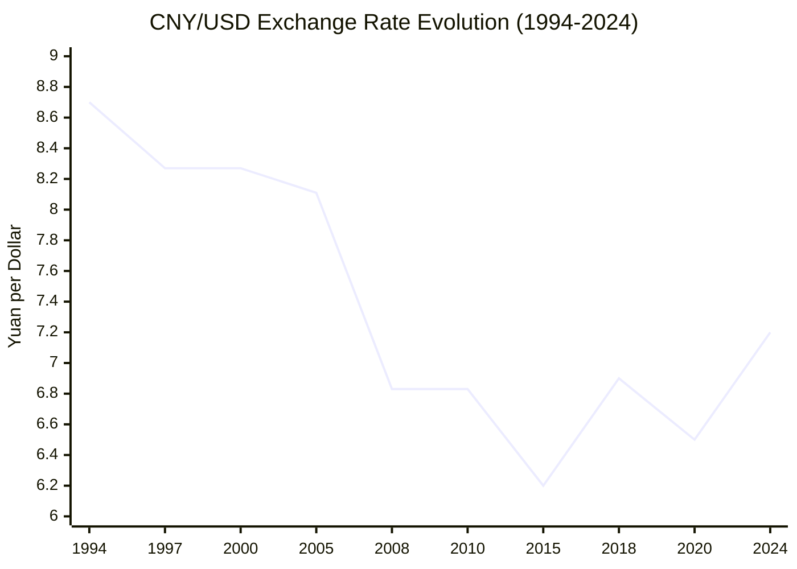
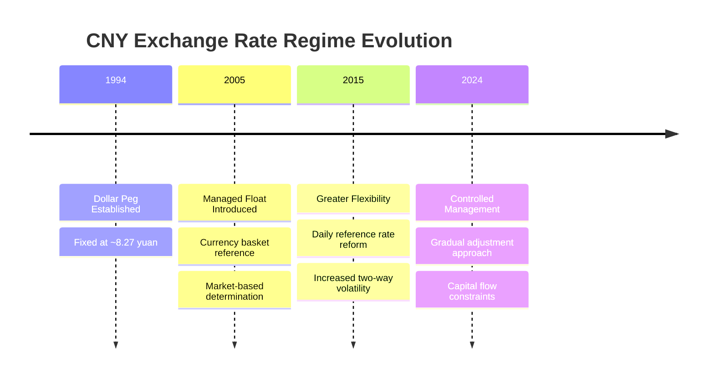

# Task 1: Historical Analysis - CNY/USD Exchange Rate Evolution (1994-2024)

## Executive Summary

Over the past 30 years, the CNY/USD exchange rate has undergone a dramatic transformation from a rigid dollar peg to a managed floating system. The Chinese yuan has generally appreciated from around 8.7 yuan per dollar in 1994 to approximately 7.2 yuan per dollar in 2024, representing a long-term strengthening trend interrupted by periods of devaluation during economic crises and trade tensions.

## Historical Timeline and Key Phases

### Phase 1: Exchange Rate Unification (1994)
- **Starting Point**: USD 1 = CNY 8.7 at exchange rate unification
- **Key Event**: 33% depreciation of official exchange rate in January 1994
- **Significance**: Harmonized market-based "swap center" rate with official rate
- **Policy**: Establishment of initial dollar peg around 8.28 yuan per dollar

### Phase 2: Rigid Dollar Peg (1994-2005)
- **Rate**: ¥8.27 per US$1 (constant from 1997-2005)
- **Duration**: 11 years of fixed exchange rate
- **Context**: Asian Financial Crisis period stability
- **Policy Rationale**: Exchange rate stability to support export-led growth

### Phase 3: Managed Appreciation (2005-2008)
- **Initiation**: July 21, 2005 - 2.1% revaluation to 8.11 yuan per dollar
- **System Change**: Shift to managed floating based on currency basket
- **Appreciation**: 18.7% appreciation from 8.11 to 6.83 (July 2005 to July 2008)
- **Total Gain**: 34% nominal appreciation from 2005-2013

### Phase 4: Crisis Response and Re-pegging (2008-2010)
- **Crisis Impact**: Global financial crisis halted yuan appreciation
- **Policy**: Unofficial re-pegging to dollar for stability
- **Duration**: 2 years of exchange rate stability
- **Rationale**: Support for Chinese exporters during global downturn

### Phase 5: Resumed Flexibility (2010-2015)
- **Resumption**: June 2010 return to managed appreciation
- **Trend**: Irregular appreciation through 2015
- **Peak Strength**: Yuan reached multi-year highs before 2015 reversal

### Phase 6: Devaluation Shock and Volatility (2015-2016)
- **August 11, 2015**: Largest one-day devaluation (1.9% cut to reference rate)
- **Market Impact**: Global financial market shocks
- **Capital Flight**: $42.5B in July, $93.9B in August 2015
- **Annual Outflows**: Nearly $1 trillion left China in 2016
- **Policy Response**: Tightened capital controls while allowing depreciation

### Phase 7: Trade War Era (2018-2021)
- **Pressure Point**: US-China trade tensions escalated exchange rate volatility
- **Tariff Impact**: US tariffs reached ~20% on Chinese goods by 2021
- **Yuan Response**: Used as buffer against trade pressures
- **Phase One Deal**: January 2020 agreement temporarily stabilized relations

### Phase 8: COVID and Recovery (2020-2021)
- **Initial Devaluation**: Early 2020 pandemic weakness
- **Strong Recovery**: Yuan strengthened significantly through 2020-2021
- **Biden Effect**: Currency spiked after Biden election victory
- **Peak Performance**: Yuan reached multi-year highs against dollar

### Phase 9: Current Challenges (2022-2024)
- **Recent Weakness**: Yuan lost 3%+ since Trump's 2024 election victory
- **Current Rate**: Trading around 7.2-7.3 yuan per dollar
- **Policy Stance**: Managed gradual depreciation rather than sharp devaluation
- **Constraints**: Capital flight concerns limit devaluation options

## Statistical Summary (30-Year Overview)

### Key Statistics:
- **Starting Rate (1994)**: 8.7 CNY/USD
- **Current Rate (2024)**: ~7.2 CNY/USD
- **Net Appreciation**: ~17% over 30 years
- **Peak Strength**: ~6.2 CNY/USD (2015)
- **Weakest Point**: 8.7 CNY/USD (1994)
- **Volatility Periods**: 2015-2016, 2018-2019, 2020-2021

## Exchange Rate Regime Evolution

## Long-Term Trends Analysis

### Structural Appreciation (2005-2015)
- **Drivers**: Economic growth, trade surpluses, foreign investment
- **Magnitude**: 34% nominal appreciation over 8 years
- **Policy**: Gradual, managed appreciation to reduce trade frictions

### Depreciation Pressures (2015-Present)
- **Factors**: Capital outflows, trade tensions, economic slowdown
- **Response**: Managed depreciation with capital controls
- **Constraint**: Financial stability concerns limit devaluation scope

### Volatility Increasing
- **2005-2008**: Low volatility during gradual appreciation
- **2015-2016**: High volatility during devaluation period  
- **2018-2021**: Trade war and pandemic-induced swings
- **2022-2024**: Moderate volatility with managed flexibility

## References

1. [San Francisco Fed - China's Exchange Rate Regime](https://www.frbsf.org/research-and-insights/publications/economic-letter/2005/09/a-look-at-china-new-exchange-rate-regime/)
2. [South China Morning Post - 2015 Yuan Reform Impact](https://www.scmp.com/economy/china-economy/article/3321464/10-years-day-chinas-big-yuan-devaluation-set-shock-waves-what-has-changed)
3. [MacroTrends - USD Yuan Historical Chart](https://www.macrotrends.net/2575/us-dollar-yuan-exchange-rate-historical-chart)
4. [CNBC - Yuan Weakness and Trump Concerns](https://www.cnbc.com/2025/01/20/yuan-weakness-tests-china-resolve-as-trump-tariffs-loom.html)
5. [Wikipedia - Renminbi History](https://en.wikipedia.org/wiki/Renminbi)