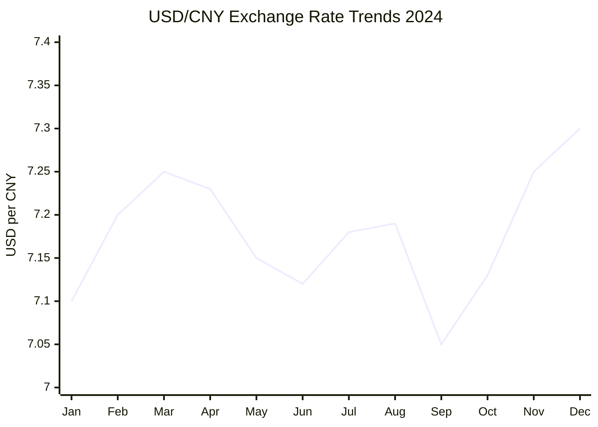
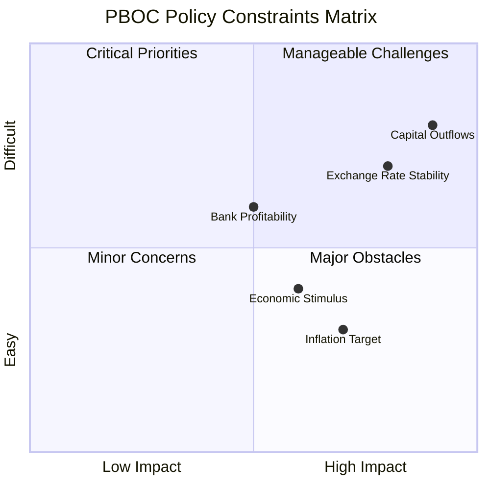

# Task 2: Recent Trends Analysis - CNY/USD Current Market Dynamics (2023-2024)

## Executive Summary

The CNY/USD exchange rate in 2024 faced significant depreciation pressure, with the yuan weakening 3.00% against the dollar. The rate fluctuated between 7.01-7.30, averaging 7.18 for the year. Key drivers included divergent monetary policies, China's economic challenges including deflation and property crisis, and mounting concerns over potential Trump tariffs creating further depreciation expectations.

## 2024 Exchange Rate Performance

### Annual Statistics
- **2024 Average Rate**: 7.1812 USD/CNY
- **Yearly Change**: -3.00% (yuan weakened)
- **Range**: 7.0105 (strongest) to 7.2991 (weakest)
- **Year-end Rate**: ~7.28 USD/CNY
- **December Outlook**: Yuan reached 14-month low after Trump election victory

### Monthly Trends Pattern

## Key Market Dynamics and Drivers

### 1. Divergent Monetary Policies

#### PBOC Policy Actions (September 2024)
- **Major Rate Cut**: 7-day reverse repo rate reduced from 1.7% to 1.5% (20bp cut)
- **Mortgage Relief**: Reduced existing mortgage rates by 50bp average
- **Bank Reserve Requirements**: Cut by 50bp to 6.6% average
- **Policy Signal**: PBOC Governor Pan Gongsheng emphasized goal to restore inflation

#### Federal Reserve Impact
- **Interest Rate Differential**: US-China yield spread peaked at 3.28pp in December 2024
- **Rate Cut Expectations**: Fed dovish pivot provided some yuan support
- **Yield Dynamics**: Narrowing spreads reduced depreciation pressure temporarily

### 2. China's Economic Challenges

#### Deflation Concerns
- **Duration**: Second consecutive year of deflation in 2024
- **Historical Context**: Longest price decline streak since 1960s
- **2024 Inflation**: Headline CPI at 0.3% (y/y) in May, core at 0.6%
- **Producer Prices**: Declined for 20 consecutive months through May 2024
- **GDP Deflator**: -1.0% in Q1 2024, following -0.6% in 2023

#### Property Crisis Impact
- **Investment Decline**: Property investment fell 10.6% in 2024 (steepest since 1987)
- **Sales Drop**: Property sales declined 12.9%
- **Construction Slowdown**: New construction starts down 23%
- **Price Correction**: Existing home prices in major cities down ~30% from 2021
- **Developer Distress**: 50% of developers facing solvency concerns

### 3. Capital Flow Dynamics

#### Structural Outflow Pressures
- **Export Conversion**: Exporters converting USD holdings to yuan post-Fed cuts
- **Dollar Hoarding**: Previous hoarding due to 5% USD yields vs lower yuan returns
- **Policy Constraints**: PBOC managing outflow concerns while supporting economy

#### PBOC Exchange Rate Management
- **Active Intervention**: Consistently stronger fixing than market indicated
- **Band Trading**: Yuan often traded at weaker end of daily trading band
- **Stability Focus**: August 2023 onwards more stable fixing approach

## Current Market Assessment (Late 2024)

### Trump Election Impact
- **Immediate Response**: Yuan lost 3%+ since Trump's November election victory
- **Tariff Expectations**: 60%+ tariffs on Chinese goods threatened
- **Depreciation Projections**: Offshore yuan could reach 8.5 per dollar
- **Policy Response**: Controlled depreciation rather than sharp devaluation

### Economic Performance vs Targets
- **GDP Achievement**: 5.0% growth target met for 2024
- **Real GDP**: RMB 134.9 trillion ($18.42 trillion)
- **Growth Quality**: Questions over sustainability and data accuracy
- **2025 Outlook**: Growth expected to slow to 4.0-4.5%

## Policy Trade-offs and Constraints

### PBOC Balancing Act

### Key Policy Constraints
1. **Capital Flight Risk**: Primary concern limiting aggressive devaluation
2. **Bank Profitability**: Low rates pressure financial sector margins  
3. **Credit Demand**: Weak demand limits monetary transmission effectiveness
4. **International Competitiveness**: Need to maintain export competitiveness
5. **Financial Stability**: Property sector stress requires policy support

## Market Expectations and Forward Guidance

### Near-term Outlook (2025)
- **Depreciation Pressure**: Continued weakness expected amid Trump policies
- **Policy Support**: Gradual adjustment preferred over sharp moves
- **Range Trading**: Likely to trade between 7.0-7.5 in absence of major shocks
- **Intervention Threshold**: PBOC likely to defend against rapid depreciation

### Structural Factors
- **Economic Rebalancing**: Transition from investment to consumption model
- **Currency Internationalization**: Gradual increase in global yuan usage
- **Technology Tensions**: Ongoing US-China strategic competition
- **Demographic Challenges**: Aging population impacting growth potential

## Comparative Regional Context

### Asian Currency Performance (2024)
| Currency | vs USD Performance |
|----------|-------------------|
| CNY | -3.00% |
| JPY | -10.2% |
| KRW | -8.7% |
| TWD | -5.9% |
| SGD | -2.1% |

*Yuan's relative outperformance reflected PBOC's active management*

## References

1. [CNBC - Yuan Weakness Tests Beijing's Resolve](https://www.cnbc.com/2025/01/20/yuan-weakness-tests-china-resolve-as-trump-tariffs-loom.html)
2. [Atlantic Council - China's Monetary Easing Measures](https://www.atlanticcouncil.org/blogs/econographics/chinas-recent-monetary-easing-measures-are-useful-but-not-enough/)
3. [Statista - Monthly CNY to USD Exchange Rate 2024](https://www.statista.com/statistics/456227/monthly-exchange-rate-chinese-yuan-to-us-dollar/)
4. [PIIE - China's Stimulus and Deflation](https://www.piie.com/blogs/realtime-economics/2024/will-chinas-stimulus-be-enough-get-its-economy-out-deflation)
5. [Federal Reserve - Internationalization of Chinese Renminbi](https://www.federalreserve.gov/econres/notes/feds-notes/internationalization-of-the-chinese-renminbi-progress-and-outlook-20240830.html)
6. [Bloomberg - China Holds Key Rate Steady](https://www.bloomberg.com/news/articles/2024-02-18/china-leaves-key-rate-steady-as-yuan-limits-maneuvering-room)