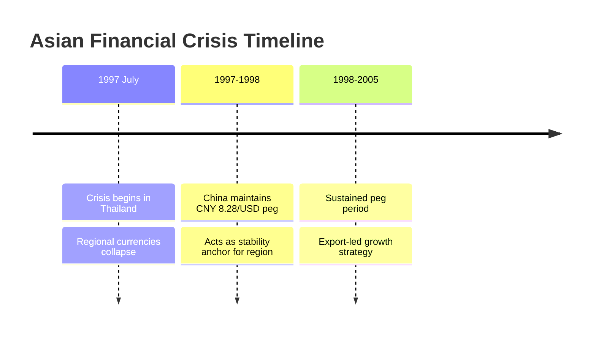
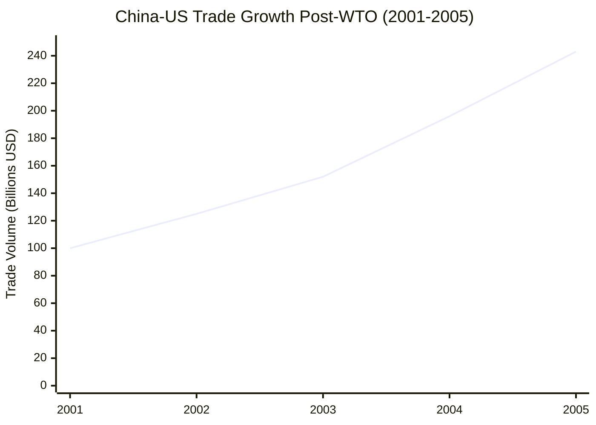
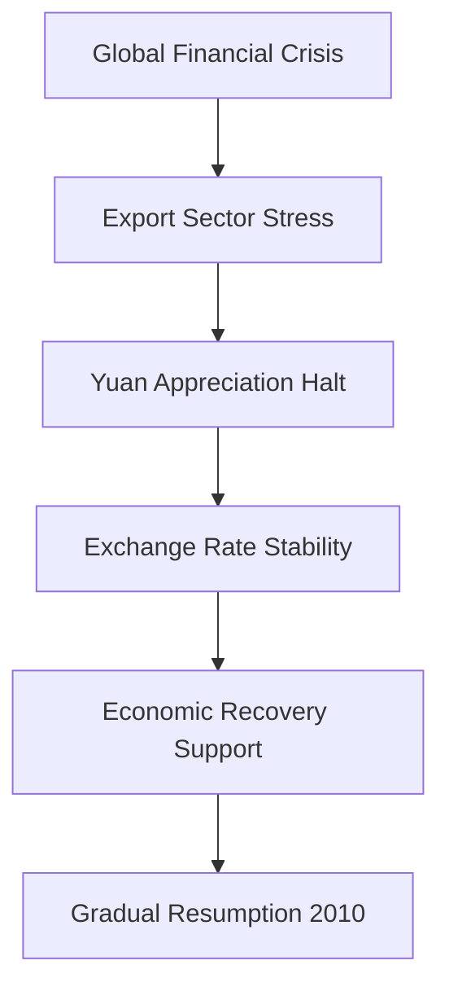
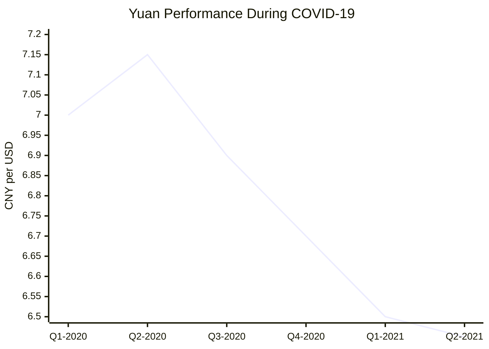
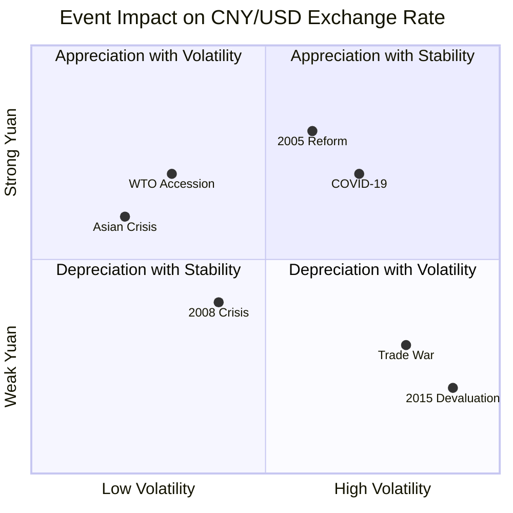

# Task 3: Major Events Impact Analysis - Key Events Affecting CNY/USD Exchange Rate

## Executive Summary

Over the past 30 years, several major geopolitical and economic events have profoundly shaped the CNY/USD exchange rate trajectory. These events demonstrate China's evolution from a rigid currency peg system to a more flexible but still managed regime, with each crisis prompting policy adaptations that reflected China's changing economic priorities and international integration.

## Timeline of Major Events and Their Impact

### 1. Exchange Rate Unification (1994)
**Event**: Merger of official and market exchange rates
**Impact**: 33% devaluation from multiple rates to unified rate of 8.7 CNY/USD
**Significance**: Established foundation for modern Chinese currency system
**Policy Response**: Created single, more market-oriented exchange rate mechanism

### 2. Asian Financial Crisis (1997-1998)

#### Context and Regional Impact
- **Crisis Onset**: July 1997, beginning in Thailand and spreading across East Asia
- **Regional Devastation**: Major currency devaluations across Southeast Asia
- **China's Position**: Maintained exchange rate stability as regional anchor

#### CNY/USD Impact


**Exchange Rate Response**:
- Maintained peg at 8.28 CNY/USD throughout crisis
- Slight appreciation from crisis-period rate of 8.7 to 8.28 (5% strengthening)
- Demonstrated commitment to regional financial stability

**Policy Significance**:
- Established China as responsible regional economic power
- Reinforced fixed peg strategy for stability during turbulence
- Enhanced international credibility of Chinese monetary policy

### 3. China's WTO Accession (December 2001)

#### Structural Economic Changes
- **Trade Integration**: Committed to sweeping economic reforms and transparency
- **Tariff Reductions**: Steep cuts for imported goods
- **Market Access**: Enhanced IP protections and regulatory transparency

#### Exchange Rate and Trade Impact
**Trade Volume Changes**:
- US goods imports from China: $100B (2001) → $400B (2023)
- Dramatic reduction in trade costs through tariff cuts
- Enhanced China's export competitiveness globally

**Currency Policy Evolution**:
- Exchange rate elasticity reduced by 0.152 magnitude post-WTO
- Lower sensitivity of exports to exchange rate changes
- Maintained currency stability to support export growth



### 4. 2005 Exchange Rate Regime Reform (July 21, 2005)

#### Major Policy Shift
- **Rate Adjustment**: 2.1% revaluation to 8.11 CNY/USD
- **System Change**: Shift from dollar peg to managed float with currency basket
- **Market Mechanism**: Introduced greater market-based determination

#### Long-term Impact (2005-2008)
- **Appreciation Trend**: 18.7% strengthening from 8.11 to 6.83
- **New Flexibility**: Daily trading bands and two-way volatility
- **International Pressure**: Response to US and international concerns over competitiveness

### 5. Global Financial Crisis (2008-2010)

#### Crisis Response Strategy
- **Policy Reversal**: Halted yuan appreciation in July 2008
- **Re-pegging**: Unofficial return to dollar peg for stability
- **Narrow Range**: Fluctuated only between 6.81-6.86 CNY/USD

#### Economic Rationale


**Impact Assessment**:
- Prioritized domestic economic stability over international pressure
- Supported Chinese exporters during global demand collapse
- Demonstrated pragmatic policy approach during crisis

### 6. Resumption of Flexibility (June 2010)

#### Post-Crisis Recovery
- **Policy Restart**: Resumed managed appreciation in June 2010
- **Gradual Approach**: Irregular appreciation through 2015
- **Market Confidence**: Restored two-way exchange rate movement

### 7. August 2015 Devaluation Shock

#### Market Disruption Event
- **Surprise Move**: Largest one-day cut (1.9%) to reference rate on August 11
- **Global Impact**: Shocked international financial markets
- **New Methodology**: Reformed daily fixing mechanism

#### Capital Flow Crisis
```mermaid
sankey-beta
    title "China Capital Outflows (2015-2016)"
    2015 July,42.5 Billion,Outflows
    2015 August,93.9 Billion,Outflows
    2016 Annual,1 Trillion,Outflows
```

**Market Consequences**:
- Shanghai Stock Exchange dropped 43% (June-August 2015)
- $42.5B outflows in July, $93.9B in August 2015
- Nearly $1 trillion left China in 2016
- Required aggressive capital control measures

### 8. US-China Trade War (March 2018-Present)

#### Escalation Timeline
- **March 22, 2018**: Trump announced China tariffs
- **Progressive Escalation**: Tariffs reached ~20% on Chinese goods by 2021
- **Phase One Agreement**: January 2020 temporary stabilization

#### Exchange Rate Weapon
**Currency as Trade Buffer**:
- Yuan depreciation used to offset tariff impacts
- Affected regional currencies (AUD, EUR, JPY, KRW, SGD, ZAR)
- Created ongoing tension over currency manipulation

**Policy Response Pattern**:
- Controlled depreciation rather than sharp devaluation
- Maintained stability as priority over competitive advantage
- Balanced domestic needs with international responsibilities

### 9. COVID-19 Pandemic (2020-2021)

#### Crisis Response and Recovery
**Initial Weakness (Early 2020)**:
- Yuan devalued at pandemic onset
- Market uncertainty and capital flight concerns
- Economic lockdowns impacted trade flows

**Strong Recovery (Late 2020-2021)**:


**Recovery Factors**:
- Effective pandemic control created favorable conditions
- Higher interest rates vs developed markets (Fed cut to zero)
- Biden election victory boosted yuan expectations
- Strong export performance during global recovery

**Policy Innovation**:
- Maintained intervention through state banks
- Concealed intervention via offshore subsidiary lending
- Missed opportunity for greater exchange rate flexibility

### 10. Current Challenge - Trump 2.0 Era (2024-Present)

#### Renewed Trade Tensions
- **Election Impact**: Yuan lost 3%+ since November 2024 Trump victory
- **Tariff Threats**: 60%+ tariffs on Chinese goods promised
- **Market Expectations**: Offshore yuan could reach 8.5 per dollar

## Pattern Analysis: Event Response Evolution

### Early Period (1994-2005): Stability Priority
- Fixed peg maintained through Asian Financial Crisis
- WTO accession supported by stable currency
- Export-led growth model protection

### Reform Period (2005-2015): Managed Flexibility
- Gradual appreciation responding to international pressure  
- Crisis interruptions with temporary re-pegging
- Balance between domestic and international considerations

### Modern Era (2015-Present): Balanced Management
- Greater two-way flexibility with intervention limits
- Capital flow management as priority constraint
- Strategic use of currency in trade disputes

## Impact Assessment Matrix



## Key Lessons from Historical Events

### 1. Crisis Management Adaptation
- China has consistently prioritized stability during major global crises
- Temporary policy reversals demonstrate pragmatic approach
- International responsibilities balanced with domestic needs

### 2. Policy Tool Evolution
- Exchange rate increasingly used as macroeconomic management tool
- Capital controls as essential complement to currency policy
- Growing sophistication in intervention techniques

### 3. International Integration Constraints
- Greater global integration limits unilateral policy options
- Market expectations increasingly important for policy effectiveness
- Trade tensions create ongoing currency policy dilemmas

## References

1. [Federal Reserve History - Asian Financial Crisis](https://www.federalreservehistory.org/essays/asian-financial-crisis)
2. [IMF - Asian Crisis: Causes and Cures](https://www.imf.org/external/pubs/ft/fandd/1998/06/imfstaff.htm)
3. [CFR - Contentious US-China Trade Relationship](https://www.cfr.org/backgrounder/contentious-us-china-trade-relationship)
4. [PIIE - Exchange Rate Policy in COVID-19 Pandemic](https://www.piie.com/blogs/realtime-economic-issues-watch/exchange-rate-policy-covid-19-pandemic)
5. [Emerald Publishing - 70 Years of China's Foreign Exchange Market](https://www.emerald.com/insight/content/doi/10.1108/cpe-05-2020-0007/full/html)
6. [Tandfonline - COVID-19 and Currency Market Analysis](https://www.tandfonline.com/doi/full/10.1080/1331677X.2021.1959368)