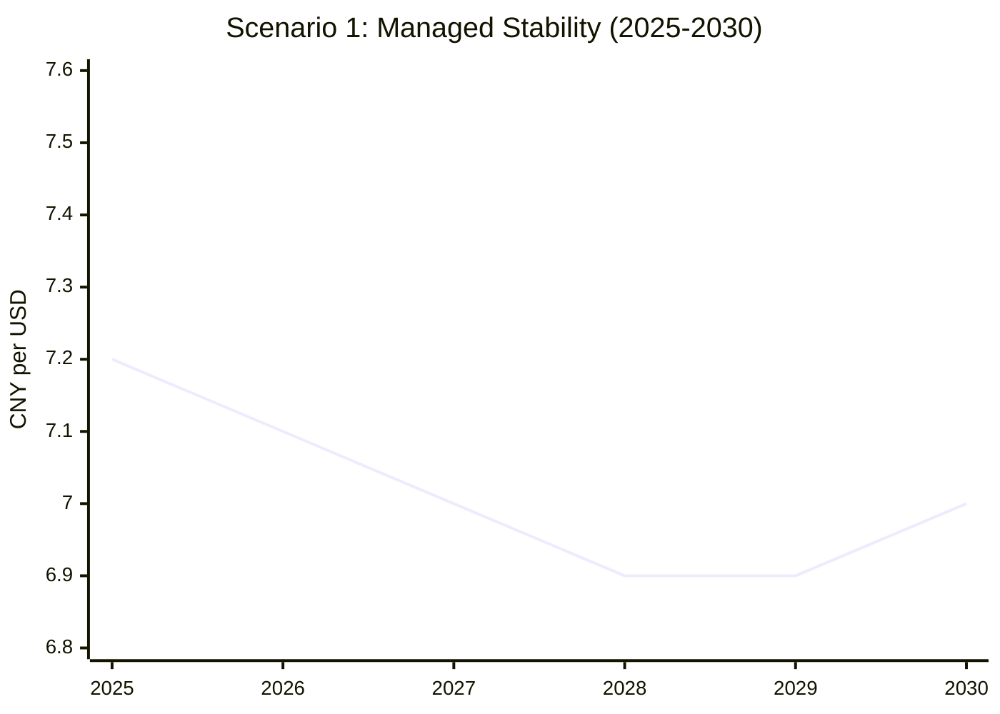
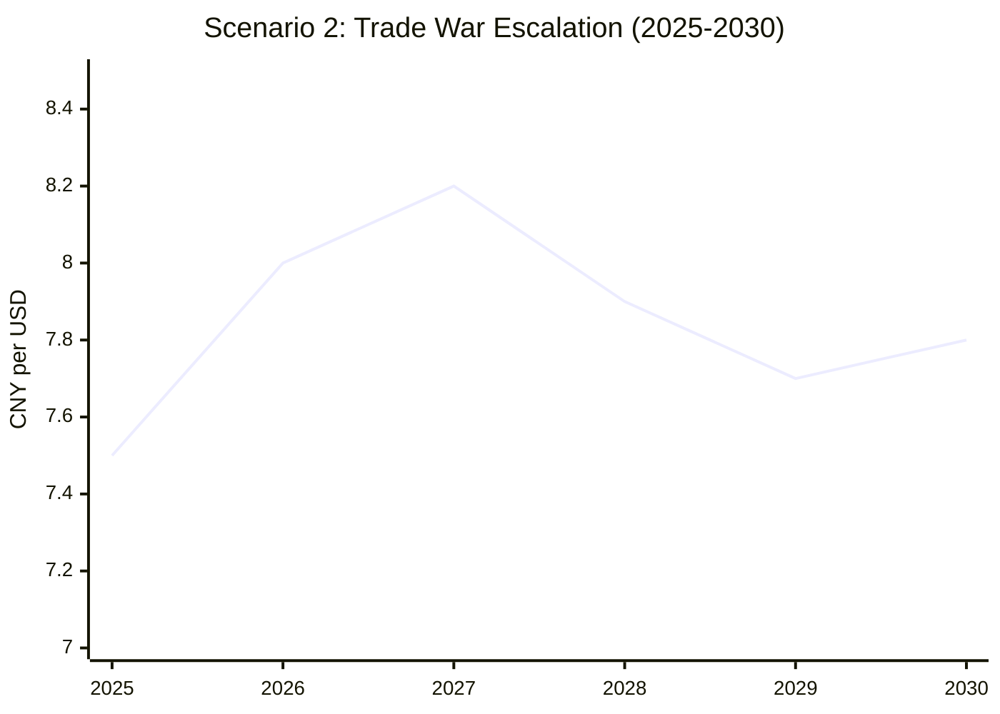
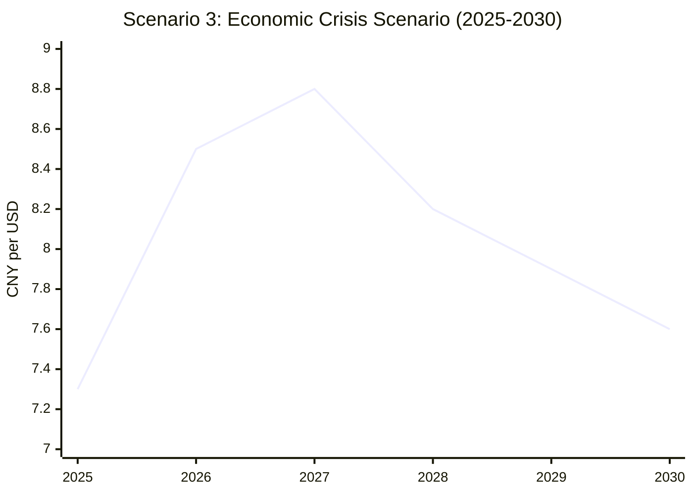
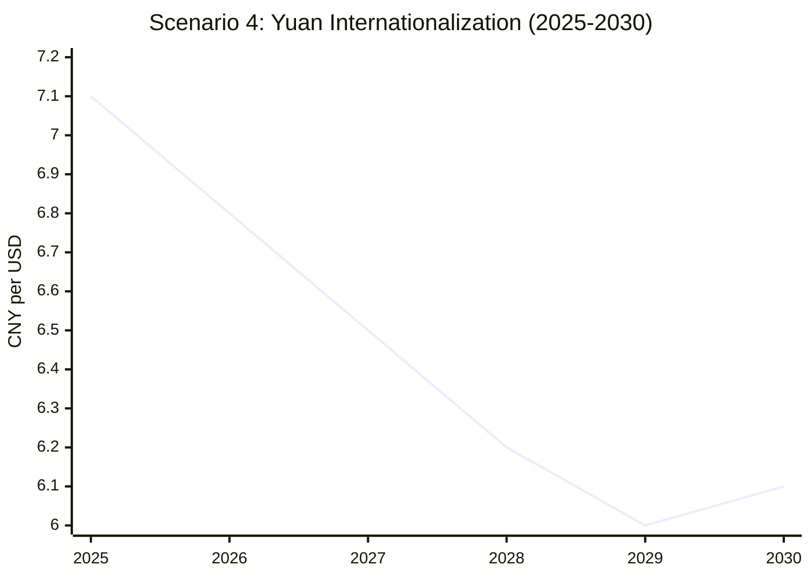
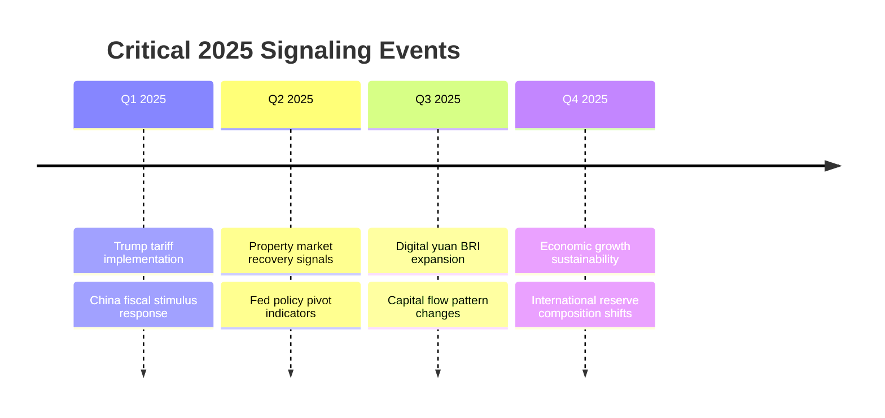
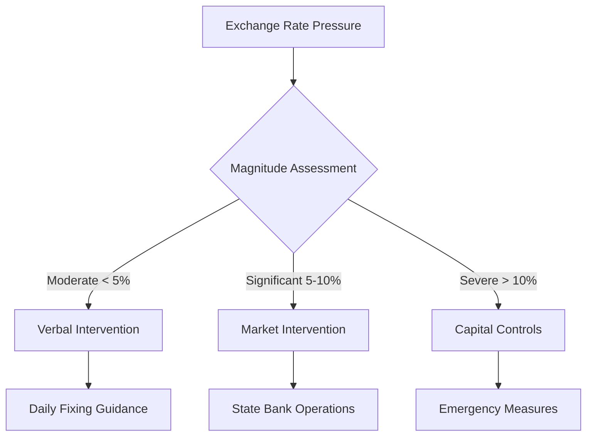

# Task 4: Future Scenarios Analysis - CNY/USD Possibilities and Signaling Events (2025-2030)

## Executive Summary

The CNY/USD exchange rate faces multiple possible trajectories over 2025-2030, driven by US-China trade tensions, monetary policy divergence, China's economic transition, and yuan internationalization efforts. Four primary scenarios emerge, ranging from managed stability to crisis-driven volatility, each with distinct signaling events that could trigger different outcomes.

## Base Case Forecasts (2025)

### Consensus Projections
- **Trading Range**: 7.0-7.5 CNY/USD with managed flexibility
- **Average Rate**: 7.12 CNY/USD (equivalent to $0.1404 per CNY)
- **Volatility**: Two-way fluctuations with PBOC intervention support
- **Policy Stance**: Gradual, orderly depreciation management

### Key Assumptions
- Moderate Trump tariff implementation (20-40% vs threatened 60%)
- Fed maintains 2024 rate level with gradual cuts
- China implements RMB 2.5-3 trillion fiscal stimulus
- No major geopolitical crisis escalation

## Four Primary Scenarios (2025-2030)

### Scenario 1: Managed Stability (Probability: 35%)

**Description**: China successfully manages gradual economic transition while maintaining exchange rate stability through active policy intervention.

**Key Characteristics**:
- Trading range: 6.8-7.3 CNY/USD
- Moderate yuan appreciation over time
- Successful economic rebalancing
- Enhanced yuan internationalization

**Signaling Events**:
✅ **Early Indicators (6-12 months ahead)**:
- Property market stabilization with sales growth >5%
- Consumer confidence index above 120
- Foreign investment inflows resumption >$50B annually
- PBOC reduces daily intervention frequency

✅ **Confirmation Signals**:
- China GDP growth sustainably above 4.5%
- Current account surplus remains 2-4% of GDP
- Yuan share in global reserves increases to 5%
- Digital yuan adoption in BRI countries exceeds 30%

### Scenario 2: Trade War Escalation (Probability: 30%)

**Description**: Severe US tariffs trigger controlled yuan depreciation as China uses currency as trade buffer while managing capital outflows.

**Key Characteristics**:
- Trading range: 7.5-8.5 CNY/USD
- Strategic depreciation to offset tariffs
- Heightened capital controls
- Accelerated de-dollarization efforts

**Signaling Events**:
⚠️ **Early Indicators**:
- Trump implements 60%+ tariffs on Chinese goods
- Monthly capital outflows exceed $30B for 3+ months
- PBOC daily fixing consistently weak vs market expectations
- China retaliates with export restrictions on critical materials

⚠️ **Escalation Signals**:
- US labels China currency manipulator
- China-US trade volume declines >25% year-over-year
- Digital yuan adoption accelerates in BRICS countries
- Foreign exchange reserves decline below $3.0 trillion

### Scenario 3: Economic Crisis and Sharp Devaluation (Probability: 20%)

**Description**: Property sector contagion or financial system stress triggers sharp yuan depreciation despite policy efforts to maintain stability.

**Key Characteristics**:
- Acute phase: 8.5-9.0 CNY/USD
- Massive capital flight
- Emergency policy measures
- Gradual recovery post-2027

**Signaling Events**:
🚨 **Crisis Triggers**:
- Major property developer defaults trigger systemic contagion
- Bank stress tests reveal capital shortfalls >RMB 2 trillion
- Monthly capital outflows exceed $50B for consecutive quarters
- Unemployment rate exceeds 7% with youth unemployment >25%

🚨 **Crisis Confirmation**:
- PBOC emergency liquidity injections >RMB 5 trillion
- Implementation of comprehensive capital controls
- Currency trading halted for multiple days
- International credit rating downgrades to sub-investment grade

### Scenario 4: Yuan Internationalization Breakthrough (Probability: 15%)

**Description**: Accelerated global adoption of digital yuan and successful economic transition creates upward pressure on exchange rate.

**Key Characteristics**:
- Trading range: 6.0-7.0 CNY/USD
- Strong yuan appreciation pressure
- Global reserve currency status advancement
- Reduced dollar dependence

**Signaling Events**:
🚀 **Breakthrough Indicators**:
- Digital yuan used in >50% of BRI trade transactions
- Yuan share in global FX transactions exceeds 10%
- Major central banks add yuan to reserves (>10% allocation)
- China opens capital account with major trading partners

🚀 **Success Confirmation**:
- Yuan becomes 3rd most traded global currency
- SWIFT alternative system gains >30 major country adoption
- Chinese bond market opens fully to foreign investors
- Yuan-denominated oil contracts capture >25% market share

## Critical Signaling Events Timeline

### 2025 Key Indicators

### Long-term Triggers (2026-2030)
- **Technology Decoupling**: Semiconductor and AI restrictions
- **Geopolitical Events**: Taiwan tensions, regional conflicts
- **Climate Policy**: Carbon border adjustments, green finance
- **Demographic Impact**: Aging population effects on growth

## Policy Response Framework

### PBOC Intervention Thresholds

### Crisis Management Tools
1. **Monetary Policy**: Rate cuts, RRR reductions, liquidity injections
2. **Fiscal Policy**: Infrastructure spending, consumption subsidies
3. **Exchange Rate**: Managed depreciation, intervention operations
4. **Capital Controls**: Outflow restrictions, FDI incentives
5. **International**: Swap line activation, multilateral cooperation

## Risk Factors and Wild Cards

### High-Impact, Low-Probability Events
- **Financial Market Crisis**: Global financial system disruption
- **Geopolitical Shock**: Military conflict, sanctions escalation
- **Natural Disasters**: Climate-related economic disruption
- **Technological Disruption**: Breakthrough payments technology
- **Political Changes**: Leadership transitions, policy reversals

### Structural Challenges
- **Demographic Dividend End**: Aging population impact
- **Debt Sustainability**: Local government and corporate debt
- **Technology Competition**: Innovation capacity vs restrictions
- **Environmental Costs**: Climate transition expenses

## Investment and Business Implications

### Hedging Strategies by Scenario
| Scenario | CNY Hedging | USD Exposure | Commodity Play |
|----------|-------------|--------------|----------------|
| Managed Stability | Minimal | Balanced | Moderate |
| Trade War | Significant | High USD | Gold, Energy |
| Crisis | Maximum | Maximum USD | Safe Havens |
| Yuan Rise | Reverse Hedge | Reduce USD | China Assets |

### Business Planning Considerations
- **Supply Chain**: Diversification vs China integration
- **Currency Exposure**: Natural hedging vs financial instruments
- **Market Access**: US vs China market prioritization
- **Technology**: Compliance with competing standards

## Monitoring Dashboard

### Real-Time Indicators
1. **Exchange Rate**: Daily USDCNY spot and forwards
2. **Capital Flows**: Monthly FDI, portfolio flows, reserves
3. **Policy Signals**: PBOC communications, fixing patterns
4. **Economic Data**: PMI, credit growth, property prices
5. **Geopolitical**: Trade policy announcements, diplomatic tensions

### Early Warning Thresholds
- Exchange rate moves >2% in single day
- Capital outflows >$20B monthly for 2 consecutive months
- Foreign reserves decline >$50B quarterly
- Credit growth diverges >5pp from targets
- Unemployment rises >1pp quarter-over-quarter

## References

1. [CoinCodex - USD to CNY Forecast 2025-2030](https://coincodx.com/forex/usd-cny/forecast/)
2. [CNBC - Trump Tariffs Yuan Impact Analysis](https://www.cnbc.com/2025/04/11/trump-tariffs-china-may-not-weaken-yuan-in-trade-war-with-the-us-.html)
3. [XTransfer - Chinese Yuan Forecast 2025](https://www.xtransfer.com/knowledge-hub/67a2dd692f8b3b7e20523f22)
4. [Georgetown Journal - Future of Chinese Yuan](https://gjia.georgetown.edu/2024/04/18/de-dollarization-the-belt-and-road-initiative-and-the-future-of-the-chinese-yuan/)
5. [Federal Reserve - Internationalization of Chinese Renminbi](https://www.federalreserve.gov/econres/notes/feds-notes/internationalization-of-the-chinese-renminbi-progress-and-outlook-20240830.html)
6. [J.P. Morgan - China Outlook 2025](https://privatebank.jpmorgan.com/apac/en/insights/markets-and-investing/china-outlook-can-china-make-it-in-2025)