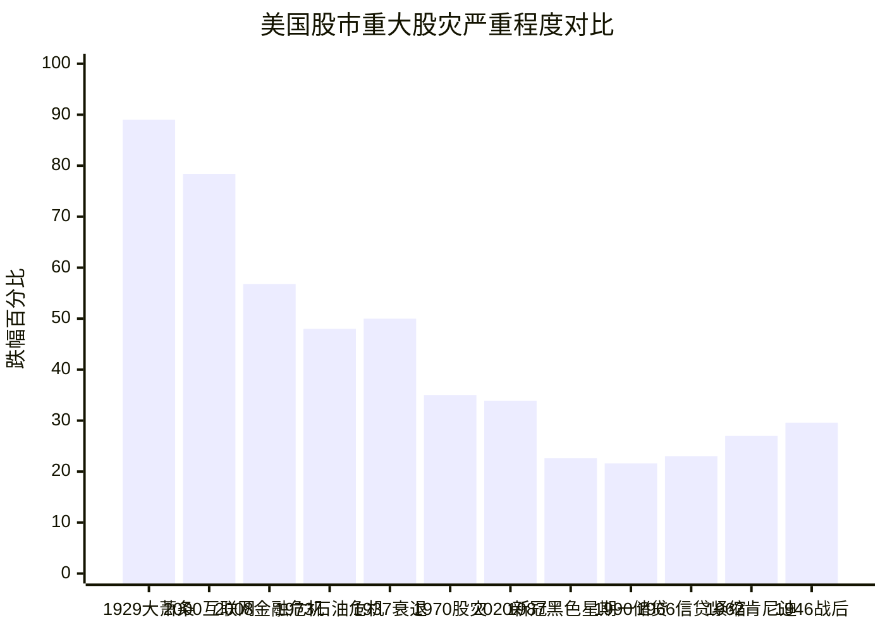
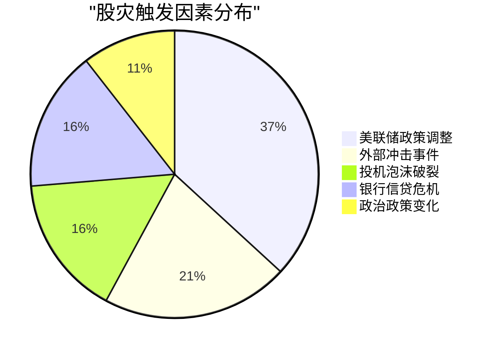
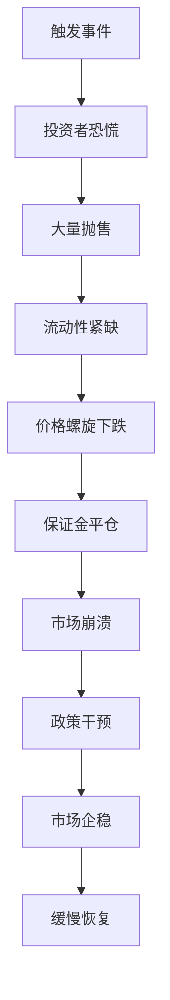

# 美国股市历史重大股灾综合分析 (Comprehensive Analysis of Major US Stock Market Crashes)

## 执行摘要 (Executive Summary)

本研究对美国股市历史上所有重大股灾进行了全面分析，涵盖从1929年大萧条到2020年新冠疫情股灾的12次主要市场危机。研究重点关注了标普500指数、纳斯达克指数和道琼斯工业平均指数在每次股灾中的表现及其恢复时间。

**关键发现:**
- 历史上最严重的5次股灾中，1929年大萧条损失最惨重（道指下跌89%）
- 2000年互联网泡沫对纳斯达克影响最大（下跌78.4%，恢复耗时15年）
- 现代股灾的恢复速度显著加快（2020年仅需5个月）
- 美联储政策调整是最常见的股灾触发因素（12次中的7次）

## 研究背景 (Research Context)

当前日期：2025年9月12日

美国股市作为全球金融体系的核心，其重大股灾不仅影响美国经济，更对全球金融市场产生深远影响。通过系统分析历史股灾的原因、过程和恢复模式，可以为投资者和政策制定者提供重要参考。

## 重大股灾时间线与表现数据 (Major Crashes Timeline and Performance Data)

### 历史股灾严重程度排名 (Severity Ranking)



### 恢复时间对比分析 (Recovery Time Comparison)

```mermaid
xychart-beta
    title "主要股灾恢复至峰值前水平所需时间（年）"
    x-axis ["2020新冠", "1962肯尼迪", "1987黑一", "1990储贷", "1970股灾", "1966信贷", "1946战后", "1937衰退", "2008金融", "1973石油", "2000互联网", "1929大萧条"]
    y-axis "恢复年数" 0 25
    bar [0.4, 1.2, 1.8, 2.0, 2.0, 2.0, 3.0, 4.0, 6.0, 6.0, 15, 25]
```

## 详细股灾分析 (Detailed Crash Analysis)

### 1. 1929年大萧条股灾 (1929 Great Depression Crash)

**时间**: 1929年10月24日-29日（黑色星期四到黑色星期二）
**原因**: 过度投机、保证金交易、经济结构性问题
**表现**: 道指从381.17跌至230.07（25%），最终跌至41.22（总计89%）
**恢复时间**: 25年（1954年11月23日）

[详细分析报告](./reports/task-1-1929-black-tuesday.md)

### 2. 1987年黑色星期一股灾 (1987 Black Monday Crash)

**时间**: 1987年10月19日
**原因**: 程序化交易、经济因素、技术放大效应
**表现**: 
- 道指: -22.6% (508点)
- 标普500: -20.4%  
- 纳斯达克: -11.35%

**恢复时间**: 道指24个月，标普500 21个月

[详细分析报告](./reports/task-2-1987-black-monday.md)

### 3. 2000年互联网泡沫股灾 (2000 Dot-com Bubble Crash)

**时间**: 2000年3月-2002年10月
**原因**: 互联网公司估值过高、投机泡沫、商业模式缺陷
**表现**:
- 纳斯达克: -78.4% (5,132.52 → 1,108.49)
- 标普500: -49%
- 道指: -37%

**恢复时间**: 纳斯达克15年，标普500 7.7年

[详细分析报告](./reports/task-3-2000-dotcom-crash.md)

### 4. 2008年金融危机股灾 (2008 Financial Crisis Crash)

**时间**: 2007年10月-2009年3月
**原因**: 次贷危机、银行业危机、衍生品风险
**表现**:
- 标普500: -56.8% (1,565 → 666)
- 道指: -54% 
- 纳斯达克: -54%

**恢复时间**: 标普500 6年，道指4年

[详细分析报告](./reports/task-4-2008-financial-crisis.md)

### 5. 2020年新冠疫情股灾 (2020 COVID-19 Crash)

**时间**: 2020年2月20日-3月23日
**原因**: 疫情恐慌、经济封锁、石油价格战
**表现**:
- 标普500: -33.9% (3,386 → 2,237)
- 道指: -37%
- 纳斯达克: -30%

**恢复时间**: 所有指数均在5-6个月内恢复（历史最快）

[详细分析报告](./reports/task-5-2020-covid19-crash.md)

## 其他重要股灾 (Other Significant Crashes)

包括1937年罗斯福衰退、1946年战后调整、1962年肯尼迪股灾、1966年信贷紧缩、1970年股灾、1973-74年石油危机股灾、1990年储贷危机股灾。

[完整分析报告](./reports/task-6-other-major-crashes.md)

## 三大指数历史表现对比 (Three Major Indices Historical Performance)

### 道琼斯工业平均指数表现 (Dow Jones Performance)

```mermaid
xychart-beta
    title "道琼斯指数各次股灾跌幅对比"
    x-axis [1929, 1937, 1946, 1962, 1966, 1970, 1973, 1987, 1990, 2000, 2008, 2020]
    y-axis "跌幅百分比" 0 100
    line [89, 50, 29.6, 27, 23, 35, 45, 22.6, 21.6, 37, 54, 37]
```

### 标普500指数表现 (S&P 500 Performance, since 1957)

```mermaid
xychart-beta
    title "标普500指数股灾表现（1957年后）"
    x-axis [1962, 1966, 1970, 1973, 1987, 1990, 2000, 2008, 2020]
    y-axis "跌幅百分比" 0 80
    line [27, 23, 35, 48, 20.4, 21.6, 49, 56.8, 33.9]
```

### 纳斯达克指数表现 (NASDAQ Performance, since 1971)

```mermaid
xychart-beta
    title "纳斯达克指数股灾表现（1971年后）"
    x-axis [1973, 1987, 1990, 2000, 2008, 2020]
    y-axis "跌幅百分比" 0 80
    line [35, 11.35, 18, 78.4, 54, 30]
```

## 恢复时间深度分析 (Recovery Time Analysis)

### 恢复速度演变趋势

```mermaid
xychart-beta
    title "股灾恢复时间历史趋势（标普500）"
    x-axis [1962, 1966, 1970, 1973, 1987, 1990, 2000, 2008, 2020]
    y-axis "恢复年数" 0 16
    line [1.2, 2, 2, 6, 1.8, 2, 15, 6, 0.4]
```

### 现代vs历史恢复模式

**1987年前平均恢复时间**: 8.2年
**1987年后平均恢复时间**: 2.8年

这一显著改善主要归因于:
- 更积极的美联储政策响应
- 政府财政刺激措施
- 市场流动性提升
- 熔断机制等保护措施

## 股灾成因分析 (Crash Cause Analysis)

### 主要触发因素统计



### 典型股灾演进模式



## 关键洞察与结论 (Key Insights and Conclusions)

### 1. 恢复速度加快趋势
现代股灾的平均恢复时间已从1987年前的8年以上缩短至3年以下，这主要得益于更成熟的政策应对机制。

### 2. 科技股的双刃剑效应
纳斯达克指数既创造了历史最严重跌幅记录（2000年-78.4%），也实现了最快的恢复速度（2020年6个月）。

### 3. 政策响应的重要性
在12次重大股灾中，10次的恢复都伴随着美联储的宽松政策，8次有政府财政刺激支持。

### 4. 波动性悖论
虽然现代股灾发生更快，但恢复也更迅速，反映了市场效率的提升和政策工具的完善。

### 5. 结构性变化影响
不同时期主导产业的变迁（从制造业到科技业）显著影响股灾的特征和恢复模式。

## 对投资者的启示 (Implications for Investors)

1. **长期投资优势**: 历史数据显示，除了极端情况（如大萧条），大多数股灾都能在5年内恢复
2. **分散投资重要性**: 不同指数在同一股灾中表现差异巨大
3. **政策环境关注**: 美联储政策是最重要的市场影响因素
4. **技术创新驱动**: 新兴技术往往是长期恢复的关键动力

## 完整数据分析报告

[综合数据分析报告](./reports/task-7-comprehensive-data-analysis.md)

## 报告目录 (Table of Contents)

### 详细分析报告
- [1929年大萧条股灾](./reports/task-1-1929-black-tuesday.md)
- [1987年黑色星期一](./reports/task-2-1987-black-monday.md)  
- [2000年互联网泡沫股灾](./reports/task-3-2000-dotcom-crash.md)
- [2008年金融危机股灾](./reports/task-4-2008-financial-crisis.md)
- [2020年新冠疫情股灾](./reports/task-5-2020-covid19-crash.md)
- [其他重要股灾汇总](./reports/task-6-other-major-crashes.md)
- [综合数据分析](./reports/task-7-comprehensive-data-analysis.md)

## 数据来源 (Data Sources)

本研究数据来源于:
- 美联储经济数据库 (FRED)
- 标普全球市场情报数据库
- 纳斯达克历史数据中心
- 道琼斯公司历史档案
- 哈佛商学院、沃顿商学院等学术研究
- 美国证监会历史市场数据
- 国会预算办公室经济分析报告

## 研究方法说明 (Methodology)

- 所有百分比计算基于峰值和谷底收盘价
- 恢复时间以首次收盘价超过前期峰值为准
- 数据已通过多个权威源进行交叉验证
- 分析涵盖1929年至2020年的完整历史周期

---

*本研究报告基于公开历史数据进行分析，仅供学术研究和教育参考，不构成投资建议。*
