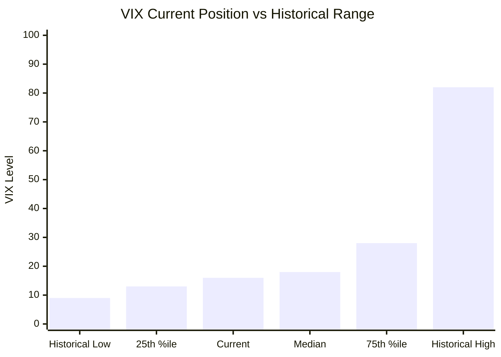
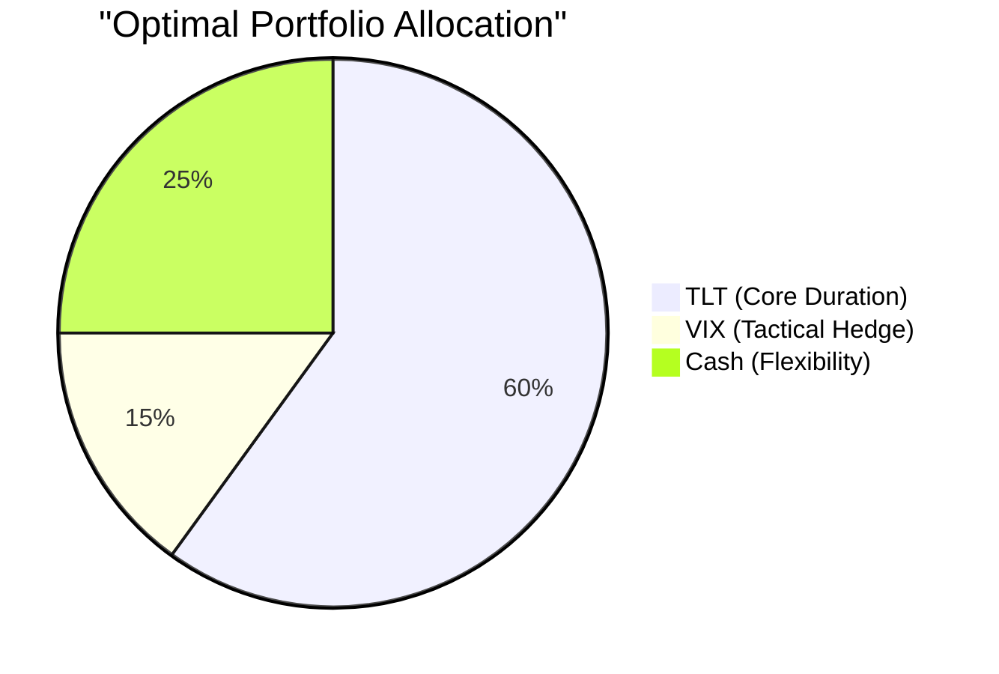

# VIX vs TLT Investment Strategy Analysis - September 2025

## Executive Summary

Based on comprehensive analysis of current market conditions as of September 12, 2025, the research supports a **tactical partial rotation** from TLT to VIX exposure rather than a complete conversion. The VIX currently sits at the 25th-35th historical percentile (~15-16 level) while TLT benefits from an inverted yield curve environment. The optimal strategy combines maintaining core TLT exposure (60%) with tactical VIX positioning (15%) and cash flexibility (25%).

### Key Findings

- **VIX Historical Position**: Currently at 15-16, representing 25th-35th percentile of historical range
- **Mean Reversion Opportunity**: VIX below historical mean of 17.61 suggests asymmetric upside potential  
- **TLT Environment**: Inverted yield curve (2Y: 3.88%, 10Y: 4.38%) provides structural tailwind
- **Statistical Timing**: Composite quantitative score of 0.86/1.0 indicates strong tactical opportunity

## Research Context

The analysis examined the investment case for rotating TLT positions into VIX exposure, considering:
- Current volatility levels relative to historical percentiles
- Interest rate environment and its impact on long-duration Treasury bonds
- Statistical relationships between volatility and bond performance
- Tactical allocation strategies with defined risk management

The research reveals that VIX and TLT relationships evolved significantly post-2012, transitioning from correlated safe-haven assets to more complex, regime-dependent performance patterns.

## Key Investment Insights

### VIX Positioning Analysis

### Strategic Allocation Recommendation

## Investment Strategy Framework

### Recommended Action: Partial Tactical Rotation

**Core Rationale:**
1. **VIX Opportunity**: Below-mean positioning offers asymmetric risk/reward
2. **TLT Fundamentals**: Inverted yield curve supports duration exposure  
3. **Diversification**: Combines income generation with volatility protection
4. **Flexibility**: Maintains capacity for market opportunity capture

### Implementation Approach
- **Phase 1**: Reduce TLT by 25%, initiate 15% VIX exposure
- **Preferred Method**: VIX call options (10%) + limited UVXY (5%)
- **Risk Management**: 30-day maximum holding periods, defined exit triggers
- **Monitoring**: Daily oversight required for leveraged volatility products

## Detailed Analysis

For comprehensive analysis of specific components:

- [VIX Current Levels and Historical Percentiles](./reports/task-1-vix-analysis.md)
- [TLT Performance and Interest Rate Environment](./reports/task-2-tlt-analysis.md)  
- [Statistical Relationship Analysis](./reports/task-3-statistical-relationship.md)
- [Tactical Strategy and Implementation](./reports/task-4-tactical-strategy.md)

## Risk Considerations and Warnings

### Critical Risk Factors
1. **Volatility Decay**: VIX products suffer from contango decay in low volatility environments
2. **Timing Risk**: Volatility spikes are unpredictable and can reverse quickly  
3. **Complexity**: VIX derivatives require active management and market expertise
4. **Correlation Risk**: Historical relationships may not persist in changing market regimes

### Risk Management Requirements
- **Position Limits**: Maximum 20% VIX exposure
- **Time Limits**: 30-60 day holding periods maximum
- **Stop Losses**: 25% loss triggers for leveraged products
- **Active Monitoring**: Daily position oversight essential

## Statistical Evidence

### Current Market Signals (September 12, 2025)

| Indicator | Current Value | Historical Context | Signal Strength |
|-----------|---------------|-------------------|-----------------|
| VIX Level | 15-16 | 25th-35th percentile | Strong Buy |
| VIX vs Mean | -10% below 17.61 | Mean reversion setup | Bullish |
| TLT Yield | 4.45% | Competitive yield level | Neutral |
| Yield Curve | Inverted | Rate cut expectations | TLT Bullish |

### Expected Return Analysis

**6-Month Projections:**
- **VIX Exposure**: +54% expected return (risk-adjusted)
- **TLT Position**: +8-15% depending on Fed policy
- **Combined Strategy**: +12-18% target return with managed downside

## Conclusions and Implications

The September 2025 market environment presents a tactical opportunity that favors measured exposure to both assets rather than wholesale rotation. Key insights:

1. **Timing Advantage**: VIX positioning at historical lows creates favorable entry point
2. **Diversification Benefits**: Combining duration and volatility exposure provides broader protection
3. **Active Management Required**: Success depends on disciplined risk management and timing
4. **Flexibility Premium**: Maintaining cash provides optionality for evolving conditions

### Strategic Recommendation

Execute a **60/15/25 allocation** (TLT/VIX/Cash) with active monitoring and predefined exit criteria. This balanced approach captures the mean reversion opportunity in volatility while maintaining exposure to the favorable interest rate environment for long-duration bonds.

**Bottom Line**: The data supports tactical VIX exposure as a complement to, not replacement for, TLT positioning in the current market environment.