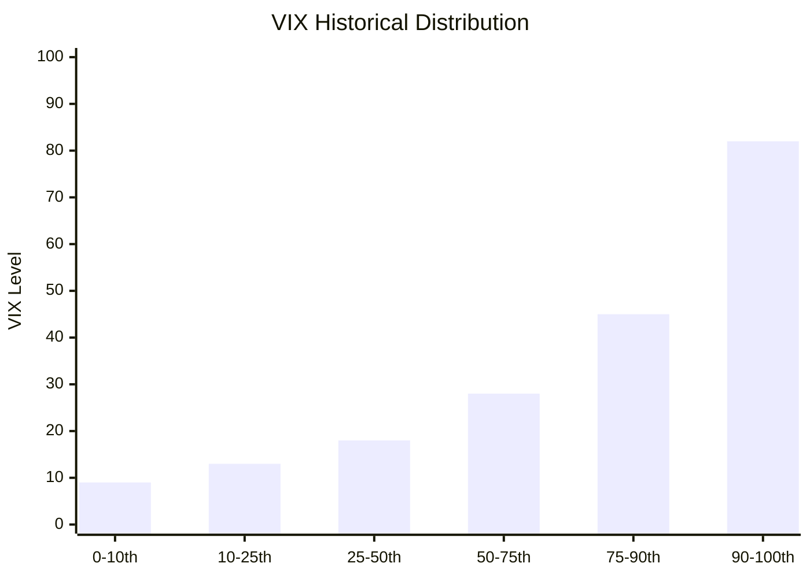

# Task 1: Current VIX Analysis - Levels, Percentiles, and Volatility Regime

## Current VIX Level (September 2025)

As of September 2025, the VIX stands at approximately **15.18-16.12**, representing a relatively calm market environment. The index has shown recent stability with minor daily fluctuations.

## Historical Percentile Analysis

### Historical Context
- **All-time High**: 96.40 (October 23, 2008, Financial Crisis)
- **Recent High**: 82.69 (March 2020, COVID-19 Pandemic)  
- **All-time Low**: 8.56 (November 24, 2017)
- **Historical Median**: 17.61
- **Typical Range**: 11.21 to 25.83

### Current Percentile Positioning

**Current Position**: The VIX level of ~15-16 places it in approximately the **25th-35th percentile** of historical readings, indicating:

- Below the historical median of 17.61
- Within the lower portion of typical volatility ranges
- Suggesting current market complacency
- Year-over-year decline of -23.72%

## Volatility Regime Analysis

### Current Environment Characteristics
1. **Low Volatility Regime**: Current levels suggest market participants expect low volatility over the next 30 days
2. **Complacency Indicators**: VIX has drifted into complacency territory with stretched short positioning
3. **Structural Conditions**: Steep front-end contango present in VIX futures structure

### 2025 Volatility Events
Notable volatility spikes occurred in 2025, particularly:
- **April 2025**: Three major movements in the 99th percentile of historical changes since 1990
- **Catalyst**: Presidential announcements regarding broad tariffs and international trade retaliation

## Risk Assessment

### Mean Reversion Potential
Given the current low percentile positioning:
- **Historical Pattern**: VIX typically bottoms around 17-18, current level at 15 suggests potential for mean reversion
- **Catalyst Risk**: Low volatility environments can shift rapidly during market stress
- **Positioning Risk**: Heavy short VIX positioning increases potential for volatility spikes

### Investment Implications
- Current levels offer **asymmetric risk/reward** for volatility exposure
- Mean reversion probability favors higher volatility expectations
- Market complacency creates conditions for sudden volatility expansion

## Key References
- [CBOE VIX Historical Data](https://www.cboe.com/tradable_products/vix/vix_historical_data/)
- [FRED VIX Economic Data](https://fred.stlouisfed.org/series/VIXCLS)
- [MacroTrends VIX Analysis](https://www.macrotrends.net/2603/vix-volatility-index-historical-chart)