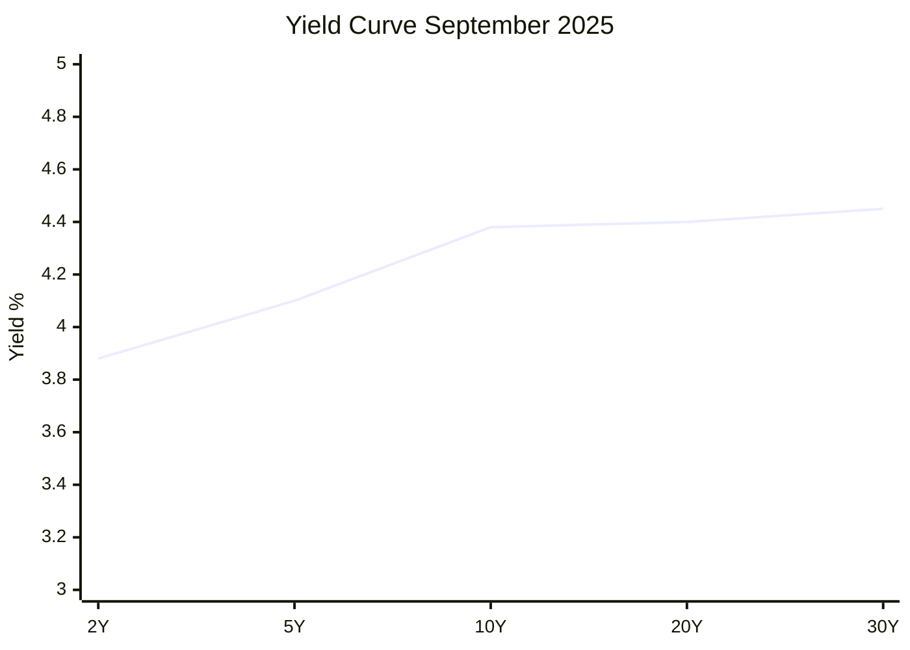

# Task 2: TLT Performance and Interest Rate Environment Analysis

## Current TLT Performance (September 2025)

### Key Performance Metrics
- **Current Price**: $89.74 USD  
- **Daily Change**: +0.70%
- **Net Asset Value**: $89.70
- **Monthly Return**: +3.21%
- **Year-to-Date Total Return**: 5.78%
- **Current Yield**: 4.45%
- **Dividend Yield**: 3.75%
- **Assets Under Management**: $48.70 billion

## Interest Rate Environment

### Current Yield Curve Structure
- **10-Year Treasury Yield**: 4.38% (as of July 2025)
- **2-Year Treasury Yield**: 3.88%
- **Yield Curve Status**: **Inverted** (long-term rates below short-term rates)

### Inverted Yield Curve Implications
The current inverted yield curve structure suggests:
- **Market Expectations**: Investors anticipate declining long-term interest rates
- **Economic Outlook**: Potential economic slowdown concerns
- **Fed Policy**: Markets pricing in future rate cuts
- **Duration Risk**: Long-term bonds positioned for potential capital appreciation

## TLT Historical Performance Context

### Fund Characteristics
- **Investment Objective**: Track U.S. Treasury bonds with maturities >20 years
- **Duration Risk**: High sensitivity to interest rate changes
- **Credit Risk**: Minimal (backed by U.S. government)
- **Correlation**: Typically inverse to equity markets during stress periods

### Rate Sensitivity Analysis
TLT exhibits high duration risk:
- **1% Rate Decline**: Approximately 15-18% price appreciation
- **1% Rate Increase**: Approximately 15-18% price decline
- **Current Position**: Inverted curve provides tailwind for long-duration bonds

## Market Environment Assessment

### Favorable Conditions for TLT
1. **Inverted Yield Curve**: Long rates below short rates favor duration exposure
2. **Economic Uncertainty**: Potential recession fears support flight-to-quality
3. **Fed Policy Expectations**: Market anticipating rate cuts supports bond prices
4. **Inflation Trends**: Moderating inflation supports real returns

### Risk Factors
1. **Duration Risk**: High sensitivity to rate changes
2. **Inflation Risk**: Unexpected inflation surge could pressure bonds
3. **Liquidity Risk**: Potential for rapid rate moves affecting long-duration assets
4. **Policy Risk**: Fed policy changes could reverse favorable trends

## TLT vs Equity Market Relationship

### Safe Haven Dynamics
- **Traditional Role**: Flight-to-quality during equity market stress
- **2022 Experience**: Both TLT and equities declined during aggressive Fed tightening
- **Current Environment**: Inverted curve may restore traditional safe-haven properties

### Portfolio Diversification Benefits
- **Negative Correlation**: Historically inverse to equities during stress periods
- **Risk Mitigation**: Provides hedge against equity market volatility
- **Income Generation**: Current yield of 4.45% provides steady income stream

## Strategic Positioning Assessment

### Current Attractiveness
1. **Yield Environment**: 4.45% yield competitive with historical standards
2. **Technical Setup**: Inverted curve suggests potential for capital appreciation
3. **Risk-Reward**: Favorable positioning for rate decline scenario
4. **Diversification**: Strong portfolio diversification benefits

### Timing Considerations
- **Rate Cycle**: Appears near peak of tightening cycle
- **Economic Data**: Slowing indicators support bond outlook
- **Market Positioning**: Institutional flows favoring long-duration exposure

## Key References
- [iShares TLT Fund Information](https://www.ishares.com/us/products/239454/ishares-20-year-treasury-bond-etf)
- [Treasury Yield Curve Data](https://home.treasury.gov/resource-center/data-chart-center/interest-rates)
- [Federal Reserve Economic Data](https://fred.stlouisfed.org/series/DGS10)