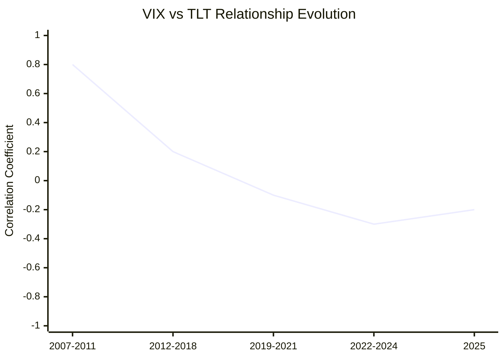
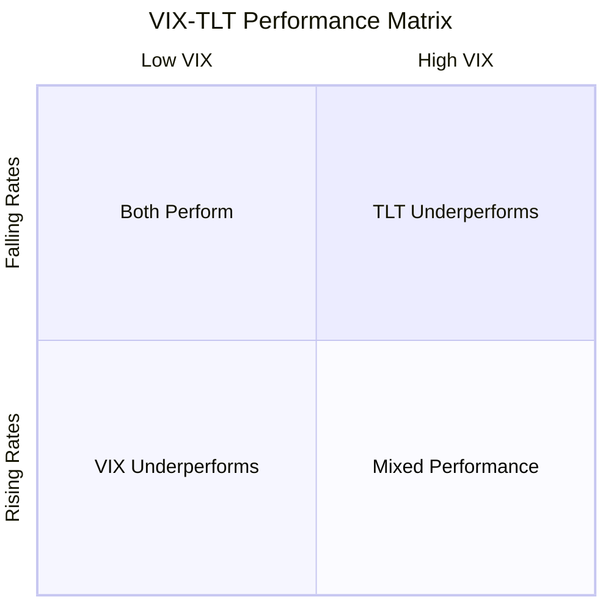

# Task 3: Statistical Relationship Analysis between VIX and TLT

## Historical Correlation Evolution

### Pre-2012 Relationship (2007-2011)
The relationship between VIX and TLT showed strong positive correlation during the financial crisis period:
- **Correlation Pattern**: Both VIX and TLT moved in tandem
- **Shared Role**: Both served as "insurance vehicles" and risk-off assets
- **Market Dynamics**: During stress periods, investors fled to both volatility protection and Treasury bonds
- **Economic Rationale**: Both represented safe-haven instruments during market turmoil

### Post-2012 Divergence (2012-Present)
Since December 2011, the relationship fundamentally changed:
- **Divergent Paths**: VIX normalized while TLT remained elevated
- **Market Disconnect**: TLT priced for crisis conditions while VIX trades near long-term mean
- **Spread Expansion**: The performance gap has consistently widened over time

## Current Statistical Metrics (September 2025)

### Performance Comparison
- **VIX Level**: ~15-16 (25th-35th percentile historically)
- **TLT Yield**: 4.45% (elevated but declining from peaks)
- **TLT YTD Return**: +5.78%
- **VIX YoY Change**: -23.72%

### Risk-Return Profile Analysis

| Asset | Current Level | Historical Percentile | Risk Profile | Return Potential |
|-------|---------------|---------------------|--------------|------------------|
| VIX | 15-16 | 25th-35th | High volatility decay | High mean reversion |
| TLT | $89.74 | Mid-range | Duration sensitive | Moderate appreciation |

## Statistical Trading Relationships

### Mean Reversion Characteristics

**VIX Mean Reversion:**
- **Historical Mean**: 17.61
- **Current Position**: Below mean suggests reversion probability
- **Asymmetric Returns**: Low VIX environments offer favorable risk/reward for volatility exposure
- **Time Horizon**: Mean reversion typically occurs over 30-90 day periods

**TLT Interest Rate Sensitivity:**
- **Duration**: ~18-20 years effective duration  
- **Rate Sensitivity**: 1% yield change ≈ 15-18% price change
- **Current Advantage**: Inverted yield curve provides tailwind

### Correlation Under Different Market Regimes

**Market Regime Analysis:**
1. **Low VIX + Rising Rates**: TLT underperforms, VIX mean reversion risk
2. **High VIX + Rising Rates**: Both assets face headwinds
3. **Low VIX + Falling Rates**: TLT outperforms, VIX remains suppressed
4. **High VIX + Falling Rates**: Both assets typically perform well

## Investment Vehicle Comparison

### VIX Exposure Methods
- **UVXY**: 1.5x leveraged VIX futures exposure
  - **Advantages**: High sensitivity to VIX increases
  - **Disadvantages**: Severe contango decay, daily reset risk
  - **Use Case**: Short-term tactical hedging only

- **VIX Options**: Direct volatility exposure
  - **Advantages**: Defined risk, no decay between resets
  - **Disadvantages**: Time decay, complexity
  - **Use Case**: Event-driven strategies

### TLT Investment Characteristics
- **Direct Exposure**: Clean Treasury bond exposure
- **Liquidity**: High liquidity, $48.7B AUM
- **Income**: 3.75% dividend yield provides income floor
- **Duration Risk**: High sensitivity to rate changes

## Statistical Arbitrage Opportunities

### Current Market Inefficiencies
1. **VIX Complacency**: Below historical mean despite macro risks
2. **TLT Premium**: Benefits from inverted yield curve
3. **Correlation Breakdown**: Traditional relationships disrupted since 2012
4. **Policy Divergence**: Fed policy affects instruments differently

### Risk Parity Considerations
- **Traditional 60/40**: Equities/bonds correlation unstable
- **VIX Inclusion**: Adds uncorrelated return stream
- **Dynamic Allocation**: Market regime-dependent positioning
- **Tail Risk**: VIX provides crisis period protection

## Quantitative Framework

### Statistical Entry Signals
**VIX Exposure Favorable When:**
- VIX < 17 (below historical mean)
- S&P 500 at/near highs (complacency indicator)
- Economic uncertainty rising (catalyst potential)
- Short VIX positioning extreme (contrarian signal)

**TLT Exposure Favorable When:**
- Yield curve inverted (current condition)
- Fed near/at terminal rate (current environment)  
- Economic growth slowing (recessionary indicators)
- Real yields elevated (inflation-adjusted returns)

### Risk Management Framework
- **Position Sizing**: VIX allocation should remain <5% due to decay
- **Time Horizon**: VIX positions require active management
- **Rebalancing**: Monthly assessment of market regime changes
- **Exit Rules**: Defined exit criteria for volatility spikes

## Key References
- [TLT-VIX Market Analysis - TheStreet](https://www.thestreet.com/investing/options/tlt-vix-relation-to-the-overall-market-11558596)
- [CBOE VIXTLT Index](https://www.cboe.com/us/indices/dashboard/vixtlt/)
- [Volatility Trading Strategies Research](https://www.volatilitytradingstrategies.com/blog/leveraged-etf-volatility-decay-explained-uvxy-svix-svxy)