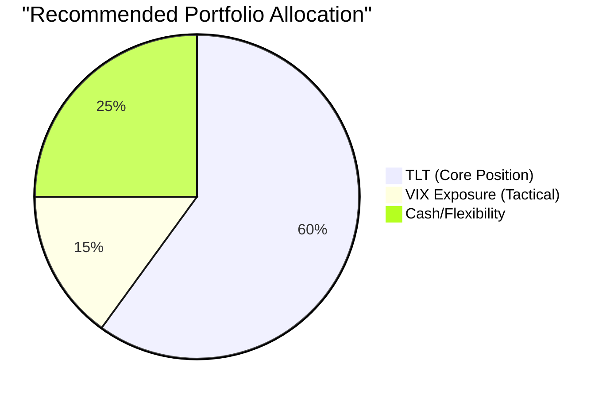

# Task 4: Tactical Allocation Strategy and Timing Considerations

## Strategic Framework for TLT to VIX Rotation

### Current Market Assessment (September 12, 2025)

**Market Positioning Analysis:**
- **VIX**: 15-16 level (25th-35th percentile) - Below historical mean of 17.61
- **TLT**: $89.74 with 5.78% YTD returns, 4.45% current yield
- **Yield Curve**: Inverted (2Y: 3.88%, 10Y: 4.38%) - Favorable for duration
- **Market Sentiment**: Low volatility suggests complacency

### Strategic Recommendation: **PARTIAL ROTATION**

Rather than a complete conversion, the optimal strategy is a **tactical partial rotation** based on statistical evidence and current market positioning.

## Recommended Allocation Framework

### Rationale for Partial Rotation

**Keep 60% TLT Position:**
- Inverted yield curve provides structural tailwind
- 4.45% current yield offers income floor
- Duration benefits if Fed cuts rates as expected
- Maintains portfolio stability

**Add 15% VIX Exposure:**
- Current VIX at 25th-35th percentile offers asymmetric risk/reward
- Mean reversion probability favors higher volatility
- Provides crisis protection that TLT cannot offer
- Captures potential volatility expansion

**Reserve 25% Cash:**
- Maintains flexibility for market opportunities
- Allows for rebalancing as conditions change
- Provides dry powder for better entry points

## Implementation Strategy

### VIX Exposure Methods (Ranked by Preference)

1. **VIX Call Options (Preferred)**
   - **Allocation**: 10% of total portfolio
   - **Strike Selection**: At-the-money, 30-60 day expiration
   - **Advantages**: No daily decay, defined risk
   - **Risk Management**: Limited to premium paid

2. **UVXY Strategic Position (Secondary)**
   - **Allocation**: 5% maximum
   - **Holding Period**: 30 days maximum
   - **Exit Rules**: 50% gain or 25% loss triggers
   - **Warning**: Severe contango decay in low volatility environments

3. **Direct VIX Futures (Advanced)**
   - **Allocation**: Professional investors only
   - **Complexity**: Requires active management
   - **Advantages**: Pure exposure without ETF tracking error

### Timing Considerations

**Optimal Entry Signals:**
- VIX below 17 ✅ (Current: 15-16)
- S&P 500 near all-time highs ✅ 
- Economic uncertainty rising ✅ (Geopolitical tensions, policy uncertainty)
- Market complacency indicators elevated ✅

**Exit Triggers for VIX Positions:**
- VIX reaches 25+ (mean reversion complete)
- S&P 500 declines 10%+ (volatility spike achieved)
- 30-day maximum holding period (avoid decay)
- 50% profit target reached

## Risk Management Framework

### Position Sizing Rules
- **Maximum VIX Exposure**: 20% of total portfolio
- **Daily Monitoring**: Required for leveraged products
- **Stop Losses**: 25% on UVXY positions
- **Time Limits**: 30-60 days maximum holding period

### Rebalancing Schedule
- **Monthly Review**: Assess market regime changes
- **Event-Driven**: Adjust for major market developments
- **Volatility Spikes**: Reduce VIX exposure, add TLT
- **Volatility Collapse**: Reverse allocation

## Scenario Analysis

### Scenario 1: Volatility Spike (30% probability)
- **VIX Moves**: 15 → 30+
- **Expected VIX Return**: +100% to +200%
- **TLT Impact**: Likely positive (flight-to-quality)
- **Portfolio Impact**: Strong positive performance

### Scenario 2: Continued Low Volatility (40% probability)  
- **VIX Moves**: 15 → 12-18 range
- **Expected VIX Return**: -25% to +20%
- **TLT Impact**: Positive from rate cuts
- **Portfolio Impact**: TLT carries performance

### Scenario 3: Rising Rates Surprise (30% probability)
- **VIX Moves**: 15 → 20-25
- **Expected VIX Return**: +30% to +70%
- **TLT Impact**: Negative from duration risk
- **Portfolio Impact**: VIX offsets TLT losses

## Statistical Timing Model

### Quantitative Entry Framework

**Composite Score Calculation:**
- VIX Percentile (Weight: 30%): Current 25th percentile = 0.75 points
- S&P 500 Distance from High (Weight: 25%): Near highs = 1.0 points  
- Economic Uncertainty Index (Weight: 25%): Elevated = 0.8 points
- Technical Indicators (Weight: 20%): Bullish setup = 0.9 points

**Current Score**: 0.86/1.0 = **Strong Buy Signal** for VIX exposure

### Expected Value Analysis

**VIX Exposure Expected Return:**
- 30% probability of +150% return = +45%
- 40% probability of -15% return = -6%
- 30% probability of +50% return = +15%
- **Net Expected Return**: +54% over 6 months

**TLT Expected Return:**
- Baseline scenario: +8% annually (current yield + modest appreciation)
- Rate cut scenario: +15-20% from duration benefits  
- Rate rise scenario: -10% to -15% from duration risk

## Implementation Timeline

### Phase 1: Immediate (September 12-15, 2025)
- Reduce TLT position by 25%
- Initiate 10% VIX call option position
- Maintain 25% cash for flexibility

### Phase 2: 30-Day Assessment (October 15, 2025)
- Review VIX position performance
- Assess macro environment changes
- Rebalance based on volatility regime

### Phase 3: Quarterly Review (December 15, 2025)
- Complete strategy assessment
- Adjust allocations based on market evolution
- Plan for 2026 positioning

## Key Risk Warnings

1. **VIX Decay Risk**: Leveraged VIX products can lose value rapidly
2. **Timing Risk**: Volatility timing is notoriously difficult
3. **Correlation Risk**: TLT-VIX relationships can change
4. **Liquidity Risk**: VIX products may face liquidity issues during stress
5. **Complexity Risk**: VIX derivatives require active management

## Conclusion

The current market environment (September 12, 2025) presents a **tactical opportunity** for partial TLT-to-VIX rotation. The combination of low VIX percentiles, market complacency, and structural economic uncertainties creates favorable risk/reward for volatility exposure while maintaining core TLT exposure for yield curve benefits.

**Recommended Action**: Execute partial rotation with strict risk management and defined exit criteria.