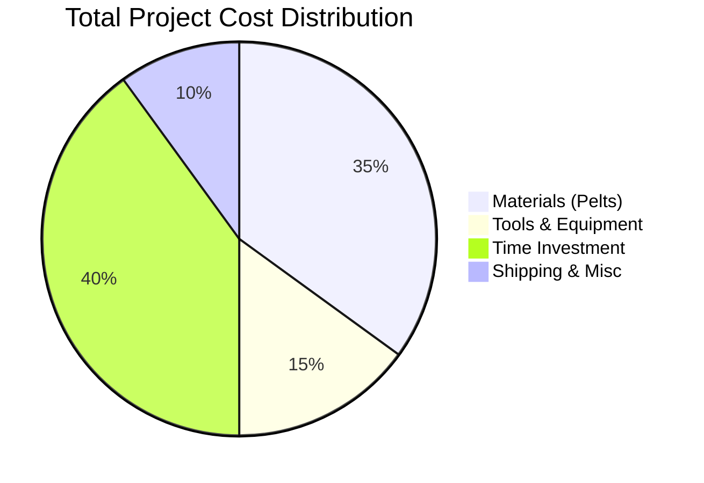

# 海豹皮女士马甲制作成本分析 
## Seal Skin Women's Vest Manufacturing Cost Analysis

## Executive Summary

Making a seal skin women's vest yourself involves a **total investment of $1,000-$3,200** including materials, tools, and time valuation. The project requires **30-70 hours** of work depending on skill level, with hand-stitching being the most time-intensive component. **Critical legal considerations apply** - seal products are prohibited in many markets including the US, EU, Mexico, and Taiwan.

### Key Cost Breakdown


## Research Context

The user inquiry focused on understanding the complete cost structure for **self-manufacturing a women's one-size seal skin vest** (女士均码马甲). This analysis addresses material procurement, manufacturing requirements, tool investments, labor time, and regulatory compliance necessary for the project.

## Key Findings

### 1. Material Costs: $355-$930
**Seal Pelt Requirements:**
- **Quantity needed**: 2-4 pelts (22-38 square feet coverage)
- **Commercial grade**: $150-$199 per pelt
- **Premium grade**: $215+ per pelt
- **Total material cost**: $300-$800 for pelts, plus shipping/taxes

**Quality Considerations:**
- **Harp seals**: Most available, "silk seal" texture
- **Ringed seals**: Traditional pattern, cultural significance
- **Waste factor**: 30% additional material recommended

### 2. Tool Investment: $200-$800
**Essential Equipment Levels:**

| Tool Category | Basic Kit | Professional Kit |
|---------------|-----------|------------------|
| Cutting tools | $50-70 | $100-150 |
| Hand stitching | $110-150 | $200-400 |
| Hardware installation | $75-100 | $150-250 |
| Finishing tools | $25-50 | $100-150 |
| **Total Investment** | **$260-370** | **$550-950** |

### 3. Time Investment: 30-70 Hours
**By Skill Level:**

```mermaid
bar
    title "Time Investment by Skill Level"
    x-axis [Beginner, Intermediate, Advanced]
    y-axis "Hours" 0 80
    "Total Hours" [65, 38, 23]
    "Hand Stitching" [35, 22, 14]
    "Other Tasks" [30, 16, 9]
```

- **Beginner**: 54-74 hours ($810-$2,960 time value)
- **Intermediate**: 33-43 hours ($495-$1,720 time value)  
- **Advanced**: 19-27 hours ($285-$1,080 time value)

### 4. Legal Compliance: Major Restrictions
**Prohibited Markets:**
- **United States**: Marine Mammal Protection Act - complete import ban
- **European Union**: EU Seal Products Regulation
- **Mexico, Taiwan**: Import restrictions in place

**Legal Markets:**
- **Canada**: Fully legal with regulated industry
- **Norway, Greenland**: Sustainable harvest programs
- **Selected Asian markets**: Limited availability

## Detailed Analysis

### Manufacturing Process Overview
The vest construction follows traditional leather crafting techniques:

1. **Pattern preparation and material layout** (4-8 hours)
2. **Cutting and edge preparation** (4-6 hours)
3. **Hand stitching using saddle stitch technique** (20-40 hours)
4. **Hardware installation and finishing** (4-8 hours)

For detailed manufacturing steps, see [Task 2 Report](./reports/task-2-vest-manufacturing-process.md).

### Cost-Benefit Analysis Compared to Commercial Options

| Option | Cost Range | Quality | Customization | Legal Risk |
|--------|------------|---------|---------------|------------|
| **DIY Seal Skin** | $1,000-$3,200 | Variable | Complete | High* |
| **Commercial Seal Vest** | $1,500-$3,000+ | Professional | Limited | High* |
| **Legal Leather Alternatives** | $400-$1,200 | Good-Excellent | High | None |

*Legal risk applies in prohibited markets (US, EU, etc.)

### Regional Recommendations

#### For Canadian Residents ✅
- **Recommended approach**: Purchase from established suppliers
- **Cost estimate**: $1,200-$2,000 total project cost
- **Timeline**: 4-8 weeks including material sourcing
- **Legal status**: Fully compliant with regulations

#### For US/EU Residents ⚠️
- **Alternative materials**: Sheepskin, rabbit fur, synthetic alternatives
- **Cost savings**: 40-80% less expensive
- **Legal compliance**: Complete legal safety
- **Recommendation**: Focus on skill development with legal materials

### Long-term Value Proposition

**Skill Development Benefits:**
- Transferable leather crafting expertise
- Tool investment for future projects
- Understanding of traditional construction techniques
- Repair and modification capabilities

**Economic Considerations:**
- **Break-even vs. commercial**: Competitive if valuing time at <$30/hour
- **Unique product**: Custom fit and design not available commercially
- **Heirloom potential**: High-quality construction with proper care

## Conclusions and Implications

### Primary Cost Drivers
1. **Legal compliance location** - Determines material accessibility
2. **Skill level** - Dramatically affects time investment
3. **Quality expectations** - Influences material and tool choices
4. **Market location** - Affects shipping and availability

### Strategic Recommendations

#### Highest Value Approach
For residents in legal markets (Canada, Norway):
- Start with commercial-grade materials ($600-800)
- Invest in mid-range tools ($400-500)
- Plan for 40-60 hour time investment
- **Total project cost**: $1,500-2,000

#### Alternative Approach  
For restricted markets or beginners:
- Practice with legal leather alternatives
- Develop skills before investing in premium materials
- Consider commissioned work from legal jurisdictions
- **Focus on**: Skill development and technique mastery

### Risk Mitigation
- **Legal compliance**: Verify local regulations before purchase
- **Skill development**: Practice on sample materials first
- **Tool investment**: Start basic, upgrade gradually
- **Documentation**: Maintain complete supply chain records

## Table of Contents - Detailed Reports

- [Task 1: Seal Skin Material Costs and Sourcing](./reports/task-1-seal-skin-materials-costs.md)
- [Task 2: Vest Manufacturing Process and Requirements](./reports/task-2-vest-manufacturing-process.md)  
- [Task 3: Tools and Equipment Needed](./reports/task-3-tools-equipment-costs.md)
- [Task 4: Labor Time Estimates and Skill Requirements](./reports/task-4-labor-time-requirements.md)
- [Task 5: Legal and Regulatory Considerations](./reports/task-5-legal-regulatory-considerations.md)

---

**研究完成时间**: 2024年分析  
**Research Completion**: 2024 Analysis  
**免责声明**: 本分析仅供教育和信息目的。请在采购前核实当地法规。  
**Disclaimer**: This analysis is for educational and informational purposes only. Verify local regulations before procurement.