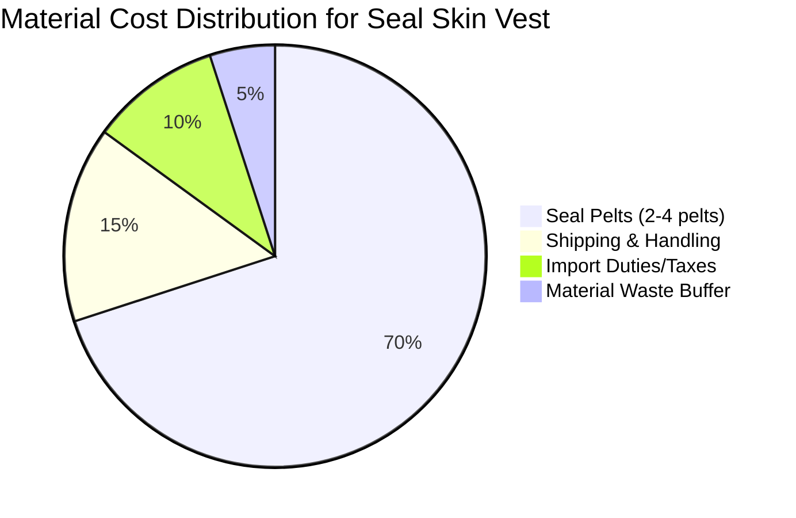

# Task 1: Seal Skin Material Costs and Sourcing

## Material Pricing Overview

### Commercial Grade Seal Pelts
- **Commercial quality harp seal skins**: $150-$199 per pelt (Grade #3-#5)
- **Premium natural harp seal skins**: Starting at $215 for medium size
- **Size availability**: M, L, XL, XXL, Jumbo, Super Jumbo

### Pelt Size Specifications
- **Young Harp Seal pelts**: 36"-48" L x 24"-36" W
- **Coverage area**: Approximately 6-12 square feet per pelt
- **Material needed for vest**: 22-38 square feet (requiring 2-4 pelts)

### Material Quality Considerations
- **Commercial grade**: May have scar marks, uneven edges, and holes
- **Premium grade**: Higher quality with fewer imperfections
- **Natural variations**: Each pelt has unique markings and coloration

## Types of Seal Skin Available

### Harp Seals
- **Appearance**: Light silvery colors with black marks
- **Texture**: Known as "silk seal" - glossy, soft, shines like silk
- **Availability**: Most abundant on the market
- **Best for**: High-end garments, smooth finish

### Ringed Seals
- **Appearance**: Black spots ringed with light marks on back
- **Origin**: Associated with Nunavut, Northwest Territories, Greenland
- **Characteristics**: Traditional pattern preferred for cultural garments

## Global Sourcing Information

### Primary Export Countries
- Canada
- Greenland  
- Norway
- Russia
- Namibia

**Global market value**: Over CA$16 million in 2006 exports

### Canadian Market Specifics
- Well-regulated harvest under strict government oversight
- Legal throughout Canada
- Quality suppliers include Bill Worb Furs Inc., Levinsky Furs, Canadian Seal Products

## Cost Breakdown for Women's Vest

### Estimated Material Costs
| Component | Low Estimate | High Estimate |
|-----------|-------------|---------------|
| Seal Pelts (2-4 pieces) | $300 | $800 |
| Shipping | $25 | $50 |
| Taxes/Duties | $30 | $80 |
| **Total Material Cost** | **$355** | **$930** |

## Legal and Import Restrictions

### Prohibited Markets
- **United States**: Marine Mammal Act forbids imports
- **European Union**: Import restrictions in place
- **Mexico**: Import restrictions
- **Taiwan**: Import restrictions

### Legal Markets
- **Canada**: Fully legal with regulated harvest
- **Other regions**: Check local regulations before importing

## Material Properties and Advantages

### Performance Characteristics
- **Waterproof**: Natural oils provide water resistance
- **Durability**: Known for strength and long-lasting wear
- **Insulation**: Excellent thermal properties for cold weather
- **Flexibility**: Suitable for garment construction

### Processing State
- Available as raw pelts requiring tanning
- Some suppliers offer pre-tanned and finished skins
- Additional processing costs may apply

## References

[1] [Commercial Quality Harp Seal Skins – Bill Worb Furs Inc.](https://billworbfurs.com/products/natural-sealskins-seal-skins-fur-rugs)
[2] [Natural Harp Seal Fur Skins](https://billworbfurs.com/products/harp-seal-natural-skins-fur-rugs)  
[3] [Seal Fur & Leather: Pelts | Canadian Seal Product](https://canadiansealproducts.com/products/seal-textiles/seal-pelts)
[4] [Seal Fur & Seal Skin Leather - Proudly Indigenous Crafts](https://proudlyindigenouscrafts.com/seal-fur-seal-skin-leather/)
[5] [SEAL SKIN – Levinskyfurs](https://levinskyfurs.com/collections/seal-skin)