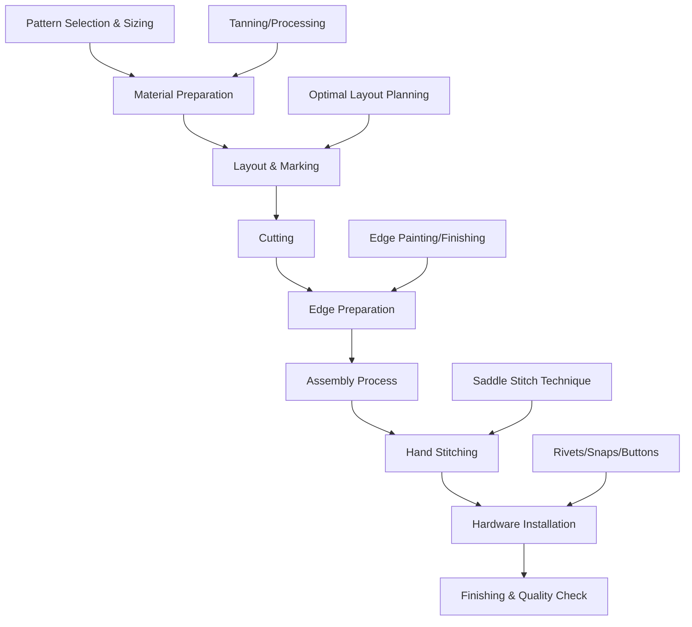

# Task 2: Vest Manufacturing Process and Material Requirements

## Material Requirements for Women's Vest

### Fabric Calculations
- **Leather needed**: 22-38 square feet depending on design complexity
- **Conversion**: Approximately 1.2-2.1 fabric yards equivalent
- **Waste factor**: 30% additional material recommended for natural hide variations
- **Pattern efficiency**: Only ~64% of stated hide area is usable for cutting

### Pattern Piece Breakdown
For a medium/size 10 women's vest:
- **Vest front**: 26"×16" (2 pieces required)  
- **Vest back**: 26"×20" (1 piece)
- **Flaps/details**: 14"×9" (4 pieces)
- **Facings**: Various smaller pieces
- **Lining**: Additional fabric if lined vest desired

## Manufacturing Process Overview

### Step-by-Step Manufacturing Process

#### 1. Pattern Preparation
- Select appropriate vest pattern for desired fit
- Adjust pattern pieces for leather thickness considerations
- Account for stretch characteristics of seal skin

#### 2. Material Preparation  
- **Tanning**: Raw pelts must be properly tanned if not pre-processed
- **Conditioning**: Leather conditioning to ensure flexibility
- **Quality inspection**: Check for defects, scars, or weak areas
- **Color matching**: Ensure consistent appearance across pelts

#### 3. Layout and Cutting
- **Strategic placement**: Position pattern pieces to avoid natural defects
- **Grain direction**: Align pieces with natural grain for strength
- **Waste minimization**: Efficient layout to maximize material usage
- **Cutting tools**: Sharp utility knives and trim knives required

#### 4. Edge Preparation
- **Edge finishing**: Raw edges require painting or treatment
- **Beveling**: May be needed for cleaner appearance
- **Hole preparation**: Pre-punching for stitching locations

#### 5. Assembly Methods

##### Machine Sewing Considerations
- **Needle requirements**: Leather point needles (size 12/80 to 200/25)
- **Thread selection**: Heavy duty polyester or polyester-wrapped core
- **Stitch length**: Longer stitches (3-4mm) for leather
- **Seam types**: French seams, flat-fell seams for durability

##### Hand Sewing Process  
- **Saddle stitch**: Most durable hand-sewing technique for leather
- **Tools needed**: Stitching awl, harness needles, waxed thread
- **Technique**: Two needles passing through same hole from opposite sides
- **Stitch density**: 6-8 stitches per inch typical for garments

## Technical Specifications

### Seam Construction
| Seam Type | Use Case | Durability Rating | Difficulty Level |
|-----------|----------|-------------------|------------------|
| Saddle Stitch | Premium hand-sewn | Excellent | Advanced |
| Machine Straight | Basic construction | Good | Beginner |
| French Seam | Enclosed edges | Very Good | Intermediate |
| Flat-fell | High stress areas | Excellent | Intermediate |

### Hardware Requirements
- **Closures**: Buttons, snaps, or zippers rated for leather weight
- **Reinforcement**: Rivets for high-stress attachment points  
- **Thread**: Waxed polyester or nylon, 92-138 weight
- **Interfacing**: May be needed for button/snap areas

## Quality Control Considerations

### Critical Check Points
1. **Pattern alignment**: Ensure symmetrical appearance
2. **Stitch integrity**: Consistent tension and spacing
3. **Edge finishing**: Proper sealing of raw edges
4. **Hardware security**: All fasteners properly installed
5. **Final inspection**: Overall fit and finish quality

### Common Challenges with Seal Skin
- **Variable thickness**: Natural variation requires adjustment
- **Oil content**: May affect thread adhesion and dyeing
- **Stretch properties**: Different from standard leather
- **Pattern matching**: Natural markings may need coordination

## Time Estimation Breakdown

```mermaid
gantt
    title Vest Manufacturing Timeline
    dateFormat  X
    axisFormat %d hours

    section Planning
    Pattern prep    :0, 2
    Material prep   :2, 4

    section Cutting  
    Layout design   :4, 6
    Cutting pieces  :6, 8

    section Assembly
    Edge preparation:8, 12
    Hand stitching  :12, 32
    Hardware install:32, 36
    
    section Finishing
    Quality check   :36, 38
    Final touches   :38, 40
```

### Detailed Time Breakdown
- **Planning & preparation**: 4-6 hours
- **Cutting & layout**: 4-6 hours  
- **Hand stitching**: 20-30 hours (primary time investment)
- **Hardware installation**: 2-4 hours
- **Finishing & quality control**: 2-4 hours
- **Total time**: 32-50 hours for complete vest

## Skill Level Requirements

### Beginner Considerations
- **Learning curve**: 20-30% additional time expected
- **Tool familiarity**: Practice with leather tools recommended
- **Pattern experience**: Simple vest patterns advisable
- **Technique mastery**: Hand-stitching proficiency essential

### Advanced Techniques
- **Custom fitting**: Adjustments for perfect fit
- **Decorative elements**: Tooled designs, contrast stitching
- **Multiple pelts**: Color and pattern coordination
- **Professional finishing**: Edge painting, burnishing

## References

[1] [Estimating Fabric Yardage Needs for Common Misses Garments | dummies](https://www.dummies.com/article/home-auto-hobbies/crafts/sewing/estimating-fabric-yardage-needs-for-common-misses-garments-192266/)
[2] [How To Calculate Leather Fabric | Kani Leather](https://www.kanileather.com/how-many-square-feet-leathers-do-i-need,2,284697)
[3] [Leather Fabric - Calculate From Yards to Feet | Leather Hide Store](https://leatherhidestore.com/leather-fabric-calculator)
[4] [Equipment for Sewing Leather Bags - Threads](https://www.threadsmagazine.com/2016/02/19/equipment-for-sewing-leather-bags)
[5] [Sewing Leather : 13 Steps - Instructables](https://www.instructables.com/Sewing-Leather-1/)