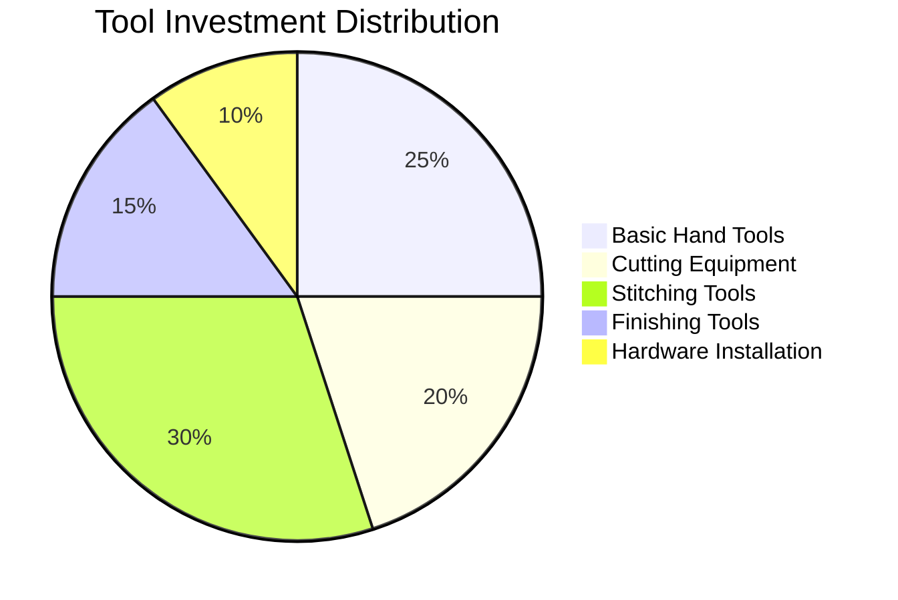

# Task 3: Tools and Equipment Needed for Garment Construction

## Essential Tool Categories

### Basic Cutting Tools
| Tool | Purpose | Price Range |
|------|---------|-------------|
| Utility knife + blades | Primary cutting tool | $15-30 |
| Trim knife (curved/straight) | Detail cutting | $20-40 |
| Cutting mat (large) | Protective cutting surface | $30-60 |
| Metal rulers/straightedge | Measuring and cutting guides | $20-50 |

### Hand Sewing Tools

#### Needles and Awls
- **Harness needles** (saddlers needles): Large, rounded points for tough materials - $40.50 for 25-pack
- **Diamond point needles**: Cutting tip for thick, firm leathers
- **Round point needles**: For softer leathers or pre-punched holes
- **Stitching awl**: Essential for hand-stitching leather - included in kits

#### Thread and Stitching Materials
- **Waxed thread**: Essential for leather work - $10.20 for 50-meter spool
- **Thread weight**: 92-138 weight polyester or nylon recommended
- **Multiple colors**: Match to leather color or contrasting

### Specialized Leather Tools

#### Punching and Hole-Making
| Tool | Function | Price |
|------|----------|-------|
| Hand-sewing leather punch | Multiple hole sizes (needle to 3/16") | $25-45 |
| Diamond stitching chisel set | Consistent stitch holes | $26+ |
| Rotary punch | Various hole sizes | $30-60 |
| Stitching groover | Creates groove for stitching line | $37.50 |

#### Measurement and Marking
- **Compass/dividers**: Consistent spacing measurements
- **Edge markers**: Mark stitching lines
- **Templates**: Pattern transfer tools
- **Scratch awl**: Marking tool for leather

## Professional Tool Kits

### Starter Kit Options

#### Budget Starter Kit (~$200-300)
- **Leather Sewing Kit for Hand Stitching**: $110.00
- **Basic cutting tools**: $50-70
- **Punch set**: $30-50
- **Thread and supplies**: $30-50

#### Professional Kit (~$500-800)
- **Leathercrafting Tool Kit 2.0**: $185.00
- **Stitching Horse**: $390.00 (work-holding device)
- **Premium cutting tools**: $100-150
- **Complete hardware sets**: $75-150

### Machine Sewing Equipment (Alternative)

#### Domestic Sewing Machine Modifications
- **Heavy-duty sewing machine**: $300-800
- **Leather needles**: $15-25 (SCHMETZ Leather needles)
- **Walking foot attachment**: $50-100
- **Thread tension adjustments**: Machine-specific

#### Industrial Options
- **Leather sewing machines**: $1,500-5,000+
- **Professional grade**: Higher speed and consistency
- **Maintenance requirements**: Regular servicing needed

## Hardware Installation Tools

### Fastener Installation
| Hardware Type | Tool Required | Tool Cost |
|---------------|---------------|-----------|
| Rivets | Rivet setter + anvil | $30-60 |
| Snaps | Snap setter | $25-45 |
| Grommets | Grommet setter | $20-40 |
| Buttons | Button shank cutter | $15-30 |

### Finishing Tools

#### Edge Work Tools
- **Stainless-steel edge paddle**: Apply edge paint/finish - $15-25
- **Edge burnisher**: Smooth and polish edges - $20-40
- **Sandpaper/abrasives**: Various grits for prep work - $10-20
- **Edge paint**: Finish raw edges - $8-15 per bottle

#### Shaping and Forming
- **Rubber mallet**: Flatten areas without iron damage - $15-25
- **Miniature anvil**: Support for hammering - $40-80
- **Bone folder**: Crease and fold assistance - $8-15
- **Modeling tools**: Shape and form curves - $20-40

## Workspace Requirements

### Essential Workspace Setup
- **Work surface**: Minimum 4'×6' cutting table
- **Good lighting**: LED work lights recommended
- **Storage**: Tool organization system
- **Ventilation**: For adhesives and finishes
- **Seating**: Comfortable work chair for long sessions

### Space Investment
- **Basic workspace setup**: $200-500
- **Professional setup**: $800-2,000+
- **Rental alternatives**: Makerspace access $30-60/month

## Progressive Tool Acquisition Strategy

### Phase 1: Essential Basics ($150-250)
1. Cutting knife and blades
2. Basic punch set
3. Hand-stitching needles
4. Waxed thread
5. Cutting mat

### Phase 2: Quality Improvements ($200-400)
1. Stitching awl and improved needles
2. Diamond chisels
3. Edge finishing tools
4. Better measuring tools
5. Work-holding devices

### Phase 3: Advanced Tools ($300-600)
1. Stitching horse
2. Complete hardware sets
3. Specialized punches
4. Professional cutting tools
5. Finishing equipment

## Cost-Effectiveness Analysis

### New vs. Used Equipment
- **Used tool savings**: 30-50% off retail prices
- **Quality considerations**: Professional tools hold value
- **Starter recommendations**: Mix of new basics and quality used tools

### Tool Rental Options
- **Makerspace access**: $30-60/month for full workshop
- **Tool library programs**: Some communities offer tool lending
- **Short-term rental**: For expensive specialty tools

## Maintenance and Replacement Costs

### Annual Maintenance Budget
- **Blade replacements**: $20-40/year
- **Thread and consumables**: $30-60/year  
- **Tool sharpening**: $20-50/year
- **Equipment wear**: $50-100/year for moderate use

### Tool Lifespan Expectations
- **Quality hand tools**: 10-20+ years with care
- **Cutting blades**: 6-12 months with regular use
- **Thread and supplies**: Consumed per project
- **Hardware setters**: 5-10 years typical life

## References

[1] [Needles & Thread | Leather Machine Co](https://leathermachineco.com/needles-thread/)
[2] [Leather Sewing Needles, Awls & Chisels - Weaver Leather Supply](https://www.weaverleathersupply.com/collections/hand-stitching)
[3] [Equipment for Sewing Leather Bags - Threads](https://www.threadsmagazine.com/2016/02/19/equipment-for-sewing-leather-bags)
[4] [How to Choose the Right Thread and Needle Size for Hand-Sewing Leather — Tandy Leather](https://tandyleather.com/blogs/tandy-blog/how-to-choose-the-right-thread-and-needle-size-for-hand-sewing-leather)
[5] [Leather Sewing Machine Needles – SCHMETZneedles](https://www.schmetzneedles.com/products/leather-sewing-machine-needles)