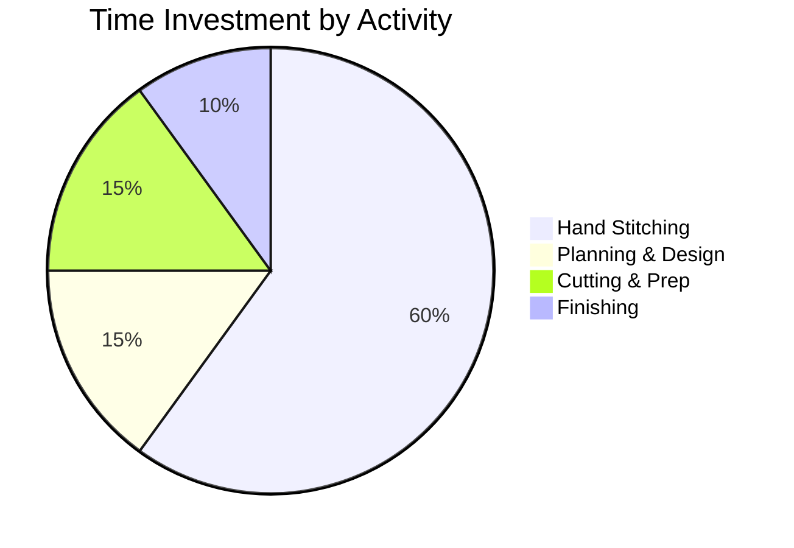

# Task 4: Labor Time Estimates and Skill Requirements

## Time Investment Overview

### Total Project Timeline

```mermaid
gantt
    title Complete Vest Project Timeline
    dateFormat  X
    axisFormat %d hours

    section Planning
    Research & Design    :0, 4
    Pattern Selection    :4, 6
    Material Sourcing    :6, 8

    section Preparation
    Material Prep        :8, 12
    Tool Setup          :12, 14
    Layout Planning     :14, 16

    section Construction
    Cutting             :16, 20
    Edge Preparation    :20, 24
    Hand Stitching      :24, 54
    Hardware Install    :54, 58

    section Finishing
    Quality Control     :58, 60
    Final Touches       :60, 62
```

## Detailed Time Breakdown by Skill Level

### Beginner (First-time leather worker)
| Phase | Task | Time Required | Notes |
|-------|------|---------------|-------|
| Planning | Research & pattern selection | 6-8 hours | Learning curve significant |
| Preparation | Material prep & layout | 8-12 hours | Multiple attempts likely |
| Construction | Cutting pieces | 4-6 hours | Careful, slow cutting |
| Stitching | Hand sewing (saddle stitch) | 30-40 hours | Learning proper technique |
| Hardware | Installation & finishing | 6-8 hours | Practice needed |
| **Total** | **Complete vest** | **54-74 hours** | **Over 2-3 weeks part-time** |

### Intermediate (Some leather experience)
| Phase | Task | Time Required | Notes |
|-------|------|---------------|-------|
| Planning | Design & pattern work | 3-4 hours | Faster decision-making |
| Preparation | Material & tool setup | 4-6 hours | Efficient workflow |
| Construction | Cutting & edge prep | 3-4 hours | Confident cutting |
| Stitching | Hand sewing | 20-25 hours | Improved technique |
| Hardware | Final assembly | 3-4 hours | Experience shows |
| **Total** | **Complete vest** | **33-43 hours** | **Over 1-2 weeks part-time** |

### Advanced (Professional level)
| Phase | Task | Time Required | Notes |
|-------|------|---------------|-------|
| Planning | Quick design decisions | 1-2 hours | Pattern expertise |
| Preparation | Efficient setup | 2-3 hours | Streamlined process |
| Construction | Precise cutting | 2-3 hours | Minimal waste |
| Stitching | Expert hand sewing | 12-16 hours | Fast, consistent stitching |
| Hardware | Professional finish | 2-3 hours | Quality final assembly |
| **Total** | **Complete vest** | **19-27 hours** | **3-5 days intensive work** |

## Skill Development Progression

### Hand-Stitching Proficiency Levels

#### Novice Level (0-10 hours experience)
- **Stitch rate**: 6-12 stitches per hour
- **Quality**: Inconsistent tension and spacing
- **Learning focus**: Basic saddle stitch technique
- **Practice needed**: 10-20 hours on sample pieces

#### Competent Level (20-50 hours experience)  
- **Stitch rate**: 18-24 stitches per hour
- **Quality**: Consistent appearance, good durability
- **Capabilities**: Basic vest construction achievable
- **Efficiency**: 50% faster than novice

#### Proficient Level (50+ hours experience)
- **Stitch rate**: 24-36 stitches per hour  
- **Quality**: Professional appearance and strength
- **Capabilities**: Complex projects, custom modifications
- **Efficiency**: Can work confidently with minimal rework

## Labor Cost Valuations

### Personal Time Investment

### Opportunity Cost Analysis
If valuing personal time at different hourly rates:

| Skill Level | Total Hours | @$15/hour | @$25/hour | @$40/hour |
|-------------|-------------|-----------|-----------|-----------|
| Beginner | 54-74 | $810-$1,110 | $1,350-$1,850 | $2,160-$2,960 |
| Intermediate | 33-43 | $495-$645 | $825-$1,075 | $1,320-$1,720 |
| Advanced | 19-27 | $285-$405 | $475-$675 | $760-$1,080 |

### Professional Service Comparison
- **Custom leather vest (commissioned)**: $800-$2,500
- **Commercial seal skin products**: $1,200-$3,000+
- **Alteration services**: $50-$150 for modifications

## Skill Requirements by Construction Method

### Hand Stitching (Traditional Method)
**Essential Skills:**
- Saddle stitch technique mastery
- Consistent awl usage
- Thread tension control
- Pattern layout efficiency

**Learning Curve:**
- **Basic competency**: 10-15 practice hours
- **Vest-ready skill**: 25-40 practice hours  
- **Professional quality**: 60+ hours experience

**Advantages:**
- Superior stitch durability
- Traditional craftsmanship appeal
- No machine investment required
- Complete control over process

### Machine Sewing (Modern Method)
**Essential Skills:**
- Heavy-duty machine operation
- Leather needle selection
- Feed rate management
- Seam finishing techniques

**Learning Curve:**
- **Basic operation**: 2-5 hours
- **Leather proficiency**: 10-20 hours
- **Professional results**: 30+ hours

**Advantages:**
- Faster construction (50% time savings)
- More consistent stitching
- Less physical fatigue
- Modern appearance

## Physical Demands and Considerations

### Hand Stitching Physical Requirements
- **Upper body strength**: Awl piercing through thick leather
- **Fine motor control**: Consistent stitch placement
- **Endurance**: 4-8 hour work sessions
- **Eye strain**: Detailed close work
- **Repetitive motion**: Risk of hand/wrist fatigue

### Workspace Ergonomics
- **Stitching horse**: Reduces back strain (recommended)
- **Good lighting**: Prevents eye fatigue
- **Regular breaks**: Every 2 hours recommended
- **Hand exercises**: Prevent repetitive strain

## Learning Resources and Time Investment

### Self-Teaching Approach
- **Online tutorials**: 10-20 hours viewing/practicing
- **Pattern familiarity**: 5-10 hours practice
- **Technique refinement**: 20-40 hours hands-on
- **Total learning investment**: 35-70 hours

### Formal Training Options
- **Weekend workshops**: 16-20 hours intensive
- **Community college courses**: 40-60 hours semester
- **Private instruction**: 10-20 hours one-on-one
- **Online courses**: 15-30 hours structured learning

## Quality vs. Time Trade-offs

### Speed vs. Craftsmanship Balance
| Priority | Time Investment | Quality Level | Best For |
|----------|----------------|---------------|-----------|
| Quick Completion | 25-35 hours | Functional | Personal use, learning |
| Balanced Approach | 35-50 hours | Good | Gift giving, moderate wear |
| Heirloom Quality | 50-70+ hours | Excellent | Investment piece, heavy use |

### Common Time-Saving Mistakes
- **Rushing pattern layout**: Results in material waste
- **Skipping edge preparation**: Poor finished appearance  
- **Inconsistent stitching**: Reduces durability
- **Inadequate planning**: Requires rework time

## Return on Investment Analysis

### Break-Even Considerations
Compared to purchasing similar commercial product ($1,500-$2,500):

- **Material costs**: $400-$1,000
- **Tool investment**: $200-$600 (one-time)
- **Time investment**: 30-70 hours
- **Learning value**: Skills for future projects
- **Satisfaction factor**: Personal accomplishment

### Long-term Value
- **Skill development**: Applies to future leather projects
- **Tool ownership**: Available for ongoing use
- **Customization capability**: Perfect fit and style
- **Repair skills**: Maintain and modify garment

## References

[1] [How Long Does It Take To Make A Leather Jacket? | Vintage Leather Jackets Forum](https://www.vintageleatherjackets.org/threads/how-long-does-it-take-to-make-a-leather-jacket.20844/)
[2] [Hand Stitching Time - Sewing Leather - Leatherworker.net](https://leatherworker.net/forum/topic/43307-hand-stitching-time/)
[3] [How long does it take hand sew clothes? - Quora](https://www.quora.com/How-long-does-it-take-hand-sew-clothes)
[4] [Sew What's Up • View thread - How long does it take to sew a garment?](http://talk.sew-whats-up.com/viewtopic.php?f=23&t=3179)