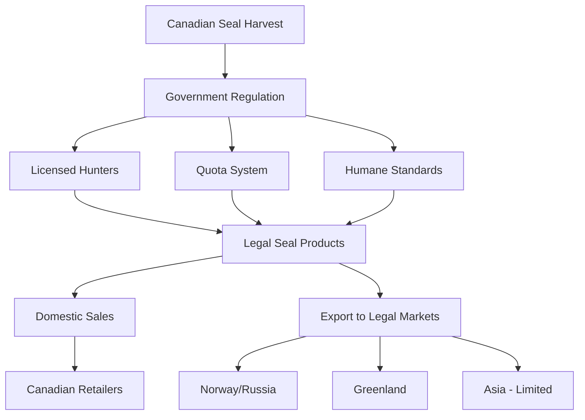

# Task 5: Legal and Regulatory Considerations for Seal Products

## Global Legal Landscape

### United States - Strict Prohibitions

#### Marine Mammal Protection Act (MMPA)
The **Marine Mammal Protection Act** establishes the most comprehensive restrictions globally:

- **Complete import ban**: No seal skin products can be imported into the USA
- **Export restrictions**: Prohibits export of marine mammal parts
- **"Taking" definition**: Includes hunt, harass, capture, or kill any marine mammal
- **Products included**: Any item wholly or partially composed of marine mammals

#### Enforcement and Penalties  
- **Violation consequences**: Federal criminal and civil penalties
- **Current status**: Actively enforced as of 2024
- **Recent updates**: Import restrictions remain until December 31, 2029

### European Union - Import Restrictions

#### EU Seal Products Regulation
- **Ban scope**: Prohibits placing seal products on EU market
- **Implementation date**: 2010, with ongoing enforcement
- **Limited exceptions**: Traditional Inuit/Indigenous hunting
- **Member state compliance**: All 27 EU countries enforce restrictions

### Other Restricted Markets
| Region | Status | Details |
|--------|--------|---------|
| **Mexico** | Prohibited | Import restrictions in place |
| **Taiwan** | Prohibited | Marine mammal protection laws |
| **Australia** | Restricted | Protected species legislation |
| **New Zealand** | Limited** | Marine mammal protection framework |

## Legal Markets and Sources

### Canada - Primary Legal Market

#### Canadian Regulatory Framework
- **Department of Fisheries and Oceans**: Primary regulatory authority
- **Annual quotas**: Scientifically-based harvest limits
- **Humane regulations**: Strict killing method requirements
- **Licensing system**: Mandatory hunter certification
- **Export documentation**: Required for international sales

### Norway - Sustainable Harvest Program
- **Regulatory body**: Norwegian Ministry of Trade and Fisheries
- **Species focus**: Primarily harp and hooded seals
- **International sales**: Legal export to approved markets
- **Sustainability standards**: Science-based population management

### Greenland - Traditional and Commercial Harvest
- **Indigenous rights**: Traditional hunting privileges maintained
- **Commercial operations**: Regulated sustainable harvest
- **Product quality**: High-grade pelts for international market
- **Cultural significance**: Important economic and cultural activity

## CITES Requirements

### Convention on International Trade in Endangered Species

#### Seal Species Classifications
Most commercial seal species are **not listed** under CITES Appendices:
- **Harp seals**: Not CITES-listed (most common commercial species)
- **Ringed seals**: Not CITES-listed
- **Grey seals**: Not CITES-listed

#### Documentation Requirements
For any cross-border movement:
- **Wildlife Declaration Form 3-177**: Required for US ports
- **USFWS port clearance**: Designated wildlife ports only
- **Export permits**: From country of origin
- **Import clearance**: Destination country requirements

## Compliance Strategies

### For US Residents/Market
**Recommendation: Do Not Attempt**
- Complete prohibition under MMPA
- No legal import pathway available  
- Criminal and civil penalties apply
- No grandfather clauses for personal use

### For Canadian Residents
**Fully Legal Domestic Market**
- No restrictions on purchase or possession
- Multiple suppliers available
- Quality products with documentation
- Support for regulated industry

### For EU Residents  
**Prohibited Under EU Regulation**
- No legal import pathway
- Traditional exceptions don't apply to commercial products
- Risk of customs seizure and penalties

### For Other Markets
**Country-Specific Research Required**
- Laws vary significantly by jurisdiction
- Many countries follow US or EU lead
- Some Asian markets remain partially open
- Legal consultation recommended

## Alternative Legal Materials

### Ethical and Legal Substitutes
| Material | Legal Status | Characteristics | Cost Comparison |
|----------|-------------|----------------|-----------------|
| **Sheepskin** | Globally legal | Similar texture, widely available | 50-70% less |
| **Rabbit fur** | Legal in most markets | Soft texture, various colors | 60-80% less |
| **Synthetic alternatives** | Universally legal | Various textures, no ethical concerns | 40-90% less |
| **Legal exotic leathers** | Regulated but available | Ostrich, python, etc. | Similar to higher |

## Risk Assessment for Seal Product Acquisition

### High-Risk Activities (Avoid)
- **Importing to prohibited countries**: Criminal penalties
- **Undocumented purchases**: No proof of legal origin
- **Online purchases from unclear sources**: Potential fraud/seizure
- **Attempting border crossings**: Customs violations

### Lower-Risk Activities (Legal Compliance Required)
- **Purchase within legal jurisdiction**: Full compliance required  
- **Documentation retention**: Proof of legal source
- **Local use only**: No international transport
- **Professional consultation**: Legal advice recommended

## Documentation Requirements

### Essential Documentation for Legal Products
- **Certificate of origin**: Government-issued documentation
- **Harvest license numbers**: Traceable to legal harvester  
- **Export permits**: If crossing international borders
- **Species identification**: Confirmation of non-protected status
- **Chain of custody**: Full supply chain documentation

### Record Keeping Recommendations
- **Photograph documentation**: Product and certificates
- **Digital copies**: Secure backup of all documents
- **Purchase receipts**: Proof of legitimate acquisition
- **Legal consultation records**: Professional advice documentation

## Enforcement and Penalties

### US Enforcement Pattern
- **Customs inspection**: Regular screening of imports
- **Wildlife trafficking unit**: Specialized enforcement
- **Penalties**: Up to $100,000 and/or 1 year imprisonment
- **Civil fines**: Additional monetary penalties possible

### International Cooperation
- **INTERPOL wildlife crime**: International coordination
- **Port authority cooperation**: Cross-border enforcement
- **Industry monitoring**: Supply chain oversight
- **Public awareness**: Consumer education programs

## Professional Legal Advice

### When to Consult Attorneys
- **Any international transaction**: Cross-border legal complexity
- **Unclear jurisdictional status**: Multiple law interpretations
- **Commercial activities**: Business compliance requirements
- **Customs questions**: Import/export procedures

### Legal Consultation Costs
- **Initial consultation**: $200-500
- **Compliance review**: $500-1,500
- **Ongoing advice**: $300-600/hour
- **Document review**: $200-400/hour

## Conclusion and Recommendations

### Key Takeaways
1. **Seal products face severe restrictions** in most major markets
2. **Canada remains the primary legal market** for acquisition and use
3. **US and EU markets are completely prohibited** with criminal penalties
4. **Legal alternatives exist** with similar characteristics
5. **Professional legal advice is essential** for any cross-border activities

### Strategic Recommendations
- **If in restricted jurisdiction**: Consider legal alternatives
- **If in legal jurisdiction**: Ensure full documentation compliance
- **For international activities**: Obtain professional legal counsel
- **For personal use**: Understand local law implications fully

## References

[1] [Marine Mammal Protection Act | NOAA Fisheries](https://www.fisheries.noaa.gov/national/marine-mammal-protection/marine-mammal-protection-act)
[2] [Letter of Determination for Protected Species Parts and Products | NOAA Fisheries](https://www.fisheries.noaa.gov/permit/letter-determination-protected-species-parts-and-products)
[3] [Federal Register :: Fish and Fish Product Import Provisions of the Marine Mammal Protection Act](https://www.federalregister.gov/documents/2016/08/15/2016-19158/fish-and-fish-product-import-provisions-of-the-marine-mammal-protection-act)
[4] [Checklist of CITES species](https://checklist.cites.org/)
[5] [eCFR :: 50 CFR Part 18 -- Marine Mammals](https://www.ecfr.gov/current/title-50/chapter-I/subchapter-B/part-18)