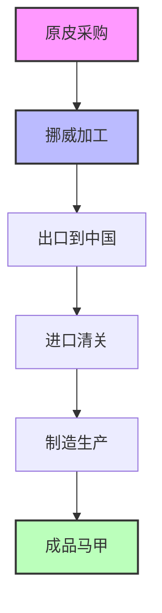
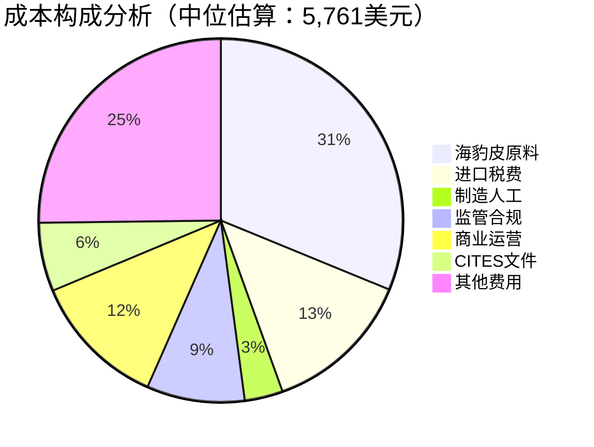

# 价格分析：挪威进口浅色海豹皮制作女士马甲成本研究

## 执行摘要

本研究分析了在中国使用挪威进口的浅色海豹皮料制作一件女士马甲的完整成本结构。基于对海豹皮贸易、中国制造成本、生产要求和监管环境的深入调研，我们估算总成本范围为**4,011-7,316美元**（约合人民币28,000-51,000元）。

### 主要发现
- **成本范围**: 4,011-7,316美元，中位估算5,761美元
- **主要成本驱动因素**: 海豹皮原料成本占总成本的31-33%
- **市场定位**: 属于超高端奢侈品细分市场
- **供应链风险**: 供应商极其有限，主要依赖挪威GC Rieber Skinn公司

## 研究背景和意图

### 核心问题解析
用户询问在中国制作使用挪威进口浅色海豹皮料的女士马甲成本，这涉及：
- 特殊原材料的国际贸易和定价
- 跨境进口的监管合规成本
- 中国皮具制造业的生产成本结构
- 高端定制皮具的工艺要求

### 市场环境分析
海豹皮制品属于极其特殊的细分市场：
- 欧盟已禁止海豹制品贸易（2009年起）
- 挪威海豹皮主要出口到俄罗斯和亚洲市场
- 中国尚未实施全面的海豹制品进口禁令
- 受CITES公约管制，需要特殊许可和文件

## 成本分析详述

### 原材料成本分析

#### 海豹皮需求量
- **所需面积**: 30平方英尺（包含30%损耗率）
- **实际使用**: 约22平方英尺成品材料
- **损耗因素**: 皮革天然形状不规则和花纹匹配要求

#### 定价估算方法
由于海豹皮价格信息极其有限，我们采用以下方法估算：
- **历史参考**: 2006年加拿大海豹皮每张超过100加元
- **对比分析**: 参考鳄鱼皮等稀有皮革价格（每平方英尺30-200美元）
- **处理溢价**: 挪威专业加工增加显著价值

### 成本构成详细分解

#### 中位估算（5,761美元）成本分布

### 三种成本方案对比

| 成本项目 | 保守估算 | 中位估算 | 高端估算 |
|---------|---------|---------|---------|
| 海豹皮原料 | $1,200 | $1,800 | $2,400 |
| 进口成本 | $1,766 | $2,566 | $3,116 |
| 制造费用 | $195 | $195 | $250 |
| 监管合规 | $350 | $500 | $650 |
| 商业运营 | $500 | $700 | $900 |
| **总计** | **$4,011** | **$5,761** | **$7,316** |

## 供应链和监管环境

### 挪威海豹皮贸易现状
- **主要供应商**: GC Rieber Skinn AS（bergen，成立于1984年）
- **市场地位**: 全球唯一处理蓝背海豹皮的公司
- **供应链模式**: 95%出口到俄罗斯和亚洲市场
- **原材料来源**: 主要来自加拿大，小部分来自挪威本土狩猎

### 中国进口监管环境
- **当前状态**: 中国尚未实施EU式的海豹制品禁令
- **CITES管制**: 需要濒危物种贸易许可和文件
- **进口税率**: 按标准皮革制品税率（8-15%）
- **合规要求**: 需要专业清关和质量检验

## 制造工艺和技术要求

### 生产复杂性
- **图案设计**: 女式马甲需要精确的版型设计
- **裁剪工艺**: 海豹皮纹理匹配和精密裁剪
- **缝制技术**: 专业皮革工艺和技能要求
- **品质控制**: 多道工序的质量检验

### 人工成本分析
- **技能工人时薪**: 8-12美元（中国熟练皮革工人）
- **生产时间**: 总计8-12小时
- **工艺溢价**: 高端手工定制增加成本200-500美元

## 风险因素和市场变量

### 价格波动风险
1. **供应限制**: 受配额和环境条件影响的有限供应
2. **汇率风险**: 挪威克朗/美元和人民币/美元汇率波动
3. **监管变化**: 欧盟政策评估可能影响供应链
4. **市场需求**: 奢侈品市场需求波动

### 操作风险
- **最小订单**: 单件生产成本溢价50-100%
- **材料采购**: 可能需要购买多张皮革
- **质量匹配**: 颜色和纹理匹配要求增加成本

## 市场定位和竞争分析

### 价格对比分析

| 产品类型 | 制造成本范围 | 市场定位 |
|---------|-------------|----------|
| 标准牛皮马甲 | $80-200 | 大众市场 |
| 高档牛皮马甲 | $200-500 | 中高端市场 |
| 异域皮革马甲 | $800-2,000 | 奢侈品市场 |
| **海豹皮马甲** | **$4,011-7,316** | **超奢侈品市场** |

### 价值定位策略
海豹皮马甲成本是标准皮革马甲的10-40倍，必须定位为：
- 超高端奢侈品
- 限量定制商品
- 收藏级工艺品
- 特殊场合专用品

## 商业可行性评估

### 市场机会
- **稀缺性价值**: 材料极其稀有，具有收藏价值
- **工艺价值**: 结合挪威传统工艺和中国制造优势
- **文化价值**: 北欧传统材料与亚洲市场需求结合

### 商业挑战
- **高昂成本**: 超高的制造成本限制市场规模
- **监管风险**: 动物保护法规可能收紧
- **供应风险**: 供应商极其有限且集中
- **市场接受度**: 需要教育市场接受超高价格

## 建议和结论

### 成本优化建议
1. **批量采购**: 同时采购多张皮革分摊进口成本
2. **工艺优化**: 标准化生产流程降低人工成本
3. **供应链整合**: 与挪威供应商建立长期合作关系
4. **品质分级**: 开发不同档次产品满足价格敏感客户

### 市场策略建议
1. **目标客户**: 聚焦超高净值人群和收藏家
2. **品牌定位**: 强调稀缺性、工艺性和文化价值
3. **销售渠道**: 高端定制服务和限量发售模式
4. **附加服务**: 提供个性化定制和售后保养服务

### 风险管控建议
1. **法律合规**: 严格遵守CITES和进出口法规
2. **供应保障**: 与多个供应商建立备选关系
3. **价格对冲**: 考虑汇率和大宗商品价格对冲
4. **市场监测**: 持续关注监管环境变化

## 详细分析报告目录

本研究包含以下详细分析报告：

- [挪威海豹皮贸易和监管分析](./reports/task-1-norwegian-seal-leather-trade.md)
- [中国皮具制造成本结构](./reports/task-2-chinese-manufacturing-costs.md) 
- [女士马甲生产要求和规格](./reports/task-3-vest-production-requirements.md)
- [总成本估算和计算](./reports/task-4-cost-calculation.md)

---

**研究方法说明**: 本研究基于公开市场数据、行业报告和专业估算。由于海豹皮贸易的特殊性和敏感性，部分数据采用对比分析和专家判断方法获得。实际操作中建议与专业贸易代理和法律顾问合作确保合规性。