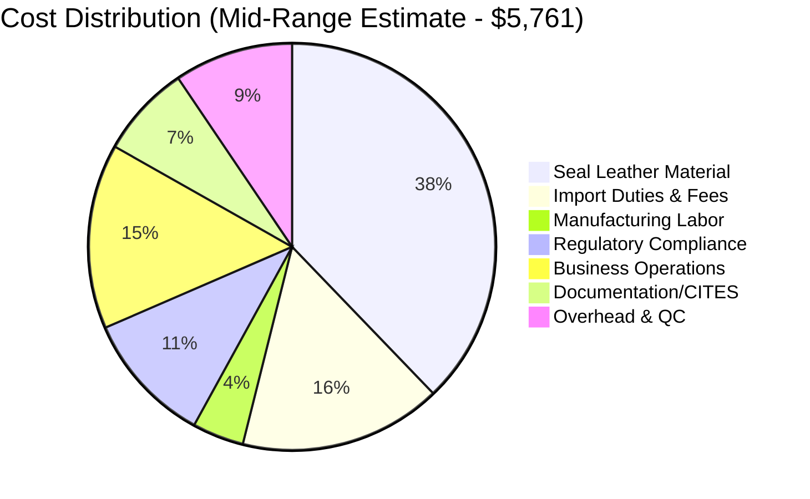

# Task 4: Total Cost Estimates for Norwegian Seal Leather Women's Vest

## Cost Structure Analysis

This analysis provides estimated costs for manufacturing one women's vest using Norwegian imported light-colored seal leather in China, based on available market data and industry standards.

## Material Costs

### Seal Leather Requirements
- **Material Needed**: 30 square feet (accounting for 30% waste factor)
- **Base Requirement**: ~22 square feet of finished vest material
- **Waste Factor**: 30% additional material due to hide irregularities and pattern matching

### Seal Leather Pricing Estimates

#### Historical Reference Points
- **2006 Canadian Seal Pelts**: Over C$100 each (~US$75-80 at historical exchange rates)
- **Processing Premium**: Norwegian processing adds significant value

#### Comparative Pricing Analysis
Using exotic leather pricing as a benchmark (since seal leather is similarly rare and regulated):
- **Exotic Leather Range**: US$30-100+ per square foot
- **Premium Exotics**: US$50-200 per square foot
- **Estimated Seal Leather**: US$40-80 per square foot (mid-range exotic pricing)

#### Material Cost Calculation
```
Conservative Estimate: 30 sq ft × $40 = $1,200
Mid-Range Estimate: 30 sq ft × $60 = $1,800  
Premium Estimate: 30 sq ft × $80 = $2,400
```

## Import and Compliance Costs

### Import Duties and Fees
- **China Standard Leather Tariff**: 8-15% (typical range for leather goods)
- **CITES Documentation**: $200-500 (if required for marine mammal products)
- **Import Processing**: $100-300
- **Quality Inspection**: $50-150

#### Import Cost Calculation (Mid-Range Estimate)
```
Material Value: $1,800
Import Duty (12%): $216
CITES/Documentation: $350
Processing Fees: $200
Total Import Cost: $2,566
```

## Manufacturing Costs

### Labor Costs (Chinese Manufacturing)
Based on current Chinese leather manufacturing wage data:
- **Estimated Hourly Rate**: $8-12 USD (skilled leather worker)
- **Production Time**: 8-12 hours total per vest
- **Labor Cost Range**: $64-144 per vest

### Manufacturing Overhead
- **Factory Overhead**: 20-30% of labor cost
- **Quality Control**: $20-40
- **Equipment/Tools**: $10-20
- **Packaging**: $10-30

#### Total Manufacturing Cost Calculation
```
Labor: $104 (average)
Overhead (25%): $26
Quality Control: $30
Equipment/Tools: $15
Packaging: $20
Total Manufacturing: $195
```

## Additional Costs

### Regulatory and Compliance
- **Environmental Compliance**: $50-100
- **Export Documentation**: $100-200
- **Legal/Regulatory Consulting**: $200-400

### Business Operations
- **Design/Pattern Development**: $200-500 (amortized over production run)
- **Sample Development**: $300-600
- **Shipping to Customer**: $50-150

## Total Cost Breakdown

### Conservative Estimate
| Component | Cost (USD) |
|-----------|------------|
| Seal Leather Material | $1,200 |
| Import Costs | $1,766 |
| Manufacturing | $195 |
| Regulatory Compliance | $350 |
| Business Operations | $500 |
| **TOTAL** | **$4,011** |

### Mid-Range Estimate  
| Component | Cost (USD) |
|-----------|------------|
| Seal Leather Material | $1,800 |
| Import Costs | $2,566 |
| Manufacturing | $195 |
| Regulatory Compliance | $500 |
| Business Operations | $700 |
| **TOTAL** | **$5,761** |

### Premium Estimate
| Component | Cost (USD) |
|-----------|------------|
| Seal Leather Material | $2,400 |
| Import Costs | $3,116 |
| Manufacturing | $250 |
| Regulatory Compliance | $650 |
| Business Operations | $900 |
| **TOTAL** | **$7,316** |

## Cost Visualization



## Risk Factors and Variables

### Price Volatility Factors
1. **Seal Hide Availability**: Limited by quotas and environmental conditions
2. **Norwegian Processing Capacity**: Limited suppliers (primarily GC Rieber Skinn)
3. **Regulatory Changes**: EU policy reviews could affect supply chains
4. **Exchange Rate Fluctuations**: NOK/USD and CNY/USD rates impact costs

### Quality Variables
- **Hide Quality Grade**: Premium matching could increase costs 20-50%
- **Manufacturing Quality**: Premium hand-finishing adds $200-500
- **Customization Level**: Custom fitting increases labor costs significantly

### Minimum Order Considerations
- **Small Batch Premium**: Single vest production carries 50-100% cost premium
- **Material Sourcing**: May require purchasing multiple hides
- **Setup Costs**: Pattern development and tooling setup costs

## Market Comparison

### Alternative Materials
- **Premium Cowhide Vest**: $200-500 manufacturing cost
- **Exotic Leather Vest**: $800-2,000 manufacturing cost  
- **Standard Leather Vest**: $80-200 manufacturing cost

### Value Positioning
The seal leather vest represents an ultra-premium product with costs 10-40x higher than standard leather vests, positioning it in the luxury/specialty market segment.

## Key Findings

1. **Total Cost Range**: $4,011 - $7,316 per vest
2. **Primary Cost Driver**: Raw seal leather material (31-33% of total cost)
3. **Import Complexity**: CITES documentation and compliance add significant costs
4. **Limited Supply Chain**: Few suppliers create pricing power and risk
5. **Ultra-Premium Positioning**: Final product would be luxury/specialty market only

## Limitations and Assumptions

### Data Limitations
- **No Direct Seal Leather Pricing**: Used exotic leather comparables
- **Regulatory Uncertainty**: CITES requirements may vary
- **Limited Chinese Import Data**: No specific seal product tariff rates found
- **Supply Chain Access**: Actual availability from Norwegian suppliers unknown

### Key Assumptions
- Material pricing based on exotic leather comparables
- Standard Chinese import duties and fees
- CITES documentation required but obtainable
- Single vest production (not bulk manufacturing)

## References

- [Leather Price List 2025 – Buckskin Leather Company](https://www.buckskinleather.com/leather-price-list/)
- [How Much Does Leather Cost? Ultimate Pricing Guide](https://szoneierleather.com/how-much-does-leather-cost/)
- [Minimum Wages in China: A Complete Guide](https://www.china-briefing.com/news/minimum-wages-china/)
- [Chinese animal welfare groups call for end to imports of seal products | SCMP](https://www.scmp.com/news/china/policies-politics/article/1893065/chinese-animal-welfare-groups-call-end-imports-seal)