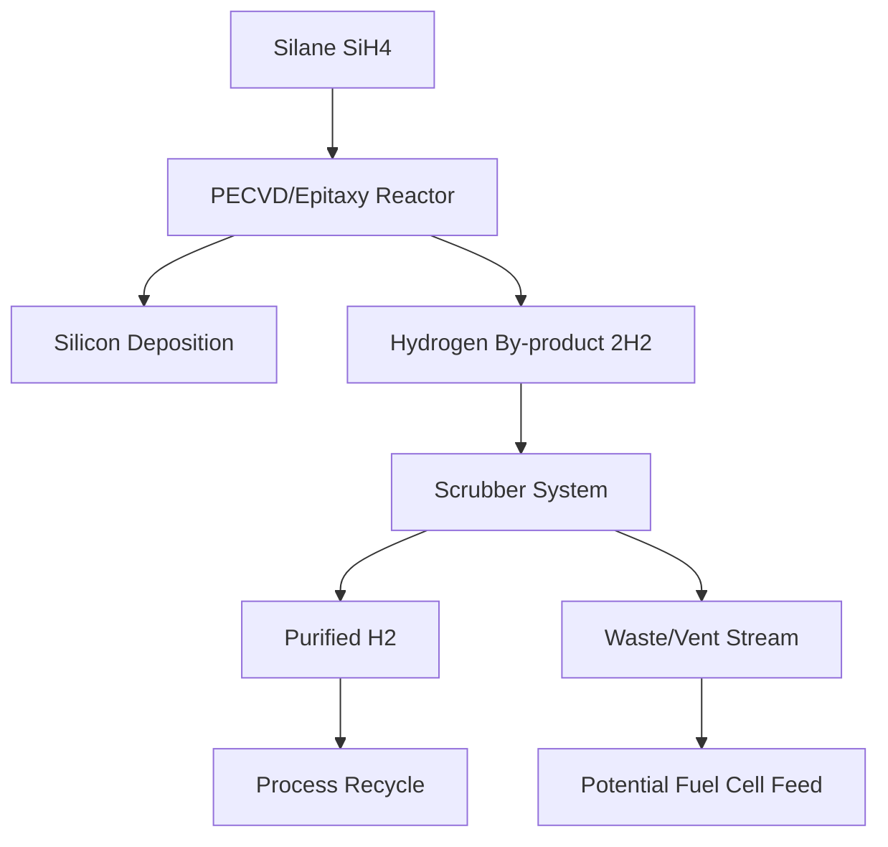
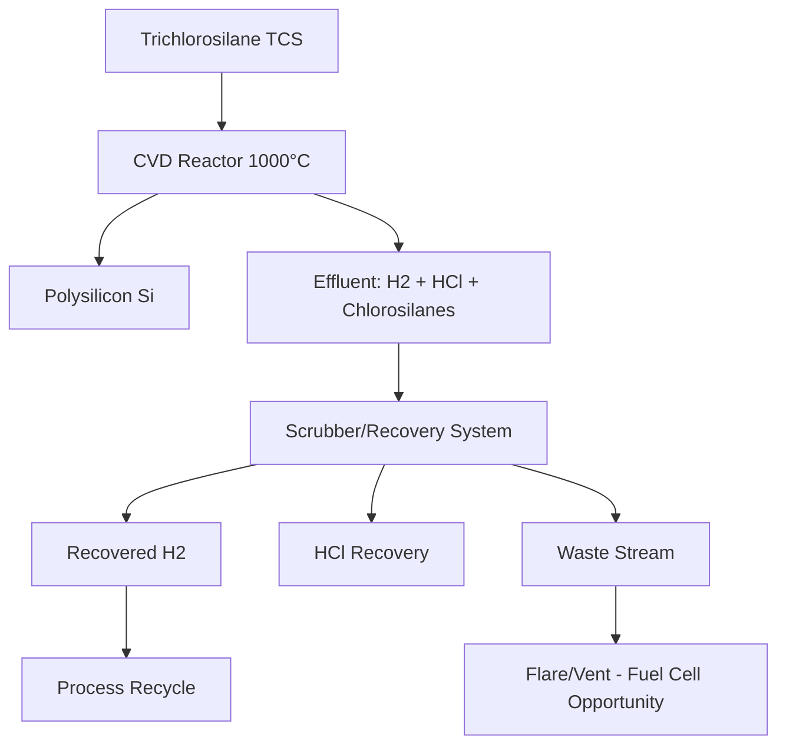

# Task 1: Process Chemistry Analysis - Validation of Semiconductor/PV Hydrogen By-Products

## Executive Summary

**HYPOTHESIS VALIDATED:** Semiconductor and photovoltaic manufacturing processes do indeed generate significant hydrogen by-products, primarily from silane pyrolysis reactions. However, most modern facilities already implement sophisticated recovery systems, limiting the "waste" hydrogen available for fuel cell conversion.

## Key Findings

### Semiconductor Manufacturing Hydrogen Generation

#### Silane Pyrolysis Process
The fundamental chemical reaction in semiconductor manufacturing is:
**SiH₄(vapor) → Si(solid) + 2H₂(gas)**

- **Temperature**: Decomposition begins at ~370°C, complete at <900°C
- **Stoichiometry**: Each mole of silane produces 2 moles of hydrogen
- **Purity**: Ultra-high purity hydrogen (>99.999%) when using semiconductor-grade silane
- **Process efficiency**: PECVD processes are "relatively inefficient at materials utilization with approximately 85% of the silane being wasted" [Berkeley Nanolab PECVD Manual](https://nanolab.berkeley.edu/process_manual/chap6/6.20PECVD.pdf)

#### PECVD and Epitaxial Processes
- **PECVD**: Operates at 250-350°C, uses plasma enhancement for deposition
- **Epitaxy**: Operates at ~1000°C using silane, dichlorosilane, or silicon tetrachloride with hydrogen carrier gas
- **Low-temp epitaxy**: PECVD enables deposition at temperatures as low as 150°C

### Photovoltaic Manufacturing Hydrogen Generation

#### Siemens Process in Polysilicon Production
The dominant polysilicon production method (>75% global market share) generates hydrogen through:

1. **Trichlorosilane (TCS) deposition**: TCS + H₂ → Si + 3HCl + other chlorosilanes
2. **Hydrogen reduction**: Occurs at ~1000°C in CVD reactors
3. **Effluent composition**: TCS, STC, H₂, HCl, and DCS

#### Industrial Hydrogen Recovery Practices
**Current State**: Modern polysilicon facilities implement extensive hydrogen recovery:
- "All hydrogen from the process collected and recycled to the hydrogenation reactor" [ScienceDirect](https://www.sciencedirect.com/topics/engineering/polysilicon-production)
- Recovery systems achieve >50% recycling rates
- "We optimized the hydrogen loops in our integrated polysilicon production system" - Wacker Chemie

### Hydrogen Purity and Fuel Cell Compatibility

#### Purity Levels Achieved
- **Semiconductor processes**: Ultra-High-Purity (≥99.999%, "5N") hydrogen from silane pyrolysis
- **Polysilicon processes**: High-purity hydrogen but contaminated with HCl, chlorosilanes, and moisture

#### Contaminants of Concern for Fuel Cells
- **HCl and chlorosilanes**: Require acid gas removal
- **CO and CO₂**: Minimal in these processes
- **Moisture**: Standard drying required
- **Silane residues**: Potential catalyst poison

#### Conditioning Requirements
- **PSA (Pressure Swing Adsorption)**: Standard for hydrogen purification
- **Membrane separation**: Including palladium alloy membranes
- **Catalytic polishing**: For trace contaminant removal
- **Drying systems**: Molecular sieve or equivalent

## Process-Specific Analysis

### Semiconductor Fabrication

### Polysilicon Production

## Industry-Specific Waste Estimates

### Semiconductor Fabs
- **Material utilization**: ~85% silane waste in PECVD processes
- **Current practice**: Most hydrogen recovered for process reuse or sold as merchant gas
- **Waste fraction**: Estimated 5-15% of generated hydrogen currently vented/flared

### Polysilicon Plants  
- **Recovery efficiency**: Modern plants achieve >90% hydrogen recovery
- **Historical waste**: "Once scrubbed from poisonous and environmentally harmful substances, the hydrogen-rich waste gas streams are released into the atmosphere"
- **Current practice**: "After cleaning from toxic and harmful substances, the off gas is either burned or vented to atmosphere"

## Technical Validation Conclusions

1. **Hypothesis Confirmed**: Both semiconductor and PV manufacturing generate substantial hydrogen by-products
2. **Chemical Basis**: Validated through fundamental silane pyrolysis chemistry
3. **Purity Suitable**: Ultra-high purity achievable, compatible with fuel cells after standard conditioning
4. **Recovery Infrastructure**: Most modern facilities already recover majority of hydrogen
5. **Addressable Waste**: Estimated 5-20% of generated hydrogen still wasted through venting/flaring

## Waste Stream Quantification Context

Research by [ScienceDirect on hydrogen waste gas recycling](https://www.sciencedirect.com/science/article/abs/pii/S0360319919318373) indicates significant potential: "Second use or recycling of hydrogen waste gas from the semiconductor industry" demonstrates both technical feasibility and economic benefits.

Case study: "Elkem believes it can capture and use 120 tons of hydrogen per year with its new method" from their Silgrain polysilicon production, indicating substantial volumes even at single facilities.

## Next Research Priorities

1. **Facility-level quantification**: Map specific U.S. semiconductor and polysilicon facilities
2. **Mass balance calculations**: Estimate hydrogen generation rates based on production capacity
3. **Current disposal practices**: Identify facilities still venting/flaring hydrogen
4. **Regional clustering analysis**: Determine geographic concentration patterns

## References

1. [Berkeley Nanolab PECVD Manual](https://nanolab.berkeley.edu/process_manual/chap6/6.20PECVD.pdf) - PECVD process efficiency data
2. [ScienceDirect Polysilicon Production](https://www.sciencedirect.com/topics/engineering/polysilicon-production) - Hydrogen recovery in Siemens process
3. [PV Magazine - Hydrogen from Polysilicon](https://www.pv-magazine.com/2020/11/12/hydrogen-captured-as-a-byproduct-of-polysilicon-production/) - Industry case studies
4. [ScienceDirect Hydrogen Waste Gas Recycling](https://www.sciencedirect.com/science/article/abs/pii/S0360319919318373) - Economic analysis of waste hydrogen recovery
5. [Wacker Chemie Sustainability Report](https://reports.wacker.com/2021/annual-report/sustainable-solutions/waste-nothing-use-everything.html) - Industrial hydrogen recovery practices