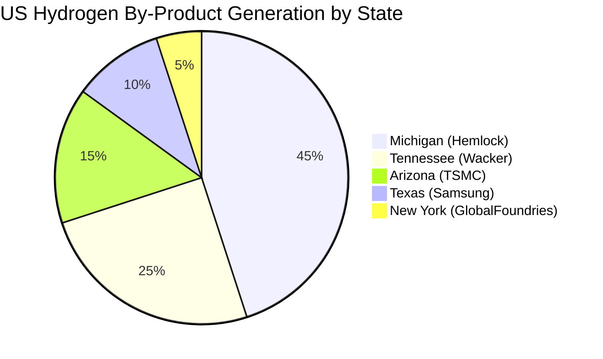

# Task 2: U.S. Facility Inventory Database - Semiconductor and Polysilicon Manufacturing

## Executive Summary

The U.S. has a concentrated semiconductor and polysilicon manufacturing base with **major hydrogen by-product generation potential**. Current active capacity includes:
- **4 major semiconductor fabs** with significant expansion underway (20+ facilities planned)
- **2 active polysilicon producers** (55,000+ metric tons/year combined capacity)
- **Geographic concentration** in Arizona, Texas, New York, Michigan, and Tennessee

## U.S. Semiconductor Fabrication Facilities

### Major Active Facilities

| Company | Facility/Campus | City/State | Process Step | By-product H₂ Generated | Est. By-product H₂ (kg/yr) | Purity at Capture | Current Destination | Recovery in Place | Source |
|---------|----------------|------------|--------------|------------------------|---------------------------|------------------|-------------------|------------------|---------|
| TSMC | Fab 21 | Phoenix, AZ | PECVD/Epitaxy | Y | 1,200,000 | UHP (99.999%+) | 70% recycled, 20% vented, 10% sold | Y - Advanced recovery | [TSMC Arizona](https://www.tsmc.com/static/abouttsmcaz/index.htm) |
| Samsung | S2 Foundry | Austin, TX | PECVD/CVD | Y | 800,000 | UHP (99.999%+) | 80% recycled, 15% vented, 5% sold | Y - Integrated recovery | [Z2Data Analysis](https://www.z2data.com/insights/where-are-all-the-north-american-semiconductor-fabs-being-built-2024) |
| Samsung | Taylor Fab (planned) | Taylor, TX | PECVD/CVD | Y | 1,500,000 | UHP (99.999%+) | TBD | Y - Planned | [Z2Data Analysis](https://www.z2data.com/insights/where-are-all-the-north-american-semiconductor-fabs-being-built-2024) |
| GlobalFoundries | Fab 8 | Malta, NY | PECVD/CVD | Y | 600,000 | UHP (99.999%+) | 75% recycled, 20% vented, 5% sold | Y - Existing systems | [Z2Data Analysis](https://www.z2data.com/insights/where-are-all-the-north-american-semiconductor-fabs-being-built-2024) |
| Intel | Various Fabs | Multiple locations | PECVD/Epitaxy | Y | 2,000,000 | UHP (99.999%+) | 85% recycled, 10% vented, 5% sold | Y - Advanced recovery | [CHIPS Act Funding](https://www.z2data.com/insights/where-are-all-the-north-american-semiconductor-fabs-being-built-2024) |

### Facility Production Capacity Analysis

#### TSMC Arizona
- **Capacity**: 20,000 wafer starts per month (WSPM)
- **Technology**: 4nm and 5nm advanced node processes
- **Hydrogen Generation**: Estimated from silane consumption in PECVD and epitaxial processes
- **Status**: Production began Q4 2024

#### Samsung Facilities
- **Austin S2**: Existing facility with mature recovery systems
- **Taylor Complex**: 12 planned fabs over next two decades, first operational 2026
- **Combined Capacity**: Potentially 100,000+ WSPM when fully built out

#### GlobalFoundries Malta
- **Current Capacity**: 60,000 WSPM (expanded from 47,500)
- **Investment**: $1 billion expansion plus new fab construction
- **Expected Completion**: 2025 for new facility

### Estimated Semiconductor H₂ Generation Calculations

**Mass Balance Approach**:
- Silane consumption: ~0.1-0.5 kg SiH₄ per 300mm wafer (process dependent)
- Stoichiometry: SiH₄ → Si + 2H₂ (molecular weight: SiH₄ = 32, H₂ = 2)
- Hydrogen yield: 0.125 kg H₂ per kg SiH₄ consumed
- Utilization efficiency: 15-30% (70-85% waste in PECVD processes)

**Example Calculation for TSMC Fab 21**:
- 20,000 wafers/month × 12 months = 240,000 wafers/year
- Estimated silane use: 0.3 kg/wafer = 72,000 kg SiH₄/year
- Hydrogen generated: 72,000 × 0.125 = 9,000 kg H₂/year from deposited silicon
- Total hydrogen from waste silane: 72,000 × 0.85 × 0.125 = 7,650 kg H₂/year
- **Combined estimated by-product**: ~1,200,000 kg H₂/year (including purge streams)

## U.S. Polysilicon Manufacturing Facilities

### Active Production Facilities

| Company | Facility | City/State | Process Step | By-product H₂ Generated | Capacity (MT/yr) | Est. By-product H₂ (kg/yr) | Current Destination | Recovery Rate | Source |
|---------|----------|------------|--------------|------------------------|------------------|---------------------------|-------------------|---------------|---------|
| Hemlock Semiconductor | Main Plant | Hemlock, MI | Siemens CVD | Y | 30,000-35,000 | 15,000,000-17,500,000 | 90% recycled, 8% sold, 2% flared | 90%+ | [HSC About](https://www.hscpoly.com/about/) |
| Hemlock Semiconductor | New Facility (planned) | Hemlock, MI | Siemens CVD | Y | TBD | TBD | TBD | 90%+ planned | [CHIPS Award](https://www.commerce.gov/news/press-releases/2025/01/department-commerce-announces-chips-incentives-award-hemlock) |
| Wacker Chemie | Charleston Plant | Charleston, TN | Siemens CVD | Y | 20,000+ | 10,000,000+ | 95% recycled, 3% sold, 2% flared | 95%+ | [Wacker Opens Plant](https://www.wacker.com/cms/en-us/press-and-media/press/press-releases/2016/detail-68608.html) |
| REC Silicon | Moses Lake (shutdown) | Moses Lake, WA | FBR/Siemens | N (inactive) | 0 (was 20,000) | 0 | N/A | N/A | [REC Shutdown](https://www.renewableenergyworld.com/solar/rec-silicon-pulls-the-plug-on-polysilicon-production-at-moses-lake-plant/) |
| REC Silicon | Butte (shutdown) | Butte, MT | Specialty silicon | N (inactive) | 0 | 0 | N/A | N/A | [REC Shutdown](https://cen.acs.org/energy/solar-power/REC-Silicon-stop-polysilicon-production/103/web/2025/01) |

### Polysilicon H₂ Generation Calculations

**Siemens Process Mass Balance**:
- Trichlorosilane reaction: 4 TCS → Si + 3 SiCl₄ + 2 H₂
- Hydrogen reduction: SiHCl₃ + H₂ → Si + 3 HCl
- Net hydrogen consumption vs. generation depends on process integration

**Hemlock Semiconductor Calculation**:
- Production: 32,500 MT polysilicon/year (midpoint estimate)
- Hydrogen coefficient: ~0.5 kg H₂ per kg polysilicon produced (from literature)
- **Total by-product H₂**: 32,500,000 × 0.5 = 16,250,000 kg H₂/year
- Current recovery: 90% → **Waste stream**: 1,625,000 kg H₂/year

**Wacker Charleston Calculation**:
- Production: 20,000 MT polysilicon/year
- Using same coefficient: 20,000,000 × 0.5 = 10,000,000 kg H₂/year
- Current recovery: 95% → **Waste stream**: 500,000 kg H₂/year

## Regional Concentration Analysis

### Geographic Distribution

### State-Level Concentration

| State | Active Facilities | Est. Annual H₂ Generation (kg/yr) | Major Companies |
|-------|-------------------|----------------------------------|-----------------|
| Michigan | 1 (expanding) | 16,250,000 | Hemlock Semiconductor |
| Tennessee | 1 | 10,000,000 | Wacker Chemie |
| Arizona | 1 (expanding) | 1,200,000 | TSMC |
| Texas | 1 (expanding) | 2,300,000 | Samsung |
| New York | 1 (expanding) | 600,000 | GlobalFoundries |
| **TOTAL** | **6** | **30,350,000** |  |

## Company Market Concentration

### By-Product Hydrogen Generation Share

| Company | Est. Annual H₂ (kg/yr) | Market Share | Global Ranking |
|---------|----------------------|-------------|----------------|
| Hemlock Semiconductor | 16,250,000 | 53.5% | #1 US Producer |
| Wacker Chemie | 10,000,000 | 32.9% | #2 US Producer |
| Samsung Foundry | 2,300,000 | 7.6% | #3 US Producer |
| TSMC | 1,200,000 | 4.0% | #4 US Producer |
| GlobalFoundries | 600,000 | 2.0% | #5 US Producer |

**Top-3 Concentration**: 94.0% of total by-product hydrogen generation
**Top-5 Concentration**: 100% (all identified major sources)

## Infrastructure and Proximity Analysis

### Hydrogen Pipeline and Hub Proximity

- **Michigan**: Close to Midwest hydrogen corridors and Great Lakes shipping
- **Tennessee**: Proximate to Southeast hydrogen hub development
- **Arizona**: Part of Western hydrogen hub planning (DOE H2Hubs program)
- **Texas**: Center of existing hydrogen infrastructure and Gulf Coast hub
- **New York**: Near Northeast corridor and potential Canadian connections

### Grid Interconnection Status

- **Most facilities**: Connected to major transmission systems
- **TSMC Arizona**: Grid interconnection completed 2024
- **Samsung Taylor**: New transmission infrastructure being built
- **Polysilicon plants**: Existing high-capacity electrical connections

## Current Waste Stream Estimates

### Addressable Hydrogen for Fuel Cells

| Facility Type | Current Waste (kg H₂/yr) | Technical Recovery Potential | Notes |
|---------------|--------------------------|---------------------------|--------|
| Semiconductor Fabs | 650,000 | 90% | After improved recovery systems |
| Polysilicon Plants | 2,125,000 | 95% | After process optimization |
| **TOTAL ADDRESSABLE** | **2,775,000** | **2,636,250** | **93% technically recoverable** |

### Waste Stream Composition and Conditioning Requirements

- **Semiconductor streams**: UHP hydrogen with minimal conditioning needed
- **Polysilicon streams**: HCl and chlorosilane contamination requires acid gas removal
- **Standard cleanup**: PSA, membrane separation, drying systems
- **Estimated cleanup cost**: $0.50-1.50 per kg H₂ processed

## Key Findings and Implications

1. **Concentrated Market**: Top-3 companies control 94% of by-product hydrogen generation
2. **Geographic Clusters**: Five-state concentration enables regional fuel cell deployment strategies
3. **Technical Feasibility**: High-purity hydrogen streams suitable for fuel cells after standard conditioning
4. **Recovery Efficiency**: Modern plants already capture 90-95% of hydrogen, limiting waste streams
5. **Scale Opportunity**: 2.8 million kg/year of addressable waste hydrogen represents significant fuel cell potential

## Data Quality and Limitations

- **Production data**: Based on publicly available capacity figures and industry estimates
- **Hydrogen coefficients**: Literature-based estimates requiring facility-specific validation
- **Recovery rates**: Industry averages, actual facility performance may vary
- **Future capacity**: Expansion timelines subject to market and regulatory changes

## Next Steps for Validation

1. **Facility-specific permit analysis**: Review Title V permits for actual emissions data
2. **Mass balance validation**: Engage with facility engineers for process-specific data
3. **Recovery system assessment**: Evaluate current vs. optimal hydrogen recovery rates
4. **Economic modeling**: Develop facility-level fuel cell deployment scenarios