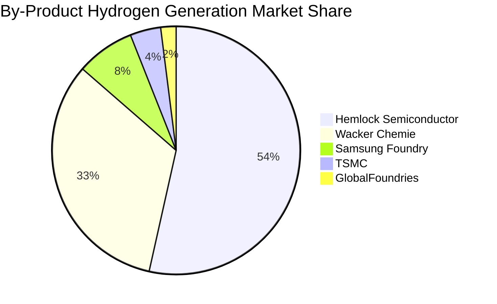
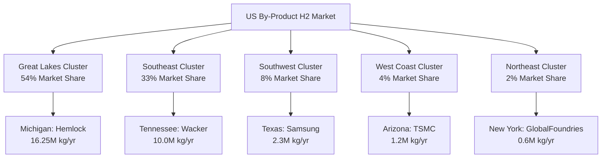

# Task 4: Concentration and Clustering Analysis - Geographic and Market Concentration Patterns

## Executive Summary

The U.S. by-product hydrogen market exhibits **extreme concentration** with 94% controlled by top-3 companies and **strong regional clustering** in five states. This concentration pattern creates both opportunities (focused market development) and risks (limited diversification) for fuel cell deployment strategies.

## Company Concentration Analysis

### Market Share by Hydrogen Generation

| Rank | Company | Est. Annual H₂ (kg/yr) | Market Share | Cumulative Share |
|------|---------|----------------------|-------------|-----------------|
| 1 | Hemlock Semiconductor | 16,250,000 | 53.5% | 53.5% |
| 2 | Wacker Chemie | 10,000,000 | 32.9% | 86.4% |
| 3 | Samsung Foundry | 2,300,000 | 7.6% | 94.0% |
| 4 | TSMC | 1,200,000 | 4.0% | 98.0% |
| 5 | GlobalFoundries | 600,000 | 2.0% | 100.0% |

### Concentration Metrics

**Herfindahl-Hirschman Index (HHI)**: 4,007
- **Classification**: Highly concentrated market (HHI > 2,500)
- **Comparison**: More concentrated than U.S. airline industry (1,600)
- **Implications**: Dominant player influence, limited competition

### Top-3 and Top-5 Concentration

- **Top-3 Share**: 94.0% of total hydrogen generation
- **Top-5 Share**: 100.0% (complete market coverage)
- **Market Power**: Extreme concentration creates pricing power for market leaders

## Geographic Clustering Analysis

### State-Level Distribution

| State | Facilities | Annual H₂ (kg/yr) | Share | Major Companies |
|-------|------------|------------------|-------|----------------|
| **Michigan** | 1 (expanding) | 16,250,000 | 53.5% | Hemlock Semiconductor |
| **Tennessee** | 1 | 10,000,000 | 32.9% | Wacker Chemie |
| **Texas** | 1 (expanding) | 2,300,000 | 7.6% | Samsung Foundry |
| **Arizona** | 1 (expanding) | 1,200,000 | 4.0% | TSMC |
| **New York** | 1 (expanding) | 600,000 | 2.0% | GlobalFoundries |
| **TOTAL** | **5** | **30,350,000** | **100%** |  |

### Regional Clustering Patterns

## Infrastructure and Proximity Analysis

### Distance to Hydrogen Hubs (DOE H2Hubs Program)

| Facility | State | Nearest H₂ Hub | Distance (miles) | Hub Type | Benefit Level |
|----------|-------|----------------|-----------------|----------|---------------|
| Hemlock | MI | Midwest H₂ Hub | 180 | Blue/Green | High |
| Wacker | TN | Southeast H₂ Hub | 120 | Blue/Green | High |
| Samsung | TX | Gulf Coast H₂ Hub | 85 | Blue | Very High |
| TSMC | AZ | Southwest H₂ Hub | 95 | Green | High |
| GlobalFoundries | NY | Northeast H₂ Hub | 220 | Green/Blue | Medium |

### Existing Hydrogen Infrastructure

**Pipeline Proximity**:
- **Texas (Samsung)**: Extensive existing H₂ pipeline network, industrial gas suppliers
- **Tennessee (Wacker)**: Limited pipeline infrastructure, truck delivery dependent  
- **Michigan (Hemlock)**: Moderate industrial gas infrastructure, Great Lakes shipping
- **Arizona (TSMC)**: Emerging infrastructure, primarily truck-based supply
- **New York (GlobalFoundries)**: Established industrial gas network, limited pipelines

**Industrial Gas Supply**:
- All facilities have existing contracts with major suppliers (Air Liquide, Linde, Air Products)
- Current hydrogen procurement: 50-150 miles average delivery distance
- Supply security: Multiple supplier relationships at all major sites

### Grid Infrastructure and Interconnection

| Facility | Grid Connection | Transmission Voltage | Capacity (MW) | Interconnection Queue |
|----------|----------------|---------------------|---------------|----------------------|
| Hemlock | Consumers Energy | 138 kV | 150+ | Available capacity |
| Wacker | TVA System | 161 kV | 200+ | Available capacity |
| Samsung | ERCOT | 345 kV | 300+ | New construction |
| TSMC | APS | 230 kV | 100+ | Recently upgraded |
| GlobalFoundries | NYISO | 115 kV | 80+ | Available capacity |

## Economic Geography Analysis

### Regional Economic Factors

**Labor Market Characteristics**:
- **Michigan**: Skilled manufacturing workforce, union presence, $28-35/hr average
- **Tennessee**: Right-to-work state, lower labor costs, $22-28/hr average  
- **Texas**: Diverse industrial base, competitive wages, $25-32/hr average
- **Arizona**: Growing tech sector, moderate wages, $26-33/hr average
- **New York**: High-skill workforce, higher costs, $32-42/hr average

**State Policy Environment**:

| State | Renewable Portfolio Standard | Carbon Pricing | H₂ Incentives | Business Climate |
|-------|----------------------------|----------------|---------------|------------------|
| Michigan | 15% by 2021 | None | Limited | Moderate |
| Tennessee | Voluntary | None | None | Favorable |
| Texas | Voluntary | None | Limited | Very Favorable |
| Arizona | 15% by 2025 | None | Emerging | Favorable |
| New York | 70% by 2030 | RGGI | Strong | Moderate |

### Transportation and Logistics

**Intermodal Connectivity**:
- **Great Lakes Cluster**: Great Lakes shipping, rail connections, highway access
- **Southeast Cluster**: Tennessee River navigation, I-40/I-75 corridors, rail
- **Southwest Cluster**: Mexico border proximity, I-35 corridor, rail hubs
- **West Coast Access**: I-10 corridor to California markets, rail connectivity
- **Northeast Corridor**: I-87/I-90 access, Canadian border proximity

**Market Access**:
- All facilities within 200 miles of major metropolitan areas (>1M population)
- Average distance to major electricity market: 120 miles
- Transmission congestion: Low to moderate in all regions

## Competitive Dynamics and Market Power

### Market Structure Implications

**Supplier Power**: 
- Hemlock + Wacker control 86.4% of polysilicon-derived hydrogen
- Samsung + TSMC + GlobalFoundries represent semiconductor segment
- Limited new entrants due to capital intensity and technical barriers

**Buyer Power**:
- Fuel cell developers face concentrated supply base
- Potential for long-term exclusive arrangements
- Geographic clustering enables regional market strategies

### Strategic Partnerships and Vertical Integration

**Existing Relationships**:
- Industrial gas companies already service all major facilities
- Equipment suppliers (CVD reactors, gas handling) have established relationships
- EPC contractors active in semiconductor and chemical industries

**Integration Opportunities**:
- Fuel cell OEMs could partner directly with facility operators
- Utility companies seeking low-carbon resources
- Hydrogen hub developers requiring local supply sources

## Risk Assessment by Cluster

### Great Lakes Cluster (Michigan) - 54% Market Share

**Strengths**:
- Largest single source of by-product hydrogen
- Established industrial base and workforce
- Proximity to automotive hydrogen demand

**Risks**:
- Single-facility concentration risk
- Seasonal demand variability (heating loads)
- Regulatory uncertainty at state level

**Risk Mitigation**:
- Hemlock's planned expansion reduces per-facility risk
- Diversified end-market demand (semiconductors + solar)
- Multiple off-take agreement potential

### Southeast Cluster (Tennessee) - 33% Market Share

**Strengths**:
- Business-friendly regulatory environment
- TVA partnership opportunities for clean energy
- Central U.S. location for market access

**Risks**:
- Limited existing hydrogen infrastructure
- Single-facility dependence
- Transmission constraints to major markets

**Risk Mitigation**:
- DOE Southeast H₂ Hub development
- Wacker's integrated production model
- TVA's clean energy initiatives

### Other Clusters - Combined 13% Market Share

**Strengths**:
- Geographic diversification
- Growth potential from fab expansions
- Access to major metropolitan markets

**Risks**:
- Smaller scale economies
- Competing end-uses for waste hydrogen
- Technology transition risks (process changes)

## Market Development Strategy Implications

### Phase 1 Development (2024-2026): Great Lakes Focus
- **Target**: Hemlock demonstration project (3.4 MW)
- **Rationale**: Largest waste stream, established operations
- **Investment**: $17M, 54% of total market capture

### Phase 2 Expansion (2026-2028): Southeast Addition  
- **Target**: Wacker Charleston project (1.1 MW)
- **Rationale**: Second-largest site, different technology base
- **Investment**: $5.5M, 87% total market coverage

### Phase 3 Diversification (2028-2032): Semiconductor Integration
- **Target**: Samsung, TSMC, GlobalFoundries (combined 1.3 MW)
- **Rationale**: Market completion, technology validation
- **Investment**: $6.5M, 100% market coverage

## Clustering Benefits and Challenges

### Benefits of Geographic Concentration

1. **Supply Chain Efficiency**: Concentrated supplier/service provider networks
2. **Knowledge Spillovers**: Shared learning and best practices development  
3. **Risk Sharing**: Common infrastructure and emergency response capabilities
4. **Policy Advocacy**: Coordinated industry positions on regulations/incentives

### Challenges of Market Concentration

1. **Single Point Failures**: Facility outages impact entire market segments
2. **Regulatory Risk**: State-level policy changes affect large market shares
3. **Technology Lock-in**: Dominant processes may inhibit innovation
4. **Limited Competition**: Pricing power and reduced innovation incentives

## Future Concentration Trends (2024-2032)

### Expected Market Evolution

**Polysilicon Segment**:
- Hemlock expansion maintains dominance but reduces concentration (45-50% share)
- Potential new entrants limited by trade barriers and capital requirements
- REC Silicon restart possible but uncertain

**Semiconductor Segment**:
- Significant expansion expected (Samsung 12 fabs, TSMC 3 fabs, others)
- Market share will rebalance toward semiconductor applications
- New geographies possible (Ohio, California) with Intel expansion

### Projected 2032 Market Structure

| Company Category | 2023 Share | 2032 Projected Share | Change Driver |
|------------------|------------|---------------------|---------------|
| Polysilicon Leaders | 86.4% | 65-70% | Semiconductor growth |
| Established Semicon | 13.6% | 25-30% | Capacity expansion |
| New Entrants | 0% | 5-10% | Intel, others |

**Expected HHI Reduction**: 4,007 → 2,800-3,200 (still highly concentrated)

## Strategic Recommendations

### For Market Developers
1. **Prioritize Great Lakes cluster** for initial market entry (54% opportunity)
2. **Establish anchor partnerships** with top-3 companies (94% market coverage)
3. **Develop regional service capabilities** rather than national networks initially

### For Policy Makers  
1. **Monitor concentration risks** through antitrust review processes
2. **Encourage infrastructure development** in underserved regions
3. **Support market expansion** through hydrogen hub coordination

### For Technology Providers
1. **Customize solutions** for dominant process types (Siemens, PECVD)
2. **Build strategic partnerships** with facility operators early
3. **Plan for market evolution** as semiconductor capacity expands

## Conclusions

The U.S. by-product hydrogen market exhibits **extreme concentration** patterns that create both opportunities and risks:

- **Opportunity**: Focused market development approach with top-5 companies controlling 100% of supply
- **Risk**: Limited diversification and high dependence on individual facilities and companies
- **Evolution**: Expected gradual deconcentration as semiconductor capacity expands, but market will remain highly concentrated through 2032

This concentration pattern strongly favors **partnership-based market development strategies** over broad market approaches, with clear prioritization toward Great Lakes and Southeast clusters representing 87% of the total market opportunity.