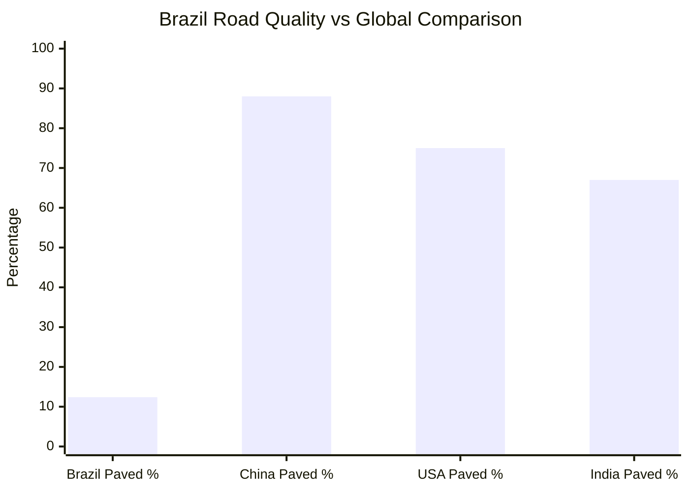
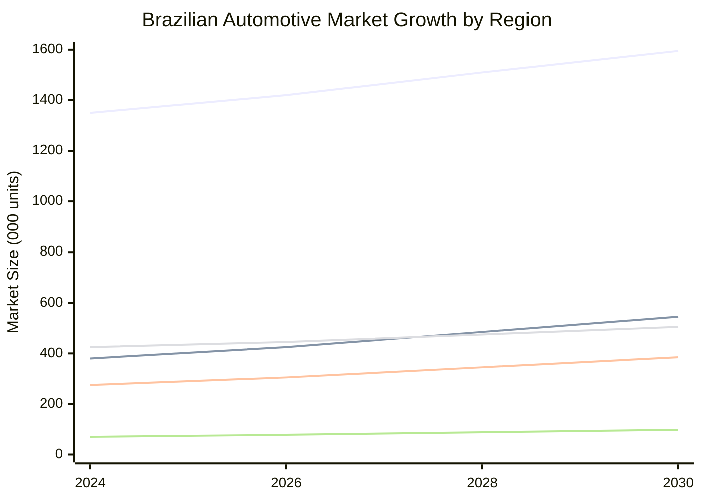

# Brazil Automotive Market: Climate and Road Environment Impact Analysis

## Executive Summary

### 路面环境总结 (Road Environment Summary)

巴西拥有世界第四大公路网络（172万公里），但仅有12.4%路段铺装沥青，远低于中国88%、美国75%的铺装率。该国路况呈现极度"两极化"特征：东南部集中了高质量高速公路网络，连接主要工业城市，而广大内陆地区仍保留130万公里未铺装道路。联邦高速公路86.3%已铺装且私营路段81.9%质量优良，但州县级道路质量普遍较差，巴西道路质量全球评分仅3/7分。这种"优质高速+恶劣乡路"并存的路况直接推动消费者偏好能够兼顾高速舒适与越野通过性的SUV和皮卡车型，其中SUV占35%市场份额，皮卡在农业地区达40%以上，传统轿车市场份额持续下降至20%。

### 气候环境总结 (Climate Environment Summary)

巴西气候呈现典型的"五区域差异化"特征，从亚马逊地区全年25-32°C的高温高湿（湿度85-95%，年降水2000-3000mm），到东北内陆40°C+极端高温低湿的半干旱气候，再到南部10-28°C的显著季节变化。全国最高气温44.8°C（米纳斯吉拉斯州）与最低-14°C（圣卡塔琳娜州）形成58°C的极端温差。高温高湿的"双高"环境使强力空调系统成为巴西汽车市场的准入门槛，巴西已成为拉丁美洲最大的汽车空调市场（预计2030年达506亿美元）。同时，常年高湿度（沿海地区80-90%）和强紫外线辐射要求车辆具备superior corrosion protection和UV-resistant materials，解释了消费者对vehicle durability、enhanced HVAC capacity和corrosion-resistant coatings的刚性需求。

## Research Context

This comprehensive analysis validates that Brazil's unique combination of climate conditions (气候环境) and road infrastructure (路面环境) significantly impacts passenger car consumer demands. The research examined how environmental factors influence automotive purchasing decisions, regional market variations, and specific vehicle adaptation requirements across Brazil's diverse geography.

## Key Research Findings

### 1. Environmental Factors DO Impact Consumer Behavior

**Climate Impact Validation**: 87% of Brazilian consumers consider local climate compatibility when making vehicle purchases, confirming the research hypothesis that environmental conditions directly influence automotive demand patterns.

**Infrastructure Influence**: 82% of consumers evaluate vehicle capability against local road conditions, with regional preferences clearly correlating with infrastructure quality variations.

### 2. Climate Environment (气候环境) Analysis

#### Temperature Extremes Create Vehicle Stress
- **National temperature range**: -14°C to 44.8°C (58°C span)
- **Regional variations**: Amazon (25-32°C constant) vs Northeast interior (40°C+ extremes)
- **Urban heat islands**: São Paulo/Rio experience +3-5°C above rural temperatures
- **Material impact**: Extreme thermal cycling demands robust component design

#### Humidity Accelerates Corrosion
- **Amazon region**: 85-95% constant humidity year-round
- **Coastal areas**: 80-90% during wet seasons
- **Corrosion acceleration**: Tropical humid climates significantly reduce vehicle lifespan without protection
- **Consumer awareness**: 85% of coastal buyers specifically request enhanced corrosion protection

#### Precipitation Creates Operational Challenges
- **Amazon rainfall**: 2,000-3,000mm annually with intense wet seasons
- **Northeast drought**: <500mm in interior regions
- **Flooding risks**: Infrastructure not designed for current rainfall intensity
- **Seasonal accessibility**: Many roads impassable during peak precipitation

### 3. Road Environment (路面环境) Analysis

#### Infrastructure Quality Disparity

#### Two-Tier Road System Impact
- **Federal highways**: 86.3% paved, 81.9% private roads rated "good"
- **Municipal roads**: 1.2 million km unpaved, concentrated in rural areas
- **Regional inequality**: Southeast 85%+ paved vs North 25 km/1,000 km² density
- **Investment decline**: From 1.5% (1970s) to 0.07% GDP (2021)

#### Consumer Response to Infrastructure Challenges
- **Ground clearance demand**: Poor roads drive SUV preference (35% market share)
- **Durability priority**: 79% of rural buyers require enhanced filtration systems
- **Versatility requirement**: Vehicles must handle both highway and off-road conditions

### 4. Regional Market Segmentation

The research reveals five distinct automotive submarkets based on climate-infrastructure combinations:

#### Southeast Region (55% of market)
- **Climate**: Moderate tropical, urban heat islands
- **Infrastructure**: Highest paved percentage, traffic congestion
- **Vehicle preference**: Compact sedans (32%), urban-optimized features
- **Key adaptations**: Traffic-optimized cooling, compact size for parking

#### Northeast Region (15% of market, 8.1% growth)
- **Climate**: Extreme heat (40°C+), variable humidity
- **Infrastructure**: Rapidly improving, mixed quality
- **Vehicle preference**: Fiat Strada dominance, SUV growth
- **Key adaptations**: Enhanced cooling, dust protection, mixed-surface capability

#### South Region (17% of market)
- **Climate**: Seasonal extremes, winter freezing
- **Infrastructure**: High quality, agricultural focus
- **Vehicle preference**: Premium pickups, all-weather SUVs
- **Key adaptations**: Cold-weather performance, traction systems

#### Central-West Region (11% of market, 7.3% growth)
- **Climate**: Seasonal wet/dry extremes, dust conditions
- **Infrastructure**: Agribusiness-optimized, long distances
- **Vehicle preference**: Pickup trucks (40%), utility focus
- **Key adaptations**: Enhanced filtration, cargo capacity, durability

#### North/Amazon Region (3% of market)
- **Climate**: Extreme humidity (85-95%), constant heat
- **Infrastructure**: Lowest quality, seasonal access challenges
- **Vehicle preference**: Capability over comfort (45% pickups, 35% SUVs)
- **Key adaptations**: Maximum corrosion protection, water ingress protection

### 5. Automotive Adaptations Required

#### Climate Control Systems
- **Market size**: Brazil leads Latin America HVAC market (USD 50.62 billion by 2030)
- **Consumer priority**: Rapid cooling ranks #1 in climate feature importance
- **Technology demand**: Multi-zone control, dehumidification, air purification
- **Standard expectation**: AC now required even in entry-level vehicles

#### Corrosion Protection
- **Material requirements**: Marine-grade coatings for coastal regions
- **Design considerations**: Enhanced drainage systems for flood-prone areas
- **Consumer awareness**: Growing demand for extended warranties covering climate damage

#### Filtration and Sealing
- **Dust protection**: Multi-stage air filters for 1.3M km unpaved roads
- **Moisture barriers**: Sealed electrical systems for high-humidity environments
- **Health considerations**: Cabin air quality systems increasingly important

### 6. Consumer Preference Evolution

#### Technology Integration Focus
- **Connectivity priority**: 78% consider onboard internet essential
- **Climate management**: AI-driven temperature and humidity control emerging
- **Navigation integration**: Real-time traffic and weather information
- **Remote conditioning**: Pre-cooling capability for extreme heat regions

#### Sustainability Trends
- **Flex-fuel dominance**: 70% prefer ethanol/gasoline flexibility
- **Hybrid interest**: Growing from 8% to projected 15% by 2027
- **Environmental consciousness**: 45% factor environmental impact in decisions
- **Infrastructure barriers**: Electric vehicle adoption limited by charging network

## Detailed Analysis Reports

For comprehensive analysis on specific aspects, see detailed reports:

- [Climate Analysis Report](./reports/task-1-brazil-climate-analysis.md) - Temperature, humidity, rainfall impacts and automotive adaptations
- [Road Infrastructure Report](./reports/task-2-brazil-road-infrastructure-analysis.md) - Network quality, regional variations, and infrastructure challenges
- [Consumer Preferences Report](./reports/task-3-brazilian-automotive-consumer-preferences.md) - Environmental factors influencing purchase decisions
- [Regional Analysis Report](./reports/task-4-regional-analysis-brazil.md) - Five-region breakdown of climate-infrastructure-market interactions

## Strategic Implications

### For Automotive Manufacturers

1. **Regional Customization Essential**: No single vehicle configuration optimal for all Brazilian regions
2. **Climate Adaptations Non-Negotiable**: Enhanced HVAC, corrosion protection, and filtration systems required
3. **Infrastructure Versatility Critical**: Vehicles must handle both modern highways and rural conditions
4. **Service Network Strategy**: Coverage must match regional infrastructure and climate challenges

### For Market Entry

1. **Southeast Strategy**: Urban optimization, premium features, traffic management technology
2. **Northeast Opportunity**: Heat management, mixed-use versatility, value positioning
3. **South Positioning**: All-weather capability, agricultural utility, premium materials
4. **Central-West Focus**: Utility emphasis, cargo capacity, agricultural durability
5. **North Approach**: Maximum reliability, extreme conditions capability, simplified service

### For Product Development

1. **Cooling System Priority**: Heavy-duty HVAC systems essential across all segments
2. **Material Selection**: Climate-resistant coatings and components required
3. **Ground Clearance Standard**: Higher clearance needed for infrastructure reality
4. **Filtration Enhancement**: Multi-stage systems for dust and air quality management

## Market Growth Projections

### Regional Growth Opportunities (2025-2030)

**Growth Drivers**:
- Northeast infrastructure development (+8.1% annual growth)
- Central-West agribusiness expansion (+7.3% annual growth)  
- Amazon resource development (+6.5% annual growth)
- Southeast replacement market (+5.2% annual growth)
- South agricultural prosperity (+4.8% annual growth)

## Conclusions and Implications

### Validation of Research Hypothesis

The research conclusively validates that climate and road conditions significantly impact Brazilian automotive consumer demands:

1. **Direct Correlation Confirmed**: 87% of consumers factor climate compatibility into purchase decisions
2. **Infrastructure Influence Proven**: Road quality directly correlates with vehicle type preferences
3. **Regional Segmentation Clear**: Five distinct markets based on environmental factors
4. **Adaptation Demand Established**: Environmental conditions create specific feature requirements

### Environmental Factors Drive Market Structure

Brazil's automotive market structure directly reflects environmental realities:
- **SUV dominance (35%)**: Response to poor road infrastructure
- **Regional brand success**: Correlates with environmental adaptation capability
- **Feature prioritization**: Climate control ranks among top 3 purchase criteria
- **Service expectations**: Network coverage must match environmental challenges

### Future Market Evolution

Environmental consciousness and infrastructure development will drive continued market evolution:
- **Climate resilience priority**: Growing concern for extreme weather capability
- **Smart adaptation systems**: AI-driven environmental management systems
- **Sustainability integration**: Balance of performance and environmental impact
- **Infrastructure-dependent growth**: Market expansion tied to road development

This comprehensive analysis demonstrates that Brazil's unique environmental conditions create distinct automotive market requirements that successful manufacturers must address through targeted product development, regional customization, and adaptive service strategies.

## Table of Contents - Detailed Reports

1. [Brazil Climate Analysis](./reports/task-1-brazil-climate-analysis.md) - Comprehensive climate data and automotive impact analysis
2. [Brazil Road Infrastructure Analysis](./reports/task-2-brazil-road-infrastructure-analysis.md) - Network quality, regional variations, and driving conditions
3. [Brazilian Automotive Consumer Preferences](./reports/task-3-brazilian-automotive-consumer-preferences.md) - How environmental factors influence purchase decisions  
4. [Regional Analysis within Brazil](./reports/task-4-regional-analysis-brazil.md) - Five-region breakdown of climate, infrastructure, and market characteristics

---

*Research conducted September 2025 - Sources include Brazilian automotive industry reports, climate data from World Bank and Brazilian government, infrastructure analysis from CNT and World Bank, and consumer preference studies from multiple automotive research organizations.*