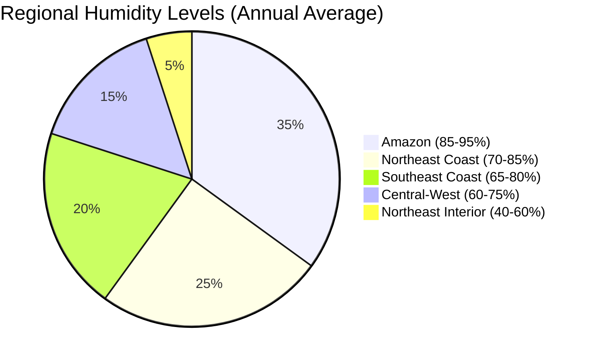

# Task 1: Brazil Climate Analysis - Temperature, Humidity, Rainfall, and Automotive Impact

## Overview

Brazil's vast territory encompasses multiple climate zones, creating diverse environmental challenges for automotive vehicles. The country's climate conditions significantly impact vehicle performance, maintenance requirements, and consumer preferences across different regions.

## Temperature Conditions

### National Temperature Range
Brazil experiences extreme temperature variations:
- **Highest recorded**: 44.8°C (112.6°F) in Araçuaí, Minas Gerais (November 2023)
- **Lowest recorded**: -14°C (7°F) in Caçador, Santa Catarina (June 1952)
- **Average national temperature**: 25°C (77°F) in most lowlands
- **Northeast drought regions**: Average 29°C (84°F), with daytime temperatures exceeding 38-40°C (100-104°F)

### Regional Temperature Patterns

| Region | Average Temperature | Seasonal Variation | Extreme Conditions |
|--------|-------------------|-------------------|------------------|
| Amazon (North) | 25-32°C | Minimal variation year-round | High humidity amplifies heat stress |
| Northeast | 29°C (interior) | Dry season: >40°C | Highest temperatures in Brazil |
| Southeast | 13-22°C (south of Tropic) | Hot summer, mild winter | Wide seasonal variation |
| South | 13-28°C | Significant seasonal changes | Winter temperatures near freezing |
| Central-West | 20-28°C | Distinct wet/dry seasons | High diurnal temperature variation |

### Automotive Temperature Impacts

According to research from [SAE International](https://www.sae.org/publications/technical-papers/content/620240/), extreme temperatures create significant challenges:

- **Engine cooling systems** must handle temperatures exceeding 40°C ambient
- **Battery performance** degrades rapidly in high temperatures
- **Material expansion/contraction** stress from temperature ranges spanning 58°C
- **Air conditioning systems** require enhanced capacity for tropical regions

## Humidity Conditions

### National Humidity Patterns
Brazil's humidity levels vary dramatically:
- **Peak humidity**: 92% average maximum (April in Maranhão)
- **Lowest humidity**: 26% minimum (October in Federal District)
- **Amazon region**: Consistently above 80% humidity year-round
- **Coastal areas**: 80-90% during wet season

### Regional Humidity Distribution

### Automotive Humidity Impacts

High humidity conditions create specific challenges:
- **Corrosion acceleration**: Metal components deteriorate faster
- **Electrical system failures**: Moisture ingress into sensitive components
- **Air conditioning efficiency**: Reduced performance in high humidity
- **Interior comfort**: Difficulty maintaining comfortable cabin conditions

[Research from ResearchGate](https://www.researchgate.net/publication/274312089_Atmospheric_corrosion_in_tropical_humid_climates) indicates that atmospheric corrosion in tropical humid climates is characterized by permanently high temperatures and relative humidity with considerable precipitation, significantly accelerating vehicle deterioration.

## Precipitation Patterns

### National Rainfall Distribution
Brazil's rainfall patterns vary significantly by region:
- **National average**: 1,000-1,500mm annually
- **Amazon region**: >2,000mm, reaching 3,000mm in western areas
- **Northeast interior**: <500mm in drought polygon areas
- **Seasonal concentration**: Most rain falls December-April south of equator

### Regional Precipitation Analysis

| Region | Annual Rainfall | Wet Season | Dry Season | Impact on Vehicles |
|--------|----------------|------------|------------|------------------|
| Amazon | 2,000-3,000mm | Nov-May | Jun-Oct | Constant moisture exposure |
| Northeast Coast | 800-1,500mm | Dec-May | Jun-Nov | Salt spray + humidity |
| Northeast Interior | 200-800mm | Dec-Feb | Mar-Nov | Dust + extreme heat |
| Southeast | 1,200-2,000mm | Oct-Mar | Apr-Sep | Seasonal flooding risk |
| South | 1,200-1,800mm | Year-round | Limited dry period | Consistent moisture |

### Precipitation Impact on Automotive Performance

Extreme rainfall creates multiple challenges:
- **Flooding risks**: Vehicle water damage in urban areas
- **Road washouts**: Infrastructure damage affecting vehicle access
- **Increased corrosion**: Constant moisture exposure
- **Visibility reduction**: Safety concerns during heavy rains

According to [World Bank data](https://climateknowledgeportal.worldbank.org/country/brazil/climate-data-historical), infrastructure in megacities like Rio and São Paulo was not designed to face rising temperatures and more intense rainfall patterns.

## Climate Change Projections

### Temperature Trends
[Climate data](https://www.frontiersin.org/journals/earth-science/articles/10.3389/feart.2018.00228/full) shows:
- **Amazon warming**: 0.6°C increase from 1973-2013
- **Stronger dry season warming** in southeastern Amazon
- **Urban heat island effects** intensifying in major cities

### Precipitation Changes
- **Southeast/South**: Increased flooding and landslide risks
- **Northeast**: Trend toward decreased rainfall and increased drought
- **Amazon**: Potential for longer dry seasons

## Automotive Adaptations Required

### Cooling System Enhancements
Based on [automotive maintenance guides](https://www.miamilakesautomall.com/chevy-blog/basic-car-maintenance-tropical-climates/):
- **Enhanced radiator capacity** for sustained high-temperature operation
- **Heavy-duty cooling fans** for stop-and-go urban traffic
- **Improved coolant systems** to prevent overheating
- **Synthetic oil requirements** for high-temperature performance

### Climate Control Systems
The [automotive HVAC market research](https://www.mordorintelligence.com/industry-reports/automotive-hvac-market) indicates Brazilian demand for:
- **Higher capacity air conditioning** systems
- **Improved dehumidification** capabilities
- **Enhanced air filtration** for dust and pollutants
- **Rapid cooling technology** for extreme heat conditions

### Material and Component Adaptations
- **Corrosion-resistant coatings** for high humidity environments
- **UV-resistant exterior materials** for intense solar radiation
- **Enhanced sealing systems** against moisture ingress
- **Climate-appropriate lubricants** and fluids

## Regional Climate Summary

Brazil's climate creates a "multi-reality" environment for automotive applications:

**Northern/Amazon Region**: Tropical rainforest climate with high temperatures (25-32°C), extreme humidity (85-95%), and heavy rainfall (2,000-3,000mm), requiring maximum corrosion protection and moisture management.

**Northeast Region**: Semi-arid to tropical climate with extreme heat (40°C+), variable humidity (40-85%), and low rainfall (<800mm interior), demanding enhanced cooling capacity and dust protection.

**Southeast Region**: Tropical to subtropical climate with moderate temperatures (13-28°C), seasonal humidity variations (65-85%), and concentrated wet seasons (1,200-2,000mm), requiring balanced climate control systems.

**South Region**: Subtropical to temperate climate with significant seasonal variations (13-28°C), moderate humidity (60-80%), and distributed rainfall (1,200-1,800mm), needing temperature adaptation flexibility.

**Central-West Region**: Tropical savanna climate with distinct seasons (20-28°C), moderate humidity (60-75%), and seasonal rainfall patterns (1,000-1,500mm), requiring agricultural-duty vehicle specifications.

## Key Findings

1. **Climate diversity necessitates regional vehicle adaptations** - No single vehicle configuration optimal for all Brazilian regions
2. **Extreme temperature ranges create significant material stress** - 58°C temperature span requires robust component design
3. **High humidity accelerates corrosion** - Tropical regions demand enhanced protective coatings
4. **Intense rainfall creates infrastructure challenges** - Vehicles must handle flooding and poor road conditions
5. **Climate change intensifies existing challenges** - Future vehicle designs must account for increasing temperature and precipitation extremes

## References

1. [Climate Change in Brazil - Wikipedia](https://en.wikipedia.org/wiki/Climate_change_in_Brazil)
2. [Brazil Climate Data - World Bank](https://climateknowledgeportal.worldbank.org/country/brazil/climate-data-historical)
3. [Vehicle Corrosion in Tropical Climates - SAE International](https://www.sae.org/publications/technical-papers/content/620240/)
4. [Atmospheric Corrosion Research - ResearchGate](https://www.researchgate.net/publication/274312089_Atmospheric_corrosion_in_tropical_humid_climates)
5. [Basic Car Maintenance for Tropical Climates](https://www.miamilakesautomall.com/chevy-blog/basic-car-maintenance-tropical-climates/)
6. [Automotive HVAC Market Analysis - Mordor Intelligence](https://www.mordorintelligence.com/industry-reports/automotive-hvac-market)