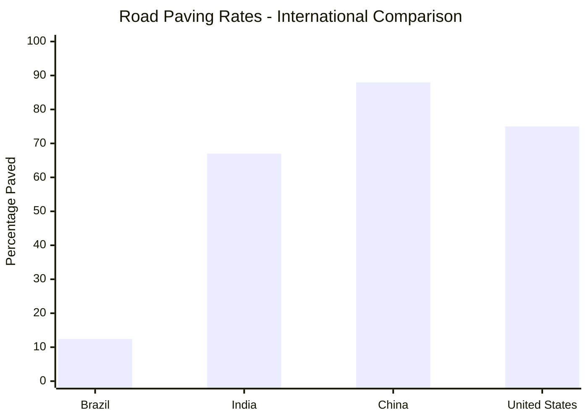
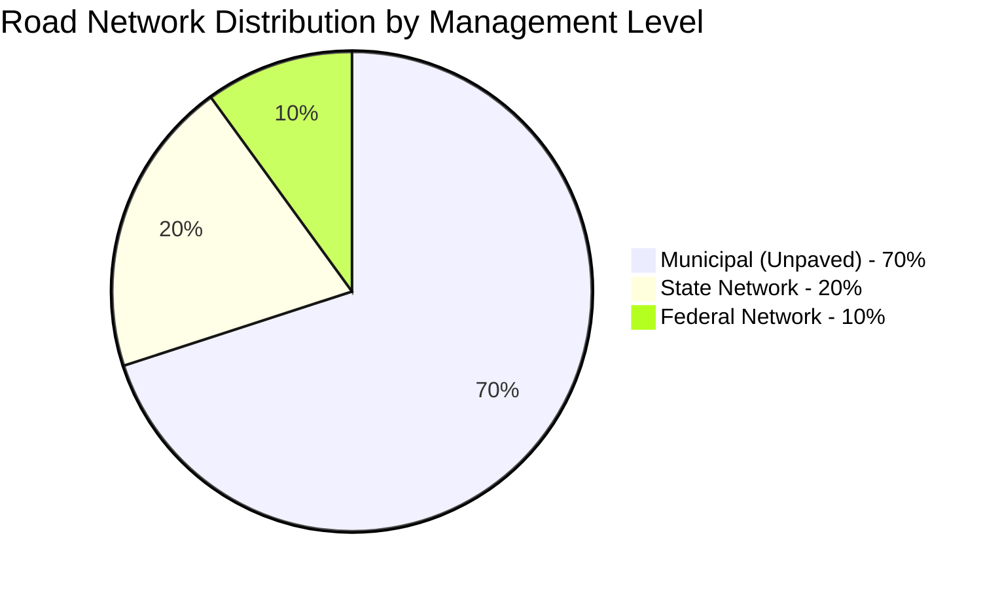
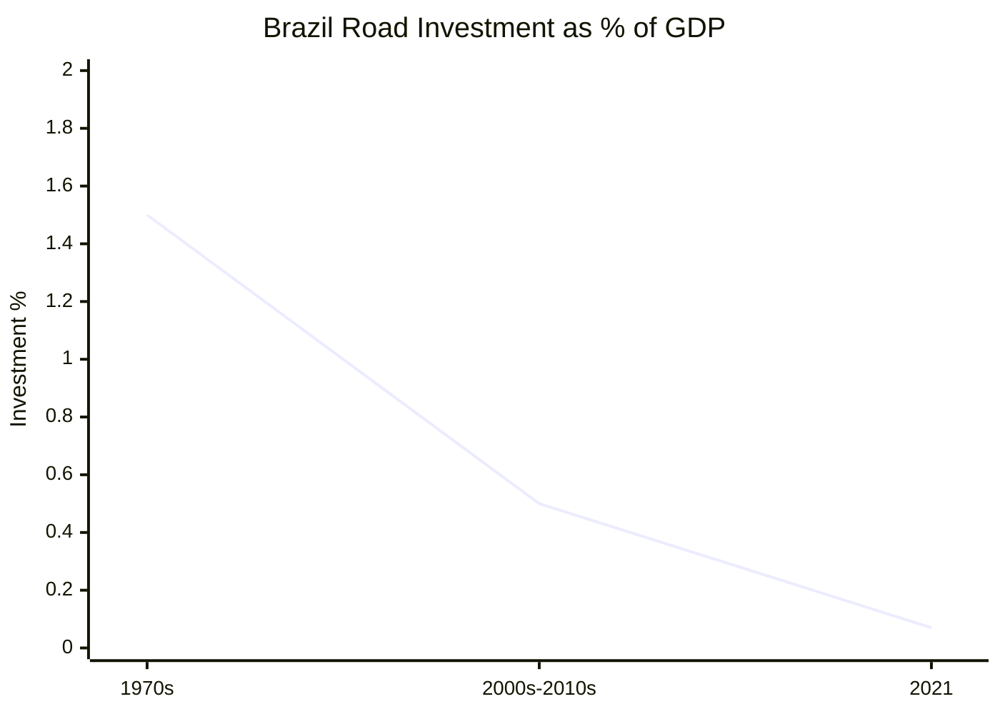
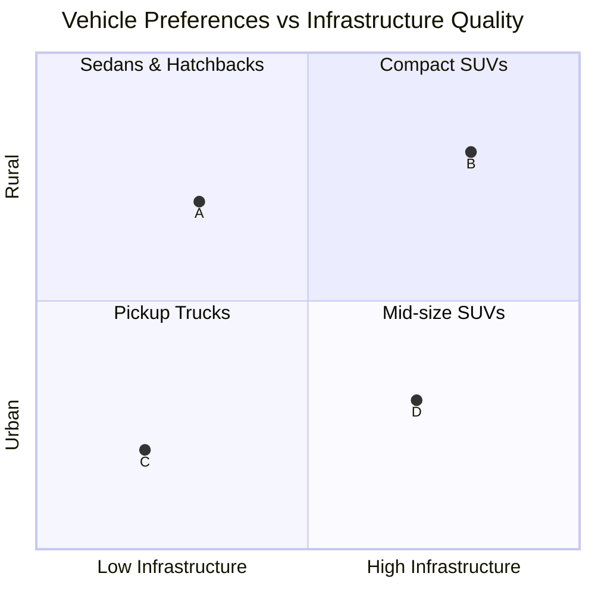

# Task 2: Brazil Road Infrastructure Analysis - Network Quality, Regional Variations, and Driving Conditions

## Overview

Brazil possesses the world's fourth-largest road network, yet faces significant infrastructure challenges that directly impact automotive market preferences and vehicle requirements. The quality disparity between different road types and regions creates distinct demands for vehicle capabilities.

## National Road Network Statistics

### Network Scale
According to [Transport in Brazil - Wikipedia](https://en.wikipedia.org/wiki/Transport_in_Brazil), Brazil's road infrastructure includes:
- **Total road network**: 1,720,700 km (1,069,200 miles)
- **Paved roads**: 213,500 km (132,700 miles) - only 12.4% of total network
- **Federal highways**: 75,800 km (86.3% paved)
- **State roads**: Significant portion of network with lower paving rates
- **Municipal roads**: 1.2 million km mostly unpaved

### Global Comparison

Brazil significantly lags behind other major economies in road infrastructure development, with only 12.4% of roads paved compared to 67% in India, 88% in China, and 75% in the United States.

## Road Quality Assessment

### National Quality Ranking
Based on [global road quality data](https://www.theglobaleconomy.com/Brazil/roads_quality/):
- **Brazil quality score**: 3 out of 7 points (2019)
- **World average**: 4.07 points
- **Global ranking**: Below average infrastructure quality
- **Safety ranking**: Third globally in road deaths

### Quality Distribution by Management Type

| Management Type | Quality Rating "Good" | Quality Rating "Terrible" | Network Coverage |
|----------------|---------------------|------------------------|-----------------|
| **Private Highways** | 81.9% | 0.1% | Limited coverage |
| **Public Federal** | 34.2% | Data varies | Federal network |
| **State/Municipal** | <34.2% | Higher percentage | Majority of network |

*Source: [National Confederation of Transport (CNT) 2019](https://www.wilsoncenter.org/blog-post/privatization-sao-paulos-proven-solution-for-brazils-long-suffering-highway-system)*

## Regional Infrastructure Analysis

### Federal vs State Highway Distribution

### Regional Paving Progress

| Region | Infrastructure Status | Municipal Access | Key Challenges |
|--------|---------------------|------------------|----------------|
| **Southeast** | Highest development | Most cities connected | Urban congestion |
| **South** | Good connectivity | RS: 54 cities without paved access (2020) | Mountainous terrain |
| **Northeast** | Improving rapidly | AL, PB: 100% access achieved | Funding constraints |
| **Central-West** | Agricultural focus | Expanding agribusiness access | Vast distances |
| **North/Amazon** | Lowest density | Limited connectivity | Environmental restrictions |

### State-by-State Achievements
According to [infrastructure reports](https://www.worldbank.org/en/news/feature/2023/12/06/brazil-what-does-a-good-road-look-like):
- **Santa Catarina**: 100% paved municipal access (2014)
- **Paraíba**: 100% paved municipal access (2017) 
- **Alagoas**: 100% paved municipal access (2021)
- **Rio Grande do Sul**: 54 cities still without paved access (2020)

## Infrastructure Investment Patterns

### Historical Investment Trends

Investment has declined dramatically:
- **1970s**: 1.5% of budget invested in roads
- **2000s-2010s**: 0.5% of budget
- **2021**: Only 0.07% of GDP (R$5.8 billion)
- **Comparison**: US/EU averaged 1% between 1995-2013

### Investment Impact Analysis
The [World Bank endorsement](https://www.worldbank.org/en/news/press-release/2024/09/10/world-bank-endorses-major-infrastructure-initiative-to-boost-road-management-in-bahia-brazil) indicates that inadequate investment has resulted in:
- **73% decrease** in road investment from 2010-2011 (R$20 billion to R$5.8 billion)
- **Catastrophic state** of interstate highways
- **R$3 billion annual cost** in healthcare for road-related injuries

## Driving Conditions and Safety

### Urban Driving Conditions
Major metropolitan areas present unique challenges:
- **São Paulo/Rio infrastructure** not designed for current temperature and rainfall patterns
- **Urban heat islands** affecting vehicle cooling requirements
- **Traffic congestion** creating stop-and-go conditions demanding robust cooling systems

### Rural Driving Conditions
Based on [driving guides](https://en.wikivoyage.org/wiki/Driving_in_Brazil):
- **Unpaved roads**: 1.3 million km requiring high ground clearance
- **Dust conditions**: Extensive filtration system requirements
- **Limited lighting**: Night driving safety concerns
- **Emergency services**: Limited access in remote areas

### Safety Considerations
- **20% of hospital admissions** (2018) related to road injuries
- **Robbery risks**: Recommendations to avoid stopping at red lights in certain areas
- **Visibility issues**: Poor lighting on rural roads
- **Extreme weather exposure**: Limited shelter during storms

## Infrastructure Impact on Vehicle Requirements

### Ground Clearance and Durability
The predominance of unpaved roads creates demand for:
- **Higher ground clearance**: Navigate rough terrain
- **Reinforced undercarriage**: Protect against rocks and debris
- **Skid plates**: Engine and transmission protection
- **All-terrain capabilities**: Handle diverse surface conditions

### Filtration and Sealing
Dusty conditions on 1.3 million km of unpaved roads require:
- **Enhanced air filtration**: Multiple-stage air cleaners
- **Cabin air filters**: Passenger comfort and health
- **Engine protection**: Extended service intervals for harsh conditions
- **Transmission sealing**: Prevent contamination

### Cooling System Adaptations
Poor road conditions create additional cooling demands:
- **Low-speed operation**: Extended periods in traffic/rough terrain
- **Enhanced radiator capacity**: Handle sustained operation
- **Auxiliary cooling fans**: Compensate for reduced airflow
- **Transmission cooling**: Additional heat load from difficult terrain

## Regional Road Network Characteristics

### Southeast Region - Industrial Corridor
- **Highest paved percentage**: Best connectivity between major cities
- **Traffic density**: Congestion creates cooling and durability demands
- **Infrastructure quality**: Mix of excellent highways and deteriorating urban roads
- **Vehicle implications**: Urban-focused sedans and SUVs with comfort priorities

### Northeast Region - Expanding Network
- **Rapid development**: Government investment in paved access
- **Climate challenges**: Extreme heat affects asphalt quality
- **Mixed conditions**: Modern highways alongside rural unpaved roads
- **Vehicle implications**: Versatile vehicles handling both highway and rural conditions

### Central-West Region - Agricultural Focus
- **Agribusiness priority**: Investment follows commodity transport routes
- **Seasonal access**: Some roads impassable during rainy season
- **Long distances**: Extended highway travel requirements
- **Vehicle implications**: Pickup trucks and SUVs for cargo and versatility

### North/Amazon Region - Limited Infrastructure
- **Lowest road density**: 25 km/1,000 km² (30% below regional average)
- **Environmental constraints**: Limited expansion due to conservation
- **Extreme conditions**: Heavy rainfall and difficult terrain
- **Vehicle implications**: Robust 4WD vehicles with extreme weather capability

### South Region - Developed Network
- **Good connectivity**: Most comprehensive paved network
- **Mountainous terrain**: Challenging topography in some areas
- **Weather extremes**: Snow and ice conditions in winter
- **Vehicle implications**: All-weather capability and mountain driving performance

## Automotive Market Implications

### Vehicle Type Preferences by Infrastructure Quality

### Infrastructure-Driven Feature Demands

| Infrastructure Type | Required Features | Popular Vehicle Categories |
|-------------------|------------------|--------------------------|
| **Paved Highways** | Comfort, fuel efficiency, connectivity | Sedans, compact hatchbacks |
| **Mixed Paved/Unpaved** | Versatility, ground clearance, durability | Compact SUVs, crossovers |
| **Predominantly Unpaved** | 4WD capability, protection, cargo capacity | Pickup trucks, full-size SUVs |
| **Urban Congested** | Compact size, efficient cooling, comfort | City cars, compact sedans |

## Key Infrastructure Challenges

### Investment Shortfall
- **Current investment**: 0.07% of GDP (2021)
- **Required investment**: Estimated 1-2% of GDP for adequate maintenance and expansion
- **Infrastructure decay**: Federal highways described as "catastrophic"

### Regional Inequality
- **Southeast advantage**: Concentrated industrial development and infrastructure
- **Northern disadvantage**: Limited connectivity and development
- **Rural isolation**: Many communities still lack paved road access

### Climate Impact
- **Heat damage**: Asphalt softening and deterioration in extreme temperatures
- **Flood damage**: Infrastructure destruction during intense rainfall periods
- **Maintenance challenges**: Difficult year-round access for repairs

## Future Infrastructure Trends

### Private Investment Growth
São Paulo's privatization success demonstrates potential:
- **Quality improvement**: Private highways show 81.9% "good" rating vs 34.2% public
- **Maintenance consistency**: Better long-term infrastructure preservation
- **Technology integration**: Smart highway systems and connectivity

### Regional Development Priorities
- **Northeast expansion**: Continued investment in paved access completion
- **Agribusiness corridors**: Central-West infrastructure development
- **Urban mobility**: Metropolitan area traffic management improvements

## Conclusions

Brazil's road infrastructure creates a "two-tier" automotive market:

1. **High-quality corridors**: Modern highways connecting major urban centers, suitable for conventional passenger vehicles with comfort and efficiency priorities

2. **Rural/developing networks**: Extensive unpaved and poor-quality roads requiring vehicles with durability, ground clearance, and all-terrain capabilities

The infrastructure gap directly influences Brazilian consumer preferences toward versatile vehicles capable of handling both highway comfort and rural durability requirements, explaining the popularity of SUVs, pickup trucks, and robust compact vehicles in the Brazilian market.

## References

1. [Brazilian Highway System - Wikipedia](https://en.wikipedia.org/wiki/Brazilian_Highway_System)
2. [Transport in Brazil - Wikipedia](https://en.wikipedia.org/wiki/Transport_in_Brazil)
3. [Brazil Roads Quality - TheGlobalEconomy.com](https://www.theglobaleconomy.com/Brazil/roads_quality/)
4. [São Paulo Highway Privatization - Wilson Center](https://www.wilsoncenter.org/blog-post/privatization-sao-paulos-proven-solution-for-brazils-long-suffering-highway-system)
5. [World Bank Infrastructure Initiative - Bahia](https://www.worldbank.org/en/news/press-release/2024/09/10/world-bank-endorses-major-infrastructure-initiative-to-boost-road-management-in-bahia-brazil)
6. [Driving in Brazil - Wikivoyage](https://en.wikivoyage.org/wiki/Driving_in_Brazil)
7. [Brazil: What does a Good Road look like? - World Bank](https://www.worldbank.org/en/news/feature/2023/12/06/brazil-what-does-a-good-road-look-like)