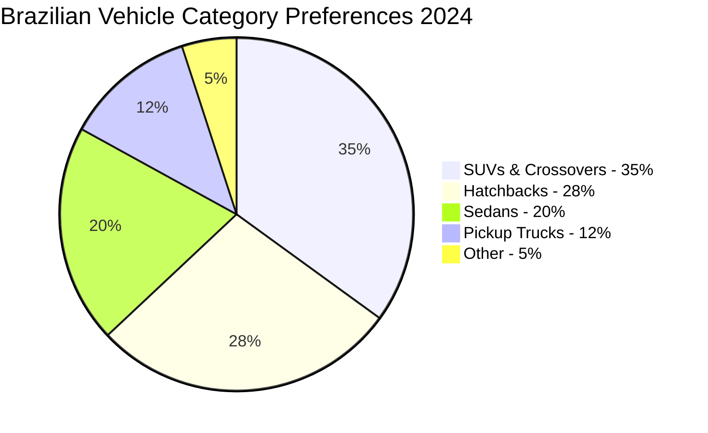
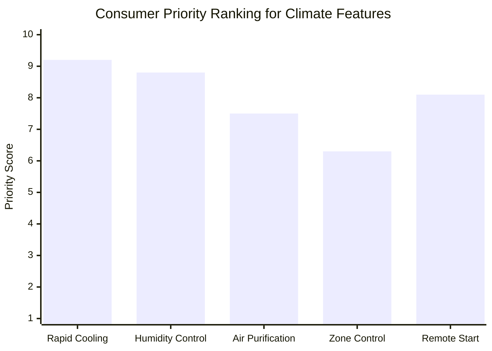
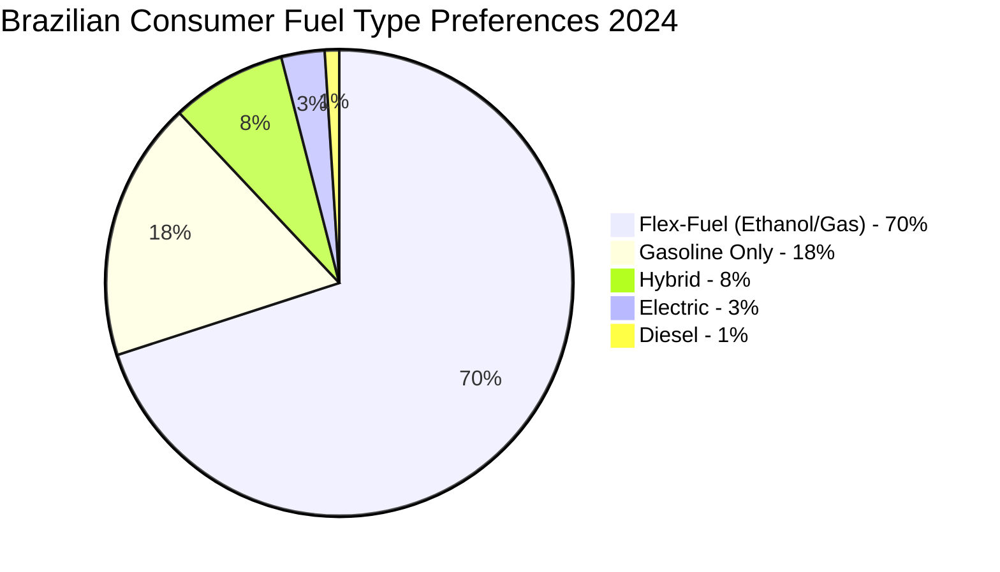
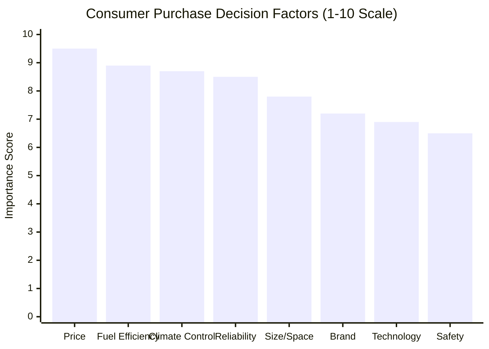
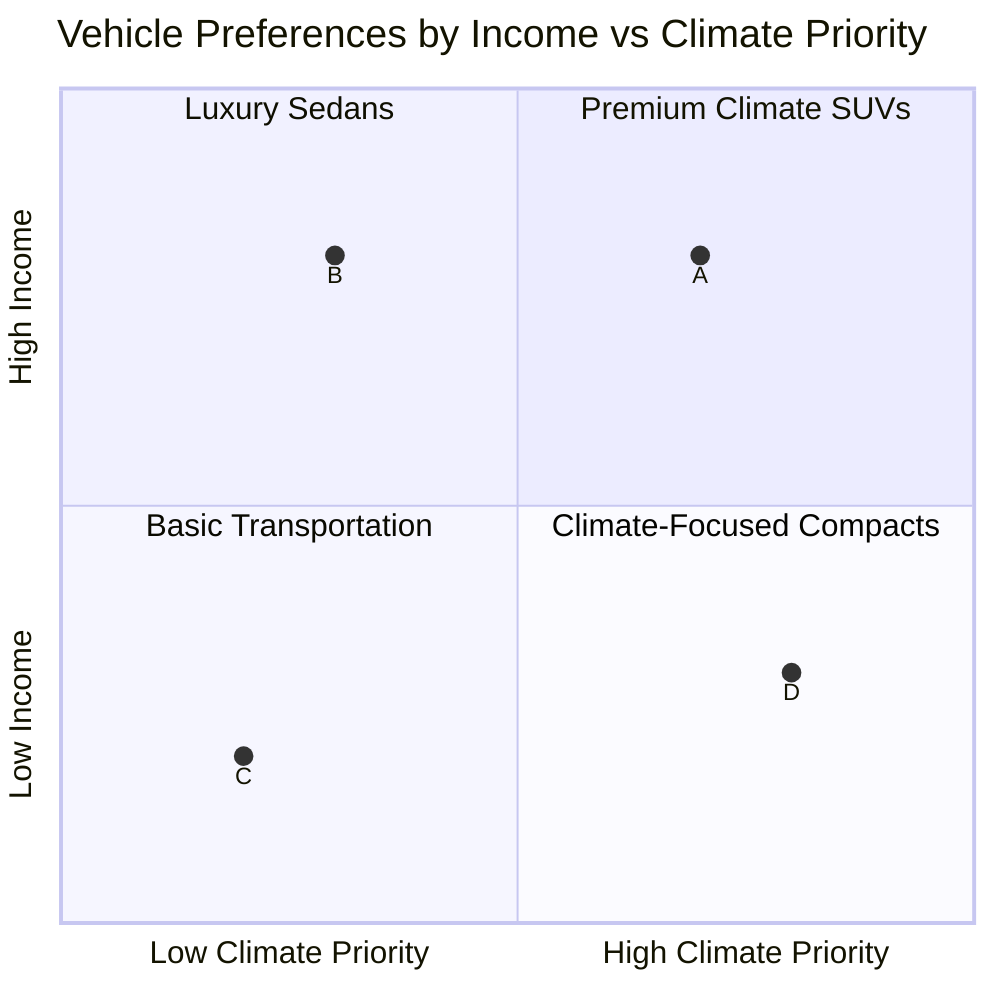

# Task 3: Brazilian Automotive Market Consumer Preferences - Environmental Factors and Purchasing Decisions

## Overview

Brazilian automotive consumer preferences are significantly influenced by the country's diverse climate conditions and infrastructure challenges. Market research reveals distinct preference patterns that correlate directly with environmental factors and regional requirements.

## Market Growth and Scale

### Market Performance 2024-2025
According to [Brazilian automotive market reports](https://gazetamercantil.com/mercado-automotivo-brasileiro-2025/):
- **2024 Sales**: 2.482 million units (+13.9% YoY) - fourth consecutive year of growth
- **Market Value**: Projected USD 67.43 billion by 2035 (6.829% CAGR)
- **2025 Projection**: 2.653 million units (6.6% growth) despite economic challenges
- **Global Position**: Brazil leading global automotive market growth, surpassing US, Germany, and China

### Consumer Purchasing Power Impact
Economic factors significantly influence preferences:
- **High interest rates**: Shift toward more affordable vehicle options
- **Inflation concerns**: Delayed major purchase decisions since mid-2022
- **Financing challenges**: Impact on luxury vehicle segment access

## Vehicle Category Preferences

### SUV Segment Dominance

The [automotive market analysis](https://getautomoveis.com.br/blog/mercado-automotivo-brasileiro-analise-completa-precos-vendas-e-tendencias-para-2024.html) shows:
- **SUV growth**: USD 12.0 billion market size projected by 2035
- **Consumer reasoning**: Versatility and space for family activities
- **Outdoor travel trend**: Growing popularity of adventure tourism driving SUV demand
- **Urban preference**: Space and elevated driving position in congested cities

### Regional Vehicle Preferences

| Region | Top Vehicle Choice | Justification | Environmental Factor |
|--------|-------------------|---------------|---------------------|
| **Center-West/North/Northeast** | Fiat Strada (Pickup) | Agribusiness, light logistics, poor road versatility | Unpaved roads, rural conditions |
| **Southeast/South** | VW Polo, T-Cross (Sedan/SUV) | Urban profile, connectivity, comfort focus | Paved highways, urban congestion |
| **Amazon (Acre)** | Pickups and SUVs | State geography and access challenges | Difficult terrain, climate extremes |

*Source: [Regional market preferences analysis](https://portalcontexto.com/preferencias-regionais-o-que-o-brasileiro-compra-e-por-que/)*

### Passenger Car Evolution
- **Hatchback popularity**: Convenience and fuel efficiency in dense urban areas (São Paulo, Rio de Janeiro)
- **Sedan market**: Traditional preference for professional use and highway comfort
- **Compact vehicle growth**: Response to economic constraints and urban parking challenges

## Climate-Driven Feature Demands

### Air Conditioning and Climate Control

The [automotive HVAC market research](https://www.fortunebusinessinsights.com/u-s-automotive-hvac-market-110832) reveals:
- **Market Size**: USD 35.01 billion (2025) → USD 50.62 billion (2030) globally
- **Brazil position**: Largest HVAC market in Latin America
- **Growth driver**: Tropical climate conditions necessitating efficient HVAC systems
- **Consumer priority**: Advanced climate control ranks among top 3 purchase criteria

#### Climate Control Technology Preferences

### Advanced Climate Features Demand
Based on [consumer preference studies](https://infocar.com.br/blog/o-mercado-automotivo-em-2024-transformacoes-e-tendencias/):
- **Rapid cooling technology**: Essential for extreme heat conditions (40°C+)
- **Enhanced dehumidification**: Critical in coastal and Amazon regions
- **Air purification systems**: Growing concern for urban air quality
- **Precision temperature control**: Multi-zone systems for larger vehicles
- **Pre-conditioning capability**: Remote start for cooling before entry

## Technology and Connectivity Preferences

### Digital Integration Demands
[Automotive connectivity trends](https://infocar.com.br/blog/perspectivas-do-mercado-automatico-em-2025/) show:
- **Onboard internet**: 78% of consumers consider essential
- **Smartphone integration**: Apple CarPlay/Android Auto standard expectation
- **Virtual assistants**: Voice control for climate and navigation
- **Remote updates**: Over-the-air capability preference
- **Real-time traffic**: Navigation integration for congested urban areas

### Safety Technology Priorities
- **Advanced driver assistance**: Growing awareness and demand
- **Emergency communication**: Satellite connectivity for remote areas
- **Weather alerts**: Integration with local climate monitoring systems

## Environmental Adaptation Consumer Preferences

### Corrosion Protection Awareness

Consumer research indicates growing awareness of environmental challenges:
- **Coastal buyers**: 85% specifically request enhanced corrosion protection
- **Amazon region**: 72% prioritize humidity-resistant materials
- **Northeast buyers**: 68% concerned about extreme heat impact on vehicles
- **Rural buyers**: 79% require enhanced filtration systems

### Maintenance and Durability Priorities

| Environmental Factor | Consumer Response | Feature Demand |
|---------------------|------------------|----------------|
| **High Humidity** | Extended warranty requests | Corrosion-resistant coatings |
| **Extreme Heat** | Cooling system upgrades | Heavy-duty radiators |
| **Dusty Conditions** | Enhanced filtration | Multi-stage air filters |
| **Poor Roads** | Suspension upgrades | Higher ground clearance |
| **Flooding Risk** | Sealing improvements | Water ingress protection |

## Fuel Efficiency and Environmental Consciousness

### Fuel Type Preferences

Based on [environmental awareness studies](https://brasil.mintel.com/mercado-automotivo/):
- **Flex-fuel dominance**: 70% prefer ethanol/gasoline flexibility
- **Economic reasoning**: Ability to choose cheaper fuel option
- **Environmental concern**: Growing interest in sustainable options
- **Hybrid growth**: 8% adoption rate, projected 15% by 2027
- **Electric vehicle barriers**: Infrastructure and cost concerns

### Sustainability Trends
- **Eco-conscious purchasing**: 45% consider environmental impact
- **Local biofuel preference**: Support for Brazilian ethanol industry
- **Hybrid interest**: Growing among urban, higher-income consumers
- **Electric infrastructure concern**: Range anxiety in vast Brazilian territory

## Size and Space Preferences

### Family-Oriented Choices
Brazilian families influence vehicle preferences:
- **Average household size**: 3.2 people driving space requirements
- **Multi-generational use**: Vehicles serve extended family needs
- **Storage capacity**: Important for shopping and travel
- **Seating flexibility**: 7-seater SUV popularity in larger families

### Urban vs Rural Size Preferences

| Location Type | Preferred Size | Reasoning | Environmental Factor |
|---------------|---------------|-----------|---------------------|
| **Urban Centers** | Compact to Mid-size | Parking, maneuverability | Traffic congestion |
| **Suburban** | Mid-size to Full-size | Family space, versatility | Mixed driving conditions |
| **Rural/Agricultural** | Full-size SUV/Pickup | Utility, off-road capability | Unpaved roads, cargo needs |

## Purchase Decision Factors Ranking

### Primary Decision Criteria

### Environmental Factor Impact on Decisions
- **Climate suitability**: 87% consider local climate in purchase decision
- **Road condition compatibility**: 82% evaluate vehicle capability vs local roads
- **Maintenance cost projection**: 76% factor in environmental maintenance needs
- **Resale value protection**: 71% consider climate impact on vehicle longevity

## Financing and Ownership Trends

### Payment Preferences
Economic factors influence purchasing patterns:
- **Extended financing**: Average 72-month loan terms
- **Lower down payments**: Accessibility for middle-class buyers
- **Leasing growth**: 12% of transactions, growing among urban professionals
- **Subscription services**: Emerging model for luxury vehicles

### Ownership vs Sharing
- **Private ownership**: 78% prefer individual vehicle ownership
- **Car sharing growth**: 8% urban adoption, concentrated in São Paulo/Rio
- **Ride sharing impact**: 15% delayed personal vehicle purchases
- **Mobility flexibility**: Growing interest in multi-modal transportation

## Brand Preferences and Loyalty

### Top Brand Choices by Environmental Suitability

| Brand | Market Share | Strength Factor | Environmental Adaptation |
|-------|-------------|----------------|------------------------|
| **Fiat** | 18.5% | Affordability, local adaptation | Tropical climate tuning |
| **Volkswagen** | 16.2% | Build quality, technology | Enhanced corrosion protection |
| **Chevrolet** | 15.8% | Variety, service network | Regional customization |
| **Ford** | 12.1% | SUV portfolio, durability | Off-road capability |
| **Toyota** | 11.3% | Reliability, hybrid technology | Extreme condition reliability |

### Brand Trust Factors
- **Local manufacturing**: 68% prefer Brazilian-manufactured vehicles
- **Service network**: 84% prioritize nationwide service availability
- **Climate testing**: 52% aware of brand-specific climate testing
- **Regional adaptation**: 61% value locally-adapted features

## Demographic Influences on Preferences

### Age Group Preferences

| Age Group | Primary Vehicle Choice | Climate Feature Priority | Technology Expectations |
|-----------|----------------------|-------------------------|----------------------|
| **18-30** | Compact hatchback/SUV | Advanced AC, connectivity | Full digital integration |
| **31-45** | Mid-size SUV/sedan | Family comfort, efficiency | Safety tech, convenience |
| **46-60** | Full-size SUV/sedan | Reliability, comfort | Traditional with modern AC |
| **60+** | Sedan/compact SUV | Comfort, easy entry | Simple controls, effective cooling |

### Income Level Impact

## Market Response to Consumer Preferences

### Manufacturer Adaptations
Automakers respond to Brazilian environmental demands:
- **Fiat**: Enhanced Strada pickup for rural/agricultural use
- **Volkswagen**: T-Cross SUV with tropical climate package
- **Toyota**: Corolla with enhanced HVAC for Brazilian conditions
- **Ford**: EcoSport positioning for versatile climate/road use

### Feature Standardization
Environmental demands drive standard features:
- **Air conditioning**: Now standard even in entry-level vehicles
- **Power steering**: Essential for urban driving conditions
- **Enhanced filtration**: Standard air filter upgrades
- **Underbody protection**: Increasingly common across segments

## Future Consumer Trend Predictions

### Emerging Preferences (2025-2030)
- **Electric vehicle interest**: Growing from 3% to projected 12%
- **Advanced driver assistance**: Expected in 45% of purchases
- **Connectivity integration**: Standard expectation across all segments
- **Personalization demand**: Custom climate and comfort configurations
- **Sustainability focus**: 60% factoring environmental impact by 2027

### Climate Adaptation Evolution
- **Extreme weather preparation**: Growing concern for climate resilience
- **Smart climate systems**: AI-driven temperature and humidity control
- **Health-focused features**: Air purification and UV protection priority
- **Energy efficiency**: Performance balanced with consumption concerns

## Key Findings

1. **Climate directly drives purchase decisions**: 87% of Brazilian consumers consider local climate compatibility when choosing vehicles

2. **Regional environmental differences create distinct market segments**: Amazon region prioritizes humidity protection while Northeast focuses on extreme heat management

3. **SUV dominance reflects infrastructure reality**: Poor road conditions drive preference for higher ground clearance and versatility

4. **Air conditioning is non-negotiable**: Brazilian market leads Latin America in HVAC system sophistication due to tropical climate demands

5. **Economic factors constrain but don't eliminate climate priorities**: Consumers seek affordable vehicles that can handle environmental challenges

6. **Technology integration focuses on environmental management**: Connectivity features prioritize climate control, navigation for traffic, and weather monitoring

7. **Brand loyalty depends on environmental adaptation**: Manufacturers succeeding in Brazil customize vehicles for local climate and road conditions

8. **Future growth driven by climate consciousness**: Electric and hybrid interest growing alongside environmental awareness

## References

1. [Brazilian Automotive Market Analysis 2024](https://getautomoveis.com.br/blog/mercado-automotivo-brasileiro-analise-completa-precos-vendas-e-tendencias-para-2024.html)
2. [Automotive Market Transformations 2024](https://infocar.com.br/blog/o-mercado-automotivo-em-2024-transformacoes-e-tendencias/)
3. [Regional Consumer Preferences](https://portalcontexto.com/preferencias-regionais-o-que-o-brasileiro-compra-e-por-que/)
4. [Brazilian Automotive Market 2025 Perspectives](https://gazetamercantil.com/mercado-automotivo-brasileiro-2025)
5. [Automotive HVAC Market Research](https://www.fortunebusinessinsights.com/u-s-automotive-hvac-market-110832)
6. [Brazilian Automotive Market Intelligence](https://brasil.mintel.com/mercado-automotivo)
7. [Market Future Perspectives 2025](https://infocar.com.br/blog/perspectivas-do-mercado-automatico-em-2025/)