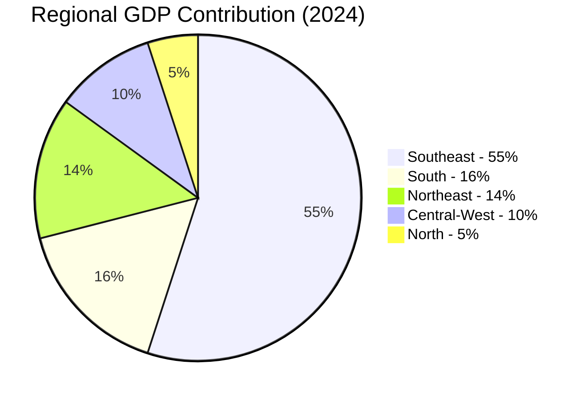
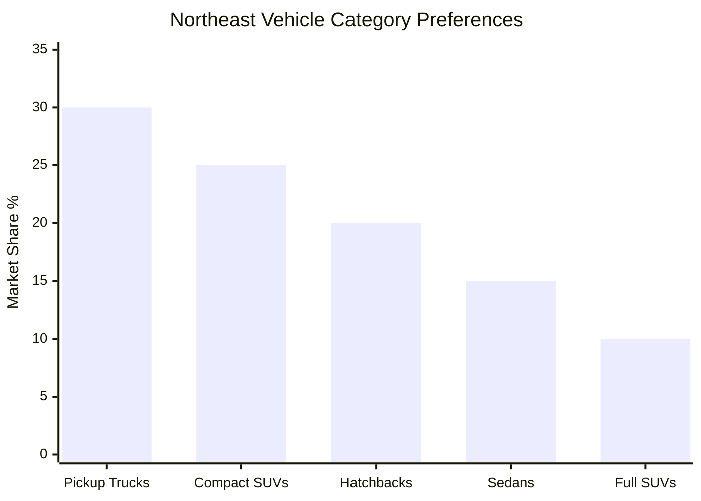
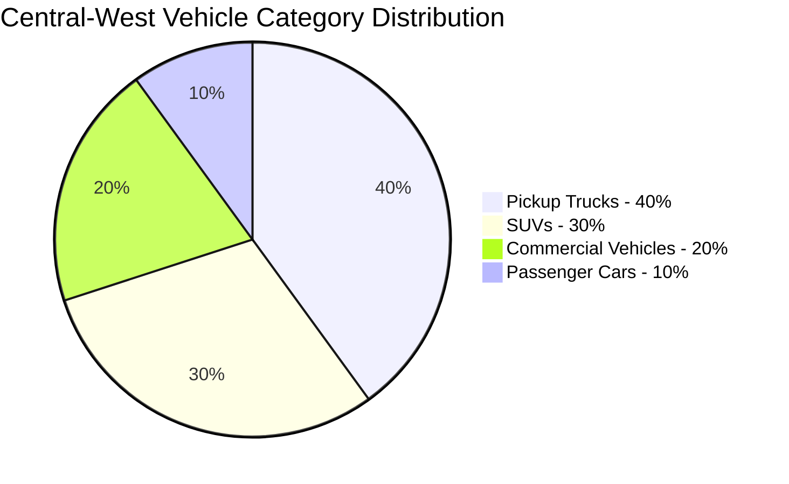
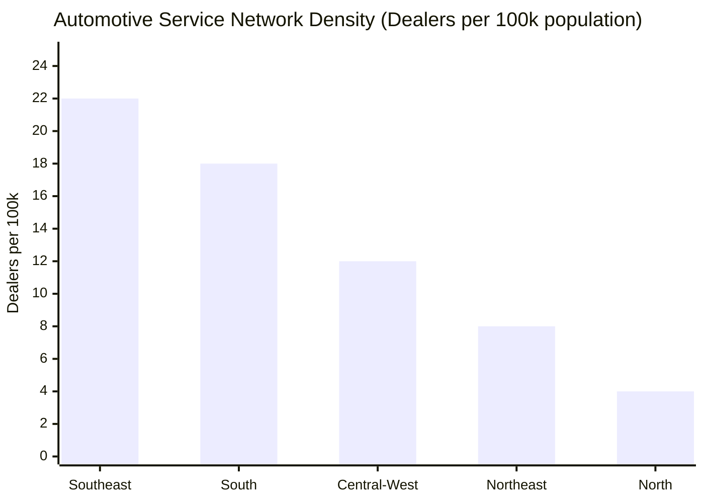
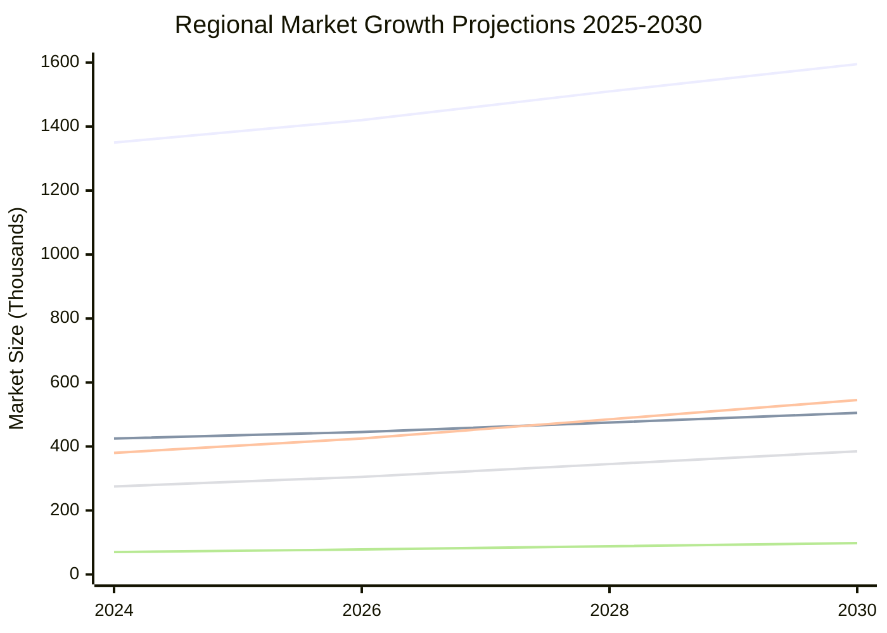

# Task 4: Regional Analysis within Brazil - Climate and Infrastructure Variations Affecting Automotive Preferences

## Overview

Brazil's continental dimensions create distinct regional automotive markets, each shaped by unique combinations of climate conditions, infrastructure quality, economic activities, and consumer preferences. This analysis examines five major regions and their specific automotive demands.

## Regional Overview and Economic Context

### Regional Economic Distribution

The economic distribution directly impacts automotive purchasing power and preferences across regions, with the Southeast dominating both production and consumption.

## Southeast Region - Industrial Automotive Hub

### States: São Paulo, Rio de Janeiro, Minas Gerais, Espírito Santo

#### Climate Characteristics
- **Temperature range**: 13-28°C with seasonal variation
- **Humidity**: 65-85%, coastal areas higher
- **Precipitation**: 1,200-2,000mm annually, concentrated December-March
- **Urban heat islands**: São Paulo and Rio experience +3-5°C above rural areas

#### Infrastructure Profile
According to [Brazilian regions analysis](https://thebrazilbusiness.com/article/brazilian-regions):
- **Highest paved road percentage**: 85%+ of major routes paved
- **Industrial concentration**: 419 auto parts producers in São Paulo alone
- **Traffic density**: Severe urban congestion in metropolitan areas
- **Highway quality**: Mix of excellent federal highways and deteriorating urban infrastructure

#### Automotive Market Characteristics

**Vehicle Production Hub**:
- **Manufacturing concentration**: Largest automotive production center
- **Major plants**: Ford, Volkswagen, GM, Fiat concentrated in ABC Paulista
- **Supply chain**: Integrated automotive ecosystem

**Consumer Preferences**:

| Vehicle Category | Market Share | Key Drivers | Climate/Infrastructure Factor |
|------------------|-------------|-------------|------------------------------|
| **Compact Sedans** | 32% | Urban efficiency, parking | Traffic congestion, fuel costs |
| **Hatchbacks** | 28% | City driving, maneuverability | Urban density, limited parking |
| **Compact SUVs** | 25% | Versatility, status | Mixed urban/highway driving |
| **Mid-size SUVs** | 15% | Family needs, comfort | Highway travel, suburban use |

**Regional Vehicle Leaders**:
- **Volkswagen Polo**: Urban efficiency and German engineering reputation
- **Fiat Argo**: Affordability with adequate urban features
- **Hyundai HB20**: Korean quality at competitive prices
- **Jeep Compass**: Premium SUV for affluent consumers

#### Climate-Specific Adaptations
- **Enhanced air conditioning**: Essential for urban heat island effect
- **Corrosion protection**: Coastal areas require marine-grade protection
- **Traffic-optimized cooling**: Systems designed for stop-and-go conditions
- **Comfort prioritization**: Longer commute times demand interior refinement

#### Infrastructure Impact on Vehicle Choice
- **Compact preference**: Parking limitations in São Paulo/Rio drive smaller vehicle adoption
- **Fuel efficiency priority**: High fuel costs and traffic congestion
- **Comfort features**: Extended commute times increase demand for refinement
- **Urban durability**: City driving conditions require robust air conditioning and electrical systems

## Northeast Region - Emerging Growth Market

### States: Bahia, Pernambuco, Ceará, Rio Grande do Norte, Paraíba, Maranhão, Piauí, Alagoas, Sergipe

#### Climate Characteristics
- **Temperature range**: 25-40°C, extreme heat in interior
- **Humidity**: Coastal 80-90%, interior 40-60%
- **Precipitation**: Coastal 800-1,500mm, interior 200-800mm
- **Extreme conditions**: Interior reaches 45°C+ with drought conditions

#### Infrastructure Profile
- **Rapid development**: Government investment programs improving connectivity
- **State progress**: Paraíba (2017) and Alagoas (2021) achieved 100% municipal paved access
- **Mixed quality**: Modern highways alongside rural unpaved roads
- **Economic incentives**: Companies receiving tax benefits through SUDENE development programs

#### Automotive Market Characteristics

**Industrial Growth**:
According to [automotive industry reports](https://mybusinessbrazil.com/brazils-automotive-industry-a-comprehensive-guide-for-foreign-investors/):
- **Manufacturing incentives**: Tax benefits attracting automotive investment
- **Emerging production**: Growing component manufacturing
- **Market expansion**: Third-largest regional economy driving demand

**Consumer Vehicle Preferences**:

**Regional Best-Sellers**:
- **Fiat Strada**: Dominates due to agribusiness utility and road versatility
- **Ford EcoSport**: Compact SUV for mixed urban/rural use
- **Chevrolet Onix**: Affordable urban transportation
- **Toyota Hilux**: Agricultural and commercial applications

#### Climate-Specific Requirements
- **Extreme heat management**: Enhanced cooling systems critical
- **Dust protection**: Interior areas require superior filtration
- **UV resistance**: Paint and interior materials need maximum sun protection
- **Humidity protection**: Coastal areas demand corrosion-resistant components

#### Infrastructure Adaptation Needs
- **Mixed-surface capability**: Vehicles must handle both highways and unpaved roads
- **Higher ground clearance**: Rural access requirements
- **Robust construction**: Harsh environmental conditions demand durability
- **Extended service intervals**: Limited service infrastructure in rural areas

## South Region - Developed Agricultural Market

### States: Rio Grande do Sul, Santa Catarina, Paraná

#### Climate Characteristics
- **Temperature range**: 10-28°C with significant seasonal variation
- **Winter extremes**: Temperatures can reach freezing, occasional snow
- **Humidity**: 60-80%, moderate levels
- **Precipitation**: 1,200-1,800mm distributed year-round

#### Infrastructure Profile
- **High development**: Best regional infrastructure after Southeast
- **Quality highways**: Well-maintained federal and state road network
- **Agricultural focus**: Roads optimized for commodity transport
- **Service coverage**: Comprehensive automotive service network

#### Automotive Market Characteristics

**Manufacturing Presence**:
- **Commercial vehicle focus**: Volvo truck manufacturing in Curitiba
- **Agricultural equipment**: Integration with farming machinery industry
- **Quality preference**: Higher-income region demands premium features

**Consumer Preferences**:

| Vehicle Type | Popularity Driver | Climate Factor | Infrastructure Factor |
|--------------|------------------|----------------|---------------------|
| **Pickup Trucks** | Agricultural use, versatility | All-weather capability | Rural access needs |
| **Mid-size SUVs** | Family transportation, safety | Winter weather handling | Highway comfort |
| **Sedans** | Professional use, efficiency | Climate control priority | Highway-focused driving |
| **Compact Cars** | Urban efficiency | Winter heating needs | City parking/traffic |

**Top Regional Models**:
- **Volkswagen Amarok**: Premium pickup for agricultural professionals
- **Toyota SW4**: Family SUV with off-road capability
- **Honda Civic**: Professional sedan choice
- **Chevrolet Tracker**: Compact SUV for urban/suburban use

#### Seasonal Adaptation Requirements
- **All-weather performance**: Winter driving capability essential
- **Heating systems**: Robust cabin heating for cold months
- **Traction control**: Safety systems for wet/icy conditions
- **Battery reliability**: Cold-weather starting capability

## Central-West Region - Agricultural Powerhouse

### States: Mato Grosso, Mato Grosso do Sul, Goiás, Federal District (Brasília)

#### Climate Characteristics
- **Temperature range**: 18-35°C with distinct wet/dry seasons
- **Seasonal extremes**: Dry season humidity can drop to 15%
- **Precipitation**: 1,000-1,500mm concentrated November-April
- **Dust conditions**: Extensive agricultural activity creates dusty environment

#### Infrastructure Profile
- **Agribusiness priority**: Investment follows commodity export routes
- **Expanding network**: Rapid development to support agricultural growth
- **Seasonal challenges**: Some roads impassable during peak rainy season
- **Long distances**: Extended highway travel between centers

#### Automotive Market Characteristics

**Agricultural Integration**:
- **Utility focus**: Vehicle choices reflect agricultural economy
- **Commercial emphasis**: High proportion of work-oriented vehicles
- **Durability priority**: Harsh conditions demand robust construction

**Regional Vehicle Distribution**:

**Dominant Models**:
- **Ford Ranger**: Agricultural workhorse with durability reputation
- **Chevrolet S10**: Versatile pickup for farm and family use
- **Mitsubishi L200**: Reliable choice for harsh conditions
- **Ford EcoSport**: SUV option for mixed use patterns

#### Agricultural-Specific Adaptations
- **Enhanced filtration**: Multi-stage air cleaning for dusty conditions
- **Cargo capacity**: Utility and transport requirements
- **Towing capability**: Agricultural equipment transport needs
- **Maintenance accessibility**: Simple, serviceable designs

## North/Amazon Region - Extreme Conditions Market

### States: Amazonas, Pará, Acre, Rondônia, Roraima, Amapá, Tocantins

#### Climate Characteristics
- **Temperature range**: 24-35°C year-round consistency
- **Extreme humidity**: 85-95% constant high humidity
- **Heavy rainfall**: 2,000-3,000mm annually, intense wet seasons
- **Flood conditions**: Seasonal inundation affects transportation

#### Infrastructure Profile
- **Limited network**: Lowest road density in Brazil (25 km/1,000 km²)
- **Environmental constraints**: Development restricted by conservation requirements
- **Seasonal access**: Many routes impassable during peak rainfall
- **Remote conditions**: Limited service infrastructure

#### Automotive Market Characteristics

**Extreme Environment Demands**:
According to [regional preferences analysis](https://portalcontexto.com/preferencias-regionais-o-que-o-brasileiro-compra-e-por-que/):
- **Capability priority**: Vehicle performance under extreme conditions
- **Durability emphasis**: Limited service access demands reliability
- **Versatility requirement**: Must handle diverse terrain and conditions

**Vehicle Preferences in Acre (Representative)**:
- **Pickup trucks**: 45% market share
- **SUVs**: 35% market share  
- **Compact vehicles**: 15% market share
- **Sedans**: 5% market share

**Popular Models**:
- **Toyota Hilux**: Reputation for extreme condition reliability
- **Ford Ranger**: Robust construction for harsh use
- **Mitsubishi Pajero**: SUV capability for difficult terrain
- **Chevrolet S10**: Affordable pickup with durability

#### Extreme Climate Adaptations
- **Maximum corrosion protection**: High-humidity environment demands
- **Enhanced sealing**: Water ingress protection critical
- **Superior drainage**: Design for flood-prone conditions
- **Fungal/mold resistance**: Interior materials must withstand constant moisture

#### Infrastructure Survival Features
- **High ground clearance**: Navigate rough, flooded terrain
- **Snorkel-ready design**: Potential for deep water crossing
- **Underbody protection**: Shield against rocks and debris
- **Extended range capability**: Limited fuel station access

## Regional Automotive Ecosystem Comparison

### Manufacturing Distribution

| Region | Manufacturing Focus | Local Brands/Models | Export Capability |
|--------|-------------------|-------------------|------------------|
| **Southeast** | Full vehicle assembly | All major brands | Global export hub |
| **Northeast** | Component manufacturing | Limited assembly | Growing export |
| **South** | Commercial vehicles | Volvo trucks | Regional export |
| **Central-West** | Agricultural vehicles | Limited local | Domestic focus |
| **North** | Limited production | Import-dependent | Minimal |

### Service Network Density

### Climate-Infrastructure Interaction Matrix

| Region | Climate Severity | Infrastructure Quality | Vehicle Adaptation Need | Market Sophistication |
|--------|-----------------|----------------------|----------------------|---------------------|
| **Southeast** | Moderate | High | Medium | Very High |
| **South** | Moderate-High | High | Medium-High | High |
| **Northeast** | High | Medium | High | Medium |
| **Central-West** | Medium-High | Medium | Medium-High | Medium |
| **North** | Very High | Low | Very High | Low |

## Regional Market Size and Growth Projections

### 2024 Market Distribution by Region

| Region | Market Size (Units) | Growth Rate | Key Growth Drivers |
|--------|------------------|-------------|------------------|
| **Southeast** | 1,350,000 (54%) | 5.2% | Urban renewal, replacement market |
| **South** | 425,000 (17%) | 4.8% | Agricultural prosperity |
| **Northeast** | 380,000 (15%) | 8.1% | Infrastructure development |
| **Central-West** | 275,000 (11%) | 7.3% | Agribusiness expansion |
| **North** | 70,000 (3%) | 6.5% | Resource development |

### Future Growth Potential (2025-2030)

## Regional Brand Preferences and Loyalty

### Brand Strength by Region

| Brand | Southeast | South | Northeast | Central-West | North |
|-------|-----------|-------|-----------|-------------|-------|
| **Fiat** | Strong | Medium | Very Strong | Strong | Medium |
| **Volkswagen** | Very Strong | Strong | Medium | Medium | Medium |
| **Chevrolet** | Strong | Strong | Strong | Very Strong | Strong |
| **Ford** | Medium | Medium | Strong | Very Strong | Strong |
| **Toyota** | Strong | Strong | Medium | Strong | Very Strong |

### Regional Brand Success Factors

**Southeast**: Brand heritage, technology integration, urban suitability
**South**: Quality reputation, cold-weather performance, agricultural utility
**Northeast**: Affordability, heat resistance, mixed-use capability
**Central-West**: Durability, cargo capacity, agricultural adaptation
**North**: Extreme reliability, parts availability, environmental resilience

## Key Regional Insights

### Climate-Infrastructure Correlations

1. **High climate stress + poor infrastructure** (North): Demands maximum vehicle capability
2. **Moderate climate + excellent infrastructure** (Southeast): Prioritizes comfort and efficiency
3. **Variable climate + good infrastructure** (South): Requires seasonal adaptability
4. **Extreme heat + improving infrastructure** (Northeast): Cooling systems critical
5. **Seasonal extremes + utilitarian infrastructure** (Central-West): Versatility essential

### Regional Market Maturity

**Mature Markets** (Southeast, South):
- Replacement purchases dominate
- Feature sophistication important
- Brand loyalty established
- Service expectations high

**Growth Markets** (Northeast, Central-West):
- First-time buyers significant
- Value-price balance critical
- Brand building opportunities
- Infrastructure development driving demand

**Frontier Market** (North):
- Capability over comfort
- Limited choice acceptance
- Brand reliability paramount
- Service scarcity challenges

## Strategic Implications for Automotive Manufacturers

### Regional Customization Requirements

1. **Product Portfolio**: Different vehicle mixes optimal for each region
2. **Feature Prioritization**: Climate control vs utility vs comfort balance
3. **Service Strategy**: Network density must match regional characteristics
4. **Pricing Strategy**: Economic conditions vary significantly by region
5. **Brand Positioning**: Environmental adaptation capabilities as competitive advantage

### Market Entry Strategies

**Southeast**: Premium features, urban optimization, traffic management technology
**South**: All-weather capability, agricultural utility, premium materials
**Northeast**: Heat management, mixed-use versatility, value positioning
**Central-West**: Utility focus, cargo capacity, agricultural durability
**North**: Maximum capability, extreme reliability, simplified service

## Conclusion

Brazil's regional diversity creates distinct automotive submarkets, each requiring specific environmental adaptations and market strategies. Success in the Brazilian automotive market demands understanding these regional variations and developing vehicles that can handle the unique combination of climate challenges and infrastructure conditions in each area.

The interaction between climate conditions and infrastructure quality creates a complex matrix of consumer needs, where no single vehicle configuration can optimally serve all Brazilian regions. This regional diversity explains the success of manufacturers who adapt their products to local conditions and the continued growth of versatile vehicle categories like compact SUVs and pickup trucks.

## References

1. [Brazilian Regions Overview - The Brazil Business](https://thebrazilbusiness.com/article/brazilian-regions)
2. [Northeast Region Analysis - Wikipedia](https://en.wikipedia.org/wiki/Northeast_Region,_Brazil)
3. [Regional Consumer Preferences](https://portalcontexto.com/preferencias-regionais-o-que-o-brasileiro-compra-e-por-que/)
4. [Brazil's Automotive Industry Guide](https://mybusinessbrazil.com/brazils-automotive-industry-a-comprehensive-guide-for-foreign-investors/)
5. [Automotive Industry in Brazil - Wikipedia](https://en.wikipedia.org/wiki/Automotive_industry_in_Brazil)
6. [Brazil Automotive Market Analysis](https://markwideresearch.com/brazil-automotive-market/)
7. [Focus2move Brazil Market Data](https://www.focus2move.com/brazil-vehicles-market/)