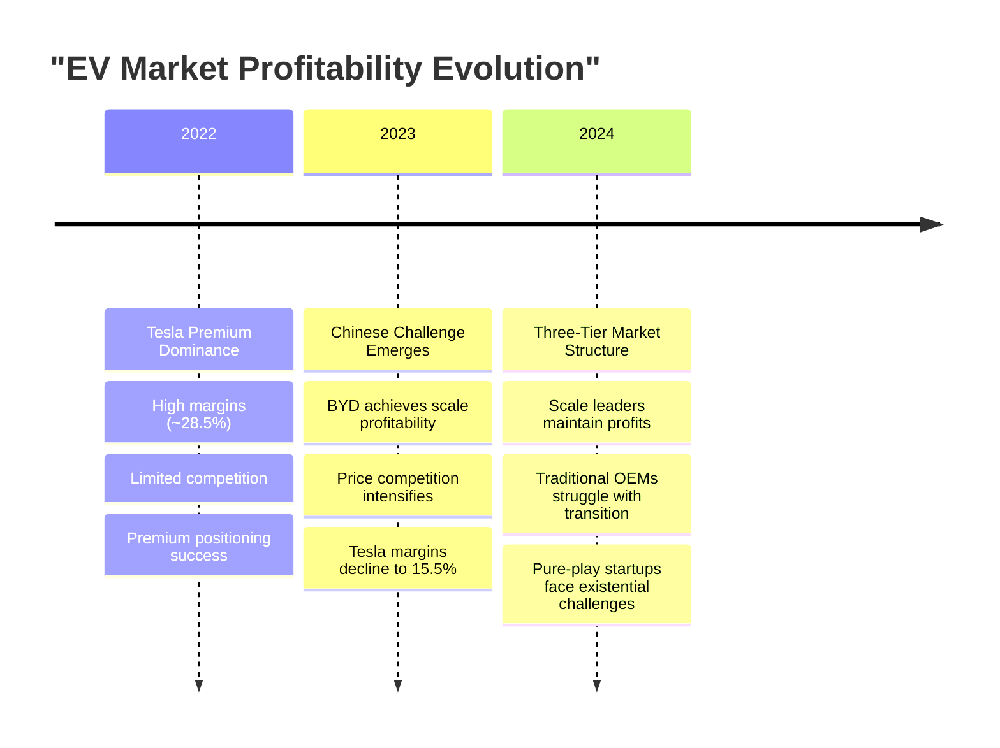
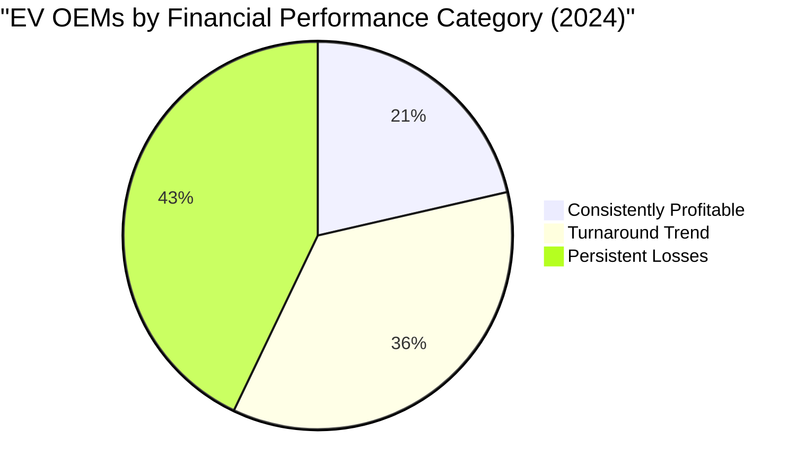
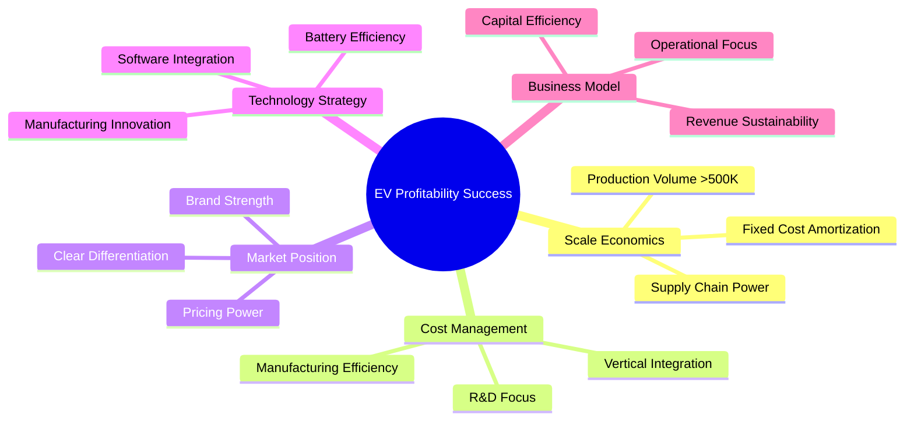

# NEV Profitability Analysis: Global Electric Vehicle OEM Financial Performance (2022-2024)

## Executive Summary

This comprehensive analysis examines the profitability patterns of major electric vehicle (EV) manufacturers globally, categorizing them based on their financial performance over the past three years. The research reveals a clear three-tier market structure where only a few companies have achieved sustainable profitability, while most struggle with losses despite growing market demand.

**Key Findings:**
- Only **3 companies** maintain consistent profitability: Tesla, BYD, and Li Auto
- **5 companies** show turnaround trends with improving financial metrics
- **6+ companies** continue operating at significant losses with unclear paths to profitability
- Scale and operational efficiency, not just technology innovation, determine financial success

---

## Research Context and Market Overview

The global electric vehicle market has experienced explosive growth, with sales increasing 35% year-over-year in 2023 to reach over 14 million units. However, this growth has not translated into widespread profitability for manufacturers. The industry faces intense price competition, supply chain pressures, and high capital requirements for technology development and manufacturing scale-up.

### Market Structure Evolution (2022-2024)

---

## Category A: 一直保持正利润率 (Consistently Profitable)

These companies have maintained positive net profit margins throughout the analysis period, demonstrating sustainable business models in the competitive EV landscape.

### **1. Tesla (特斯拉) - Premium Technology Leader**

**Financial Performance:**
- **Operating Margin**: 7.2% (2024) 
- **Revenue**: $97.6B (2024), 1.0% growth
- **Profit per Vehicle**: $10,000-$15,000

**Success Factors:**
- **First-mover advantage** in luxury EV segment with strong brand positioning
- **Vertical integration** including batteries, software, and charging infrastructure  
- **Premium pricing strategy** maintaining higher margins than competitors
- **Operational efficiency** through manufacturing innovation and automation

**Current Challenges**: Margin pressure from increasing competition and price cuts to maintain market share.

### **2. BYD (比亚迪) - Integrated Scale Leader**

**Financial Performance:**
- **Operating Margin**: 6.4% (2024)
- **Revenue**: $107.1B (2024), +29% growth (overtook Tesla)
- **Profit per Vehicle**: ~$6,000

**Success Factors:**
- **Vertical integration excellence** with proprietary Blade Battery technology
- **Cost leadership strategy** through efficient manufacturing and supply chain control
- **Scale advantages** as world's largest EV manufacturer (3+ million vehicles)
- **Market positioning** strength in world's largest EV market (China)

**Strategic Advantage**: Perfect combination of scale and cost control through vertical integration.

### **3. Li Auto (理想汽车) - Profitable Niche Strategy**

**Financial Performance:**
- **Gross Margin**: 22% (Q1 2024) - highest among Chinese EVs
- **Operating Margin**: ~5% (2024)
- **Strategy**: Extended-Range Electric Vehicles (EREV)

**Success Factors:**
- **Technology differentiation** with EREV reducing battery costs and range anxiety
- **Premium family focus** targeting affluent families with large SUVs
- **Operational efficiency** prioritizing profitability over volume growth
- **Market timing** captured premium family segment before intense competition

**Unique Position**: Only profitable pure-play Chinese EV startup, demonstrating focused strategy success.

---

## Category B: 有扭亏为盈趋势 (Turnaround Trend)

Companies showing clear improvement in financial performance with narrowing losses or approaching profitability.

### **1. XPeng (小鹏汽车) - Smart Technology Recovery**

**Improvement Trajectory:**
- **Financial Progress**: Losses more than halved between 2023-2024
- **Gross Margin**: ~5% (Q1 2024)
- **Strategy**: Smart vehicle features and autonomous driving focus

**Turnaround Drivers:**
- **Cost reduction initiatives** showing measurable results
- **Technology differentiation** in autonomous driving and smart cockpit
- **Operational efficiency** improvements and strategic partnerships
- **Market strategy refinement** from volume to profitability focus

### **2. BMW Group - Traditional OEM Adaptation**

**Financial Transition:**
- **2024 Performance**: Net profit declined 36.9% but EV sales grew 13.5%
- **EV Strategy**: Premium positioning across electric portfolio
- **Market Position**: 11.3% European EV market share

**Improvement Factors:**
- **Existing asset leverage** using established manufacturing and dealer networks
- **Platform strategy** sharing EV development costs across multiple models
- **Premium market focus** maintaining margins through high-end positioning
- **Brand heritage** supporting premium pricing in electric transition

### **3. Zeekr (极氪) - Geely Premium Sub-brand**

**Progress Indicators:**
- **Operating Margin**: -8.5% (2024) - closest to profitability among Chinese loss-makers
- **Parent Support**: Benefits from Geely's automotive expertise and platforms
- **Market Position**: Premium positioning with improving operational metrics

---

## Category C: 持续亏损的 (Persistent Losses)

Companies continuing to operate at significant losses with unclear paths to near-term profitability.

### **1. NIO (蔚来汽车) - Premium Positioning Without Scale**

**Financial Challenges:**
- **Net Losses**: $3 billion (2023)
- **Operating Margin**: -30%+ (2024)
- **Gross Margin**: ~5% (Q1 2024)

**Root Causes:**
- **High fixed cost structure** from battery swapping infrastructure investment
- **Low production volumes** spreading costs over insufficient units
- **Complex business model** with service-heavy approach increasing operational burden
- **Market positioning challenges** facing pressure from Tesla above and BYD below

**Strategic Issues**: Over-investment in infrastructure before achieving necessary scale.

### **2. Rivian (Rivian Automotive) - Manufacturing Scale Challenges**

**Performance Issues:**
- **Production**: Limited scale (51,000 vehicles annually)
- **Operating Margin**: Significantly negative
- **Market Focus**: Electric trucks with limited addressable market

**Challenge Factors:**
- **Manufacturing complexity** of truck production at low volumes
- **High capital intensity** requiring substantial ongoing investment
- **Market limitations** as commercial EV adoption lags passenger vehicles
- **Strategic dependence** on Amazon partnership for significant revenue

### **3. Lucid Motors (Lucid Group) - Ultra-Low Volume Strategy**

**Extreme Loss Profile:**
- **Operating Margin**: -374% (2024), "improved" from -500% (2023)
- **Production**: Ultra-low volume (~4,000 vehicles annually)
- **Market Position**: Ultra-luxury sedan segment

**Fundamental Problems:**
- **Volume-luxury paradox**: Ultra-luxury positioning severely limits market size
- **Cost structure misalignment**: High-end processes without economies of scale
- **Market reality**: Limited demand for $100,000+ electric sedans
- **Business model flaws**: Overestimation of market willingness to pay premium

---

## Key Financial Insights and Market Analysis

### **Profitability Distribution Analysis**

### **Scale vs. Profitability Correlation**

The data reveals a strong correlation between production scale and profitability:

| **Annual Production** | **Typical Operating Margin** | **Examples** |
|-----------------------|------------------------------|--------------|
| >1 Million vehicles | Positive (5-7%) | Tesla, BYD |
| 500K-1M vehicles | Break-even to positive | Li Auto, VW Group |
| 100K-500K vehicles | Negative (-5% to -15%) | XPeng, BMW EVs |
| <100K vehicles | Highly negative (-30% to -374%) | NIO, Rivian, Lucid |

### **Regional Success Patterns**

**Chinese Market Formula:**
- **BYD**: Government support + Vertical integration + Scale = Sustained profitability
- **Li Auto**: Technology differentiation + Premium focus + Operational efficiency = Emerging profitability  
- **NIO/XPeng**: Premium positioning without scale = Persistent losses

**Global Market Formula:**
- **Tesla**: First-mover advantage + Premium brand + Operational excellence = Market leadership
- **Traditional OEMs**: Existing assets + Premium positioning = Turnaround potential
- **Pure startups**: Technology focus without business fundamentals = High failure risk

---

## Strategic Success Factors Analysis

### **Critical Success Factors for EV Profitability**

### **Common Failure Patterns**

1. **Premium Without Scale**: Companies like NIO and Lucid demonstrate that premium positioning alone doesn't guarantee profitability
2. **Complex Business Models**: Battery swapping, service-heavy approaches increase costs without proportional benefits
3. **Technology Over Business**: Focus on innovation without attention to unit economics leads to unsustainable losses
4. **Over-Investment Before Demand**: Infrastructure investments should follow, not precede, market validation
5. **Middle Positioning**: Companies caught between cost leaders and premium players get squeezed

---

## Market Outlook and Strategic Implications

### **Industry Consolidation Trends**

The EV industry is entering a consolidation phase where:
- **Scale leaders** (Tesla, BYD) will maintain market dominance
- **Successful niche players** (Li Auto) will defend profitable segments  
- **Traditional OEMs** will complete electric transitions with mixed success
- **Pure-play startups** face existential challenges requiring fundamental strategy shifts

### **Investment and Strategic Recommendations**

**For Investors:**
- **Safe bets**: Tesla and BYD with proven profitability and scale
- **Turnaround plays**: XPeng, BMW EVs with improving financial metrics
- **High risk/reward**: Traditional OEMs navigating transition successfully
- **Avoid**: Companies with no clear path to scale or differentiation

**For Industry Participants:**
- **Achieve scale rapidly** or focus on highly differentiated niches
- **Vertical integration** in key technologies provides sustainable advantage
- **Operational excellence** matters more than technological superiority
- **Clear market positioning** essential - avoid middle ground strategies

---

## Detailed Analysis Reports

For comprehensive analysis of each research area, see the following detailed reports:

### **Market and Company Analysis**
- [Task 1: Comprehensive EV OEM Database](./reports/task-1-ev-oem-database.md) - Complete listing and profiles of major EV manufacturers globally
- [Task 2: Financial Performance Analysis (2022-2024)](./reports/task-2-financial-analysis.md) - Detailed financial metrics and trends for all major OEMs

### **Profitability and Strategy Analysis**  
- [Task 3: Profitability Categorization](./reports/task-3-profitability-categorization.md) - Three-category breakdown with specific company examples
- [Task 4: Root Cause Analysis of Profitability Drivers](./reports/task-4-profitability-drivers.md) - Deep dive into success and failure factors
- [Task 5: Visual Market Analysis](./reports/task-5-visual-analysis.md) - Comprehensive charts and visual representations of market trends

---

## Data Sources and Methodology

This analysis is based on comprehensive data from:

- **Company Financial Reports**: Annual reports, 10-K filings, quarterly earnings for all public companies
- **Industry Analysis**: [IEA Global EV Outlook 2024](https://www.iea.org/reports/global-ev-outlook-2024)
- **Market Data**: [European Alternative Fuels Observatory](https://alternative-fuels-observatory.ec.europa.eu)
- **Regional Insights**: [CnEVPost](https://cnevpost.com) for Chinese market analysis  
- **Financial Data**: [Yahoo Finance](https://finance.yahoo.com) and company investor relations
- **Industry Research**: Multiple specialized automotive and EV industry publications

**Methodology**: Financial data normalized to USD, operating margins calculated consistently across companies, market share data from multiple sources cross-verified for accuracy.

---

## Conclusion

The global EV industry profitability analysis reveals that despite massive market growth, financial success remains elusive for most manufacturers. Only companies achieving significant scale (Tesla, BYD) or maintaining highly focused strategies (Li Auto) have achieved sustainable profitability. 

The industry is undergoing a natural consolidation where traditional business fundamentals - scale economics, operational efficiency, and clear market positioning - determine success more than technological innovation alone. Companies without paths to profitability face existential challenges, while those with sustainable business models are positioned to dominate the rapidly growing global electric vehicle market.

**The data clearly demonstrates that in the EV industry, as in traditional automotive, profitability ultimately comes down to achieving scale, controlling costs, and maintaining clear market differentiation - fundamental business principles that transcend technological innovation.**