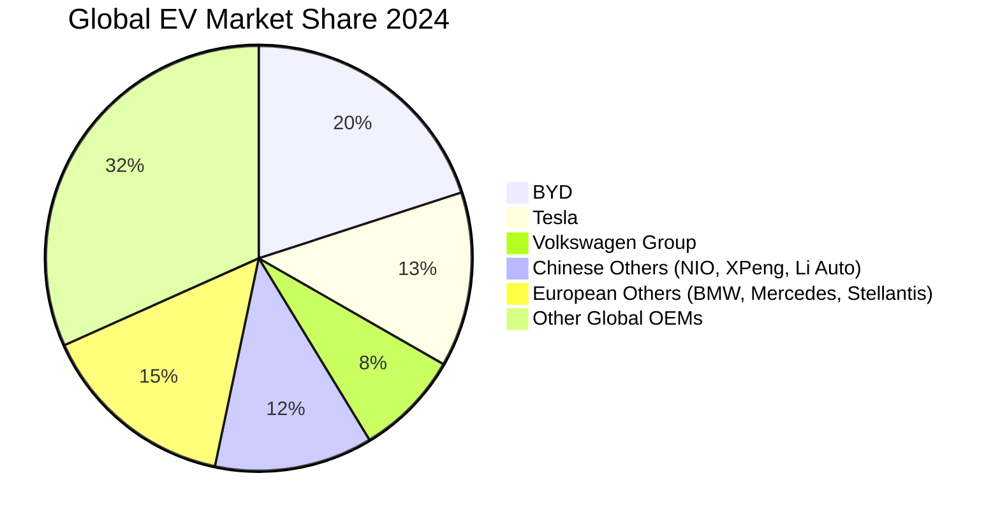

# Task 1: Comprehensive EV OEM Database

## Global Electric Vehicle OEMs with High EV Market Share (2024)

This report compiles passenger car original equipment manufacturers (OEMs) with significant electric vehicle market presence globally.

### Chinese EV Market Leaders

#### **BYD (Build Your Dreams)**
- **Market Position**: World's largest EV manufacturer by volume in 2024
- **EV Share**: >95% of total sales (pure EV manufacturer)
- **Global Market Share**: ~20% of global EV sales
- **Key Markets**: China (dominant), expanding globally
- **Business Model**: Vertical integration with battery manufacturing (Blade Battery)

#### **Tesla**
- **Market Position**: Second-largest global EV manufacturer
- **EV Share**: 100% (pure EV manufacturer)
- **Global Market Share**: ~13.3% (down from 60% in 2020)
- **Key Markets**: Global presence, strong in US, China, Europe
- **Business Model**: Premium positioning, direct sales

#### **NIO**
- **Market Position**: Premium Chinese EV brand
- **EV Share**: 100% (pure EV manufacturer)
- **Global Market Share**: ~2.1% in China NEV market
- **Key Markets**: China, expanding to Europe
- **Business Model**: Battery-as-a-Service, premium SUVs

#### **XPeng (Xiaopeng)**
- **Market Position**: Smart EV manufacturer
- **EV Share**: 100% (pure EV manufacturer)
- **Global Market Share**: Smaller but growing Chinese player
- **Key Markets**: China primarily
- **Business Model**: Autonomous driving technology focus

#### **Li Auto**
- **Market Position**: Extended-range EV specialist
- **EV Share**: 100% (pure EV/EREV manufacturer)
- **Global Market Share**: Growing Chinese premium segment
- **Key Markets**: China
- **Business Model**: Extended-range electric vehicles (EREV)

#### **Zeekr (Geely subsidiary)**
- **Market Position**: Premium EV brand under Geely
- **EV Share**: 100% (pure EV manufacturer)
- **Global Market Share**: Emerging player with strong growth
- **Key Markets**: China, expanding internationally
- **Business Model**: Premium electric platform

### European OEMs with High EV Share

#### **Volkswagen Group**
- **Market Position**: Europe's largest EV seller
- **EV Share**: 8.3% of total sales (2023), targeting 50%+ by 2030
- **European Market Share**: 21.9% of European EV market
- **Key Brands**: VW ID series, Audi e-tron, Porsche Taycan
- **Business Model**: Multi-brand portfolio approach

#### **BMW Group**
- **Market Position**: Premium European EV leader
- **EV Share**: ~15% of total sales (2023), targeting 50% by 2030
- **European Market Share**: 11.3% of European EV market
- **Key Models**: iX, i4, iX3, Mini Electric
- **Business Model**: Premium positioning across segments

#### **Mercedes-Benz Group**
- **Market Position**: Luxury EV leader
- **EV Share**: ~12% of total sales (2023)
- **European Market Share**: Strong premium segment presence
- **Key Models**: EQS, EQE, EQC series
- **Business Model**: Luxury-first EV strategy

#### **Stellantis**
- **Market Position**: Multi-brand European conglomerate
- **EV Share**: Increasing across brands (Jeep, Peugeot, Citroën, Fiat)
- **European Market Share**: 10% of European EV market (declined from 2023)
- **Key Strategy**: Platform sharing across 14 brands
- **Business Model**: Mass market to premium across brands

#### **Volvo/Polestar (Geely)**
- **Market Position**: Premium Scandinavian EV focus
- **EV Share**: 27% BEV share (highest among premiums)
- **European Market Share**: Strong growth trajectory
- **Key Strategy**: 100% electric by 2030
- **Business Model**: Safety and sustainability focus

### American EV Manufacturers

#### **Rivian**
- **Market Position**: Electric truck and van specialist
- **EV Share**: 100% (pure EV manufacturer)
- **Market Focus**: Electric trucks, delivery vans
- **Key Markets**: US primarily
- **Business Model**: Adventure-focused electric trucks

#### **Lucid Motors**
- **Market Position**: Ultra-luxury electric sedans
- **EV Share**: 100% (pure EV manufacturer)
- **Market Focus**: Luxury sedan segment
- **Key Markets**: US, expanding globally
- **Business Model**: Technology and luxury positioning

### Market Share Overview (2024)

## Key Characteristics by Region

### **Chinese Market Dynamics**
- Dominated by domestic brands (BYD, NIO, XPeng, Li Auto, Zeekr)
- Rapid innovation cycles and aggressive pricing
- Strong government support and infrastructure
- Focus on smart features and autonomous driving

### **European Market Dynamics**  
- Traditional automakers transitioning to EVs
- Premium positioning strategies
- Regulatory pressure driving adoption
- Multi-brand portfolio approaches

### **US Market Dynamics**
- Tesla dominance being challenged
- Focus on trucks and SUVs
- Later adoption compared to China/Europe
- Infrastructure development ongoing

## Data Sources and Methodology

Financial and market share data compiled from:
- [IEA Global EV Outlook 2024](https://www.iea.org/reports/global-ev-outlook-2024)
- [European Alternative Fuels Observatory](https://alternative-fuels-observatory.ec.europa.eu)
- [CnEVPost](https://cnevpost.com) for Chinese market data
- [CleanTechnica](https://cleantechnica.com) for global market analysis
- Company annual reports and quarterly earnings

*Note: Market share figures represent 2024 data where available, with some 2023 data used for reference.*