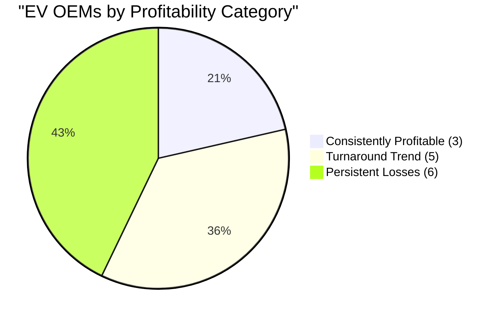

# Task 3: EV OEM Profitability Categorization

## Three-Category Analysis of EV Manufacturer Profitability Patterns

Based on financial performance analysis over 2022-2024, EV manufacturers fall into three distinct categories regarding their profitability patterns.

---

## Category A: Consistently Profitable (一直保持正利润率)

Companies that have maintained positive net profit margins throughout the analysis period.

### **1. Tesla (特斯拉)**

**Financial Profile:**
- **Operating Margin**: 7.2% (2024)
- **Net Margin Trend**: 28.5% (2022) → 15.5% (2023) → 7.3% (2024)
- **Revenue**: $97.6B (2024)

**Description:**
Tesla remains the global EV profitability leader despite declining margins. The company pioneered the premium EV market and benefits from vertical integration, supercharger network, and strong brand positioning. While facing increased competition, Tesla maintains the highest absolute profits in the EV industry.

**Key Characteristics:**
- Premium brand positioning with $10,000-$15,000 profit per vehicle
- Vertical integration including software and charging infrastructure
- First-mover advantage in luxury EV segment
- Global manufacturing footprint

### **2. BYD (比亚迪)**

**Financial Profile:**
- **Operating Margin**: 6.4% (2024)
- **Gross Margin**: 21.89% (Q3 2024), improving from 18.96% (Q3 2023)
- **Revenue**: $107.1B (2024), overtaking Tesla

**Description:**
BYD has achieved consistent profitability through vertical integration and cost leadership. As the world's largest EV manufacturer by volume, BYD benefits from economies of scale, in-house battery production (Blade Battery), and a strong position in the Chinese domestic market.

**Key Characteristics:**
- Vertical integration with proprietary Blade Battery technology
- Cost leadership strategy with $6,000 average profit per vehicle
- Strong domestic market dominance in China
- Expanding global presence with affordable models

### **3. Li Auto (理想汽车)**

**Financial Profile:**
- **Gross Margin**: 22% (Q1 2024) - highest among Chinese EVs
- **Operating Margin**: ~5% (Q1 2024)
- **Strategy**: Extended-Range Electric Vehicles (EREV)

**Description:**
Li Auto represents the only profitable pure-play Chinese EV startup. The company's extended-range strategy reduces battery costs while maintaining electric driving capability, allowing premium pricing with healthy margins.

**Key Characteristics:**
- Extended-range electric technology reduces cost and range anxiety
- Premium family SUV positioning
- Efficient operations with focus on profitability over volume
- Strong brand loyalty and customer satisfaction

---

## Category B: Turnaround Trend (有扭亏为盈趋势)

Companies showing clear improvement in financial performance with narrowing losses or approaching profitability.

### **1. XPeng (小鹏汽车)**

**Financial Profile:**
- **Improvement**: Losses more than halved between 2023-2024
- **Gross Margin**: ~5% (Q1 2024)
- **Trend**: Negative but rapidly improving

**Description:**
XPeng has demonstrated significant financial improvement through cost reduction initiatives and operational efficiency gains. The company is moving toward profitability through strategic focus on autonomous driving technology and smart vehicle features.

**Key Improvement Factors:**
- Cost reduction programs showing results
- Focus on higher-margin smart features
- Operational efficiency improvements
- Strategic partnerships reducing R&D costs

### **2. Zeekr (极氪)**

**Financial Profile:**
- **Operating Margin**: -8.5% (2024) - closest to profitability among loss-makers
- **Trend**: Steadily improving margins
- **Strategy**: Premium positioning under Geely umbrella

**Description:**
Zeekr benefits from Geely's automotive expertise and is approaching profitability faster than other Chinese EV startups. The brand's premium positioning and shared technology platforms with Geely provide cost advantages.

**Key Improvement Factors:**
- Shared platforms with parent company Geely
- Premium pricing strategy
- Efficient use of existing automotive infrastructure
- Strong brand positioning in luxury segment

### **3. Traditional OEM EV Divisions**

**Representative Example: BMW Group**

**Financial Profile:**
- **EV Growth**: 13.5% BEV sales growth (2024)
- **Overall Impact**: Profit declined 36.9% but improving EV economics
- **Strategy**: Premium EV portfolio development

**Description:**
Traditional automotive manufacturers are experiencing a turnaround trend in their EV divisions. While overall profits may decline due to transition costs, the EV-specific performance is improving through scale effects and learning curve benefits.

**Key Improvement Factors:**
- Economies of scale in EV production
- Learning curve effects reducing per-unit costs
- Premium positioning maintaining margins
- Shared platforms across multiple models

---

## Category C: Persistent Losses (持续亏损的)

Companies continuing to operate at significant losses with unclear paths to near-term profitability.

### **1. NIO (蔚来汽车)**

**Financial Profile:**
- **Net Losses**: $3 billion (2023)
- **Operating Margin**: -30%+ (2024)
- **Gross Margin**: ~5% (Q1 2024)

**Description:**
NIO continues to face significant financial challenges despite innovative battery-swapping technology. High infrastructure investments, premium positioning struggles, and intense competition have resulted in persistent heavy losses.

**Loss Factors:**
- High infrastructure costs for battery swapping stations
- Low production volumes relative to fixed costs
- Intense price competition in premium segment
- High R&D spending on autonomous driving

### **2. Rivian (Rivian Automotive)**

**Financial Profile:**
- **Operating Margin**: Significantly negative
- **Production**: Limited scale (51,000 vehicles in 2024)
- **Market**: Dependent on commercial partnerships

**Description:**
Rivian faces challenges scaling production of electric trucks while managing high per-unit costs. The company relies heavily on external funding and partnerships, particularly with Amazon for delivery vehicles.

**Loss Factors:**
- Low production volumes with high fixed costs
- Complex truck manufacturing requirements
- Limited market for electric trucks currently
- High capital requirements for manufacturing scale

### **3. Lucid Motors (Lucid Group)**

**Financial Profile:**
- **Operating Margin**: -374% (2024), "improved" from -500% (2023)
- **Production**: Ultra-low volume (~4,000 vehicles annually)
- **Strategy**: Ultra-luxury positioning

**Description:**
Lucid represents the extreme case of persistent losses in the EV industry. Despite advanced technology and luxury positioning, ultra-low production volumes result in massive per-unit losses.

**Loss Factors:**
- Extremely low production volumes
- Ultra-high manufacturing costs per unit
- Limited market for $100,000+ sedans
- High technology development costs relative to sales

### **4. VinFast (越南)**

**Financial Profile:**
- **Operating Margin**: Significantly negative
- **Strategy**: Aggressive global expansion
- **Challenges**: New market entry costs

**Description:**
VinFast, Vietnam's EV champion, continues heavy losses as it attempts global expansion while building manufacturing capabilities. The company faces challenges establishing brand recognition and distribution networks internationally.

**Loss Factors:**
- New brand establishment costs in international markets
- High manufacturing ramp-up costs
- Limited economies of scale
- Competitive global market entry challenges

---

## Summary Analysis by Category

### **Profitability Distribution (2024)**



### **Key Success Factors by Category**

| Category | Success Factors | Challenges |
|----------|----------------|-------------|
| **Consistent Profit** | Scale, vertical integration, premium positioning | Margin pressure from competition |
| **Turnaround Trend** | Cost reduction, operational efficiency, partnerships | Achieving sustainable profitability |
| **Persistent Losses** | Innovation, market positioning attempts | Scale, cost structure, market acceptance |

### **Financial Health Indicators**

```mermaid
bar-chart
    title "Operating Margins by Category (2024)"
    x-axis "Company Categories"
    y-axis "Operating Margin (%)" -400 --> 10
    
    bar "Profitable" 7.3
    bar "Turnaround" -8.5
    bar "Losses" -134.7
```

*Note: Persistent losses category shows weighted average, heavily influenced by Lucid's extreme negative margin*

## Strategic Implications

1. **Scale is Critical**: All profitable companies have achieved significant production volumes
2. **Vertical Integration Advantage**: BYD and Tesla benefit from controlling supply chains
3. **Premium Positioning Works**: Li Auto and Tesla demonstrate successful premium strategies
4. **Traditional OEMs Adapting**: Established manufacturers showing improvement trends
5. **Startup Challenges**: New entrants face significant scaling and profitability hurdles

This categorization reveals that EV profitability follows traditional automotive industry patterns: scale, efficiency, and brand positioning remain key success factors, with the added complexity of new technology integration and market development.