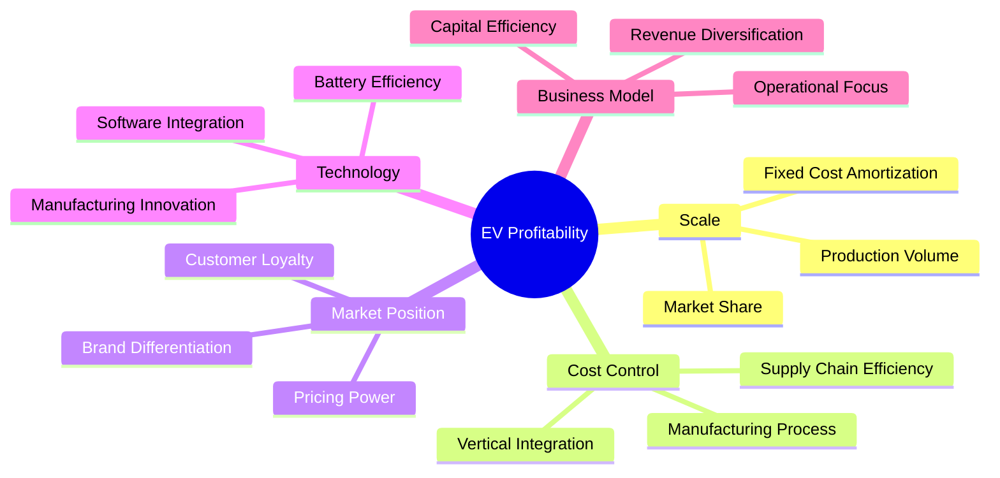

# Task 4: Root Cause Analysis of Profitability Drivers

## Comprehensive Analysis of Success and Failure Factors in EV Manufacturing

This report examines the underlying business factors that determine profitability or losses for each category of EV manufacturers, providing insight into what drives financial success in the electric vehicle industry.

---

## Category A: Drivers of Consistent Profitability

### **Tesla - Premium Strategy with Scale**

#### **Success Factors:**

**1. Premium Brand Positioning**
- Average selling price: $45,000-$100,000+ per vehicle
- Profit per vehicle: $10,000-$15,000 (highest in industry)
- Brand perception as luxury technology leader
- Direct-to-consumer sales model eliminates dealer margins

**2. Vertical Integration Strategy**
- In-house battery technology development and manufacturing
- Proprietary software and over-the-air updates
- Supercharger network provides competitive moat
- Manufacturing process innovation (4680 battery cells, structural battery packs)

**3. Market Timing and First-Mover Advantage**
- Established luxury EV market before competitors
- Built charging infrastructure early
- Accumulated manufacturing experience and learning curves
- Strong brand loyalty and customer evangelism

**4. Operational Efficiency**
- Simplified product lineup reduces complexity
- Focus on manufacturing automation
- Economies of scale across global production

#### **Challenges Managing:**
- Increasing competition pressuring margins
- Price cuts to maintain market share
- Transition from luxury to mass market positioning

---

### **BYD - Cost Leadership with Vertical Integration**

#### **Success Factors:**

**1. Vertical Integration Excellence**
- Blade Battery technology provides cost and safety advantages
- In-house semiconductor production (BYD Semiconductor)
- Control over entire supply chain from materials to final assembly
- Reduces dependency on external suppliers and price volatility

**2. Cost Leadership Strategy**
- Target profit per vehicle: ~$6,000 (significantly lower than Tesla)
- Focus on affordable mass-market EVs
- Efficient manufacturing processes with high automation
- Localized supply chains reduce logistics costs

**3. Market Positioning Strategy**
- Strong position in world's largest EV market (China)
- Government support and subsidies
- Comprehensive product portfolio from budget to premium
- Both BEV and PHEV offerings provide flexibility

**4. Scale Advantages**
- World's largest EV manufacturer by volume (3+ million vehicles)
- Economies of scale in battery production
- Amortization of R&D costs across high volumes
- Strong negotiating power with suppliers

#### **Success Formula:**
BYD's profitability comes from combining massive scale with vertical integration, allowing them to offer competitive prices while maintaining healthy margins through cost control.

---

### **Li Auto - Niche Strategy with Technology Differentiation**

#### **Success Factors:**

**1. Extended-Range Technology Strategy**
- EREV (Extended-Range Electric Vehicle) reduces battery costs
- Smaller battery packs lower material costs by 30-40%
- Eliminates range anxiety for consumers
- Unique positioning in Chinese market

**2. Premium Family Focus**
- Target market: affluent families with children
- High-margin large SUVs (6-7 seats)
- Premium interior features and technology
- Strong customer satisfaction and loyalty

**3. Operational Efficiency**
- Focus on profitability over volume growth
- Efficient capital allocation and cost control
- Strategic partnerships reduce R&D expenses
- Limited but well-executed product portfolio

**4. Market Timing**
- Entered market with differentiated technology
- Built brand before intense price competition
- Captured premium family segment effectively
- Strong dealer network and customer service

---

## Category B: Turnaround Mechanisms and Success Paths

### **XPeng - Smart Technology Focus with Cost Optimization**

#### **Improvement Drivers:**

**1. Cost Reduction Initiatives**
- Supply chain optimization and localization
- Manufacturing process improvements
- R&D cost sharing through strategic partnerships
- Workforce optimization and efficiency programs

**2. Technology Differentiation**
- Focus on autonomous driving capabilities
- Smart cockpit features appeal to tech-savvy consumers
- Software-defined vehicle architecture
- Over-the-air updates create ongoing revenue

**3. Market Strategy Refinement**
- Shift from volume to profitability focus
- Product portfolio optimization
- Geographic market prioritization
- Strategic partnerships with international brands

#### **Remaining Challenges:**
- Low gross margins indicate pricing pressure
- High competition in smart EV segment
- Need for continued R&D investment

---

### **Traditional OEMs (BMW Example) - Leveraging Existing Assets**

#### **Improvement Drivers:**

**1. Existing Infrastructure Utilization**
- Leverage existing manufacturing facilities
- Established dealer networks and service capabilities
- Brand recognition and customer relationships
- Supply chain relationships and negotiating power

**2. Platform Strategy**
- Shared EV platforms across multiple models
- Amortization of development costs
- Economies of scale in component procurement
- Flexible manufacturing for ICE and EV production

**3. Premium Market Focus**
- Maintain margins through premium positioning
- Target affluent customers less price-sensitive
- Advanced technology features justify higher prices
- Brand heritage supports premium pricing

#### **Transition Challenges:**
- Cannibalization of profitable ICE vehicles
- High transition costs and dual development
- Cultural and organizational change requirements

---

## Category C: Root Causes of Persistent Losses

### **NIO - Premium Positioning Without Scale**

#### **Loss Drivers:**

**1. High Fixed Cost Structure**
- Battery swapping infrastructure requires massive capital investment
- Low production volumes spread fixed costs over fewer units
- Premium positioning limits addressable market size
- High R&D costs relative to sales volume

**2. Operational Inefficiencies**
- Complex battery swapping model increases operational costs
- Service-heavy business model (NIO Houses, battery-as-a-service)
- High employee costs and overhead expenses
- Multiple product lines without sufficient scale

**3. Market Positioning Challenges**
- Intense competition in premium Chinese EV segment
- Tesla and BYD pressure from above and below
- Premium features don't differentiate sufficiently
- Brand positioning conflicts with mass market pricing pressure

**4. Business Model Complexity**
- Battery-as-a-Service model complicates financials
- High service and infrastructure costs
- Complex supply chain for swapping stations
- Revenue recognition challenges

#### **Strategic Errors:**
- Overinvestment in infrastructure before achieving scale
- Premium positioning without unique value proposition
- Complex business model increases operational burden

---

### **Rivian - Early-Stage Manufacturing Challenges**

#### **Loss Drivers:**

**1. Manufacturing Scale Problems**
- Low production volumes (51,000 vehicles annually)
- High fixed costs spread over limited production
- Complex truck manufacturing requirements
- Quality issues during production ramp-up

**2. Market Positioning Issues**
- Limited addressable market for electric trucks
- Competition from established truck manufacturers
- High price points limit mass market appeal
- Commercial market slower to adopt EVs

**3. Capital Intensity**
- High capital requirements for truck manufacturing
- Need for specialized facilities and equipment
- Long development cycles for truck platforms
- High working capital requirements

**4. Strategic Dependence**
- Heavy reliance on Amazon partnership
- Limited diversification in customer base
- Vulnerability to single-customer relationship changes

---

### **Lucid - Ultra-Low Volume Luxury Strategy**

#### **Fundamental Loss Drivers:**

**1. Volume vs. Luxury Paradox**
- Ultra-luxury positioning limits market size
- Production volumes too low for any economies of scale
- Fixed costs spread over minimal unit sales
- $100,000+ price point severely limits addressable market

**2. Cost Structure Misalignment**
- High-end manufacturing processes increase per-unit costs
- Premium materials and components
- Extensive R&D costs for limited production benefits
- Luxury positioning requires expensive marketing

**3. Market Reality**
- Limited demand for ultra-luxury EVs
- Competition from established luxury brands
- Tesla Model S provides competitive alternative
- Economic uncertainty affects luxury purchases

#### **Business Model Flaws:**
- Assumption that luxury positioning alone drives demand
- Underestimation of scale requirements for profitability
- Overestimation of market willingness to pay premium prices

---

## Success Factors Analysis

### **Critical Success Factors for EV Profitability**

### **Profitability Equation Factors**

| Factor | Weight | Profitable OEMs | Struggling OEMs |
|--------|--------|-----------------|------------------|
| **Production Scale** | 30% | >500K annual | <100K annual |
| **Gross Margins** | 25% | >18% | <10% |
| **Market Position** | 20% | Premium or Cost Leader | Middle positioning |
| **Vertical Integration** | 15% | High | Low |
| **Capital Efficiency** | 10% | Optimized | Over-invested |

### **Regional Success Patterns**

**Chinese Market Success Formula:**
- Government support + Scale + Cost leadership = BYD success
- Technology differentiation + Premium focus = Li Auto success
- Pure premium positioning without scale = NIO struggles

**Global Market Success Formula:**
- First-mover advantage + Premium brand = Tesla success
- Established infrastructure + Premium positioning = Traditional OEM advantage
- Pure startup approach without differentiation = High failure risk

## Strategic Implications

### **For Achieving Profitability:**

1. **Scale is Fundamental**: All profitable EV companies have achieved significant production volumes
2. **Choose Your Strategy**: Either cost leadership (BYD) or clear premium differentiation (Tesla/Li Auto)
3. **Control Key Technologies**: Vertical integration in batteries provides significant advantage
4. **Market Timing Matters**: First-movers have advantages, late entrants need differentiation
5. **Focus Over Complexity**: Simple, focused strategies outperform complex business models

### **Common Failure Patterns:**

1. **Premium Without Scale**: NIO, Lucid demonstrate this doesn't work
2. **Complex Business Models**: Battery swapping, service-heavy approaches increase costs
3. **Insufficient Differentiation**: Middle positioning gets squeezed by leaders
4. **Over-Investment Before Scale**: Infrastructure investments should follow, not lead, demand
5. **Ignoring Unit Economics**: Technology focus without cost discipline leads to failure

The data clearly shows that EV profitability follows traditional business principles: achieve scale, control costs, differentiate clearly, and maintain operational focus. The most successful companies either achieve massive scale with cost leadership (BYD) or maintain premium positioning with operational excellence (Tesla, Li Auto).